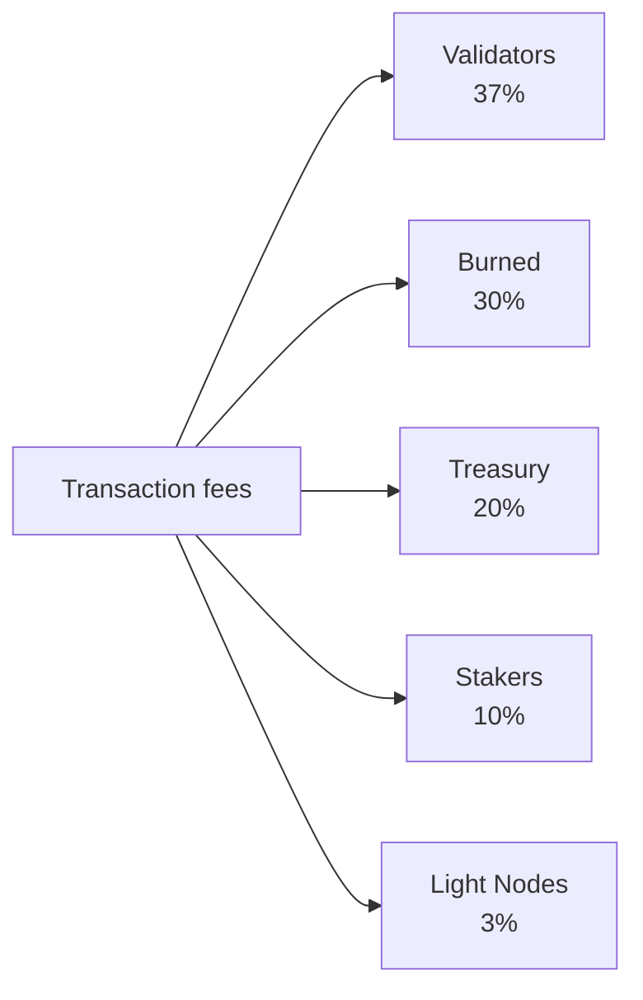

# Tokenómica

QoreChain utiliza un modelo económico de **suministro fijo** centrado en el token nativo **QOR**. En lugar de inflar el suministro con el tiempo, la red financia las recompensas de staking a partir de un presupuesto de emisión finito y preasignado, mientras que un motor de quema multicanal aplica una presión deflacionaria sostenida a medida que crece el uso de la red.

---

## Conceptos básicos del token

| Propiedad             | Valor                                                    |
| --------------------- | -------------------------------------------------------- |
| **Token de visualización** | QOR                                                 |
| **Denominación base** | uqor                                                     |
| **Precisión decimal** | 10^6 (1 QOR = 1.000.000 uqor)                            |
| **Suministro total**  | 4.500.000.000 QOR (fijo)                                 |
| **Chain ID**          | `qorechain-vladi` (mainnet, EVM chain ID 9801)          |
| **Prefijo Bech32**    | `qor` (cuentas: `qor1...`, validadores: `qorvaloper...`) |

:::note
Las cifras de esta página describen la **mainnet** (`qorechain-vladi`, EVM chain ID **9801**), en vivo desde el 7 de junio de 2026 en la versión de cadena **v3.1.80**. La testnet **`qorechain-diana`** (EVM chain ID **9800**) comparte el mismo modelo económico.
:::

---

## Modelo de suministro y emisión

QoreChain tiene un **suministro total fijo de 4.500.000.000 QOR**. Nunca se acuña nuevo QOR para inflar el suministro. En cambio:

* Se quemaron **80.000.000 QOR (1,78% del suministro)** en el Token Generation Event (TGE).
* Las recompensas de staking se pagan a partir de un **presupuesto de emisión finito de 590.000.000 QOR**, que se va agotando con el tiempo según un calendario decreciente.

Este es un **modelo de suministro fijo con un presupuesto de emisión finito**, no un modelo de inflación del suministro. Una vez agotado el presupuesto de emisión, no se produce ninguna emisión de recompensas adicional más allá de lo que la gobernanza asigne del presupuesto restante.

### Calendario de recompensas de staking {#staking-reward-schedule}

Las recompensas de staking se distribuyen a partir del presupuesto de emisión de 590.000.000 QOR según un calendario decreciente:

| Período     | APY objetivo            | Presupuesto de emisión           |
| ----------- | ----------------------- | -------------------------------- |
| Año 1       | 8–12% APY               | 127.500.000 QOR                  |
| Año 2       | 6–10% APY               | 106.250.000 QOR                  |
| Años 3–4    | 5–8% APY                | 85.000.000 QOR por año           |
| Año 5+      | Determinado por gobernanza | ~186.000.000 QOR restantes    |

Los rangos de APY son objetivos que dependen de la proporción de tokens en staking; las cifras del presupuesto de emisión son los límites estrictos de QOR liberado a los stakers en cada período. A partir del año 5, los ~186.000.000 QOR restantes se liberan a una tasa establecida por la gobernanza.

---

## x/burn — Motor de quema multicanal

El módulo `x/burn` implementa un sistema de quema de tokens de 10 canales. Cada token quemado se elimina permanentemente del suministro circulante, creando una presión deflacionaria sostenida a medida que crece el uso de la red.

### Canales de quema

| #  | Canal              | Origen                     | Descripción                                   |
| -- | ------------------ | -------------------------- | --------------------------------------------- |
| 1  | `gas_fee`          | Tarifas de transacción     | Se quema el 30% de todas las tarifas de gas   |
| 2  | `contract_create`  | Despliegue de smart contracts | Tarifa fija de 100 QOR quemada por creación de contrato |
| 3  | `ai_service`       | Tarifas de uso del módulo de IA | Se quema el 50% de las tarifas de servicios de IA |
| 4  | `bridge_fee`       | Tarifas de bridge entre cadenas | Se quema el 100% de las tarifas de bridge   |
| 5  | `treasury_buyback` | Operaciones de tesorería   | Recompra y quema periódica desde la tesorería |
| 6  | `failed_tx`        | Gas de transacciones fallidas | Se quema el 10% del gas de transacciones fallidas |
| 7  | `xqore_penalty`    | Penalizaciones por salida anticipada de xQORE | Los montos de penalización se enrutan a través de la quema |
| 8  | `auto_buyback`     | Programa de recompra automatizado | Quemas automatizadas a nivel de protocolo |
| 9  | `tge`              | Token generation event     | Quemas únicas en génesis (80.000.000 QOR)     |
| 10 | `rollup_create`    | Despliegue de rollup       | Se quema el 1% del stake de creación del rollup |

### Distribución de tarifas

Todas las tarifas de transacción recaudadas por la red se reparten entre cinco destinos, como se muestra a continuación. Los porcentajes se imponen on-chain y siempre suman exactamente el 100%.



Todas las tarifas de transacción recaudadas por la red se reparten entre cinco destinos:

| Destinatario    | Porcentaje | Descripción                                                  |
| --------------- | ----- | -------------------------------------------------------------------- |
| **Validadores** | 37%   | Distribuido al conjunto de validadores activos en proporción al stake |
| **Quemado**     | 30%   | Eliminado permanentemente del suministro vía el canal de quema `gas_fee` |
| **Tesorería**   | 20%   | Asignado a la tesorería comunitaria para gasto dirigido por la gobernanza |
| **Stakers**     | 10%   | Distribuido a todos los stakers de QOR en proporción a la delegación |
| **Light Nodes** | 3%    | Distribuido a los light nodes por servir datos de la red             |

Los porcentajes se imponen on-chain y siempre deben sumar exactamente el 100%.

### Parámetros de quema

| Parámetro              | Por defecto                | Descripción                              |
| ---------------------- | -------------------------- | ---------------------------------------- |
| `gas_burn_rate`        | 0.30                       | Fracción de tarifas de gas quemada (30%) |
| `contract_create_fee`  | 100.000.000 uqor (100 QOR) | Tarifa fija de quema por creación de contrato |
| `ai_service_burn_rate` | 0.50                       | Fracción de tarifas de servicios de IA quemada (50%) |
| `bridge_burn_rate`     | 1.00                       | Fracción de tarifas de bridge quemada (100%) |
| `failed_tx_burn_rate`  | 0.10                       | Fracción del gas de TX fallidas quemada (10%) |

Cada evento de quema se registra on-chain con su origen, monto, altura de bloque y hash de transacción asociado. Las estadísticas agregadas se pueden consultar por canal y en total.

---

## x/xqore — Staking bloqueado y amplificación de gobernanza

El módulo `x/xqore` introduce **xQORE**, un derivado de staking bloqueado no transferible. Los usuarios bloquean QOR para acuñar xQORE en una proporción 1:1. Los poseedores de xQORE reciben un poder de gobernanza amplificado y una parte de las penalizaciones por salida redistribuidas.

### Mecanismo de bloqueo

* **Bloqueo**: enviar QOR al módulo xQORE para acuñar xQORE en una proporción 1:1.
* **Peso de gobernanza**: los poseedores de xQORE reciben **2x de poder de voto en gobernanza** en comparación con los stakers estándar de QOR.
* **No transferible**: el xQORE no puede enviarse entre cuentas. Está vinculado a la dirección de bloqueo.

### Calendario de penalizaciones por salida

El retiro anticipado de xQORE incurre en una penalización que disminuye con la duración del bloqueo:

| Duración del bloqueo | Tasa de penalización | Descripción                                |
| -------------- | ------------ | ------------------------------------------ |
| &lt; 30 días   | **50%**      | Se pierde la mitad del QOR bloqueado       |
| 30 -- 90 días  | **35%**      | Penalización significativa para bloqueos a corto plazo |
| 90 -- 180 días | **15%**      | Penalización reducida para compromiso a medio plazo |
| > 180 días     | **0%**       | Retiro completo sin penalización           |

### Redistribución por rebase PvP

Las penalizaciones recaudadas de las salidas anticipadas no se destruyen simplemente. En cambio, siguen un modelo de rebase PvP (player-versus-player):

1. El **50%** de los montos de penalización se quema (enrutado a través de `x/burn` vía el canal `xqore_penalty`).
2. El **50%** se redistribuye a prorrata a todos los poseedores de xQORE restantes.

Esto crea una dinámica de suma positiva para los poseedores a largo plazo: cada salida anticipada aumenta el valor efectivo de las posiciones de xQORE restantes. Los rebases ocurren cada **100 bloques**.

### Parámetros de xQORE

| Parámetro               | Por defecto            | Descripción                               |
| ----------------------- | ---------------------- | ----------------------------------------- |
| `governance_multiplier` | 2.0                    | Multiplicador de poder de voto para poseedores de xQORE |
| `min_lock_amount`       | 1.000.000 uqor (1 QOR) | QOR mínimo requerido para bloquear        |
| `penalty_burn_rate`     | 0.50                   | Fracción de penalizaciones por salida quemada (50%) |
| `rebase_interval`       | 100 bloques            | Bloques entre eventos de rebase PvP       |
| `enabled`               | true                   | Indicador de activación del módulo        |

---

## x/inflation — Calendario del presupuesto de emisión

A pesar de su nombre de módulo, el módulo `x/inflation` **no** infla el suministro total. Gobierna la liberación de recompensas de staking a partir del presupuesto de emisión finito de **590.000.000 QOR** según el [calendario de recompensas de staking](#staking-reward-schedule) decreciente. Las emisiones se calculan por época y se distribuyen a stakers y validadores, agotando el presupuesto preasignado en lugar de acuñar nuevo suministro.

### Mecánica de épocas

* **Duración de la época**: 17.280 bloques (\~1 día con tiempos de bloque de 5 segundos)
* **Bloques por año**: \~6.311.520
* Al inicio de cada época, la emisión programada para el período actual se libera del presupuesto de emisión y se distribuye a stakers y validadores.
* El rastreador de épocas registra el número de época actual, el año actual, el bloque inicial, el QOR acumulado liberado del presupuesto de emisión y el presupuesto restante.

### Parámetros de inflación

| Parámetro      | Por defecto      | Descripción                                                |
| -------------- | ---------------- | ---------------------------------------------------------- |
| `schedule`     | declining        | Presupuesto de emisión indexado por período (ver calendario de recompensas de staking) |
| `epoch_length` | 17.280 bloques   | Bloques por época de emisión                               |
| `enabled`      | true             | Indicador de activación del módulo                         |

---

## Dinámica deflacionaria

Dado que el suministro es fijo y la emisión se extrae de un presupuesto finito, la dinámica neta de tokens de QoreChain tiende a la deflación a medida que crece la adopción:

```
Years 1-2:  Larger scheduled emissions from the budget offset burns → near-neutral supply
Years 3-4:  Scheduled emissions decline; burn volume grows with usage → convergence
Year 5+:    Emission budget is largely drawn down; burn channels (gas, bridge,
            contracts, rollups) scale with transaction volume → net deflationary
```

Los 10 canales de quema garantizan que cada actividad importante de la red elimine tokens del suministro. A medida que aumentan el volumen de transacciones, el uso del bridge, las llamadas a servicios de IA y los despliegues de rollups, las quemas acumuladas se aceleran mientras que las emisiones programadas disminuyen hacia el final del presupuesto finito.

---

## Orden del ciclo de vida de los módulos

Los módulos económicos se ejecutan en un orden específico durante el `EndBlocker` de cada bloque:

```
x/burn → x/xqore → x/inflation → x/rlconsensus
```

1. **x/burn** — Procesa los registros de quema pendientes y actualiza las estadísticas agregadas.
2. **x/xqore** — Ejecuta los rebases PvP (cada `rebase_interval` bloques) y enruta las penalizaciones a la quema.
3. **x/inflation** — Libera las emisiones de recompensas de staking programadas del presupuesto en los límites de época.
4. **x/rlconsensus** — Ajusta los parámetros de consenso basándose en las señales de aprendizaje por refuerzo de PRISM.

Este orden garantiza que las quemas se finalicen antes de los rebases, y que los rebases se completen antes de que se liberen las emisiones programadas, manteniendo transiciones de estado económico consistentes.

## Relacionado

* [Parámetros de la cadena](/appendix/chain-parameters) — valores por defecto canónicos económicos y de consenso.
* [Staking y delegación](/user-guide/staking-and-delegation) — delegar QOR y ganar recompensas.
* [Staking de xQORE](/user-guide/xqore-staking) — el mecanismo de staking con rebase PvP.
* [Recompensas de Light Node](/light-node/rewards-and-monitoring) — la parte de recompensa de los light nodes.
