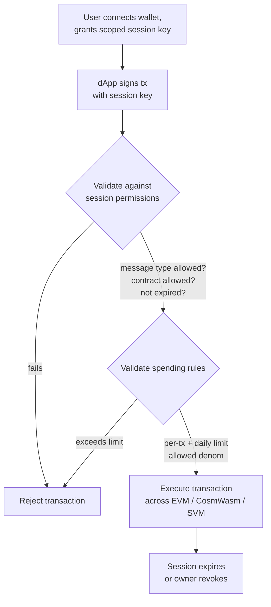

# Abstracción de cuentas

QoreChain ofrece **abstracción de cuentas a nivel de protocolo** mediante el módulo `x/abstractaccount`. Esto permite cuentas programables con reglas de autenticación flexibles, claves de sesión, límites de gasto y recuperación social — todo sin requerir infraestructura externa de contratos inteligentes.

:::note
Los comandos siguientes usan la mainnet **`qorechain-vladi`**, en funcionamiento desde el 7 de junio de 2026 ejecutando la versión de cadena **v3.1.82**. Sustituye por `--chain-id qorechain-diana` para la testnet.
:::

## Resumen

Las cuentas tradicionales de blockchain están controladas por una única clave privada. La abstracción de cuentas desacopla el concepto de "quién puede autorizar una transacción" de una sola clave criptográfica, lo que permite:

* **Cuentas multifirma** con firma por umbral configurable
* **Cuentas de recuperación social** con recuperación de claves basada en guardianes
* **Cuentas basadas en sesión** con permisos granulares y limitados en el tiempo para dApps

El módulo `x/abstractaccount` implementa estas capacidades en la capa de protocolo, lo que significa que funcionan en las tres VM (EVM, CosmWasm, SVM) y se benefician de la eficiencia nativa de gas.

*Un flujo de dApp basado en sesión: una clave de sesión con alcance acotado firma una transacción, el módulo la valida contra la sesión y las reglas de gasto, y luego la ejecuta.*



## Tipos de cuenta

| Tipo              | Descripción                             | Caso de uso                      |
| ----------------- | --------------------------------------- | -------------------------------- |
| `multisig`        | Firma por umbral M-de-N                 | Tesorerías de DAO, monederos compartidos |
| `social_recovery` | Recuperación de claves asistida por guardianes | Monederos de consumo, onboarding |
| `session_based`   | Claves de sesión delegadas con restricciones | Sesiones de dApp, monederos móviles |

## Crear una cuenta abstracta

### Cuenta basada en sesión

```bash
qorechaind tx abstractaccount create \
  --account-type session_based \
  --from mykey \
  --gas auto \
  -y
```

### Cuenta multifirma

```bash
qorechaind tx abstractaccount create \
  --account-type multisig \
  --signers qor1alice...,qor1bob...,qor1carol... \
  --threshold 2 \
  --from mykey \
  --gas auto \
  -y
```

### Cuenta de recuperación social

```bash
qorechaind tx abstractaccount create \
  --account-type social_recovery \
  --guardians qor1guardian1...,qor1guardian2...,qor1guardian3... \
  --recovery-threshold 2 \
  --from mykey \
  --gas auto \
  -y
```

## Claves de sesión

Las claves de sesión son la piedra angular del tipo de cuenta `session_based`. Te permiten conceder **permisos temporales y acotados** a una clave secundaria — perfectas para interacciones con dApps en las que no quieres exponer tu clave principal.

### Propiedades de las claves

| Propiedad             | Descripción                                          |
| --------------------- | ---------------------------------------------------- |
| **Permisos**          | Qué tipos de mensaje puede firmar la clave de sesión |
| **Caducidad**         | Expiración automática tras una duración configurable |
| **Límites de gasto**  | Importes máximos que la clave de sesión puede gastar |
| **Contratos permitidos** | Restringir las interacciones a direcciones de contrato específicas |

### Conceder una clave de sesión

```bash
qorechaind tx abstractaccount grant-session \
  --session-key qor1sessionkey... \
  --permissions "bank/MsgSend,wasm/MsgExecuteContract" \
  --expiry "2026-03-01T00:00:00Z" \
  --allowed-contracts qor1contract1...,0x1234...abcd \
  --from mykey \
  -y
```

### Revocar una clave de sesión

```bash
qorechaind tx abstractaccount revoke-session \
  --session-key qor1sessionkey... \
  --from mykey \
  -y
```

### Listar sesiones activas

```bash
qorechaind query abstractaccount sessions <account-address>
```

## Reglas de gasto

Las reglas de gasto añaden salvaguardas financieras a las cuentas abstractas, independientemente del tipo de cuenta:

| Regla            | Descripción                                     |
| ---------------- | ----------------------------------------------- |
| `daily_limit`    | Gasto total máximo por ventana móvil de 24 horas |
| `per_tx_limit`   | Gasto máximo por transacción individual         |
| `allowed_denoms` | Restringir qué denominaciones de token se pueden gastar |

### Establecer reglas de gasto

```bash
qorechaind tx abstractaccount update-spending-rules \
  --daily-limit 1000000000uqor \
  --per-tx-limit 100000000uqor \
  --allowed-denoms uqor \
  --from mykey \
  -y
```

### Consultar las reglas actuales

```bash
qorechaind query abstractaccount spending-rules <account-address>
```

### Respuesta de ejemplo

```json
{
  "daily_limit": {
    "denom": "uqor",
    "amount": "1000000000"
  },
  "per_tx_limit": {
    "denom": "uqor",
    "amount": "100000000"
  },
  "allowed_denoms": ["uqor"],
  "daily_spent": {
    "denom": "uqor",
    "amount": "250000000"
  },
  "window_reset": "2026-02-27T00:00:00Z"
}
```

## Consultar cuentas abstractas

### CLI

```bash
# Get full account configuration
qorechaind query abstractaccount account <address>

# List all abstract accounts (paginated)
qorechaind query abstractaccount list --limit 10
```

### JSON-RPC

```bash
curl -X POST http://localhost:8545 \
  -H "Content-Type: application/json" \
  -d '{
    "jsonrpc": "2.0",
    "method": "qor_getAbstractAccount",
    "params": ["0xYourAddress"],
    "id": 1
  }'
```

### Respuesta de cuenta de ejemplo

```json
{
  "address": "qor1myaccount...",
  "account_type": "session_based",
  "owner": "qor1owner...",
  "active_sessions": 2,
  "spending_rules": {
    "daily_limit": "1000000000uqor",
    "per_tx_limit": "100000000uqor",
    "allowed_denoms": ["uqor"]
  },
  "created_at_height": 54321
}
```

## Flujo de recuperación social

Si el propietario de la cuenta pierde el acceso a su clave principal, los guardianes pueden autorizar una rotación de clave.

1. **El propietario informa de la pérdida de la clave (o un guardián la inicia):**

   ```bash
   qorechaind tx abstractaccount initiate-recovery \
     --account <account-address> \
     --new-owner qor1newkey... \
     --from guardian1 \
     -y
   ```

2. **Guardianes adicionales aprueban** (deben alcanzar el `recovery_threshold`):

   ```bash
   qorechaind tx abstractaccount approve-recovery \
     --account <account-address> \
     --recovery-id <recovery-id> \
     --from guardian2 \
     -y
   ```

3. **La recuperación se ejecuta automáticamente** una vez alcanzado el umbral. Un **periodo de bloqueo temporal** (por defecto: 48 horas) da al propietario original la oportunidad de cancelar un intento de recuperación fraudulento.

## Integración con dApps

Las claves de sesión permiten experiencias de dApp fluidas:

1. **El usuario conecta su monedero** y crea una clave de sesión acotada al contrato de la dApp
2. **La dApp usa la clave de sesión** para enviar transacciones en nombre del usuario
3. **Sin firmas repetidas** — la clave de sesión gestiona la autorización dentro de sus permisos
4. **La sesión caduca** automáticamente, o el usuario la revoca en cualquier momento

Este patrón es especialmente útil para:

* Monederos móviles donde los avisos biométricos repetidos resultan molestos
* dApps de juegos que necesitan firmar transacciones con rapidez
* Protocolos DeFi que ejecutan múltiples operaciones secuenciales

## Próximos pasos

* [Ejecutar un validador](/developer-guide/running-a-validator) — Configura y opera un nodo validador
* [Desarrollo en EVM](/developer-guide/evm-development) — Integra cuentas abstractas con dApps de Solidity
* [Interoperabilidad entre VM](/developer-guide/cross-vm-interoperability) — Mensajería entre VM con cuentas abstractas
