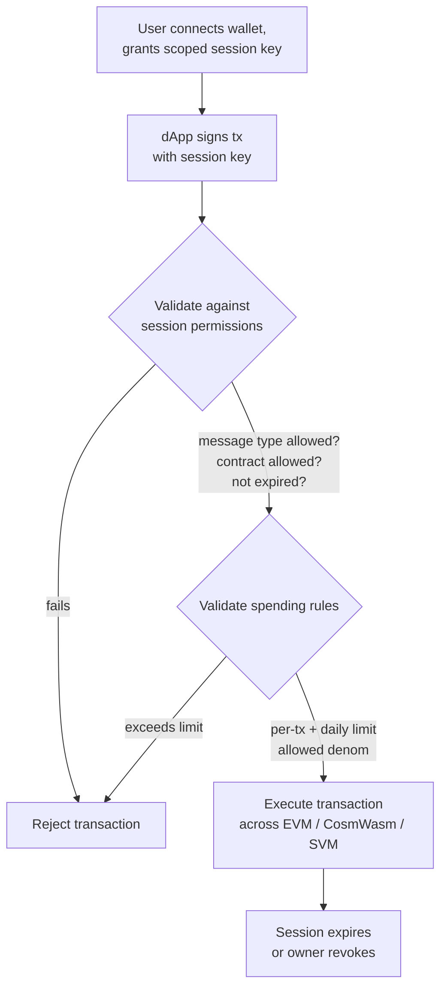

# Abstracción de cuentas

QoreChain ofrece **abstracción de cuentas a nivel de protocolo** mediante el módulo `x/abstractaccount`. Esto permite cuentas programables con reglas de autenticación flexibles, claves de sesión, límites de gasto y recuperación social — todo sin requerir infraestructura externa de contratos inteligentes.

:::note
Los comandos siguientes usan la mainnet **`qorechain-vladi`**, en funcionamiento desde el 7 de junio de 2026 ejecutando la versión de cadena **v3.1.85**. Sustituye por `--chain-id qorechain-diana` para la testnet.
:::

## Visión general

Las cuentas blockchain tradicionales están controladas por una única clave privada. La abstracción de cuentas desacopla el concepto de "quién puede autorizar una transacción" de una única clave criptográfica, lo que permite:

* **Cuentas multifirma** con firma por umbral configurable
* **Cuentas con recuperación social** con recuperación de claves basada en guardianes
* **Cuentas basadas en sesiones** con permisos granulares y de duración limitada para dApps

El módulo `x/abstractaccount` implementa estas capacidades en la capa de protocolo, lo que significa que funcionan en las tres VMs (EVM, CosmWasm, SVM) y se benefician de la eficiencia de gas nativa.

*Un flujo de dApp basado en sesiones: una clave de sesión con alcance limitado firma una transacción, el módulo la valida contra las reglas de sesión y de gasto, y luego la ejecuta.*


```mermaid
flowchart TD
    A["User connects wallet,<br/>grants scoped session key"] --> B["dApp signs tx<br/>with session key"]
    B --> C{"Validate against<br/>session permissions"}
    C -- "message type allowed?<br/>contract allowed?<br/>not expired?" --> D{"Validate spending rules"}
    C -- "fails" --> R["Reject transaction"]
    D -- "per-tx + daily limit<br/>allowed denom" --> E["Execute transaction<br/>across EVM / CosmWasm / SVM"]
    D -- "exceeds limit" --> R
    E --> F["Session expires<br/>or owner revokes"]
```

## Tipos de cuenta

| Tipo              | Descripción                                        | Caso de uso                                    |
| ----------------- | -------------------------------------------------- | ---------------------------------------------- |
| `multisig`        | Firma por umbral M-de-N                            | Tesorerías de DAO, carteras compartidas        |
| `social_recovery` | Recuperación de claves asistida por guardianes     | Carteras de consumo, incorporación de usuarios |
| `session_based`   | Claves de sesión delegadas con restricciones       | Sesiones de dApp, carteras móviles             |

## Crear una cuenta abstracta

### Cuenta basada en sesiones

```bash
qorechaind tx abstractaccount create \
  --account-type session_based \
  --from mykey \
  --gas auto \
  -y
```

### Cuenta multifirma

```bash
qorechaind tx abstractaccount create \
  --account-type multisig \
  --signers qor1alice...,qor1bob...,qor1carol... \
  --threshold 2 \
  --from mykey \
  --gas auto \
  -y
```

### Cuenta con recuperación social

```bash
qorechaind tx abstractaccount create \
  --account-type social_recovery \
  --guardians qor1guardian1...,qor1guardian2...,qor1guardian3... \
  --recovery-threshold 2 \
  --from mykey \
  --gas auto \
  -y
```

## Claves de sesión

Las claves de sesión son la piedra angular del tipo de cuenta `session_based`. Te permiten otorgar **permisos temporales y acotados** a una clave secundaria — perfecto para interacciones con dApps en las que no quieres exponer tu clave principal.

### Propiedades de las claves

| Propiedad                | Descripción                                                        |
| ------------------------ | ------------------------------------------------------------------ |
| **Permisos**             | Qué tipos de mensaje puede firmar la clave de sesión                |
| **Caducidad**            | Expiración automática tras una duración configurable                |
| **Límites de gasto**     | Importes máximos que la clave de sesión puede gastar                |
| **Contratos permitidos** | Restringe las interacciones a direcciones de contrato específicas   |

### Otorgar una clave de sesión

```bash
qorechaind tx abstractaccount grant-session \
  --session-key qor1sessionkey... \
  --permissions "bank/MsgSend,wasm/MsgExecuteContract" \
  --expiry "2026-03-01T00:00:00Z" \
  --allowed-contracts qor1contract1...,0x1234...abcd \
  --from mykey \
  -y
```

### Revocar una clave de sesión

```bash
qorechaind tx abstractaccount revoke-session \
  --session-key qor1sessionkey... \
  --from mykey \
  -y
```

### Listar sesiones activas

```bash
qorechaind query abstractaccount sessions <account-address>
```

## Reglas de gasto

Las reglas de gasto añaden salvaguardas financieras a las cuentas abstractas, independientemente del tipo de cuenta:

| Regla            | Descripción                                            |
| ---------------- | ------------------------------------------------------ |
| `daily_limit`    | Gasto total máximo por ventana móvil de 24 horas       |
| `per_tx_limit`   | Gasto máximo por transacción individual                |
| `allowed_denoms` | Restringe qué denominaciones de token se pueden gastar |

### Establecer reglas de gasto

```bash
qorechaind tx abstractaccount update-spending-rules \
  --daily-limit 1000000000uqor \
  --per-tx-limit 100000000uqor \
  --allowed-denoms uqor \
  --from mykey \
  -y
```

### Consultar las reglas actuales

```bash
qorechaind query abstractaccount spending-rules <account-address>
```

### Ejemplo de respuesta

```json
{
  "daily_limit": {
    "denom": "uqor",
    "amount": "1000000000"
  },
  "per_tx_limit": {
    "denom": "uqor",
    "amount": "100000000"
  },
  "allowed_denoms": ["uqor"],
  "daily_spent": {
    "denom": "uqor",
    "amount": "250000000"
  },
  "window_reset": "2026-02-27T00:00:00Z"
}
```

## Autenticadores de carteras vinculadas — Gasto delegado {#authenticators}

A partir de la versión de cadena **v3.1.85** (que se apoya en el modelo de permisos de la v3.1.84), una **clave de cartera externa vinculada** — una clave de Phantom (ed25519) o una cuenta de MetaMask (secp256k1) — puede **gastar desde la cuenta post-cuántica canónica** bajo condiciones de mínimo privilegio, con límites de gasto y revocables. La clave externa nunca produce una firma ML-DSA; un **relayer** envía y paga el sobre de la transacción (la propia firma PQC híbrida del relayer satisface los requisitos de firma de la cadena), mientras que la firma del autenticador sobre **sign bytes con separación de dominio y protección contra repetición** constituye la autorización.

### Registrar un autenticador {#register-authenticator}

El propietario de la cuenta registra la clave externa con `MsgRegisterAuthenticator` (una transacción ordinaria con la clave raíz), asignándole un esquema, permisos, una caducidad y límites de gasto opcionales:

```js
import { registerEthAuthenticatorMsg } from "@qorechain/wallet-adapter";

// Link a MetaMask account by its 20-byte address (EIP-191 verification):
const msg = registerEthAuthenticatorMsg({
  account: "qor1owner...",            // the canonical account
  ethAddress: "0xAbC...123",          // the MetaMask address to link
  permissions: ["evm"],               // least privilege — see the taxonomy below
  expirySeconds: 30 * 24 * 3600,      // ≤ 30 days recommended
  spendingRule: { perTxLimit: "100000000uqor", dailyLimit: "1000000000uqor" },
});
// Sign & broadcast this msg with the OWNER's normal hybrid-PQC signer.
```

Una clave de Phantom se registra de la misma manera con `scheme: "ed25519"` y la clave pública de Phantom. La revocación es instantánea mediante `MsgRevokeAuthenticator`.

### Taxonomía de permisos {#permission-taxonomy}

Once permisos canónicos controlan lo que un autenticador registrado puede hacer. El mapa es de **cierre por defecto (fail-closed)**: un tipo de mensaje sin correspondencia es denegado.

| Permiso | Otorga |
| --- | --- |
| `send` | Transferencias bancarias del carril nativo |
| `delegate` / `withdraw` / `vote` | Staking, retiro de recompensas, gobernanza |
| `evm` / `wasm` / `svm` | Ejecución en el carril de la VM correspondiente |
| `amm` / `ibc` / `deploy` | Operaciones de AMM, transferencias IBC, despliegue de contratos |
| `all` | Cualquier mensaje *delegable* |

**Los mensajes de gestión de claves nunca son delegables** — `MsgRegisterAuthenticator`, `MsgRevokeAuthenticator`, el registro/migración de claves PQC y `MsgRotatePQCKey` siempre requieren la clave raíz, de modo que una clave vinculada nunca puede escalar sus propios privilegios.

Lee la taxonomía en vivo (con `schema_version` para detectar desviaciones) en lugar de codificarla de forma fija:

```bash
curl -s https://api.qore.host/qorechain/abstractaccount/v1/permission_schema | jq
# or: qorechaind query abstractaccount permission-schema
```

### Gastar mediante una clave vinculada {#execute-messages}

Dos mensajes transportan acciones autorizadas por un autenticador. En ambos, el relayer es el firmante/pagador de comisiones de la transacción; la firma del autenticador viaja dentro del mensaje.

**`MsgExecuteEVM`** — una llamada o transferencia EVM **desde la dirección `0x…` de la cuenta canónica**. El autenticador firma `sha256("qorechain-evm-auth-v1" ‖ chainId ‖ account ‖ pubkey ‖ to ‖ value ‖ data ‖ nonce)` (todos los campos con prefijo de longitud). La protección contra repetición es el propio nonce EVM de la cuenta.

**`MsgExecuteCosmos`** — un envío bancario del carril nativo desde la cuenta canónica. El autenticador firma `sha256("qorechain-cosmos-auth-v1" ‖ chainId ‖ account ‖ pubkey ‖ to ‖ amount ‖ nonce)`. La protección contra repetición es una **secuencia por autenticador** mantenida por el módulo (un envío bancario no incrementa el nonce de la cuenta). Los envíos a uno mismo se rechazan.

:::caution Reglas de nonce
* `MsgExecuteEVM.nonce` = el nonce EVM **actual** de la cuenta (`eth_getTransactionCount(account0x, "latest")`). En producción el relayer es una cuenta *distinta*, así que **no** sumes +1. Firmar un nonce obsoleto devuelve el código `11`.
* `MsgExecuteCosmos.nonce` = la secuencia por autenticador (consulta el estado del autenticador de la cuenta), **no** la secuencia Cosmos de la cuenta.
:::

**Ejemplo con Phantom** (navegador: Phantom firma, tu backend actúa como relayer):

```js
import { buildPhantomExecuteCosmos } from "@qorechain/wallet-adapter";

// In the dApp: Phantom signs the digest with ed25519 signMessage.
const msg = await buildPhantomExecuteCosmos({
  provider: window.solana,            // Phantom
  chainId: "qorechain-vladi",
  account: "qor1owner...",            // canonical account being spent from
  to: "qor1recipient...",
  amount: { denom: "uqor", amount: "900000" },
  nonce: authSequence,                // per-authenticator sequence
});
// Send `msg` to your relayer; the relayer wraps it in a tx it signs
// (hybrid PQC) and broadcasts. The transfer moves the OWNER's funds.
```

**Ejemplo con MetaMask** (`personal_sign` EIP-191 desde la dirección vinculada de 20 bytes):

```js
import { buildMetaMaskExecuteEvm } from "@qorechain/wallet-adapter";

const msg = await buildMetaMaskExecuteEvm({
  provider: window.ethereum,          // MetaMask (EIP-1193)
  chainId: "qorechain-vladi",
  account: "qor1owner...",
  to: "0xRecipient...",
  valueWei: 10n ** 16n,               // 0.01 QOR (18-dec EVM view)
  nonce: currentEvmNonce,             // eth_getTransactionCount(owner0x, "latest")
});
// Relay as above. The chain verifies the signature via EIP-191 + ecrecover
// against the registered 20-byte address.
```

Los mismos constructores existen en el [SDK de QoreChain](/sdk/guides/authenticators) para los cinco lenguajes, además de sus equivalentes de CLI:

```bash
# Produce the exact sign bytes the chain verifies (for custom signers):
qorechaind query abstractaccount auth-sign-cosmos <account> <to> <amount> <nonce>
qorechaind query abstractaccount auth-sign-evm <account> <to> <value> <data-hex> <nonce>

# Relay a pre-signed authorization:
qorechaind tx abstractaccount execute-cosmos <account> <to> <amount> <auth-pubkey> <auth-sig> <nonce> --from relayer -y
qorechaind tx abstractaccount execute-evm    <account> <to> <value> <data-hex> <auth-pubkey> <auth-sig> <nonce> --from relayer -y
```

### Códigos de error {#authenticator-errors}

Los fallos de aplicación de las reglas devuelven códigos distintos (codespace `abstractaccount`) para que las carteras puedan mostrar el mensaje correcto:

| Código | Significado | UX de la cartera |
| --- | --- | --- |
| `5` | Límite de gasto superado (por transacción o diario) | Mostrar el margen disponible restante |
| `6` | Autenticador caducado | "Caducado — vuelve a vincular tu cartera" |
| `10` | Permiso denegado (fuera de alcance o msg no delegable) | Mostrar el permiso que falta |
| `11` | Repetición rechazada (nonce/secuencia obsoletos) | Volver a consultar el nonce y firmar de nuevo |

(Codespace `pqc`, código `21` = fallo de verificación de la firma híbrida — un problema de firma del lado del relayer, no de autorización.)

### Consultas REST {#abstractaccount-rest}

A partir de la **v3.1.85**, las consultas de lectura del módulo también se sirven por REST:

```
GET /qorechain/abstractaccount/v1/config
GET /qorechain/abstractaccount/v1/accounts
GET /qorechain/abstractaccount/v1/accounts/{address}
GET /qorechain/abstractaccount/v1/permission_schema
```

## Consultar cuentas abstractas

### CLI

```bash
# Get full account configuration
qorechaind query abstractaccount account <address>

# List all abstract accounts (paginated)
qorechaind query abstractaccount list --limit 10
```

### JSON-RPC

```bash
curl -X POST http://localhost:8545 \
  -H "Content-Type: application/json" \
  -d '{
    "jsonrpc": "2.0",
    "method": "qor_getAbstractAccount",
    "params": ["0xYourAddress"],
    "id": 1
  }'
```

### Ejemplo de respuesta de cuenta

```json
{
  "address": "qor1myaccount...",
  "account_type": "session_based",
  "owner": "qor1owner...",
  "active_sessions": 2,
  "spending_rules": {
    "daily_limit": "1000000000uqor",
    "per_tx_limit": "100000000uqor",
    "allowed_denoms": ["uqor"]
  },
  "created_at_height": 54321
}
```

## Flujo de recuperación social

Si el propietario de la cuenta pierde el acceso a su clave principal, los guardianes pueden autorizar una rotación de clave.

1. **El propietario informa de la pérdida de la clave (o un guardián lo inicia):**

   ```bash
   qorechaind tx abstractaccount initiate-recovery \
     --account <account-address> \
     --new-owner qor1newkey... \
     --from guardian1 \
     -y
   ```

2. **Guardianes adicionales aprueban** (debe alcanzarse `recovery_threshold`):

   ```bash
   qorechaind tx abstractaccount approve-recovery \
     --account <account-address> \
     --recovery-id <recovery-id> \
     --from guardian2 \
     -y
   ```

3. **La recuperación se ejecuta automáticamente** una vez alcanzado el umbral. Un **periodo de bloqueo temporal** (por defecto: 48 horas) da al propietario original la oportunidad de cancelar un intento de recuperación fraudulento.

## Integración con dApps

Las claves de sesión permiten experiencias de dApp fluidas:

1. **El usuario conecta su cartera** y crea una clave de sesión limitada al contrato de la dApp
2. **La dApp usa la clave de sesión** para enviar transacciones en nombre del usuario
3. **Sin firmas repetidas** — la clave de sesión gestiona la autorización dentro de sus permisos
4. **La sesión caduca** automáticamente, o el usuario la revoca en cualquier momento

Este patrón es especialmente útil para:

* Carteras móviles donde las solicitudes biométricas repetidas resultan molestas
* dApps de juegos que necesitan firmar transacciones con rapidez
* Protocolos DeFi que ejecutan múltiples operaciones secuenciales

## Próximos pasos

* [Operar un validador](/developer-guide/running-a-validator) — Configura y opera un nodo validador
* [Desarrollo EVM](/developer-guide/evm-development) — Integra cuentas abstractas con dApps en Solidity
* [Interoperabilidad entre VMs](/developer-guide/cross-vm-interoperability) — Mensajería entre VMs con cuentas abstractas
