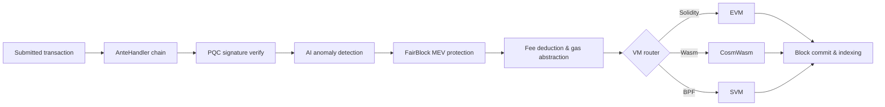

# Visión general de la arquitectura

QoreChain es un nodo de blockchain modular compuesto por tres procesos principales —el nodo de cadena, el sidecar de IA y el indexador de bloques— respaldados por una base de datos Postgres y monitorizados mediante Prometheus y Grafana. La mainnet (`qorechain-vladi`, EVM chain ID **9801**) está activa desde el 7 de junio de 2026 con la versión de cadena **v3.1.80**, junto con una testnet en paralelo (`qorechain-diana`, EVM chain ID **9800**). La cadena está construida sobre Cosmos SDK v0.53. El siguiente diagrama muestra la disposición de los componentes a alto nivel.

El ciclo de vida de las transacciones que se muestra a continuación resume cómo fluye una transacción enviada a través del nodo: desde la cadena de decoradores del AnteHandler (comprobaciones de seguridad y comisiones) hasta la ejecución en la VM y la liquidación on-chain:



```
┌────────────────────────────────────────────────────────────────────────────┐
│                            QoreChain Node                                  │
│                                                                            │
│  ┌──────────────────── Virtual Machines ──────────────────────┐           │
│  │  ┌───────┐    ┌──────────┐    ┌───────┐                   │           │
│  │  │  EVM  │    │ CosmWasm │    │  SVM  │                   │           │
│  │  │(Sol.) │◄──►│ (Wasm)   │◄──►│ (BPF) │                   │           │
│  │  └───┬───┘    └────┬─────┘    └───┬───┘                   │           │
│  │      └─────────┬───┘──────────────┘                       │           │
│  │           x/crossvm (bridge)                               │           │
│  └────────────────────────────────────────────────────────────┘           │
│                                                                            │
│  ┌────────────────────── Tokenomics ─────────────────────────┐           │
│  │  ┌──────┐   ┌───────┐   ┌───────────┐                    │           │
│  │  │x/burn│   │x/xqore│   │x/inflation│                    │           │
│  │  │10 ch.│   │lock/  │   │finite     │                    │           │
│  │  │37/30/│   │unlock │   │emission   │                    │           │
│  │  │20/10/│   │PvP    │   │590M       │                    │           │
│  │  │3     │   │       │   │budget     │                    │           │
│  │  └──────┘   └───────┘   └───────────┘                    │           │
│  └────────────────────────────────────────────────────────────┘           │
│                                                                            │
│  ┌──────────── IBC / Bridges ────────────────────────────────┐           │
│  │  ┌──────────┐  ┌──────────┐  ┌───────────┐  ┌──────────┐ │           │
│  │  │x/bridge  │  │x/babylon │  │x/abstract │  │x/gas     │ │           │
│  │  │37 QCB +  │  │BTC re-   │  │ account   │  │abstract. │ │           │
│  │  │8 IBC     │  │staking   │  │session key│  │multi-tok │ │           │
│  │  └────┬─────┘  └────┬─────┘  └───────────┘  └──────────┘ │           │
│  │  QCB Bridge     Babylon IBC   ERC-4337-like   ibc/USDC    │           │
│  │  PQC-signed     BTC finality  social recov.   ibc/ATOM    │           │
│  │  36 ext chains  checkpoint    spending rules  fee convert  │           │
│  │  ┌──────────┐                                              │           │
│  │  │x/fair    │  5-Lane Prioritization: PQC|MEV|AI|Def|Free │           │
│  │  │ block    │  tIBE encrypted mempool framework           │           │
│  │  └──────────┘                                              │           │
│  └────────────────────────────────────────────────────────────┘           │
│                                                                            │
│  ┌──── Rollup Development Kit ───────────────────────────────┐           │
│  │  ┌──────────┐  ┌──────────┐  ┌───────────┐  ┌──────────┐ │           │
│  │  │ x/rdk    │  │Settlement│  │ DA Router │  │ Profiles │ │           │
│  │  │ 4 modes: │  │Optimistic│  │ Native    │  │ defi     │ │           │
│  │  │ opt/zk/  │  │ZK/Based/ │  │ Celestia* │  │ gaming   │ │           │
│  │  │ based/   │  │Sovereign │  │ Both      │  │ nft      │ │           │
│  │  │ sovereign│  │          │  │           │  │ social/  │ │           │
│  │  │          │  │          │  │           │  │ general  │ │           │
│  │  └────┬─────┘  └────┬─────┘  └───────────┘  └──────────┘ │           │
│  │  Bank escrow    Auto-finalize  SHA-256 commit  AI-assisted │           │
│  │  Burn on create EndBlocker     Blob pruning    PRISM sugg. │           │
│  │  → x/multilayer (RegisterSidechain + AnchorState)          │           │
│  └────────────────────────────────────────────────────────────┘           │
│                                                                            │
│  ┌──────────────┐ ┌──────┐ ┌────────────┐ ┌─────┐                       │
│  │x/rlconsensus │ │ x/ai │ │x/reputation│ │x/qca│                       │
│  │  PRISM (RL)  │ │      │ │            │ │     │                       │
│  └──────┬───────┘ └──┬───┘ └────┬──────┘ └──┬──┘                       │
│   PPO MLP         AI Engine   Scoring    CPoS Pools                      │
│   Obs/Action      Fraud Det.  Decay      Bonding                         │
│   Circuit Brk     Fee Opt.    Sigmoid    Slashing                        │
│   Rollup Adv.     TEE/FL                 QDRW Gov                        │
│                                                                            │
│  ┌──────┐ ┌──────────┐                                                   │
│  │x/pqc │ │ x/multi  │                                                   │
│  └──┬───┘ └────┬─────┘                                                   │
│  Dilithium    Layer Router                                                │
│  ML-KEM       Sidechains                                                  │
│  Hybrid Sig   + Rollups                                                   │
│  SHAKE-256                                                                │
│                                                                            │
│  ┌──────┐ ┌───────┐                                                      │
│  │x/svm │ │x/cross│                                                      │
│  └──┬───┘ └───┬───┘                                                      │
│  BPF Exec   CrossVM Msg                                                   │
└────────┬──────┬───────────────────────────────────────┬───────────────────┘
         │      │                                       │
   ┌─────┴─────┐│                              ┌───────┴──────┐
   │libqorepqc ││                              │  Indexer     │
   │(Rust PQC) ││                              │  (Postgres)  │
   └───────────┘│                              └──────────────┘
   ┌───────────┐│  ┌──────────┐
   │libqoresvm ││  │AI Sidecar│
   │(Rust BPF) │└──│ (gRPC)   │
   └───────────┘   └──────────┘
```

## Componentes del nodo

QoreChain se ejecuta como tres procesos cooperantes, cada uno con su propio módulo Go y binario:

| Componente         | Descripción                                                                                                                                                                                                                                                                                          | Ubicación                  |
| ------------------ | ---------------------------------------------------------------------------------------------------------------------------------------------------------------------------------------------------------------------------------------------------------------------------------------------------- | ------------------------- |
| **qorechain-node** | El nodo principal de la blockchain. Ejecuta el QoreChain Consensus Engine, ejecuta todos los módulos personalizados, gestiona los tres entornos de ejecución de VM y expone endpoints RPC, REST, gRPC y JSON-RPC.                                                                                      | `qorechain-core/`         |
| **ai-sidecar**     | Un servicio gRPC que proporciona capacidades avanzadas de inferencia de IA respaldadas por el QCAI Backend. El sidecar gestiona las solicitudes de inferencia que superan el alcance del agente RL on-chain, como el análisis de lenguaje natural y el reconocimiento de patrones complejos. Se comunica con el nodo a través de gRPC en el puerto 50051. | `qorechain-core/sidecar/` |
| **block-indexer**  | Un listener de WebSocket que se suscribe a nuevos bloques y transacciones desde el endpoint RPC del nodo, analiza eventos y escribe datos estructurados en una base de datos Postgres para consultas rápidas por parte de exploradores y APIs.                                                          | `qorechain-core/indexer/` |

## Puertos

| Puerto | Protocolo      | Servicio                                                                          |
| ----- | -------------- | --------------------------------------------------------------------------------- |
| 26657 | HTTP/WebSocket | RPC del QoreChain Consensus Engine (bloques, transacciones, estado de consenso)   |
| 1317  | HTTP           | API REST (endpoints de consulta, difusión de transacciones)                       |
| 9090  | gRPC           | Endpoints gRPC de consulta y transacciones                                        |
| 8545  | HTTP           | EVM JSON-RPC (espacios de nombres `eth_`, `web3_`, `net_`, `txpool_`, `qor_`)     |
| 8546  | WebSocket      | EVM JSON-RPC (suscripciones WebSocket)                                            |
| 8899  | HTTP           | SVM JSON-RPC (compatible con Solana: `getAccountInfo`, `getBalance`, `getSlot`, etc.) |
| 50051 | gRPC           | AI Sidecar (solicitudes de inferencia desde el nodo)                              |
| 5432  | TCP            | Postgres (almacenamiento del indexador de bloques)                                |
| 9091  | HTTP           | Métricas de Prometheus                                                            |
| 3000  | HTTP           | Paneles de Grafana                                                                |

## Mapa de módulos

QoreChain registra **más de 45 módulos de génesis, incluidos más de 20 módulos personalizados**, agrupados por función:

**Seguridad**

* `x/pqc` — Criptografía poscuántica: Dilithium-5, ML-KEM-1024, híbrido secp256k1 (ECDSA) + ML-DSA-87, SHAKE-256, agilidad de algoritmos

**IA y aprendizaje automático**

* `x/ai` — Enrutamiento de transacciones, detección de anomalías, detección de fraude, optimización de comisiones, atestación TEE, aprendizaje federado
* `x/reputation` — Puntuación de reputación de validadores multifactorial con decaimiento temporal
* `x/rlconsensus` — Agente RL on-chain (PPO MLP), ajuste dinámico del consenso, disyuntor (circuit breaker), asesoramiento de rollups — la capa de optimización PRISM

**Consenso**

* `x/qca` — Triple-Pool Composite PoS (RPoS/DPoS/PoS) sobre el QoreChain Consensus Engine, curva de bonding personalizada, slashing progresivo, gobernanza QDRW

**Máquinas virtuales**

* `x/vm` — Enrutamiento de VM y gestión del ciclo de vida
* `x/svm` — Entorno de ejecución SVM: despliegue/ejecución de BPF, recaudación de rent, RPC compatible con Solana
* `x/crossvm` — Comunicación entre VMs: precompile EVM-CosmWasm + eventos asíncronos de SVM

**Tokenomics y liquidez**

* `x/burn` — 10 canales de quema, distribución de comisiones en EndBlocker (reparto 37/30/20/10/3)
* `x/xqore` — Staking potenciado por gobernanza: lock/unlock, penalizaciones de salida graduadas, rebase PvP
* `x/inflation` — Emisión de suministro fijo desde un presupuesto finito de recompensas de staking sobre un calendario plurianual
* `x/amm` — Liquidez on-chain / creador de mercado automatizado

**Puentes e interoperabilidad**

* `x/bridge` — 37 configuraciones QCB (36 cadenas externas + loopback de QoreChain) en todos los principales tipos de cadena, atestaciones firmadas con PQC, disyuntores
* `x/babylon` — Restaking de BTC mediante Babylon Protocol, checkpoints de época
* `x/multilayer` — Gestión de capas de sidechain/paychain/rollup, anclaje de estado

**Extensiones de gobernanza y licencias**

* `x/abstractaccount` — Cuentas inteligentes: multifirma, recuperación social, claves de sesión, reglas de gasto
* `x/fairblock` — Protección MEV: framework de mempool cifrado con IBE de umbral
* `x/gasabstraction` — Pago de gas multi-token: conversión de comisiones ibc/USDC, ibc/ATOM
* `x/license` — Licenciamiento de cadenas

**Rollups**

* `x/rdk` — Rollup Development Kit: 4 modos de liquidación (optimistic, zk, based, sovereign), perfiles predefinidos, DA nativo, escrow bancario

## Cadena AnteHandler

Toda transacción pasa por la siguiente cadena de decoradores antes de su ejecución. Los decoradores se ejecutan en orden; cualquier decorador puede rechazar la transacción.

```
SetUpContext
  → CircuitBreaker
    → PQCVerify
      → PQCHybridVerify
        → AIAnomaly
          → FairBlock
            → SVMComputeBudget
              → SVMDeductFee
                → Extension
                  → ValidateBasic
                    → TxTimeout
                      → Memo
                        → MinGasPrice
                          → ConsumeTxSize
                            → GasAbstraction
                              → DeductFee
                                → SetPubKey
                                  → ValidateSigCount
                                    → SigGasConsume
                                      → SigVerify
                                        → IncrementSequence
```

Los decoradores clave se ejecutan en la siguiente secuencia (cada decorador se ejecuta en orden y puede rechazar una transacción):

1. **PQCVerify** — Módulo `x/pqc`. Verifica las firmas Dilithium-5 en transacciones marcadas como PQC.
2. **PQCHybridVerify** — Módulo `x/pqc`. Verifica las firmas híbridas duales secp256k1 (ECDSA) + ML-DSA-87.
3. **AIAnomaly** — Módulo `x/ai`. Ejecuta la detección de anomalías mediante isolation forest y la puntuación de riesgo.
4. **FairBlock** — Módulo `x/fairblock`. Procesa transacciones cifradas con tIBE para la protección MEV.
5. **SVMComputeBudget** — Módulo `x/svm`. Valida y asigna unidades de cómputo para programas SVM.
6. **SVMDeductFee** — Módulo `x/svm`. Deduce las comisiones de ejecución específicas de SVM.
7. **GasAbstraction** — Módulo `x/gasabstraction`. Convierte los tokens de comisión no nativos (USDC, ATOM) antes de la deducción.

## Stack de Docker Compose

El stack de desarrollo completo se ejecuta como un despliegue de Docker Compose de seis servicios sobre una red bridge compartida (`qorechain-net`):

| Servicio         | Imagen                      | Propósito                                            |
| ---------------- | -------------------------- | --------------------------------------------------- |
| `qorechain-node` | `qorechain-core:latest`    | Nodo de cadena con todos los módulos, VMs y endpoints RPC |
| `ai-sidecar`     | `qorechain-sidecar:latest` | Servicio de inferencia de IA (gRPC + QCAI Backend)  |
| `block-indexer`  | `qorechain-indexer:latest` | Indexador de bloques/transacciones (WebSocket + Postgres) |
| `postgres`       | `postgres:16-alpine`       | Base de datos para el indexador de bloques          |
| `prometheus`     | `prom/prometheus:latest`   | Recopilación y almacenamiento de métricas           |
| `grafana`        | `grafana/grafana:latest`   | Paneles de monitorización y alertas                 |

Inicia el stack completo:

```bash
docker compose up -d
```

Todos los datos persistentes se almacenan en volúmenes Docker con nombre: `node-data`, `postgres-data`, `prometheus-data` y `grafana-data`.

## Relacionado

* [Arquitectura multicapa](/architecture/multilayer-architecture) — registro de sidechains y anclaje de estado.
* [Mecanismo de consenso](/architecture/consensus-mechanism) — producción de bloques, finalidad y slashing.
* [PRISM Consensus Engine](/architecture/prism-consensus-engine) — optimización de parámetros impulsada por IA.
* [Seguridad poscuántica](/architecture/post-quantum-security) — firmas Dilithium-5 en todo el stack.
