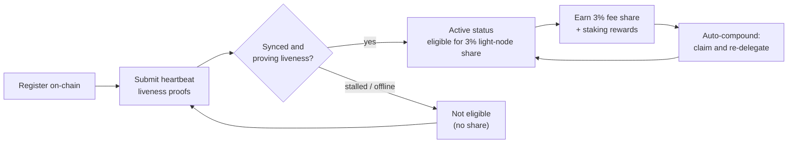

# Recompensas y monitoreo

Un nodo ligero **gana recompensas** y, a la vez, **necesita mantenerse en buen estado** para seguir ganándolas. Esta página cubre la participación del 3 % de recompensa para nodos ligeros, cómo funcionan el staking delegado y el auto-compounding, y cómo monitorear el nodo.

## La participación del 3 % de la recompensa por bloque

La distribución de comisiones de QoreChain reserva una **participación fija del 3 % para los nodos ligeros** que sirven datos de la red. Este es uno de los cinco destinos en el reparto de recompensas del protocolo — validadores (37 %), quemado (30 %), tesorería (20 %), stakers (10 %) y **nodos ligeros (3 %)** — aplicado en la cadena. Consulta [Tokenómica](/architecture/tokenomics) para el desglose completo.

Para ser elegible para esta participación, un nodo debe estar **registrado en la cadena y demostrando activamente su actividad** mediante pruebas de heartbeat. Un nodo registrado pero desconectado no gana la participación. Consulta [Registro y licencias](/light-node/registration-and-licensing) para ver cómo funcionan el registro y los heartbeats.

*Elegibilidad para recompensas: regístrate en la cadena, demuestra actividad mediante heartbeats para alcanzar el estado activo, gana la participación del 3 % y luego compóntela automáticamente en stake.*



## Cómo funcionan las recompensas

Más allá de la participación de nodos ligeros, el nodo gestiona el stake delegado y las recompensas de staking que produce. Este comportamiento se controla mediante la sección `[delegation]` de `config.toml`.

### Staking delegado con reparto multi-validador

Puedes delegar entre **múltiples validadores** en lugar de concentrar el stake en uno solo. El nodo rastrea cada delegación y la porción de stake asignada a cada validador mediante **pesos de reparto** configurables, de modo que puedes distribuir el riesgo entre el conjunto.

### Auto-compounding de recompensas

El nodo puede **reclamar recompensas y volver a delegarlas automáticamente** en un intervalo configurable. Por defecto, el auto-compounding está habilitado en un intervalo de `1h`, con un umbral mínimo de recompensa (en `uqor`) que debe acumularse antes de activar una reclamación. La composición convierte las recompensas ganadas en stake adicional sin intervención manual.

### Rebalanceo según reputación

Cuando el rebalanceo está habilitado, el nodo puede **desplazar la delegación hacia validadores de mayor reputación** automáticamente, sujeto a una puntuación de reputación mínima configurable. Esto mantiene el stake trabajando con validadores que están rindiendo bien en lugar de dejarlo con aquellos que se han degradado.

### Inspeccionar recompensas y delegaciones

La edición SX expone comandos para inspeccionar este estado:

```bash
lightnode-sx delegation   # current delegations and their split
lightnode-sx rewards      # pending staking rewards (uqor)
lightnode-sx validators   # the bonded validator set
```

En la edición UX, la vista **Delegation** muestra la misma información de delegación y recompensas en el navegador.

## Monitoreo

Mantener el nodo en buen estado es lo que lo mantiene elegible para recompensas. Hay tres cosas que vale la pena vigilar.

### Telemetría

La telemetría en tiempo real cubre validadores, consenso/red, el puente y la tokenómica, cada una actualizada en su propio intervalo (configurado bajo `[telemetry]` en `config.toml`). Desde la CLI:

```bash
lightnode-sx status    # node and light-client sync status
lightnode-sx network   # recent synced headers and latest height
```

La edición UX muestra los mismos datos en vivo en sus vistas **Overview**, **Network**, **Bridge** y **Tokenomics** — consulta [Edición UX](/light-node/ux-edition).

### Estado de sincronización y heartbeat

El comando `status` informa el ID de cadena, la altura del último bloque, si la cadena está poniéndose al día y la altura sincronizada del cliente ligero junto con su estado de sincronización. Un nodo registrado, sincronizado y en funcionamiento sigue enviando **pruebas de actividad por heartbeat** y, por lo tanto, se mantiene elegible para la participación de recompensa. Estos heartbeats se producen mediante un **canal de transacción cofirmado con PQC** (híbrido Dilithium-5 / ML-DSA-87), coherente con el valor por defecto PQC-required de la cadena — consulta [Registro y licencias](/light-node/registration-and-licensing#pqc-cosigned-heartbeat-pipeline) para ver cómo funciona el canal y cómo habilitar los heartbeats en la cadena. Si `status` muestra que el nodo está estancado o que no sincroniza, puede estar fallando en demostrar su actividad — investiga antes de que se vea afectada la elegibilidad.

### Estado del autotest

Si sospechas que hay un problema con el stack criptográfico, ejecuta el autotest PQC en cualquier momento:

```bash
lightnode-sx selftest
```

Ejecuta keygen → firma → verificación → detección de manipulación (cinco comprobaciones) y sale con código distinto de cero ante cualquier fallo. Esta es la forma más rápida de descartar una biblioteca `libqorepqc` rota o ausente al diagnosticar problemas del nodo. Consulta [Edición SX](/light-node/sx-edition) para el desglose completo del autotest.

## A dónde ir después

- [Registro y licencias](/light-node/registration-and-licensing) — regístrate y mantente activo.
- [Tokenómica](/architecture/tokenomics) — el modelo completo de recompensas y quemado.
