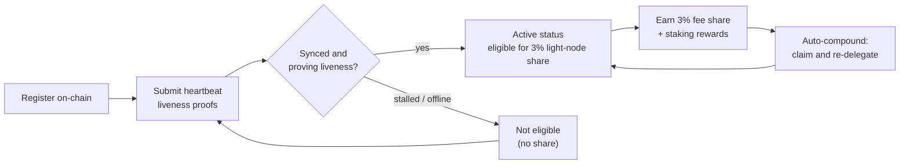

# Recompensas y monitoreo

Un nodo ligero tanto **gana recompensas** como **necesita mantenerse en buen estado** para seguir ganándolas. Esta página cubre la participación del 3 % de recompensa para nodos ligeros, cómo funcionan el staking delegado y el auto-compounding, y cómo monitorear el nodo.

## La participación del 3 % de la recompensa por bloque

La distribución de comisiones de QoreChain reserva una **participación fija del 3 % para los nodos ligeros** que sirven datos de la red. Este es uno de los cinco destinos en el reparto de recompensas del protocolo — validadores (37 %), quemado (30 %), tesorería (20 %), stakers (10 %) y **nodos ligeros (3 %)** — aplicado en la cadena. Consulta [Tokenómica](/architecture/tokenomics) para el desglose completo.

Para ser elegible para esta participación, un nodo necesita tres cosas, verificadas en la cadena y no autodeclaradas: una licencia `lightnode_operator` activa, un mínimo de **1,000 QOR delegados** — contados como tu total en todos los validadores a los que delegas, no por validador — y una tarifa de registro en la cadena de **1 QOR**. La participación también tiene un límite a nivel de red de **10,000 nodos ligeros**. Consulta [Registro y licencias](/light-node/registration-and-licensing) para ver cómo funcionan el registro y las licencias, incluido el estado actual de la inscripción en el programa de recompensas.

Una vez registrado y delegado, mantener la elegibilidad es cuestión de seguir activo. Un nodo necesita al menos un **80 % de tiempo de actividad**, y debe seguir enviando pruebas de actividad por heartbeat en un intervalo de aproximadamente **1,000 bloques (~39 minutos)**.

**La ventana de envío es estrecha en ambos extremos, no solo por el lado tardío.** Un heartbeat solo se acepta entre aproximadamente **tu último heartbeat aceptado + 1,000 bloques y +1,100 bloques** (unos 4 minutos, una vez cada ~39 minutos) — enviarlo demasiado pronto lo rechaza igual que enviarlo demasiado tarde.

**Perder la ventana cuesta tiempo de actividad, no tu registro.** Un nodo que la pierde se marca como inactivo y deja de ganar la participación, pero el siguiente heartbeat exitoso lo reactiva — no hay que volver a registrarse. Ten en cuenta también que el contador interno propio del daemon hacia el siguiente heartbeat sigue avanzando incluso si un intento de envío falla, y se reinicia al reiniciar el proceso, por lo que un nodo puede terminar marcado como inactivo sin que sea culpa del operador; comprueba `status` en lugar de asumir que una marca de inactivo significa que algo está mal configurado.

:::note Lo que realmente demuestra un heartbeat
Un heartbeat exitoso demuestra que la clave del operador firmó a tiempo — no demuestra que un nodo esté ejecutando continuamente el software completo. Trátalo como una firma de actividad, no como "verificado como nodo activo".
:::

:::note `last_heartbeat` es una altura de bloque, no una marca de tiempo
Si consultas directamente el registro en la cadena de un nodo, `last_heartbeat` es una altura de bloque, y un valor de `0` significa que el nodo aún no ha enviado ninguno — en ese caso, la cadena informa su altura `registered_at` como sustituto. Leerlo como un cálculo ingenuo de tiempo transcurrido hace que un nodo recién registrado parezca tener un retraso de millones de bloques.
:::

*Elegibilidad para recompensas: mantén una licencia activa en la cadena y el stake delegado mínimo, regístrate y luego sigue demostrando actividad mediante heartbeats para mantenerte por encima de los umbrales de tiempo de actividad e intervalo de heartbeat que mantienen fluyendo la participación.*


```mermaid
flowchart LR
    A["Register on-chain"] --> B["Submit heartbeat<br/>liveness proofs"]
    B --> C{"Synced and<br/>proving liveness?"}
    C -- "yes" --> D["Active status<br/>eligible for 3% light-node share"]
    C -- "stalled / offline" --> E["Not eligible<br/>(no share)"]
    E --> B
    D --> F["Earn 3% fee share<br/>+ staking rewards"]
    F --> G["Auto-compound:<br/>claim and re-delegate"]
    G --> D
```

## Cómo funcionan las recompensas

Más allá de la participación de nodos ligeros, el nodo gestiona el stake delegado y las recompensas de staking que produce. Este comportamiento se controla mediante la sección `[delegation]` de `config.toml`.

### Staking delegado con reparto multi-validador

Puedes delegar entre **múltiples validadores** en lugar de concentrar el stake en uno solo. El nodo rastrea cada delegación y la porción de stake asignada a cada validador mediante **pesos de reparto** configurables, de modo que puedes distribuir el riesgo entre el conjunto.

### Auto-compounding de recompensas

El nodo puede **reclamar recompensas y volver a delegarlas automáticamente** en un intervalo configurable. Por defecto, el auto-compounding está habilitado en un intervalo de `1h`, con un umbral mínimo de recompensa (en `uqor`) que debe acumularse antes de activar una reclamación. La composición convierte las recompensas ganadas en stake adicional sin intervención manual.

### Rebalanceo según reputación

Cuando el rebalanceo está habilitado, el nodo puede **desplazar la delegación hacia validadores de mayor reputación** automáticamente, sujeto a una puntuación de reputación mínima configurable. Esto mantiene el stake trabajando con validadores que están rindiendo bien en lugar de dejarlo con aquellos que se han degradado.

### Inspeccionar recompensas y delegaciones

La edición SX expone comandos para inspeccionar este estado:

```bash
lightnode-sx delegation   # current delegations and their split
lightnode-sx rewards      # pending staking rewards (uqor)
lightnode-sx validators   # the bonded validator set
```

En la edición UX, la vista **Delegation** muestra la misma información de delegación y recompensas en el navegador.

## Monitoreo

Mantener el nodo en buen estado es lo que lo mantiene elegible para recompensas. Hay tres cosas que vale la pena vigilar.

### Telemetría

La telemetría en tiempo real cubre validadores, consenso/red, el puente y la tokenómica, cada una actualizada en su propio intervalo (configurado bajo `[telemetry]` en `config.toml`). Desde la CLI:

```bash
lightnode-sx status    # node and light-client sync status
lightnode-sx network   # recent synced headers and latest height
```

La edición UX muestra los mismos datos en vivo en sus vistas **Overview**, **Network**, **Bridge** y **Tokenomics** — consulta [Edición UX](/light-node/ux-edition).

### Estado de sincronización y heartbeat

El comando `status` informa el ID de cadena, la altura del último bloque, si la cadena está poniéndose al día, y la altura sincronizada del cliente ligero junto con su estado de sincronización. Un nodo que está registrado, sincronizado y en funcionamiento continúa enviando **pruebas de actividad por heartbeat** y, por lo tanto, se mantiene elegible para la participación de recompensa. Estos heartbeats se producen mediante un **canal de transacción cofirmado con PQC** (híbrido Dilithium-5 / ML-DSA-87), coherente con el valor por defecto que exige PQC en la cadena — consulta [Registro y licencias](/light-node/registration-and-licensing#pqc-cosigned-heartbeat-pipeline) para ver cómo funciona el canal y cómo habilitar los heartbeats en la cadena. Si `status` muestra que el nodo está estancado o no está sincronizando, puede estar fallando en demostrar su actividad — investiga antes de que se vea afectada la elegibilidad.

### Estado del autotest

Si sospechas que hay un problema con el stack criptográfico, ejecuta el autotest PQC en cualquier momento:

```bash
lightnode-sx selftest
```

Ejecuta keygen → firma → verificación → detección de manipulación (cinco comprobaciones) y sale con un código distinto de cero ante cualquier fallo. Esta es la forma más rápida de descartar un problema en el stack de firma post-cuántica al diagnosticar problemas del nodo. Consulta [Edición SX](/light-node/sx-edition) para el desglose completo del autotest.

## A dónde ir después

- [Registro y licencias](/light-node/registration-and-licensing) — regístrate y mantente activo.
- [Tokenómica](/architecture/tokenomics) — el modelo completo de recompensas y quemado.
