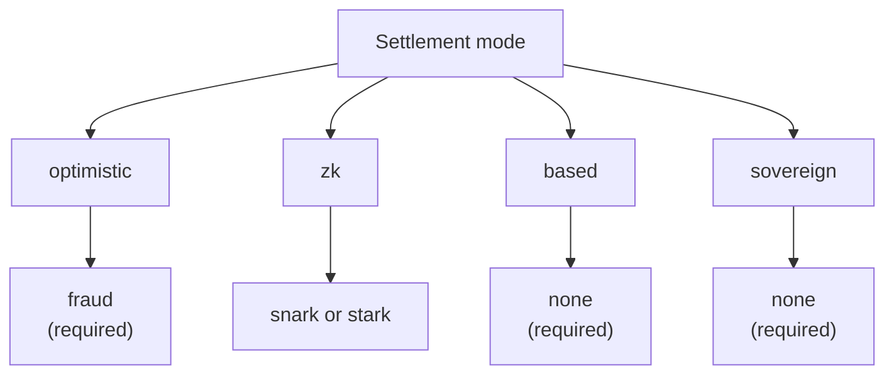

# Visión general de los Rollups

El **Rollup Development Kit (RDK)** de QoreChain — el módulo `x/rdk` — permite a los desarrolladores lanzar rollups específicos de aplicación que liquidan en QoreChain. Cada rollup es un entorno de ejecución independiente con su propio tiempo de bloque, máquina virtual, modelo de comisiones y secuenciación, al tiempo que hereda las garantías de seguridad, criptografía poscuántica y disponibilidad de datos de QoreChain.

:::caution
El RDK y la capa de liquidación de rollups son una capacidad en evolución activa. Trata los modos de liquidación, los sistemas de prueba, los presets y la madurez por característica descritos a lo largo de esta sección como intención de diseño sujeta a cambios, y valida cualquier despliegue en la testnet **`qorechain-diana`** antes de apuntar a mainnet (**`qorechain-vladi`**, EVM chain ID **9801**, versión de cadena **v3.1.77**).
:::

Para la referencia del módulo de más bajo nivel — parámetros del módulo, internos del ciclo de vida, integración con burn y anclaje multicapa — consulta la página **[Rollup Development Kit](/architecture/rollup-development-kit)** en la sección de Arquitectura. Esta sección de Rollups es la guía práctica orientada al desarrollador: qué es el RDK, qué paradigma elegir, cómo desplegar, cómo funciona la disponibilidad de datos y cómo se liquidan los retiros de L2 de vuelta a L1.

---

## Qué te ofrece el RDK

Un rollup creado a través del RDK agrupa cuatro aspectos configurables:

| Aspecto | Qué controla | Opciones |
| ------- | ---------------- | ------- |
| **Modo de liquidación** | Cómo se verifican y finalizan en QoreChain las transiciones de estado del rollup | `optimistic`, `zk`, `based`, `sovereign` |
| **Sistema de prueba** | El mecanismo criptográfico o económico que respalda la liquidación | `fraud`, `snark`, `stark`, `none` |
| **Modo de secuenciador** | Quién ordena las transacciones antes de que se liquiden | `dedicated`, `shared`, `based` |
| **Disponibilidad de datos** | Dónde se publican los datos de transacción para que cualquiera pueda reconstruir el estado | `native`, `celestia`, `both` |

Cada rollup se registra con un `rollup-id` único, respaldado por un bono en stake de QOR, y se le asigna un estado de ciclo de vida (`pending`, `active`, `paused`, `stopped`). Consulta **[Desplegar un Rollup](/rollups/deploying-a-rollup)** para conocer el flujo completo de creación y ciclo de vida.

---

## Qué hace diferente al RDK de QoreChain

Más allá de las funcionalidades básicas de cualquier kit de rollups, el RDK de QoreChain expone tres capacidades que dependen de la Capa 1 de QoreChain y que ningún kit construido sobre una capa base sin poscuántica ni IA puede ofrecer — además de un auto-impugnador watchtower. El RDK se distribuye en cinco lenguajes (TypeScript, Python, Go, Rust, Java), todos actualmente en **v0.4.0**.

| Diferenciador | Qué hace |
| -------------- | ------------ |
| **[Recibos de liquidación cuántico-seguros](/rollups/settlement-receipts)** | Convierte un ancla de liquidación en un recibo portátil verificable **totalmente sin conexión** bajo una firma poscuántica (ML-DSA-87 / Dilithium-5) — byte a byte en los cinco clientes. |
| **[QCAI Rollup Copilot](/rollups/qcai-copilot)** | Agrega los servicios de IA/RL en cadena de QoreChain (agente de política de comisiones, recomendaciones, investigaciones de fraude, disyuntores) en un asesoramiento de solo lectura y en lenguaje sencillo para un rollup. |
| **[Llamadas multi-VM entre VM](/rollups/multi-vm)** | Llama a un contrato CosmWasm desde un contrato de rollup EVM/Solidity a través del precompilado entre VM (`0x…0901`). |
| **[Watchtower](/rollups/watchtower)** | Un framework de auto-impugnación para rollups optimistas que expone los nuevos lotes y los plazos de la ventana de impugnación e impugna los lotes inválidos frente a tu predicado de validez. |

Consulta **[Por qué QoreChain RDK](/rollups/why)** para el razonamiento completo y los ejemplos de código.

---

## Los cuatro paradigmas de liquidación

QoreChain RDK admite cuatro modos de liquidación distintos, cada uno con diferentes supuestos de confianza, características de finalidad y requisitos de prueba. La combinación de modo de liquidación y sistema de prueba se valida en cadena — un emparejamiento incompatible se rechaza en la creación. El diagrama de abajo asigna cada modo de liquidación a su sistema de prueba válido.

### Optimistic

Los rollups optimistas asumen por defecto que los lotes enviados son válidos y dependen de **pruebas de fraude** para la resolución de disputas.

* **Sistema de prueba**: `fraud` — pruebas de fraude interactivas
* **Secuenciador**: `dedicated` o `shared`
* **Finalidad**: Retrasada hasta que expira una ventana de impugnación configurable sin una impugnación exitosa
* **Disputas**: Cualquiera puede enviar una impugnación con prueba de fraude contra un lote enviado dentro de la ventana; una impugnación exitosa rechaza el lote

### ZK (Conocimiento Cero)

Los rollups ZK adjuntan una prueba de validez criptográfica a cada lote, demostrando la corrección de la transición de estado sin reejecución.

* **Sistema de prueba**: `snark` (pruebas sucintas) o `stark` (pruebas transparentes, sin configuración de confianza)
* **Secuenciador**: `dedicated` o `shared`
* **Finalidad**: Tras la verificación de una prueba válida — no se requiere ventana de impugnación
* **Madurez**: La verificación ZK y STARK aún está madurando. Trata la liquidación ZK como aún no endurecida para producción y valídala en testnet. Consulta **[ZK / STARK y Retiros](/rollups/zk-stark-withdrawals)** para más detalles.

### Based

Los rollups based delegan la secuenciación de transacciones a los proponentes de QoreChain (L1), heredando la vivacidad y la resistencia a la censura de la cadena anfitriona.

* **Sistema de prueba**: `none` — los proponentes de L1 son la fuente de verdad del ordenamiento
* **Secuenciador**: `based` (requerido — impuesto por la validación en cadena)
* **Finalidad**: Sigue la confirmación de la cadena anfitriona
* **Compensación**: El modelo operativo más simple, ya que los validadores de QoreChain se encargan de la secuenciación, a costa del control de latencia de un secuenciador dedicado

### Sovereign

Los rollups soberanos ejecutan su propio consenso y se autosecuencian. Anclan el estado a QoreChain para verificabilidad, pero no dependen de la cadena anfitriona para la finalidad.

* **Sistema de prueba**: `none`
* **Secuenciador**: autogestionado por el rollup
* **Finalidad**: Independiente — determinada por el propio consenso del rollup
* **Anclaje de estado**: Las raíces de estado se publican en QoreChain por transparencia, pero la cadena anfitriona no las impone

---

## Compatibilidad de sistemas de prueba

El modo de liquidación restringe qué sistemas de prueba son válidos. Estos emparejamientos se imponen cuando se crea un rollup.

| Modo de liquidación | `fraud` | `snark` | `stark` | `none` |
| --------------- | :-----: | :-----: | :-----: | :----: |
| **optimistic**  | Requerido | — | — | — |
| **zk**          | — | Soportado | Soportado | — |
| **based**       | — | — | — | Requerido |
| **sovereign**   | — | — | — | Requerido |

---

## Modos de secuenciador

El secuenciador determina quién ordena las transacciones dentro de un bloque de rollup antes de la liquidación.

| Modo | Quién secuencia | Notas |
| ---- | ------------- | ----- |
| **`dedicated`** | Una única dirección de operador designada | Menor latencia; requiere confianza en el operador para la vivacidad y el ordenamiento justo |
| **`shared`** | Un conjunto de secuenciadores compartido | Ordenamiento distribuido entre el conjunto; sobrecarga de coordinación ligeramente mayor |
| **`based`** | Proponentes de QoreChain L1 | Hereda la seguridad de los validadores de la cadena anfitriona y la resistencia a la censura; requerido para la liquidación `based` |

---

## Elegir un paradigma

| Si quieres... | Considera |
| -------------- | -------- |
| La configuración operativa más simple, con los validadores de QoreChain secuenciando | **based** |
| Finalidad rápida con garantías criptográficas (madurando) | **zk** (`snark` / `stark`) |
| Un modelo bien comprendido con resolución de disputas económica | **optimistic** (`fraud`) |
| Independencia total con tu propio consenso, anclada para verificabilidad | **sovereign** |

¿No sabes por dónde empezar? El RDK incluye **perfiles preset** que agrupan estas elecciones para categorías de aplicación comunes — consulta **[Perfiles Preset](/rollups/preset-profiles)** — y una consulta `suggest-profile` que recomienda uno a partir de una descripción en lenguaje sencillo de tu caso de uso.

Para los desarrolladores, el RDK también se distribuye como el SDK público de TypeScript **`@qorechain/rdk`** más el generador de andamiaje **`create-qorechain-rollup`**, que impulsan el mismo módulo en cadena desde el código — consulta **[Desplegar un Rollup](/rollups/deploying-a-rollup#deploy-with-the-typescript-rdk-qorechainrdk)**.

## Relacionado

* [Desplegar un Rollup](/rollups/deploying-a-rollup) — lanza un rollup desde la CLI o el RDK de TypeScript.
* [Perfiles Preset](/rollups/preset-profiles) — paquetes de un clic para categorías de aplicación comunes.
* [Disponibilidad de Datos](/rollups/data-availability) — el enrutador DA nativo y el almacenamiento de blobs.
* [Retiros ZK / STARK](/rollups/zk-stark-withdrawals) — flujos de retiro respaldados por pruebas.
