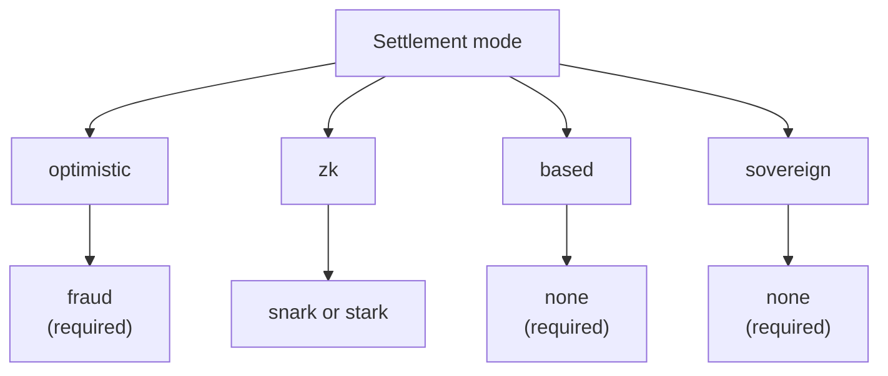

# Visión general de los Rollups

El **Rollup Development Kit (RDK)** de QoreChain — el módulo `x/rdk` — permite a los desarrolladores lanzar rollups específicos de aplicación que liquidan en QoreChain. Cada rollup es un entorno de ejecución independiente con su propio tiempo de bloque, máquina virtual, modelo de comisiones y secuenciación, al tiempo que hereda las garantías de seguridad, criptografía poscuántica y disponibilidad de datos de QoreChain.

:::caution
El RDK y la capa de liquidación de rollups son una capacidad en evolución activa. Trate los modos de liquidación, los sistemas de prueba, los presets y la madurez de cada característica descritos a lo largo de esta sección como una intención de diseño sujeta a cambios, y valide cualquier despliegue en la testnet **`qorechain-diana`** antes de apuntar a mainnet (**`qorechain-vladi`**, chain ID de EVM **9801**, versión de la cadena **v3.1.95**).
:::

Para la referencia del módulo de bajo nivel — parámetros del módulo, detalles internos del ciclo de vida, integración de quema y anclaje multicapa — consulte la página **[Rollup Development Kit](/architecture/rollup-development-kit)** en la sección de Arquitectura. Esta sección de Rollups es la guía práctica orientada al desarrollador: qué es el RDK, qué paradigma elegir, cómo desplegar, cómo funciona la disponibilidad de datos y cómo se liquidan los retiros de L2 de vuelta a L1.

---

## Lo que le ofrece el RDK

Un rollup creado a través del RDK agrupa cuatro aspectos configurables:

| Aspecto | Qué controla | Opciones |
| ------- | ------------ | -------- |
| **Modo de liquidación** | Cómo se verifican y finalizan en QoreChain las transiciones de estado del rollup | `optimistic`, `zk`, `based`, `sovereign` |
| **Sistema de prueba** | El mecanismo criptográfico o económico que respalda la liquidación | `fraud`, `snark`, `stark`, `none` |
| **Modo de secuenciador** | Quién ordena las transacciones antes de que se liquiden | `dedicated`, `shared`, `based` |
| **Disponibilidad de datos** | Dónde se publican los datos de las transacciones para que cualquiera pueda reconstruir el estado | `native`, `celestia`, `both` |

Cada rollup se registra con un `rollup-id` único, respaldado por un bono de stake en QOR, y se le asigna un estado de ciclo de vida (`pending`, `active`, `paused`, `stopped`). Consulte **[Desplegar un Rollup](/rollups/deploying-a-rollup)** para el flujo completo de creación y ciclo de vida.

---

## Qué diferencia al RDK de QoreChain

Más allá de lo básico de cualquier kit de rollups, el RDK de QoreChain expone tres capacidades que dependen de la Capa 1 de QoreChain y que ningún kit construido sobre una capa base sin criptografía poscuántica y sin IA puede ofrecer — además de un auto-desafiador de tipo watchtower. El RDK se distribuye en cinco lenguajes (TypeScript, Python, Go, Rust, Java), alineados en la versión **v0.4.4** en npm, PyPI y Maven Central (en crates.io, instale la última versión publicada o compile desde el repositorio). Desde la v0.4.2 los presets `mainnet` y `testnet` incluyen de serie los endpoints públicos de `qore.host`, de modo que `createRdkClient({ network })` alcanza la cadena sin configuración manual de endpoints.

| Diferenciador | Qué hace |
| ------------- | -------- |
| **[Recibos de liquidación resistentes a computación cuántica](/rollups/settlement-receipts)** | Convierta un ancla de liquidación en un recibo portátil verificable **totalmente sin conexión** bajo una firma poscuántica (ML-DSA-87 / Dilithium-5) — byte a byte en los cinco clientes. |
| **[QCAI Rollup Copilot](/rollups/qcai-copilot)** | Agregue los servicios on-chain de IA/RL de QoreChain (agente de política de comisiones, recomendaciones, investigaciones de fraude, cortacircuitos) en un asesoramiento de solo lectura y en lenguaje natural para un rollup. |
| **[Llamadas multi-VM entre VMs](/rollups/multi-vm)** | Llame a un contrato CosmWasm desde un contrato de rollup EVM/Solidity a través del precompilado cross-VM (`0x…0901`). |
| **[Watchtower](/rollups/watchtower)** | Un framework de auto-desafío para rollups optimistas que muestra los nuevos lotes y los plazos de la ventana de impugnación, y desafía los lotes inválidos según su predicado de validez. |

Consulte **[Por qué el RDK de QoreChain](/rollups/why)** para la justificación completa y ejemplos de código.

---

## Los cuatro paradigmas de liquidación

El RDK de QoreChain admite cuatro modos de liquidación distintos, cada uno con diferentes supuestos de confianza, características de finalidad y requisitos de prueba. La combinación de modo de liquidación y sistema de prueba se valida on-chain — un emparejamiento incompatible se rechaza en el momento de la creación. El diagrama siguiente asocia cada modo de liquidación con su sistema de prueba válido.

```mermaid
flowchart TD
    S["Settlement mode"]
    S --> O["optimistic"]
    S --> Z["zk"]
    S --> BA["based"]
    S --> SV["sovereign"]
    O --> OF["fraud<br/>(required)"]
    Z --> ZS["snark or stark"]
    BA --> BN["none<br/>(required)"]
    SV --> SN["none<br/>(required)"]
```

### Optimistic

Los rollups optimistas asumen que los lotes enviados son válidos por defecto y se apoyan en **pruebas de fraude** para la resolución de disputas.

* **Sistema de prueba**: `fraud` — pruebas de fraude interactivas
* **Secuenciador**: `dedicated` o `shared`
* **Finalidad**: Diferida hasta que expire una ventana de impugnación configurable sin ninguna impugnación exitosa
* **Disputas**: Cualquiera puede presentar una impugnación mediante prueba de fraude contra un lote enviado dentro de la ventana; una impugnación exitosa rechaza el lote

### ZK (Conocimiento cero)

Los rollups ZK adjuntan una prueba criptográfica de validez a cada lote, demostrando la corrección de la transición de estado sin re-ejecución.

* **Sistema de prueba**: `snark` (pruebas sucintas) o `stark` (pruebas transparentes, sin configuración de confianza)
* **Secuenciador**: `dedicated` o `shared`
* **Finalidad**: Al verificarse una prueba válida — no se requiere ventana de impugnación
* **Madurez**: La verificación ZK y STARK aún está madurando. Considere la liquidación ZK como todavía no endurecida para producción y valídela en testnet. Consulte **[ZK / STARK y Retiros](/rollups/zk-stark-withdrawals)** para más detalles.

### Based

Los rollups based delegan la secuenciación de transacciones a los proposers de QoreChain (L1), heredando la vivacidad y la resistencia a la censura de la cadena anfitriona.

* **Sistema de prueba**: `none` — los proposers de L1 son la fuente de verdad del ordenamiento
* **Secuenciador**: `based` (obligatorio — aplicado mediante validación on-chain)
* **Finalidad**: Sigue la confirmación de la cadena anfitriona
* **Contrapartida**: El modelo operativo más simple, ya que los validadores de QoreChain gestionan la secuenciación, a costa del control de latencia de un secuenciador dedicado

### Sovereign

Los rollups soberanos ejecutan su propio consenso y se autosecuencian. Anclan su estado a QoreChain para la verificabilidad, pero no dependen de la cadena anfitriona para la finalidad.

* **Sistema de prueba**: `none`
* **Secuenciador**: autogestionado por el rollup
* **Finalidad**: Independiente — determinada por el propio consenso del rollup
* **Anclaje de estado**: Las raíces de estado se publican en QoreChain por transparencia, pero la cadena anfitriona no las hace cumplir

---

## Compatibilidad de sistemas de prueba

El modo de liquidación restringe qué sistemas de prueba son válidos. Estos emparejamientos se aplican cuando se crea un rollup.

| Modo de liquidación | `fraud` | `snark` | `stark` | `none` |
| --------------- | :-----: | :-----: | :-----: | :----: |
| **optimistic**  | Obligatorio | — | — | — |
| **zk**          | — | Admitido | Admitido | — |
| **based**       | — | — | — | Obligatorio |
| **sovereign**   | — | — | — | Obligatorio |

---

## Modos de secuenciador

El secuenciador determina quién ordena las transacciones dentro de un bloque del rollup antes de la liquidación.

| Modo | Quién secuencia | Notas |
| ---- | ------------- | ----- |
| **`dedicated`** | Una única dirección de operador designada | Latencia mínima; requiere confianza en el operador para la vivacidad y el ordenamiento justo |
| **`shared`** | Un conjunto de secuenciadores compartido | Ordenamiento distribuido entre el conjunto; sobrecarga de coordinación ligeramente mayor |
| **`based`** | Los proposers L1 de QoreChain | Hereda la seguridad de los validadores y la resistencia a la censura de la cadena anfitriona; obligatorio para la liquidación `based` |

---

## Elegir un paradigma

| Si desea... | Considere |
| -------------- | -------- |
| La configuración operativa más simple, con los validadores de QoreChain secuenciando | **based** |
| Finalidad rápida con garantías criptográficas (en maduración) | **zk** (`snark` / `stark`) |
| Un modelo bien entendido con resolución económica de disputas | **optimistic** (`fraud`) |
| Independencia total con su propio consenso, anclado para la verificabilidad | **sovereign** |

¿No sabe por dónde empezar? El RDK incluye **perfiles preconfigurados** que agrupan estas elecciones para categorías de aplicación comunes — consulte **[Perfiles preconfigurados](/rollups/preset-profiles)** — y una consulta `suggest-profile` que recomienda uno a partir de una descripción en lenguaje natural de su caso de uso.

Para los desarrolladores, el RDK también se distribuye como el SDK público de TypeScript **`@qorechain/rdk`** junto con el scaffolder **`create-qorechain-rollup`**, que operan el mismo módulo on-chain desde código — consulte **[Desplegar un Rollup](/rollups/deploying-a-rollup#deploy-with-the-typescript-rdk-qorechainrdk)**.

## Relacionado

* [Desplegar un Rollup](/rollups/deploying-a-rollup) — lance un rollup desde la CLI o el RDK de TypeScript.
* [Perfiles preconfigurados](/rollups/preset-profiles) — paquetes de un clic para categorías de aplicación comunes.
* [Disponibilidad de datos](/rollups/data-availability) — el enrutador de DA nativo y el almacenamiento de blobs.
* [Retiros ZK / STARK](/rollups/zk-stark-withdrawals) — flujos de retiro respaldados por pruebas.
