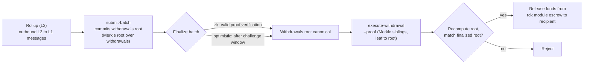

# ZK / STARK y Retiros

Esta página cubre dos temas relacionados: los **sistemas de pruebas ZK** (`snark` y `stark`) utilizados por los rollups liquidados con ZK, y el **flujo de retiro L2 → L1** que mueve fondos desde un rollup de vuelta a QoreChain una vez que un lote se finaliza.

:::caution
La verificación ZK y STARK es una parte del RDK que está madurando activamente. Trata los sistemas de pruebas y el flujo de retiro descritos aquí como una intención de diseño, valídalos en la testnet **`qorechain-diana`** y no asumas todavía garantías criptográficas reforzadas para producción en mainnet.
:::

---

## Sistemas de pruebas ZK

Un rollup liquidado con ZK (modo de liquidación `zk`) adjunta una prueba de validez a cada lote de liquidación, demostrando que la transición de estado es correcta sin volver a ejecutar las transacciones del rollup. La liquidación ZK admite dos sistemas de pruebas:

| Sistema de pruebas | Características |
| ------------ | --------------- |
| **`snark`** | Pruebas sucintas |
| **`stark`** | Pruebas transparentes — sin configuración de confianza (trusted setup) |

El modo de liquidación `zk` requiere `snark` o `stark`; el emparejamiento se aplica on-chain cuando se crea el rollup. En cambio, la liquidación `optimistic` usa el sistema de pruebas `fraud`, y las liquidaciones `based` y `sovereign` usan `none`. Consulta **[Visión general de Rollups](/rollups/overview)** para ver la matriz de compatibilidad completa.

### Finalidad

A diferencia de los rollups optimistas —que esperan a que transcurra una ventana de impugnación de prueba de fraude— un lote ZK puede finalizarse con la **verificación de una prueba válida**, sin una ventana de disputa. Esta es la compensación central de la liquidación ZK: una finalidad más fuerte y rápida a cambio del coste y la complejidad de generar pruebas.

### Madurez

La verificación de pruebas ZK y STARK todavía está madurando. Trata la liquidación ZK como **aún no reforzada para producción**: crea prototipos y valida en testnet, y sigue las notas de versión del RDK para conocer el estado de la verificación completa de pruebas antes de confiar en ella para rollups de mainnet que manejen valor.

---

## Cómo los lotes transportan los retiros

Cuando un rollup liquida un lote, ese lote también puede comprometer los mensajes salientes entre capas del rollup: sus **retiros L2 → L1**. Conceptualmente:

* Un lote finalizado puede transportar un compromiso de su conjunto de retiros (una raíz de Merkle sobre los mensajes de retiro del lote).
* Cada retiro individual es una hoja bajo esa raíz, identificada por su índice de lote y un índice de retiro.
* Una vez que el lote se finaliza, cualquier parte puede demostrar que una hoja de retiro específica está incluida bajo la raíz comprometida y activar el pago.

Por eso los retiros dependen de la liquidación: un retiro solo puede ejecutarse contra un lote **finalizado**, porque es la finalización lo que hace canónica la raíz de retiros comprometida.

Para saber cómo se envían y finalizan los lotes —incluyendo `submit-batch` y la ruta de disputa `challenge-batch` para rollups optimistas— consulta **[Desplegar un Rollup](/rollups/deploying-a-rollup)**.

---

## Ejecutar un retiro: `execute-withdrawal`

El comando `execute-withdrawal` finaliza un retiro L2 → L1 contra la raíz de retiros de un lote finalizado. Demuestra que una hoja de retiro está comprometida en esa raíz y paga al destinatario desde el escrow del módulo rdk. La acción es **sin permisos**: cualquiera puede enviar una prueba válida.

```bash
qorechaind tx rdk execute-withdrawal \
  [rollup-id] [batch-index] [withdrawal-index] [recipient] [denom] [amount] \
  --proof <sibling-hash-1>,<sibling-hash-2>,... \
  --from mykey \
  --chain-id qorechain-diana \
  --fees 500uqor
```

**Argumentos posicionales:**

| Argumento | Descripción |
| -------- | ----------- |
| `rollup-id` | El rollup al que pertenece el retiro |
| `batch-index` | El lote finalizado cuya raíz de retiros compromete este retiro |
| `withdrawal-index` | El índice de la hoja de retiro dentro de ese lote |
| `recipient` | La dirección a la que pagar |
| `denom` | La denominación a pagar |
| `amount` | La cantidad a pagar |

**Flag:**

| Flag | Descripción |
| ---- | ----------- |
| `--proof` | Hashes hermanos de Merkle en hexadecimal separados por comas, ordenados de la hoja a la raíz, que demuestran que la hoja de retiro está comprometida en la raíz de retiros del lote |

El valor de `--proof` es la prueba de inclusión: los hashes hermanos a lo largo del camino desde la hoja de retiro hasta la raíz de retiros comprometida del lote. El módulo recalcula la raíz a partir de la hoja y los hermanos proporcionados y la compara con la raíz comprometida del lote finalizado antes de liberar los fondos en escrow.

---

## Flujo de retiro de extremo a extremo

*La ruta de L2 a L1: un lote de liquidación compromete una raíz de retiros, el lote se finaliza, y luego una prueba de inclusión sin permisos libera los fondos en escrow en QoreChain.*



1. **Liquidar un lote.** El operador del rollup envía un lote de liquidación con `submit-batch`. El lote puede comprometer una raíz de retiros sobre sus mensajes salientes L2 → L1.
2. **Finalizar.** El lote se finaliza según el modo de liquidación del rollup: con la verificación de una prueba válida para `zk`, o tras la ventana de impugnación para `optimistic` (durante la cual `challenge-batch` puede disputarlo).
3. **Demostrar y ejecutar.** Una vez finalizado, cualquiera envía `execute-withdrawal` con la prueba de inclusión de Merkle (`--proof`) para la hoja de retiro específica. El módulo verifica la inclusión contra la raíz de retiros del lote finalizado y paga al destinatario desde el escrow.

Como el paso 3 es sin permisos y basado en pruebas, un retiro no depende de la cooperación del operador del rollup una vez que el lote que lo transporta está finalizado.

---

## Relacionado

* **[Visión general de Rollups](/rollups/overview)** — paradigmas de liquidación y la matriz de compatibilidad de sistemas de pruebas.
* **[Desplegar un Rollup](/rollups/deploying-a-rollup)** — comandos de operador `submit-batch` y `challenge-batch`.
* **[Rollup Development Kit](/architecture/rollup-development-kit)** — la referencia del módulo de más bajo nivel.
