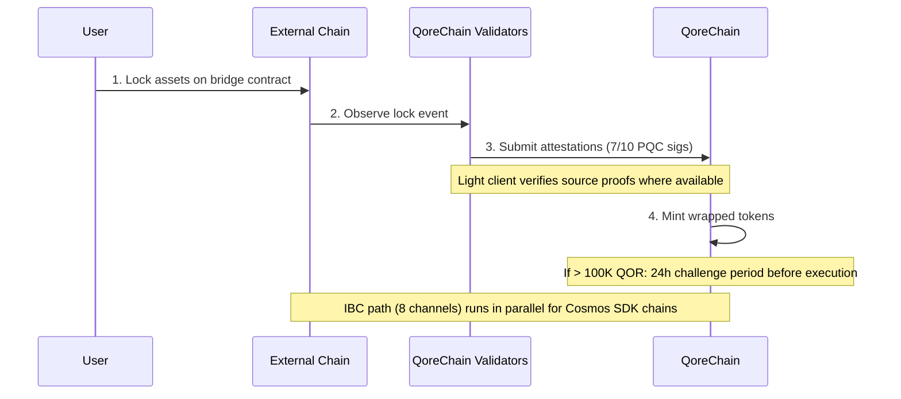

# Architecture du bridge

Le module `x/bridge` est conçu pour connecter QoreChain à l'écosystème blockchain plus large via **37 configurations de chaînes QCB (QoreChain Bridge) et 8 canaux IBC (Inter-Blockchain Communication)**. Chaque opération de bridge est sécurisée par cryptographie post-quantique.

:::caution
Le bridge inter-chaînes est **actuellement en testnet et en attente — ce n'est pas encore un système de production**. Les configurations de chaînes, clients légers et flux décrits ci-dessous reflètent le bridge tel que conçu et tel qu'éprouvé en testnet. La connectivité externe est déployée progressivement ; considérez toutes les cibles comme une intention de conception plutôt que comme des garanties live sur le mainnet.
:::

## Vue d'ensemble des connexions

QoreChain est conçue pour prendre en charge deux protocoles de bridge fonctionnant en parallèle :

| Protocole | Connexions           | Modèle de sécurité                   | Cas d'usage                             |
| --------- | -------------------- | ------------------------------------ | --------------------------------------- |
| **IBC**   | 8 canaux             | IBC standard + signatures PQC de paquets | Chaînes compatibles Cosmos SDK      |
| **QCB**   | 37 configs de chaînes | Multisig 7-sur-10 Dilithium-5       | Chaînes non-IBC (EVM, Solana, TON, etc.) |

Les **37 configurations de chaînes QCB** comprennent **36 chaînes externes** plus **QoreChain elle-même** en tant que configuration native/loopback (utilisée pour le routage interne et le règlement auto-référentiel). Les 8 canaux IBC se connectent à des chaînes compatibles Cosmos SDK.

## Canaux IBC

QoreChain est conçue pour maintenir des connexions IBC vers les 8 chaînes suivantes, relayées via Hermes v1.x :

| Chaîne     | Description                       |
| ---------- | --------------------------------- |
| Cosmos Hub | Connexion au hub principal        |
| Osmosis    | Routage de liquidité DEX          |
| Noble      | Émission native d'USDC            |
| Celestia   | Couche de disponibilité des données |
| Stride     | Staking liquide                   |
| Akash      | Calcul décentralisé               |
| Babylon    | Protocole de restaking BTC        |
| Injective  | Interopérabilité DeFi / carnet d'ordres |

### Configuration du relayeur IBC

* **Logiciel de relais** : Hermes v1.x
* **Mises à jour de client** : rafraîchissement automatique du client léger
* **Détection de comportement malveillant** : activée — le relayeur surveille les cas d'équivocation
* **Effacement des paquets** : tous les 100 blocs, les paquets IBC en attente sont effacés
* **Amélioration PQC** : chaque paquet IBC provenant de QoreChain inclut une signature Dilithium-5 optionnelle pour une sécurité quantique anticipée. Les chaînes réceptrices compatibles PQC peuvent vérifier cette signature en complément de la vérification IBC standard.

## Protocole QCB (QoreChain Bridge)

Le protocole QCB utilise une architecture en étoile (hub-and-spoke) sécurisée par cryptographie post-quantique. QoreChain agit comme le hub, avec des configurations en rayon (spoke) pour chaque chaîne externe plus une configuration native/loopback pour QoreChain elle-même.

### Configurations de chaînes externes (36)

Le protocole QCB est conçu pour cibler les 36 chaînes externes suivantes. Combiné à la configuration native/loopback propre à QoreChain, cela donne **37 configs de chaînes QCB au total (y compris QoreChain elle-même)**.

**Chaînes de base (10)**

Ethereum, Solana, TON, BSC, Avalanche, Polygon, Arbitrum, Optimism, Base, Sui.

**Chaînes de la famille EVM (14)**

zkSync Era, Linea, Scroll, Blast, Mantle, Hyperliquid, Berachain, Sonic, Sei, Monad, Plasma, Filecoin FVM, Cronos, Kaia.

**Chaînes non-EVM (5)**

Starknet, XRP Ledger, Stellar, Hedera, Algorand.

**Chaînes en attente (7)**

NEAR, Bitcoin, Cardano, Polkadot, Tezos, Tron, Aptos.

:::note
Vérification du décompte : 10 de base + 14 famille EVM + 5 non-EVM + 7 en attente = **36 chaînes externes**. En ajoutant la configuration native/loopback propre à QoreChain, on obtient **37 configs de chaînes QCB**.
:::

### Formats d'adresses

Le protocole QCB classe les chaînes par type afin de valider les adresses de destination :

| Type de chaîne | Exemples de chaînes                                                     | Format d'adresse                                   |
| -------------- | ----------------------------------------------------------------------- | -------------------------------------------------- |
| `evm`          | Ethereum, BSC, Avalanche, Polygon, Arbitrum, Optimism, Base             | `0x` + 40 caractères hex                           |
| `solana`       | Solana                                                                  | Base58, 32-44 caractères                           |
| `ton`          | TON                                                                     | `EQ` + encodé en base64                            |
| `sui_move`     | Sui                                                                     | `0x` + 64 caractères hex                           |
| `aptos_move`   | Aptos                                                                   | `0x` + 64 caractères hex                           |
| `bitcoin`      | Bitcoin                                                                 | Bech32 (`bc1`), P2SH (`3...`), ou legacy (`1...`)  |
| `near`         | NEAR Protocol                                                           | suffixe `.near` ou implicite                       |
| `cardano`      | Cardano                                                                 | `addr1` (paiement) ou `stake1` (staking)           |
| `polkadot`     | Polkadot                                                                | encodé en SS58                                     |
| `tezos`        | Tezos                                                                   | `tz1`/`tz2`/`tz3` (implicite) ou `KT1` (originé)   |
| `tron`         | TRON                                                                    | `T` + base58, 34 caractères                        |

## Clients légers

Pour vérifier les événements de chaînes externes sans confiance, le bridge est conçu pour exécuter des clients légers on-chain adaptés au consensus et au système de preuve de chaque chaîne source. Ces clients légers permettent à QoreChain de valider les dépôts et retraits sans s'appuyer uniquement sur les attestations des validateurs.

| Client léger            | Chaîne source       | Primitives de vérification                                          |
| ----------------------- | ------------------- | ------------------------------------------------------------------- |
| **Client léger Ethereum** | Ethereum / EVM L1 | Vérification de signature BLS12-381, sérialisation SSZ, preuves d'état MPT |
| **Bitcoin SPV**         | Bitcoin             | Simplified Payment Verification sur les en-têtes de bloc            |
| **Starknet STARK**      | Starknet            | Vérification de preuve STARK des transitions d'état Starknet        |
| **Sui BLS**             | Sui                 | Vérification de signature agrégée BLS des checkpoints Sui           |
| **Wormhole / Solana VAA** | Solana (via Wormhole) | Vérification de signature des gardiens via Verified Action Approval (VAA) |

## Flux de dépôt (externe vers QoreChain)

La séquence ci-dessous illustre un dépôt QCB : les actifs sont verrouillés sur une chaîne externe, les validateurs de QoreChain soumettent des attestations signées par PQC (7-sur-10 Dilithium-5), et des jetons enveloppés (wrapped) sont émis. Les chaînes compatibles Cosmos SDK utilisent plutôt le chemin IBC parallèle (8 canaux, avec signatures de paquets Dilithium-5 optionnelles). Les deux chemins sont en testnet/en attente.



```
External Chain          QoreChain Validators           QoreChain
     |                         |                          |
     | 1. Lock assets on       |                          |
     |    bridge contract      |                          |
     |------------------------>|                          |
     |                         | 2. Observe & attest      |
     |                         |    (7/10 PQC sigs)       |
     |                         |------------------------->|
     |                         |                          | 3. Mint wrapped
     |                         |                          |    tokens
     |                         |                          |
     |                         |    [If > 100K QOR]       |
     |                         |    24h challenge period   |
     |                         |    before execution       |
```

1. **Verrouillage** — L'utilisateur verrouille des actifs dans le contrat de bridge sur la chaîne externe.
2. **Attestation** — Les validateurs du bridge observent la transaction de verrouillage et soumettent des attestations signées Dilithium-5. Un minimum de **7 sur 10** attestations de validateurs est requis. Lorsqu'un client léger est disponible pour la chaîne source, l'événement de verrouillage est en outre vérifié par rapport aux preuves propres à la chaîne.
3. **Émission** — Une fois le seuil d'attestation atteint, des jetons enveloppés sont émis sur QoreChain.
4. **Période de contestation** — Pour les transferts dépassant l'équivalent de 100 000 QOR, une **période de contestation de 24 heures** s'applique avant l'exécution. Pendant cette fenêtre, les validateurs peuvent signaler une activité suspecte.

## Flux de retrait (QoreChain vers externe)

```
QoreChain               QoreChain Validators           External Chain
     |                         |                          |
     | 1. Burn wrapped tokens  |                          |
     |------------------------>|                          |
     |                         | 2. Attest burn           |
     |                         |    (7/10 PQC sigs)       |
     |                         |------------------------->|
     |                         |                          | 3. Unlock original
     |                         |                          |    assets
```

1. **Burn** — L'utilisateur brûle les jetons enveloppés sur QoreChain.
2. **Attestation** — Les validateurs attestent l'événement de burn avec des signatures Dilithium-5 (seuil 7/10).
3. **Déverrouillage** — Une fois le seuil atteint, les actifs originaux sont déverrouillés sur la chaîne externe.

Tous les frais de bridge collectés lors des retraits sont acheminés vers le module `x/burn` via le canal de burn `bridge_fee` (100 % des frais de bridge sont brûlés).

### Flux de retrait L2 → L1 (règlement de rollup)

Le bridge est également conçu pour régler les **retraits de rollup (L2) vers leur chaîne hôte (L1)**. Les rollups déployés via le [Rollup Development Kit](/architecture/rollup-development-kit) ancrent périodiquement leur état sur QoreChain ; le bridge consomme ces ancres finalisées pour autoriser les retraits du rollup vers la chaîne hôte :

1. Un utilisateur initie un retrait sur le rollup (L2), qui est inclus dans un lot de règlement.
2. Le lot est ancré sur QoreChain et prouvé/finalisé selon le mode de règlement du rollup (par exemple, après l'expiration de la fenêtre de contestation optimiste, ou à la suite d'une vérification de preuve valide).
3. Une fois l'ancre finalisée, le retrait devient réclamable et les actifs correspondants sont libérés sur la chaîne hôte (L1) via le chemin standard burn-and-attest.

Cela lie la finalité du rollup directement aux garanties de règlement de la chaîne hôte, de sorte que les retraits L2 ne peuvent pas être libérés avant que l'état L2 correspondant ne soit irréversiblement réglé.

## Architecture de sécurité

### Multisig PQC

Toutes les opérations de bridge QCB requièrent un **seuil de 7 sur 10** de signatures post-quantiques Dilithium-5 de la part des validateurs de bridge enregistrés. Chaque validateur de bridge s'enregistre avec :

* Une adresse de validateur QoreChain
* Une clé publique Dilithium-5 (2 592 octets)
* Une liste des chaînes prises en charge
* Un score de réputation (maintenu par `x/reputation`)

### Coupe-circuits

Chaque chaîne connectée dispose de protections de coupe-circuit indépendantes :

| Protection                | Description                                                                          |
| ------------------------- | ------------------------------------------------------------------------------------ |
| **Limite par transfert unique** | Montant maximal pour toute opération de bridge individuelle par chaîne          |
| **Limite agrégée quotidienne** | Plafond de volume total par chaîne par fenêtre de 24 heures                       |
| **Pause manuelle**        | Arrêt d'urgence déclenché par la gouvernance ou un validateur, par chaîne            |
| **Détection d'anomalie**  | Pause automatique si >50 opérations dans une courte fenêtre ou si le volume dépasse 5x la limite quotidienne |

L'état du coupe-circuit est suivi par chaîne et comprend : le transfert unique maximal, la limite quotidienne, l'usage quotidien courant, la dernière hauteur de réinitialisation, et le statut de pause avec son motif.

### Période de contestation

Pour les transferts importants (>100 000 QOR équivalent, configurable via `large_transfer_threshold`) :

* Une **période de contestation de 24 heures** (86 400 secondes) s'applique après l'atteinte du seuil d'attestation.
* Pendant cette fenêtre, tout validateur peut signaler l'opération.
* Si elle n'est pas contestée, l'opération s'exécute automatiquement après l'expiration de la période.
* Les opérations contestées sont gelées pour examen par la gouvernance.

### Optimisation de chemin par IA

Le module de bridge s'intègre au sous-système d'IA pour l'optimisation des routes. Pour les transferts pouvant emprunter plusieurs chemins (par exemple, chaîne A vers chaîne B via un intermédiaire), l'optimiseur de chemin évalue :

* Les frais estimés sur les routes
* Le temps de complétion estimé
* Le score de sécurité par chemin
* Le niveau de confiance de l'estimation

## Points de terminaison de l'API REST

À partir de la version de chaîne **v3.1.77**, l'état du bridge est également interrogeable **en lecture seule via REST** au moyen de grpc-gateway sous le préfixe `/qorechain/bridge/v1/...` (`config`, `chains`, `chains/{chain_id}`, `validators`, `validators/{address}`, `operations`, `operations/{id}`) — auparavant disponible uniquement en gRPC. Ces points de terminaison servent du JSON on-chain réel via HTTP pour les explorateurs et la télémétrie des nœuds légers. Voir [Points de terminaison REST / gRPC](/api-reference/rest-grpc-endpoints#bridge-module) pour la liste complète.

| Méthode | Point de terminaison                               | Description                                      |
| ------- | -------------------------------------------------- | ------------------------------------------------ |
| GET     | `/bridge/v1/chains`                                | Lister toutes les configurations de chaînes prises en charge |
| GET     | `/bridge/v1/chains/{chain_id}`                     | Obtenir la configuration d'une chaîne spécifique |
| GET     | `/bridge/v1/validators`                            | Lister tous les validateurs de bridge enregistrés |
| GET     | `/bridge/v1/operations`                            | Lister toutes les opérations de bridge (les plus récentes en premier) |
| GET     | `/bridge/v1/operations/{operation_id}`             | Obtenir les détails d'une opération spécifique   |
| GET     | `/bridge/v1/locked/{chain}/{asset}`                | Obtenir les montants verrouillés/émis pour une paire chaîne/actif |
| GET     | `/bridge/v1/circuit-breakers`                      | Lister tous les états des coupe-circuits          |
| GET     | `/bridge/v1/estimate/{from}/{to}/{asset}/{amount}` | Obtenir une estimation de route optimisée par IA  |

## Événements du bridge

Le module de bridge émet les événements on-chain suivants :

| Type d'événement              | Description                                     |
| ----------------------------- | ----------------------------------------------- |
| `bridge_deposit`              | Nouvelle opération de dépôt créée               |
| `bridge_withdraw`             | Nouvelle opération de retrait créée             |
| `bridge_attestation`          | Attestation de validateur soumise               |
| `bridge_operation_executed`   | Opération finalisée et exécutée                 |
| `bridge_circuit_breaker_trip` | Coupe-circuit activé ou désactivé               |
| `bridge_validator_registered` | Nouveau validateur de bridge enregistré         |
| `bridge_pqc_verification`     | Résultat de vérification de signature PQC (paquets IBC) |

## Voir aussi

* [Faire transiter des actifs](/user-guide/bridging-assets) — déplacer des actifs entre chaînes étape par étape.
* [Bridge du Dashboard](/dashboard/bridge) — l'interface de bridge pour les utilisateurs au quotidien.
* [Restaking BTC via Babylon](/architecture/btc-restaking-babylon) — sécurité adossée à Bitcoin.
* [Sécurité post-quantique](/architecture/post-quantum-security) — vérification PQC sur les paquets IBC.
