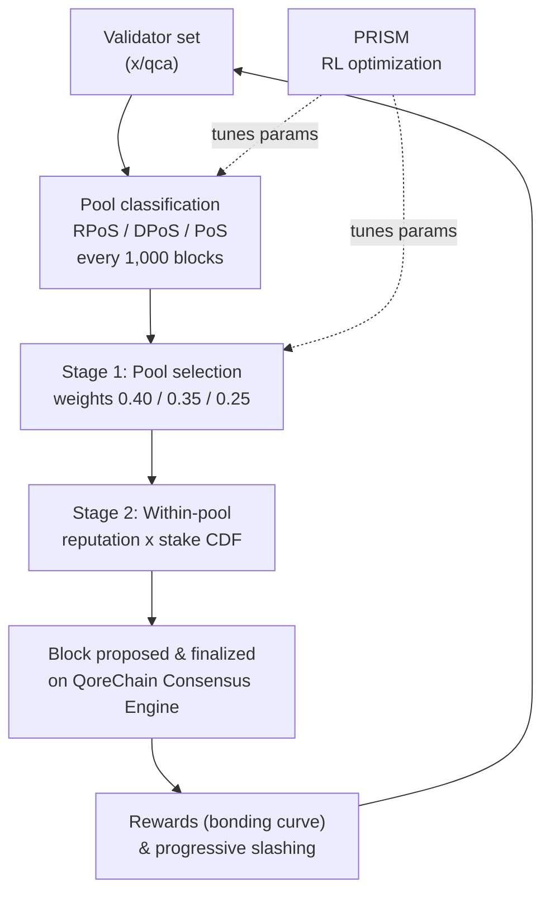

# Mécanisme de consensus

QoreChain met en œuvre le **Triple-Pool Composite Proof-of-Stake (CPoS)**, un mécanisme de consensus qui classe les validateurs en trois pools spécialisés et utilise une sélection pondérée par la réputation pour équilibrer sécurité, décentralisation et performance. Le CPoS est implémenté dans le module `x/qca` et fonctionne au-dessus du **QoreChain Consensus Engine**.

La couche d'optimisation par apprentissage par renforcement qui ajuste les paramètres de consensus à l'exécution porte le nom de marque **PRISM** (Policy-driven Reinforcement-learning for Intelligent State Machines). Voir le [moteur de consensus PRISM](/architecture/prism-consensus-engine) pour plus de détails.

Le schéma ci-dessous résume un cycle de bloc/consensus du Triple-Pool CPoS sur le QoreChain Consensus Engine, et montre où PRISM rétroagit sur les paramètres ajustables de `x/qca`.



---

## Architecture Triple-Pool

Le CPoS répartit l'ensemble actif des validateurs en trois pools en fonction de la réputation, du stake et des métriques de délégation. Chaque pool joue un rôle distinct dans le processus de consensus.

### Classification des pools

| Pool                                 | Critères                                                                | Poids de sélection |
| ------------------------------------ | ----------------------------------------------------------------------- | ------------------ |
| **RPoS** (Reputation Proof-of-Stake) | Score de réputation >= 70e centile **ET** stake auto-délégué >= médiane | 40 %               |
| **DPoS** (Delegated Proof-of-Stake)  | Délégation totale >= 10,000 QOR                                          | 35 %               |
| **PoS** (Standard Proof-of-Stake)    | Tous les autres validateurs actifs                                      | 25 %               |

La classification est évaluée selon la priorité suivante : **RPoS > DPoS > PoS**. Un validateur qui remplit les critères à la fois de RPoS et de DPoS est affecté à RPoS.

La reclassification a lieu tous les **1,000 blocs**. À chaque époque de reclassification :

1. **Collecter les scores de réputation** — Les scores de réputation sont collectés depuis le module `x/reputation` pour tous les validateurs actifs.
2. **Calculer le seuil de réputation** — Le seuil de réputation du 70e centile est calculé à partir de la distribution triée des scores.
3. **Calculer le stake auto-délégué médian** — Le stake auto-délégué médian est calculé à partir de la distribution triée des stakes.
4. **Réaffecter les validateurs** — Chaque validateur actif est réaffecté au pool de plus haute priorité dont il remplit les critères.
5. **Affectation par défaut** — Les validateurs non classés (ceux qui n'ont pas encore été évalués) sont affectés par défaut au pool PoS.

---

## Sélection du proposant pondérée par pool

La sélection du proposant de bloc suit un processus déterministe en deux étapes.

### Étape 1 : Sélection du pool

Une valeur aléatoire déterministe sélectionne le pool qui propose le bloc suivant :

```
seed = SHA256(lastBlockHash || height || "pool")
randVal = uint64(seed[:8]) / MaxUint64    // uniform in [0, 1)
```

Le pool est choisi en comparant `randVal` à des seuils de poids cumulés :

* `randVal < 0.40` → pool RPoS
* `0.40 <= randVal < 0.75` → pool DPoS
* `randVal >= 0.75` → pool PoS

### Étape 2 : Sélection au sein du pool

Au sein du pool sélectionné, le proposant est choisi via une **CDF pondérée réputation × stake**. Pour chaque validateur du pool :

1. Le score de réputation `r` est récupéré depuis `x/reputation`.
2. Le poids composite est `w = r * tokens`.
3. Une fonction de répartition cumulative (CDF) est construite à partir de tous les poids composites.
4. Le proposant est sélectionné à l'aide d'un tirage aléatoire déterministe contre la CDF, initialisé par le hachage et la hauteur du bloc.

### Comportement de repli

Si le pool sélectionné est vide, le système se replie sur le pool PoS. Si le pool PoS est également vide, la sélection se replie sur une sélection pondérée par la réputation sur l'ensemble actif complet des validateurs.

---

## Courbe de bonding personnalisée

Les récompenses des validateurs sont calculées à l'aide d'une courbe de bonding multifactorielle qui incite à la participation à long terme, à une réputation élevée et à l'alignement avec les phases de croissance du protocole.

### Formule

```
R(v, t) = beta * S_v * (1 + alpha * ln(1 + L_v)) * Q(r_v) * P(t)
```

### Définition des facteurs

| Facteur                       | Symbole  | Description                                                          | Défaut       |
| ----------------------------- | -------- | ------------------------------------------------------------------- | ------------ |
| Multiplicateur de récompense de base | `beta`   | Met à l'échelle l'amplitude globale de la récompense           | 1.0          |
| Stake auto-délégué            | `S_v`    | Les tokens auto-délégués du validateur (uqor)                       | --           |
| Sensibilité à la loyauté      | `alpha`  | Contrôle dans quelle mesure la durée de loyauté amplifie les récompenses | 0.1     |
| Durée de loyauté              | `L_v`    | Nombre de blocs consécutifs durant lesquels le validateur a été actif | --        |
| Qualité de réputation         | `Q(r_v)` | Mappe la réputation `r` vers un multiplicateur de récompense dans \[0.75, 1.25] | -- |
| Phase du protocole            | `P(t)`   | Multiplicateur dépendant de la phase pour amorcer ou modérer les récompenses | Voir ci-dessous |

### Fonction de qualité de réputation

```
Q(r) = 1 + 0.5 * (r - 0.5)
```

Le résultat est borné à la plage **\[0.75, 1.25]** :

| Score de réputation | Q(r)  |
| ------------------- | ----- |
| 0.0                 | 0.75  |
| 0.25                | 0.875 |
| 0.5                 | 1.0   |
| 0.75                | 1.125 |
| 1.0                 | 1.25  |

### Multiplicateurs de phase du protocole

| Phase   | P(t) | Description                                          |
| ------- | ---- | --------------------------------------------------- |
| Genesis | 1.5  | Récompenses plus élevées pour amorcer l'ensemble des validateurs |
| Growth  | 1.0  | Récompenses standard pendant l'expansion du réseau  |
| Mature  | 0.8  | Émission réduite à mesure que le réseau se stabilise |

### Mathématiques déterministes

Le calcul de `ln(1 + L_v)` utilise une approximation par série de Taylor avec réduction d'argument (`TaylorLn1PlusX`), opérant entièrement sur des décimaux à précision fixe `LegacyDec`. Aucune arithmétique à virgule flottante n'est utilisée dans les calculs de récompense critiques pour le consensus.

---

## Slashing progressif

QoreChain remplace les taux de slashing forfaitaires par un **modèle de pénalité progressif** qui aggrave les conséquences pour les récidivistes tout en permettant aux infractions de s'estomper avec le temps.

### Formule

```
penalty = base_rate * escalation_factor^effective_count * severity_factor
```

### Décroissance temporelle

Les infractions passées contribuent un poids décroissant au compte effectif :

```
effective_count = SUM( 0.5^(blocks_since_i / decay_halflife) )
```

Pour chaque infraction passée `i`, la contribution est divisée par deux tous les `decay_halflife` blocs (par défaut : 100,000). Cela signifie qu'une ancienne infraction unique survenue il y a 200,000 blocs ne contribue que 0.25 au compte effectif.

### Facteurs de gravité

| Type d'infraction      | Facteur de gravité |
| ---------------------- | ------------------ |
| Downtime               | 1.0                |
| Double Sign            | 2.0                |
| Light Client Attack    | 3.0                |

### Pénalité maximale

La pénalité est plafonnée à **33 %** par événement de slash, quel que soit le nombre d'infractions passées qu'un validateur a accumulées.

### Exemple de calcul

Un validateur ayant 2 infractions antérieures (une il y a 50,000 blocs, une il y a 150,000 blocs) commet un double-sign :

1. **Contributions de décroissance** :
   * Infraction 1 : `0.5^(50000 / 100000) = 0.5^0.5 = 0.707`
   * Infraction 2 : `0.5^(150000 / 100000) = 0.5^1.5 = 0.354`
   * `effective_count = 0.707 + 0.354 = 1.061`
2. **Escalade** : `1.5^1.061 = 1.516`
3. **Pénalité** : `0.01 * 1.516 * 2.0 = 0.0303` (3.03 %)

À comparer avec un primo-délinquant : `0.01 * 1.5^0 * 2.0 = 0.02` (2.0 %).

---

## Gouvernance QDRW

La gouvernance de QoreChain utilise la **Quadratic Delegation with Reputation Weighting (QDRW)** pour empêcher une captation plutocratique tout en récompensant les participants de longue date du réseau.

### Formule du pouvoir de vote

```
VP(v) = sqrt(staked + 2 * xQORE) * ReputationMultiplier(r)
```

Où :

* `staked` = les tokens QOR bondés du votant
* `xQORE` = le solde xQORE du votant (dérivé de staking à long terme)
* `2` = le multiplicateur de poids xQORE (configurable par gouvernance)
* `r` = le score de réputation du votant issu de `x/reputation`

### Multiplicateur de réputation

Le multiplicateur de réputation mappe `r` dans \[0, 1] vers un multiplicateur dans \[0.5, 2.0] via une courbe sigmoïde :

```
ReputationMultiplier(r) = 0.5 + 1.5 * sigmoid(6 * (r - 0.5))
```

| Score de réputation | Multiplicateur |
| ------------------- | -------------- |
| 0.0                 | 0.50           |
| 0.1                 | 0.52           |
| 0.2                 | 0.58           |
| 0.3                 | 0.71           |
| 0.4                 | 0.93           |
| 0.5                 | 1.25           |
| 0.6                 | 1.57           |
| 0.7                 | 1.79           |
| 0.8                 | 1.92           |
| 0.9                 | 1.98           |
| 1.0                 | 2.00           |

### Mise à l'échelle quadratique

La fonction racine carrée garantit que le pouvoir de vote croît de façon sous-linéaire avec le stake. Un votant disposant de 4 fois le stake d'un autre votant ne reçoit que 2 fois le pouvoir de vote, et non 4 fois. Cela empêche les grands détenteurs de tokens de dominer les décisions de gouvernance.

### Mathématiques déterministes

`IntegerSqrt` utilise la méthode de Newton avec la précision `LegacyDec`. `SigmoidApprox` utilise une `ExpApprox` par série de Taylor à 12 termes. Tous les calculs de gouvernance sont entièrement déterministes sur l'ensemble des nœuds validateurs.

---

## Paramètres QCA

Le tableau suivant liste tous les paramètres configurables par gouvernance dans le module `x/qca` :

### Paramètres de base

| Paramètre                  | Type    | Défaut  | Description                                              |
| -------------------------- | ------- | ------- | ------------------------------------------------------- |
| `use_reputation_weighting` | bool    | `true`  | Active la sélection du proposant pondérée par la réputation |
| `min_reputation_score`     | float64 | `0.1`   | Score de réputation minimal pour une participation active |

### Configuration des pools

| Paramètre                 | Type      | Défaut           | Description                                      |
| ------------------------- | --------- | ---------------- | ------------------------------------------------ |
| `classification_interval` | uint64    | `1000`           | Blocs entre les reclassifications de pool         |
| `weight_rpos`             | LegacyDec | `0.40`           | Poids de sélection du pool RPoS                   |
| `weight_dpos`             | LegacyDec | `0.35`           | Poids de sélection du pool DPoS                   |
| `min_delegation_dpos`     | uint64    | `10,000,000,000` | Délégation minimale pour DPoS (10,000 QOR en uqor) |
| `rep_percentile_rpos`     | uint64    | `70`             | Seuil de centile de réputation pour RPoS         |

### Configuration de la courbe de bonding

| Paramètre          | Type      | Défaut | Description                                          |
| ------------------ | --------- | ------ | --------------------------------------------------- |
| `alpha`            | LegacyDec | `0.1`  | Coefficient de sensibilité à la loyauté             |
| `beta`             | LegacyDec | `1.0`  | Multiplicateur de récompense de base                |
| `phase_multiplier` | LegacyDec | `1.5`  | Multiplicateur de récompense de phase du protocole (phase Genesis) |

### Configuration du slashing

| Paramètre           | Type      | Défaut    | Description                                  |
| ------------------- | --------- | --------- | ------------------------------------------- |
| `base_rate`         | LegacyDec | `0.01`    | Taux de slash de base (1 %)                 |
| `escalation_factor` | LegacyDec | `1.5`     | Base d'escalade progressive                 |
| `max_penalty`       | LegacyDec | `0.33`    | Pénalité maximale par événement (33 %)      |
| `decay_halflife`    | uint64    | `100,000` | Blocs pour la demi-vie du poids d'infraction |

### Configuration de la gouvernance QDRW

| Paramètre            | Type      | Défaut  | Description                                       |
| -------------------- | --------- | ------- | ------------------------------------------------ |
| `enabled`            | bool      | `false` | Active le décompte de gouvernance QDRW            |
| `xqore_multiplier`   | LegacyDec | `2.0`   | Poids de xQORE relativement aux tokens stakés     |
| `rep_min_multiplier` | LegacyDec | `0.5`   | Multiplicateur de réputation minimal              |
| `rep_max_multiplier` | LegacyDec | `2.0`   | Multiplicateur de réputation maximal              |

## Pour aller plus loin

* [Moteur de consensus PRISM](/architecture/prism-consensus-engine) — la couche IA qui ajuste les paramètres de consensus.
* [Architecture multicouche](/architecture/multilayer-architecture) — comment les sidechains s'ancrent à la couche de base.
* [Exploiter un validateur](/developer-guide/running-a-validator) — opérer un validateur qui sécurise la chaîne.
* [Tokenomics](/architecture/tokenomics) — récompenses de staking, inflation et économie du slashing.
