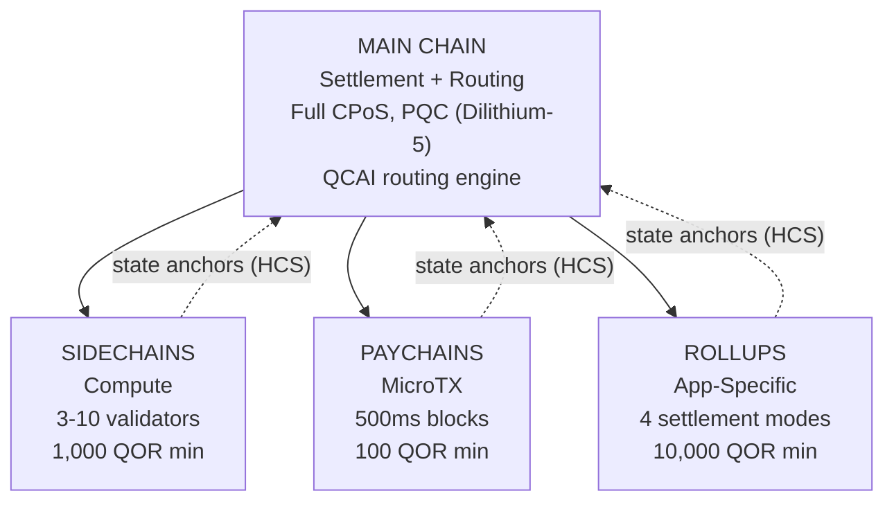

# Architecture multicouche

QoreChain met en œuvre une **architecture de chaînes hiérarchique à 4 niveaux** via le module `x/multilayer`. La chaîne principale sert de racine de règlement et de confiance, tandis que les couches subsidiaires (sidechains, paychains et rollups) gèrent des charges de travail spécialisées avec différents compromis de performance et de sécurité.

---

## Vue d'ensemble du système

La hiérarchie à 4 niveaux ci-dessous montre la chaîne principale comme racine de règlement et de confiance, avec trois types de couches subsidiaires qui ancrent leurs racines d'état vers celle-ci via des Hierarchical Commitment Schemes (HCS).



```
                    +---------------------------+
                    |       MAIN CHAIN          |
                    |  (Settlement + Routing)   |
                    |  Full CPoS consensus      |
                    |  PQC-secured (Dilithium-5)|
                    |  QCAI routing engine       |
                    +------+------+------+------+
                           |      |      |
              +------------+      |      +------------+
              |                   |                    |
    +---------v--------+ +-------v--------+ +---------v---------+
    |   SIDECHAINS     | |   PAYCHAINS    | |     ROLLUPS       |
    |  (Compute)       | |  (MicroTX)     | |  (App-Specific)   |
    |  3-10 validators | |  500ms blocks  | |  4 settlement     |
    |  1,000 QOR min   | |  100 QOR min   | |    modes          |
    |  Max: 10         | |  Max: 50       | |  10,000 QOR min   |
    +------------------+ +----------------+ |  Max: 100         |
                                            +-------------------+
```

---

## Types de couches

### Chaîne principale

La chaîne principale est la racine de confiance de l'ensemble de l'écosystème QoreChain.

| Propriété  | Valeur                                                                          |
| ---------- | ------------------------------------------------------------------------------ |
| Consensus  | Triple-Pool CPoS complet (voir [Mécanisme de consensus](/architecture/consensus-mechanism)) |
| Sécurité   | Sécurisée par PQC avec des signatures Dilithium-5                              |
| Rôle       | Couche de règlement, stockage des ancres d'état, moteur de routage QCAI, racine de confiance |
| Temps de bloc | \~5 secondes                                                                |

Toutes les couches subsidiaires ancrent périodiquement leurs racines d'état à la chaîne principale via des Hierarchical Commitment Schemes (HCS).

### Sidechains

Les sidechains gèrent des **opérations à forte intensité de calcul** telles que les protocoles DeFi, les moteurs de jeu et le traitement de données IoT.

| Paramètre                  | Valeur            |
| -------------------------- | ----------------- |
| Validateurs minimum        | 3                 |
| Validateurs maximum        | 10                |
| Stake minimal du créateur  | 1,000 QOR         |
| Sidechains actives maximum  | 10                |
| Domaines cibles            | DeFi, Gaming, IoT |

### Paychains

Les paychains sont optimisées pour des **microtransactions à haute fréquence** avec une latence minimale.

| Paramètre                 | Valeur                                  |
| ------------------------- | --------------------------------------- |
| Temps de bloc cible       | 500 ms                                  |
| Paychains actives maximum  | 50                                      |
| Stake minimal du créateur | 100 QOR                                 |
| Domaines cibles           | Paiements, streaming, micro-transactions |

### Rollups

Les rollups sont des **chaînes spécifiques à une application** déployées via le Rollup Development Kit (`x/rdk`). Elles s'enregistrent comme type de couche rollup au sein du module multilayer.

| Paramètre               | Valeur                                      |
| ----------------------- | ------------------------------------------- |
| Modes de règlement      | 4 (optimistic, zk, based, sovereign)        |
| Rollups actifs maximum   | 100                                         |
| Stake minimal du créateur | 10,000 QOR                                 |
| Type de couche          | `rollup`                                    |
| Domaines cibles         | DeFi, Gaming, NFT, Enterprise               |

Le déploiement et la configuration des rollups sont traités en détail dans le [Rollup Development Kit](/architecture/rollup-development-kit).

---

## Routage des transactions par QCAI

Le routeur QCAI évalue toutes les couches actives pour chaque transaction entrante et sélectionne la destination optimale à l'aide d'un modèle de scoring pondéré à 4 facteurs.

### Formule de scoring

Chaque couche candidate reçoit un score composite (plus élevé est meilleur) :

```
Score = w_congestion * (1 - Congestion) + w_capability * Capability + w_cost * (1 - Cost) + w_latency * (1 - Latency)
```

| Facteur    | Poids  | Description                                                                  |
| ---------- | ------ | --------------------------------------------------------------------------- |
| Congestion | 0.30   | Niveau de charge actuel (inversé : congestion plus faible = score plus élevé) |
| Capability | 0.40   | À quel point la couche correspond aux exigences de la transaction           |
| Cost       | 0.20   | Multiplicateur de frais relatif à la chaîne principale (inversé : coût plus faible = score plus élevé) |
| Latency    | 0.10   | Temps de finalité attendu (inversé : latence plus faible = score plus élevé) |

### Seuil de confiance

Le routeur exige un score de confiance minimal de **0.6** avant d'acheminer une transaction vers une couche subsidiaire. Si aucune couche n'atteint ce seuil, la transaction est acheminée par défaut vers la chaîne principale.

Un indice de couche préférée peut être fourni par l'expéditeur de la transaction. Si la couche préférée obtient un score d'au moins 80 % du seuil de confiance (soit 0.48), elle est acceptée comme cible de routage.

### Heuristiques de charge utile

Lorsque des métadonnées de transaction détaillées ne sont pas disponibles, le routeur utilise la taille de la charge utile comme signal de classification :

| Taille de charge utile  | Couche préférée | Justification                                |
| ----------------------- | --------------- | -------------------------------------------- |
| &lt; 256 bytes          | Paychain        | Probablement un transfert simple ou une microtransaction |
| 256 - 1,024 bytes       | Main Chain      | Complexité de transaction standard           |
| > 1,024 bytes           | Sidechain       | Probablement une interaction de contrat complexe |

---

## Hierarchical Commitment Schemes (HCS)

Les couches subsidiaires valident périodiquement leur état vers la chaîne principale via des **ancres d'état**. Chaque ancre contient une preuve cryptographique de l'état de la chaîne subsidiaire à une hauteur donnée.

### Contenu d'une ancre

| Champ                     | Description                                          |
| ------------------------- | ---------------------------------------------------- |
| `layer_id`                | Identifiant de la couche subsidiaire                 |
| `layer_height`            | Hauteur de bloc sur la chaîne subsidiaire            |
| `state_root`              | Racine de Merkle de l'arbre d'état de la chaîne subsidiaire |
| `validator_set_hash`      | Hachage de l'ensemble des validateurs ayant signé l'engagement |
| `pqc_aggregate_signature` | Signature agrégée Dilithium-5 sur les données de l'ancre |
| `transaction_count`       | Nombre de transactions depuis la dernière ancre      |
| `compressed_state_proof`  | Preuve de transition d'état compressée               |

### Soumission d'une ancre

Les ancres sont soumises à la chaîne principale via `MsgAnchorState`. Le keeper valide l'ancre selon les étapes suivantes :

1. **La couche existe et est active** — Le keeper vérifie que la couche existe dans l'état et a actuellement le statut `active`.
2. **Intervalle d'ancrage minimal écoulé** — Le keeper vérifie qu'au moins `min_anchor_interval` blocs (par défaut : 100) se sont écoulés depuis la dernière ancre pour cette couche.
3. **Signature agrégée PQC** — Le keeper s'assure que la signature agrégée PQC est présente et valide pour les données de l'ancre.

### Période de contestation

Chaque ancre entre dans une **période de contestation** de **24 heures** (86,400 secondes, configurable par couche). Pendant cette période, toute partie peut contester l'ancre en soumettant une preuve de fraude via `MsgChallengeAnchor`. Si la preuve de fraude est valide, l'ancre est invalidée et l'état de la chaîne subsidiaire est ramené à l'ancre précédente.

Une fois la période de contestation expirée sans contestation aboutie, l'ancre est considérée comme finalisée.

---

## Cross-Layer Fee Bundling (CLFB)

Le CLFB permet à un paiement de frais unique sur la couche source de couvrir l'exécution sur plusieurs couches dans un chemin de transaction inter-couches.

### Calcul des frais

```
avgMultiplier = sum(layer_multiplier_i) / num_layers
bundledFee = (totalGas / 1000) * avgMultiplier
```

Où :

* `layer_multiplier_i` est le multiplicateur de frais de base pour chaque couche du chemin de transaction (chaîne principale = 1.0).
* `totalGas` est la consommation totale de gas estimée sur toutes les couches.
* Le résultat est libellé en **uqor** avec des frais minimaux de 1 uqor.

### Exemple

Une transaction inter-couches touche trois couches : la chaîne principale (multiplicateur 1.0), une sidechain (multiplicateur 0.5) et une paychain (multiplicateur 0.1).

```
avgMultiplier = (1.0 + 0.5 + 0.1) / 3 = 0.533
bundledFee = (150,000 / 1000) * 0.533 = 80 uqor
```

Le CLFB peut être activé ou désactivé globalement via le paramètre `cross_layer_fee_bundling`, et les couches individuelles peuvent s'en désinscrire via leur indicateur de configuration `cross_layer_fee_bundling_enabled`.

---

## Cycle de vie d'une couche

Chaque couche subsidiaire progresse à travers un cycle de vie bien défini :

```
Proposed --> Active --> Suspended --> Decommissioned
                  \                /
                   +-- Active <--+
```

| Statut             | Description                                                                     | Transitions autorisées    |
| ------------------ | ------------------------------------------------------------------------------- | ------------------------- |
| **Proposed**       | La couche a été enregistrée mais pas encore activée                             | Active, Decommissioned    |
| **Active**         | La couche est opérationnelle et accepte les transactions                        | Suspended, Decommissioned |
| **Suspended**      | La couche est temporairement en pause (p. ex. pour maintenance ou pour des raisons de sécurité) | Active, Decommissioned    |
| **Decommissioned** | La couche est définitivement arrêtée (état terminal)                            | Aucune                    |

Les transitions de statut sont imposées par le keeper. Les transitions invalides (p. ex. Decommissioned vers Active) sont rejetées.

---

## Paramètres

| Paramètre                      | Type   | Défaut          | Description                                             |
| ------------------------------ | ------ | --------------- | ------------------------------------------------------- |
| `max_sidechains`               | uint64 | `10`            | Nombre maximal de sidechains actives                    |
| `max_paychains`                | uint64 | `50`            | Nombre maximal de paychains actives                     |
| `min_anchor_interval`          | uint64 | `100`           | Blocs minimum entre les ancres d'état                   |
| `max_anchor_interval`          | uint64 | `1,000`         | Blocs maximum entre les ancres d'état (ancre forcée)    |
| `default_challenge_period`     | uint64 | `86,400`        | Période de contestation par défaut en secondes (24 heures) |
| `min_sidechain_stake`          | string | `1,000,000,000` | Stake minimal pour créer une sidechain (1,000 QOR en uqor) |
| `min_paychain_stake`           | string | `100,000,000`   | Stake minimal pour créer une paychain (100 QOR en uqor) |
| `routing_enabled`              | bool   | `true`          | Active le routage des transactions par QCAI             |
| `routing_confidence_threshold` | string | `0.6`           | Confiance minimale pour les décisions de routage QCAI   |
| `cross_layer_fee_bundling`     | bool   | `true`          | Active le Cross-Layer Fee Bundling global               |
