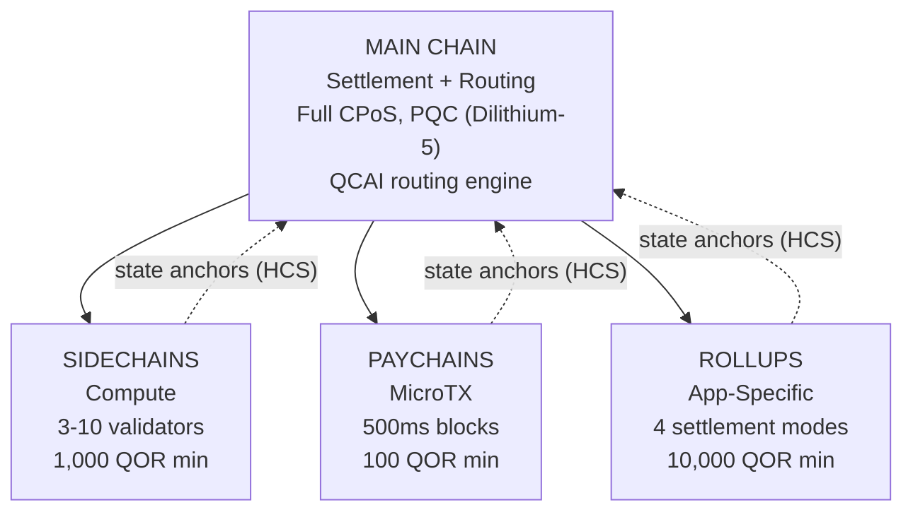

# Architecture multicouche

QoreChain met en œuvre une **architecture de chaînes hiérarchique à 4 niveaux** via le module `x/multilayer`. La chaîne principale sert de racine de règlement et de confiance, tandis que les couches subsidiaires (sidechains, paychains et rollups) prennent en charge des charges de travail spécialisées avec différents compromis de performance et de sécurité.

---

## Vue d'ensemble du système

La hiérarchie à 4 niveaux ci-dessous présente la chaîne principale comme racine de règlement et de confiance, avec trois types de couches subsidiaires ancrant leurs racines d'état vers celle-ci via des schémas d'engagement hiérarchiques (HCS).



```
                    +---------------------------+
                    |       MAIN CHAIN          |
                    |  (Settlement + Routing)   |
                    |  Full CPoS consensus      |
                    |  PQC-secured (Dilithium-5)|
                    |  QCAI routing engine       |
                    +------+------+------+------+
                           |      |      |
              +------------+      |      +------------+
              |                   |                    |
    +---------v--------+ +-------v--------+ +---------v---------+
    |   SIDECHAINS     | |   PAYCHAINS    | |     ROLLUPS       |
    |  (Compute)       | |  (MicroTX)     | |  (App-Specific)   |
    |  3-10 validators | |  500ms blocks  | |  4 settlement     |
    |  1,000 QOR min   | |  100 QOR min   | |    modes          |
    |  Max: 10         | |  Max: 50       | |  10,000 QOR min   |
    +------------------+ +----------------+ |  Max: 100         |
                                            +-------------------+
```

---

## Types de couches

### Chaîne principale

La chaîne principale est la racine de confiance de l'ensemble de l'écosystème QoreChain.

| Propriété       | Valeur                                                                          |
| --------------- | ------------------------------------------------------------------------------ |
| Consensus       | CPoS Triple-Pool complet (voir [Mécanisme de consensus](/architecture/consensus-mechanism)) |
| Sécurité        | Sécurisé par PQC avec signatures Dilithium-5                                    |
| Rôle            | Couche de règlement, stockage des ancres d'état, moteur de routage QCAI, racine de confiance |
| Temps de bloc   | \~5 secondes                                                                   |

Toutes les couches subsidiaires ancrent périodiquement leurs racines d'état à la chaîne principale via des schémas d'engagement hiérarchiques (HCS).

### Sidechains

Les sidechains prennent en charge les **opérations à forte intensité de calcul** telles que les protocoles DeFi, les moteurs de jeu et le traitement de données IoT.

| Paramètre                  | Valeur            |
| -------------------------- | ----------------- |
| Validateurs minimum        | 3                 |
| Validateurs maximum        | 10                |
| Mise minimale du créateur  | 1,000 QOR         |
| Sidechains actives maximum | 10                |
| Domaines cibles            | DeFi, Gaming, IoT |

### Paychains

Les paychains sont optimisées pour les **microtransactions à haute fréquence** avec une latence minimale.

| Paramètre                  | Valeur                                  |
| -------------------------- | --------------------------------------- |
| Temps de bloc cible        | 500 ms                                  |
| Paychains actives maximum  | 50                                      |
| Mise minimale du créateur  | 100 QOR                                 |
| Domaines cibles            | Paiements, streaming, micro-transactions |

### Rollups

Les rollups sont des **chaînes spécifiques à une application** déployées via le Rollup Development Kit (`x/rdk`). Elles s'enregistrent comme type de couche rollup au sein du module multilayer.

| Paramètre                 | Valeur                                      |
| ------------------------- | ------------------------------------------- |
| Modes de règlement        | 4 (optimistic, zk, based, sovereign)        |
| Rollups actifs maximum    | 100                                         |
| Mise minimale du créateur | 10,000 QOR                                  |
| Type de couche            | `rollup`                                    |
| Domaines cibles           | DeFi, Gaming, NFT, Enterprise               |

Le déploiement et la configuration des rollups sont traités en détail dans le [Rollup Development Kit](/architecture/rollup-development-kit).

---

## Routage des transactions QCAI

Le routeur QCAI évalue toutes les couches actives pour chaque transaction entrante et sélectionne la destination optimale à l'aide d'un modèle de notation pondérée à 4 facteurs.

### Formule de notation

Chaque couche candidate reçoit un score composite (plus élevé est meilleur) :

```
Score = w_congestion * (1 - Congestion) + w_capability * Capability + w_cost * (1 - Cost) + w_latency * (1 - Latency)
```

| Facteur     | Poids  | Description                                                                  |
| ----------- | ------ | ---------------------------------------------------------------------------- |
| Congestion  | 0.30   | Niveau de charge actuel (inversé : moins de congestion = score plus élevé)   |
| Capacité    | 0.40   | Adéquation de la couche aux exigences de la transaction                      |
| Coût        | 0.20   | Multiplicateur de frais par rapport à la chaîne principale (inversé : coût plus faible = score plus élevé) |
| Latence     | 0.10   | Temps de finalité attendu (inversé : latence plus faible = score plus élevé) |

### Seuil de confiance

Le routeur exige un score de confiance minimum de **0.6** avant de router une transaction vers une couche subsidiaire. Si aucune couche n'atteint ce seuil, la transaction est par défaut dirigée vers la chaîne principale.

Une indication de couche préférée peut être fournie par l'expéditeur de la transaction. Si la couche préférée obtient un score d'au moins 80 % du seuil de confiance (soit 0.48), elle est acceptée comme cible de routage.

### Heuristiques de charge utile

Lorsque les métadonnées détaillées de la transaction ne sont pas disponibles, le routeur utilise la taille de la charge utile comme signal de classification :

| Taille de charge utile | Couche préférée  | Justification                                |
| ---------------------- | ---------------- | -------------------------------------------- |
| &lt; 256 bytes         | Paychain         | Probablement un transfert simple ou une microtransaction |
| 256 - 1,024 bytes      | Chaîne principale | Complexité de transaction standard           |
| > 1,024 bytes          | Sidechain        | Probablement une interaction de contrat complexe |

---

## Schémas d'engagement hiérarchiques (HCS)

Les couches subsidiaires engagent périodiquement leur état sur la chaîne principale via des **ancres d'état**. Chaque ancre contient une preuve cryptographique de l'état de la chaîne subsidiaire à une hauteur donnée.

### Contenu d'une ancre

| Champ                     | Description                                          |
| ------------------------- | ---------------------------------------------------- |
| `layer_id`                | Identifiant de la couche subsidiaire                 |
| `layer_height`            | Hauteur de bloc sur la chaîne subsidiaire            |
| `state_root`              | Racine de Merkle de l'arbre d'état de la chaîne subsidiaire |
| `validator_set_hash`      | Hachage de l'ensemble des validateurs ayant signé l'engagement |
| `pqc_aggregate_signature` | Signature agrégée Dilithium-5 sur les données de l'ancre |
| `transaction_count`       | Nombre de transactions depuis la dernière ancre      |
| `compressed_state_proof`  | Preuve compressée de transition d'état               |

### Soumission d'une ancre

Les ancres sont soumises à la chaîne principale via `MsgAnchorState`. Le keeper valide l'ancre selon les étapes suivantes :

1. **La couche existe et est active** — Le keeper vérifie que la couche existe dans l'état et possède actuellement le statut `active`.
2. **Intervalle minimal d'ancrage écoulé** — Le keeper vérifie qu'au moins `min_anchor_interval` blocs (par défaut : 100) se sont écoulés depuis la dernière ancre de cette couche.
3. **Signature agrégée PQC** — Le keeper s'assure que la signature agrégée PQC est présente et valide pour les données de l'ancre.

### Période de contestation

Chaque ancre entre dans une **période de contestation** de **24 heures** (86 400 secondes, configurable par couche). Pendant cette période, toute partie peut contester l'ancre en soumettant une preuve de fraude via `MsgChallengeAnchor`. Si la preuve de fraude est valide, l'ancre est invalidée et l'état de la chaîne subsidiaire est ramené à l'ancre précédente.

Une fois la période de contestation expirée sans contestation aboutie, l'ancre est considérée comme finalisée.

### Lecture des ancres

À partir de la version de chaîne **v3.1.80**, les ancres sont également **lisibles** via le service de requête multilayer. Deux requêtes exposent l'état des ancres à la fois via gRPC et REST :

* **`Anchor`** (`/qorechain/multilayer/v1/anchor/{layer_id}`) — renvoie la dernière ancre d'état finalisée pour une couche.
* **`Anchors`** (`/qorechain/multilayer/v1/anchors/{layer_id}`) — renvoie l'historique des ancres pour une couche.

Étant donné que chaque ancre porte une signature Dilithium-5 sur le message canonique `layer_id || layer_height || state_root || validator_set_hash` (vérifiée par rapport à la clé PQC enregistrée du créateur de la couche), un client peut récupérer une ancre et la vérifier **hors ligne**, sans faire confiance au nœud servant la requête. Il s'agit de la primitive on-chain qui sous-tend les [reçus de règlement quantiquement sûrs](/rollups/settlement-receipts) du Rollup Development Kit.

---

## Regroupement de frais inter-couches (CLFB)

Le CLFB permet à un paiement de frais unique sur la couche source de couvrir l'exécution sur plusieurs couches dans un chemin de transaction inter-couches.

### Calcul des frais

```
avgMultiplier = sum(layer_multiplier_i) / num_layers
bundledFee = (totalGas / 1000) * avgMultiplier
```

Où :

* `layer_multiplier_i` est le multiplicateur de frais de base pour chaque couche du chemin de transaction (chaîne principale = 1.0).
* `totalGas` est la consommation totale de gaz estimée sur l'ensemble des couches.
* Le résultat est libellé en **uqor** avec un frais minimum de 1 uqor.

### Exemple

Une transaction inter-couches touche trois couches : la chaîne principale (multiplicateur 1.0), une sidechain (multiplicateur 0.5) et une paychain (multiplicateur 0.1).

```
avgMultiplier = (1.0 + 0.5 + 0.1) / 3 = 0.533
bundledFee = (150,000 / 1000) * 0.533 = 80 uqor
```

Le CLFB peut être activé ou désactivé globalement via le paramètre `cross_layer_fee_bundling`, et chaque couche peut s'en exclure via son indicateur de configuration `cross_layer_fee_bundling_enabled`.

---

## Cycle de vie d'une couche

Chaque couche subsidiaire évolue à travers un cycle de vie bien défini :

```
Proposed --> Active --> Suspended --> Decommissioned
                  \                /
                   +-- Active <--+
```

| Statut             | Description                                                                     | Transitions autorisées    |
| ------------------ | ------------------------------------------------------------------------------- | ------------------------- |
| **Proposed**       | La couche a été enregistrée mais n'est pas encore activée                       | Active, Decommissioned    |
| **Active**         | La couche est opérationnelle et accepte les transactions                        | Suspended, Decommissioned |
| **Suspended**      | La couche est temporairement suspendue (par ex. pour maintenance ou pour des raisons de sécurité) | Active, Decommissioned    |
| **Decommissioned** | La couche est définitivement arrêtée (état terminal)                            | Aucune                    |

Les transitions de statut sont imposées par le keeper. Les transitions invalides (par ex. de Decommissioned à Active) sont rejetées.

---

## Paramètres

| Paramètre                      | Type   | Défaut          | Description                                             |
| ------------------------------ | ------ | --------------- | ------------------------------------------------------- |
| `max_sidechains`               | uint64 | `10`            | Nombre maximum de sidechains actives                   |
| `max_paychains`                | uint64 | `50`            | Nombre maximum de paychains actives                    |
| `min_anchor_interval`          | uint64 | `100`           | Nombre minimum de blocs entre les ancres d'état        |
| `max_anchor_interval`          | uint64 | `1,000`         | Nombre maximum de blocs entre les ancres d'état (ancre forcée) |
| `default_challenge_period`     | uint64 | `86,400`        | Période de contestation par défaut en secondes (24 heures) |
| `min_sidechain_stake`          | string | `1,000,000,000` | Mise minimale pour créer une sidechain (1,000 QOR en uqor) |
| `min_paychain_stake`           | string | `100,000,000`   | Mise minimale pour créer une paychain (100 QOR en uqor) |
| `routing_enabled`              | bool   | `true`          | Activer le routage des transactions basé sur QCAI      |
| `routing_confidence_threshold` | string | `0.6`           | Confiance minimale pour les décisions de routage QCAI  |
| `cross_layer_fee_bundling`     | bool   | `true`          | Activer le regroupement de frais inter-couches global  |
