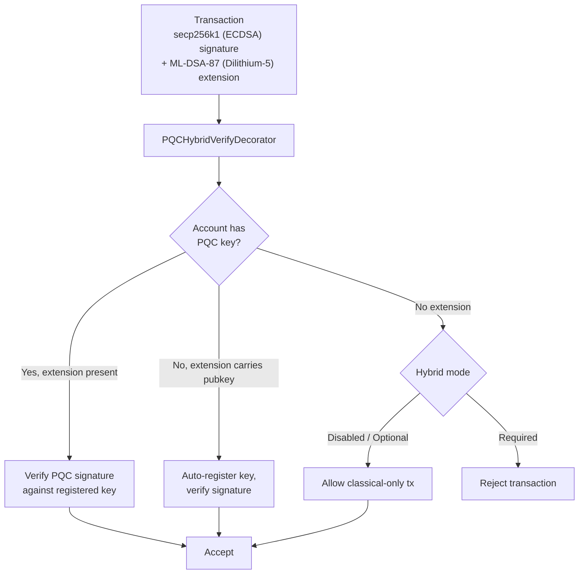

# Sécurité post-quantique

QoreChain est conçue avec la **cryptographie post-quantique (PQC) dès le genesis** — et non ajoutée a posteriori sous forme de mise à niveau. Le module `x/pqc` fournit des signatures numériques fondées sur les réseaux euclidiens (lattices) et l'encapsulation de clés comme primitives cryptographiques principales, avec un cadre d'agilité algorithmique contrôlé par la gouvernance pour une résilience à long terme.

La base PQC complète — **Dilithium-5 (signatures) + ML-KEM-1024 (KEM) + SHAKE-256 (hachage)** — est désormais achevée et constitue la valeur par défaut du réseau. À partir de la version de chaîne actuelle (**v3.1.80**), les signatures hybrides sont **requises par défaut** sur le chemin de transaction cosmos : `hybrid_signature_mode = required` et `allow_classical_fallback = false`. Chaque transaction du chemin cosmos doit porter une signature Dilithium-5 aux côtés de sa signature classique secp256k1 ; les transactions purement classiques émises depuis un compte PQC sont rejetées, et le chemin de rétrogradation classique est fermé.

## Principes de conception

* **PQC requise par défaut** : Les signatures post-quantiques sont obligatoires sur le chemin cosmos. Les signatures classiques secp256k1 seules ne suffisent plus — `allow_classical_fallback = false`.
* **Hybride par défaut** : Les transactions cosmos portent simultanément une signature classique secp256k1 et une signature PQC Dilithium-5. Le repli purement classique est fermé.
* **Agilité algorithmique** : Le registre des algorithmes cryptographiques est contrôlé par la gouvernance, ce qui permet au réseau d'adopter de nouveaux algorithmes ou de déprécier ceux qui sont compromis sans hard fork.
* **Vérification déterministe** : Toute vérification de signature est déterministe et reproductible sur l'ensemble des nœuds validateurs.

## Algorithmes pris en charge

| Algorithme      | Standard             | Catégorie            | Niveau NIST | Clé publique | Clé privée  | Signature / Chiffré | Secret partagé |
| --------------- | -------------------- | -------------------- | ----------- | ------------ | ----------- | ------------------- | -------------- |
| **Dilithium-5** | ML-DSA-87 (FIPS 204) | Signature            | 5           | 2,592 bytes  | 4,896 bytes | 4,627 bytes         | --             |
| **ML-KEM-1024** | FIPS 203             | Encapsulation de clés | 5           | 1,568 bytes  | 3,168 bytes | 1,568 bytes         | 32 bytes       |

Les deux algorithmes opèrent au **niveau de sécurité NIST 5**, la catégorie de sécurité standardisée la plus élevée, offrant une protection équivalente à AES-256 contre les adversaires classiques comme quantiques.

## Backend cryptographique

Les opérations PQC sont implémentées dans un backend cryptographique haute performance et à mémoire sûre (memory-safe) qui expose la signature, la vérification et l'encapsulation de clés fondées sur les réseaux euclidiens au runtime de QoreChain. Le backend fournit :

Opérations spécifiques aux algorithmes :

* Génération de clés, signature et vérification Dilithium-5
* Génération de clés, encapsulation et décapsulation ML-KEM-1024
* Génération de balise aléatoire déterministe (`seed`, `epoch`)

Opérations agnostiques à l'algorithme :

* `Keygen(algorithmID)` — Générer une paire de clés pour tout algorithme enregistré
* `Sign(algorithmID, privkey, message)` — Créer une signature
* `Verify(algorithmID, pubkey, message, signature)` — Vérifier une signature
* `AlgorithmInfo(algorithmID)` — Interroger les tailles de clé/sortie
* `ListAlgorithms()` — Énumérer tous les algorithmes pris en charge

Toutes les opérations de signature et de vérification sont déterministes et produisent des résultats identiques sur chaque nœud validateur et chaque plateforme prise en charge.

Ces mêmes primitives — ML-DSA (FIPS-204), ML-KEM (FIPS-203) et SHAKE-256 (FIPS-202) — sont disponibles pour les portefeuilles et les intégrateurs via la bibliothèque open source [**qorechain-pqc**](https://github.com/qorechain/qorechain-pqc), qui fournit une API unique, cohérente et compatible octet par octet à travers six langages (JavaScript/TypeScript, Rust, Go, C, Python, Java). Voir [Signature post-quantique](/developer-guide/post-quantum-signing).

## Enregistrement des clés

Les comptes enregistrent des clés PQC via `MsgRegisterPQCKey` (legacy, par défaut Dilithium-5) ou `MsgRegisterPQCKeyV2` (agnostique à l'algorithme). Chaque message comprend :

* **Sender** : L'adresse du compte qui enregistre la clé.
* **PublicKey** : Les octets de la clé publique PQC.
* **AlgorithmID** : L'identifiant de l'algorithme PQC (v2 uniquement).
* **KeyType** : L'un des trois modes d'enregistrement :

| Type de clé      | Description                                                              |
| ---------------- | ------------------------------------------------------------------------ |
| `hybrid`         | Clés classique (ECDSA) et PQC. Les transactions portent des doubles signatures. |
| `pqc_only`       | Clé PQC uniquement. La signature classique n'est pas requise.            |
| `classical_only` | Clé classique uniquement. Aucune protection PQC (non recommandé).        |

## Signatures hybrides

Le système de signatures hybrides exige que les transactions du chemin cosmos portent **à la fois** une signature classique et une signature PQC simultanément. Cela offre une défense en profondeur : même si l'un des schémas est cassé, l'autre protège la transaction.

Avec la valeur par défaut du réseau `hybrid_signature_mode = required`, chaque transaction du chemin cosmos doit inclure l'extension Dilithium-5 aux côtés de la signature secp256k1. Les seules exemptions (pour le bootstrap) sont les **gentxs de genesis (hauteur 0)** et les **transactions d'enregistrement/migration de clé PQC** (`MsgRegisterPQCKey`, `MsgRegisterPQCKeyV2`, `MsgMigratePQCKey`), qui sont autorisées à être purement classiques afin que les comptes puissent enregistrer leur première clé PQC.

**Les transactions EVM ne sont pas concernées.** Les transactions EVM sont authentifiées sur un chemin ante `eth_secp256k1` distinct (le chemin du QoreChain EVM Engine) et ne requièrent jamais l'extension hybride PQC. L'exigence hybride ne s'applique qu'au chemin de transaction cosmos.

### Flux de cosignature

Pour produire une transaction cosmos conforme, la signature classique secp256k1 est calculée sur les sign bytes standard (qui excluent l'extension PQC), et une signature Dilithium-5 est calculée et attachée comme extension `PQCHybridSignature`. Les outils standard CosmJS / relayer doivent produire cette extension pour transiger sur le chemin cosmos. Aujourd'hui, cela se fait via :

* `qorechaind tx pqc gen-key` — générer une clé Dilithium-5.
* `qorechaind tx pqc cosign` — attacher la cosignature Dilithium-5 à une transaction.
* La signature hybride du SDK QoreChain — `buildHybridTx` avec `includePqcPublicKey` (intègre la clé publique PQC pour l'auto-enregistrement à la première utilisation).

*Une transaction signée avec secp256k1 (ECDSA) plus ML-DSA-87 (Dilithium-5), vérifiée par l'ante handler sous le mode d'application à l'échelle de la chaîne.*



### Format de l'extension de TX

Les signatures PQC sont attachées aux transactions comme une **extension de TX** avec le type URL `/qorechain.pqc.v1.PQCHybridSignature` :

```text
{
  "algorithm_id": 1,
  "pqc_signature": "<4627 bytes for Dilithium-5>",
  "pqc_public_key": "<2592 bytes, optional>"
}
```

Le champ `pqc_public_key` est optionnel. S'il est présent et que le compte n'a pas de clé PQC enregistrée, l'ante handler procédera à un **auto-enregistrement** de la clé à la première utilisation.

### PQCHybridVerifyDecorator

L'ante handler `PQCHybridVerifyDecorator` traite les signatures hybrides avec une logique de vérification à trois voies :

| Scénario | Le compte a une clé PQC | Extension présente | Clé publique dans l'extension | Résultat                                            |
| -------- | ----------------------- | ------------------ | ----------------------------- | --------------------------------------------------- |
| Path 1   | Oui                     | Oui                | --                            | Vérifie la signature PQC contre la clé enregistrée  |
| Path 2   | Non                     | Oui                | Oui                           | Auto-enregistre la clé, vérifie la signature        |
| Path 3a  | Non                     | Non                | --                            | **Mode Optional** : Autorise une transaction purement classique |
| Path 3b  | Non                     | Non                | --                            | **Mode Required** : Rejette la transaction          |
| Path 4   | Oui                     | Non                | --                            | Géré par le PQCVerifyDecorator standard             |

### Modes de signature hybride

Le niveau d'application hybride à l'échelle de la chaîne est configurable par gouvernance. La **valeur par défaut actuelle du réseau est `required`** :

| Mode         | ID | Défaut | Comportement                                                                                                    |
| ------------ | -- | ------ | --------------------------------------------------------------------------------------------------------------- |
| **Disabled** | 0  | Non    | Signatures classiques uniquement. Les extensions PQC sont ignorées.                                            |
| **Optional** | 1  | Non    | Les extensions PQC sont vérifiées si présentes. Les comptes sans clé PQC peuvent transiger avec des signatures classiques uniquement. |
| **Required** | 2  | **Oui** | Toutes les transactions du chemin cosmos doivent porter à la fois des signatures classiques et PQC. Les transactions sans extension PQC sont rejetées. |

Le réseau a achevé sa migration : **Optional** (genesis) → **Required** (la valeur par défaut actuelle depuis v3.1.71, avec `allow_classical_fallback = false`). Les trois modes restent contrôlés par la gouvernance et peuvent être ajustés par proposition.

## Cadre d'agilité algorithmique

Le cadre d'agilité algorithmique fournit un registre contrôlé par la gouvernance pour les algorithmes PQC, permettant au réseau d'ajouter de nouveaux algorithmes, de déprécier les vulnérables et de migrer les comptes — le tout sans hard fork.

### Cycle de vie d'un algorithme

Chaque algorithme enregistré possède un statut de cycle de vie :

```
active --> migrating --> deprecated --> disabled
```

| Statut         | Description                                                                                                                                 |
| -------------- | ------------------------------------------------------------------------------------------------------------------------------------------- |
| **Active**     | Pleinement opérationnel. Les nouveaux enregistrements de clés et les vérifications sont acceptés.                                           |
| **Migrating**  | La période de double signature est active. Les comptes sont encouragés à migrer vers l'algorithme de remplacement. Les anciennes et nouvelles signatures sont acceptées. |
| **Deprecated** | Les signatures existantes peuvent encore être vérifiées, mais aucun nouvel enregistrement de clé n'est accepté.                            |
| **Disabled**   | Interrupteur d'arrêt d'urgence. L'algorithme ne peut vérifier aucune signature. Utilisé lorsqu'une vulnérabilité est découverte.            |

### Migration par double signature

Lorsqu'un algorithme est déprécié, une **période de migration** commence (par défaut : 1,000,000 blocs, soit environ 69 jours à 6 s/bloc). Pendant cette période :

1. Les comptes dont les clés utilisent l'algorithme déprécié doivent migrer vers le remplacement.
2. La migration requiert des doubles signatures (`MsgMigratePQCKey`) : une de l'ancienne clé et une de la nouvelle clé, prouvant la possession des deux.
3. Les deux algorithmes sont acceptés pour la vérification tout au long de la période de migration.

### Messages de gouvernance

| Message                 | Description                                                                                                                                                       |
| ----------------------- | ----------------------------------------------------------------------------------------------------------------------------------------------------------------- |
| `MsgAddAlgorithm`       | Propose l'ajout d'un nouvel algorithme PQC au registre. Inclut les `AlgorithmInfo` complètes (nom, catégorie, niveau NIST, tailles de clé). Doit être soumis via la gouvernance. |
| `MsgDeprecateAlgorithm` | Démarre le processus de dépréciation d'un algorithme. Spécifie l'algorithme de remplacement et la période de migration en blocs.                                  |
| `MsgDisableAlgorithm`   | Désactive un algorithme immédiatement en urgence. Requiert une chaîne de motif. Utilisé lorsqu'une vulnérabilité cryptographique est découverte.                 |

### Extensibilité

L'ajout d'un nouvel algorithme requiert :

1. L'implémentation de l'algorithme dans le backend cryptographique derrière l'interface unifiée de signature et de vérification.
2. La soumission d'une proposition de gouvernance `MsgAddAlgorithm` avec les métadonnées de l'algorithme.
3. Une fois approuvé, l'algorithme devient disponible pour l'enregistrement de clés et la vérification.

## Hachage SHAKE-256

Depuis v3.1.73, **SHAKE-256** (fonction à sortie extensible de SHA-3) est le **hachage applicatif par défaut** à travers QoreChain — fourni par le package `qorehash` — complétant la base cryptographique résistante au quantique aux côtés des signatures Dilithium-5 et de l'encapsulation de clés ML-KEM-1024. Le module `x/pqc` fournit des utilitaires SHAKE-256 en pur Go :

| Fonction                           | Description                       | Sortie           |
| ---------------------------------- | --------------------------------- | ---------------- |
| `SHAKE256Hash(data, outputLen)`    | Empreinte SHAKE-256 à longueur variable | Longueur arbitraire |
| `SHAKE256Hash32(data)`             | Empreinte SHAKE-256 standard de 256 bits | 32 bytes       |
| `SHAKE256ConcatHash(left, right)`  | Hachage d'entrées concaténées     | 32 bytes         |
| `SHAKE256DomainHash(domain, data)` | Hachage à séparation de domaine   | 32 bytes         |

Ces utilitaires sous-tendent le hachage applicatif par défaut et sont utilisés pour :

* Le hachage des nœuds d'arbres de Merkle
* Les engagements de hachage dans les attestations inter-couches
* La séparation de domaine pour différents contextes de hachage (p. ex. `"leaf:"` vs `"node:"`)

## PQC du bridge

Toutes les attestations de bridge inter-chaînes et les engagements d'état utilisent des signatures **Dilithium-5**. Le module `x/multilayer` requiert des signatures agrégées PQC sur chaque soumission `MsgAnchorState`, et les engagements ML-KEM sécurisent les canaux d'échange de clés entre les relayers de bridge.

Cela garantit que la sécurité inter-chaînes n'est pas dégradée par l'usage de cryptographie classique dans l'infrastructure de bridge, maintenant la résistance au quantique sur l'ensemble de la pile du protocole.

## Paramètres du module

| Paramètre                  | Type                | Défaut            | Description                                           |
| -------------------------- | ------------------- | ----------------- | ----------------------------------------------------- |
| `pqc_primary`              | bool                | `true`            | La PQC est le schéma de signature principal           |
| `allow_classical_fallback` | bool                | `false`           | Le repli purement classique est fermé ; les txs cosmos doivent être hybrides |
| `min_security_level`       | int32               | `5`               | Niveau de sécurité NIST minimal pour les algorithmes acceptés |
| `default_migration_blocks` | int64               | `1,000,000`       | Période de migration par double signature par défaut en blocs |
| `default_signature_algo`   | AlgorithmID         | `1` (Dilithium-5) | Algorithme de signature par défaut pour les nouveaux enregistrements de clé |
| `hybrid_signature_mode`    | HybridSignatureMode | `2` (Required)    | Niveau d'application des signatures hybrides à l'échelle de la chaîne |

## Pour aller plus loin

* [Signature post-quantique](/developer-guide/post-quantum-signing) — la bibliothèque open source `qorechain-pqc` (six langages) pour ces primitives et la signature hybride.
* [Configuration du portefeuille](/getting-started/wallet-setup) — créer et gérer des comptes adossés à la PQC.
* [Comptes du SDK & signature PQC](/sdk/concepts/accounts-pqc) — clés et signature post-quantique depuis le code.
* [Paramètres de la chaîne](/appendix/chain-parameters) — algorithmes par défaut et réglages de migration.
* [Architecture du bridge](/architecture/bridge-architecture) — vérification PQC sur les paquets inter-chaînes.
