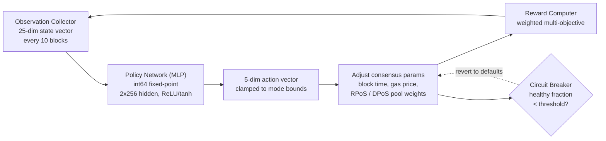

# Moteur de consensus PRISM

QoreChain intègre **PRISM** (Policy-driven Reinforcement-learning for Intelligent State Machines), une couche d'optimisation par apprentissage par renforcement, directement dans la couche de consensus via le module `x/rlconsensus`. PRISM observe les métriques de la chaîne tous les N blocs, exécute une inférence à travers un réseau de neurones en virgule fixe et propose des ajustements des paramètres de consensus — le tout de manière déterministe, sans aucune arithmétique en virgule flottante dans les chemins critiques pour le consensus.

*La boucle d'optimisation PRISM : observer l'état de la chaîne, exécuter l'inférence de la politique, borner et appliquer les changements de paramètres, puis réinjecter le résultat.*



---

## Vue d'ensemble de l'architecture

PRISM se compose de quatre éléments :

1. **Collecteur d'observations** — Rassemble des vecteurs d'état de chaîne à 25 dimensions à des intervalles configurables.
2. **Réseau de politique (MLP)** — Un perceptron multicouche natif en Go qui mappe les observations vers des actions.
3. **Calculateur de récompense** — Évalue la qualité des changements de paramètres à l'aide d'une fonction multi-objectif pondérée.
4. **Disjoncteur** — Surveille la santé de la chaîne et annule tous les paramètres ajustés par PRISM si une instabilité est détectée.

Tous les éléments opèrent dans le cycle de vie ABCI et produisent des sorties déterministes et vérifiables sur l'ensemble des nœuds validateurs.

---

## Réseau de politique

Le réseau de politique est un perceptron multicouche (MLP) à propagation avant implémenté entièrement en Go avec une **arithmétique en virgule fixe int64** (mise à l'échelle par 10^8).

### Architecture du réseau

| Propriété             | Valeur                             |
| --------------------- | ---------------------------------- |
| Dimensions d'entrée   | 25                                 |
| Couches cachées       | 2                                  |
| Tailles des couches cachées | 256, 256                     |
| Dimensions de sortie  | 5                                  |
| Activation (cachée)   | ReLU                               |
| Activation (sortie)   | tanh                               |
| Nombre total de paramètres | 73,733                        |
| Précision             | virgule fixe int64 (mise à l'échelle par 10^8) |

### Décomposition du nombre de paramètres

```
Layer 1: 25 * 256 + 256   =  6,656  (input -> hidden_1)
Layer 2: 256 * 256 + 256   = 65,792  (hidden_1 -> hidden_2)
Layer 3: 256 * 5 + 5       =  1,285  (hidden_2 -> output)
Total:                       73,733
```

### Arithmétique en virgule fixe

Tous les calculs du MLP utilisent des valeurs `int64` mises à l'échelle par `FixedPointScale = 10^8`. Cela élimine le non-déterminisme dû aux différences d'arrondi en virgule flottante IEEE 754 entre plateformes matérielles.

* **Multiplication** : `fixMul(a, b) = (a / SCALE) * b + (a % SCALE) * b / SCALE` (scindée pour éviter le dépassement)
* **ReLU** : `relu(x) = max(0, x)`
* **tanh** : Approximant de Padé `tanh(x) ~ x * (3*S - x^2) / (3*S + x^2)` pour `|x| <= 2.5*SCALE`, borné à +/- SCALE sinon

Les poids de la politique sont stockés on-chain sous forme de vecteur aplati `[]int64` et peuvent être mis à jour via une proposition de gouvernance.

---

## Vecteur d'observation

PRISM collecte un vecteur d'observation à 25 dimensions à chaque intervalle d'observation (par défaut : tous les 10 blocs).

| Index | Dimension              | Description                                       |
| ----- | ---------------------- | ------------------------------------------------- |
| 0     | `block_utilization`    | Gas de bloc utilisé / limite de gas de bloc       |
| 1     | `tx_count`             | Nombre de transactions dans le bloc               |
| 2     | `avg_tx_size`          | Taille moyenne des transactions en octets         |
| 3     | `block_time`           | Temps écoulé depuis le bloc précédent (ms)        |
| 4     | `block_time_delta`     | Temps de bloc moins le temps de bloc cible (ms)   |
| 5     | `gas_price_50th`       | Prix médian du gas                                |
| 6     | `gas_price_95th`       | Prix du gas au 95e centile                        |
| 7     | `mempool_size`         | Nombre de transactions en attente                 |
| 8     | `mempool_bytes`        | Total d'octets des transactions en attente        |
| 9     | `validator_count`      | Nombre de validateurs actifs                      |
| 10    | `validator_gini`       | Coefficient de Gini de la distribution du pouvoir des validateurs |
| 11    | `missed_block_ratio`   | Fraction de validateurs ayant manqué la signature |
| 12    | `avg_commit_latency`   | Latence moyenne du round de commit (ms)           |
| 13    | `max_commit_latency`   | Latence maximale du round de commit (ms)          |
| 14    | `precommit_ratio`      | Fraction de précommits reçus                      |
| 15    | `failed_tx_ratio`      | Fraction de transactions échouées                 |
| 16    | `avg_gas_per_tx`       | Gas moyen consommé par transaction                |
| 17    | `reward_per_validator` | Récompense moyenne par validateur (uqor)          |
| 18    | `slash_count`          | Nombre d'événements de slashing dans la fenêtre d'observation |
| 19    | `jail_count`           | Nombre d'événements d'emprisonnement dans la fenêtre d'observation |
| 20    | `inflation_rate`       | Taux d'émission actuel                            |
| 21    | `bonded_ratio`         | Tokens bondés / offre totale                      |
| 22    | `reputation_mean`      | Score de réputation moyen sur les validateurs actifs |
| 23    | `reputation_stddev`    | Écart-type des scores de réputation               |
| 24    | `mev_estimate`         | MEV extrait estimé (heuristique)                  |

Toutes les valeurs sont stockées sous forme de représentations textuelles `LegacyDec` et converties en virgule fixe int64 avant l'inférence.

---

## Espace d'action

La sortie du MLP est un vecteur d'action à 5 dimensions, où chaque dimension représente un changement proposé pour un paramètre de consensus. L'activation tanh contraint les sorties brutes à \[-1, 1], qui sont ensuite mises à l'échelle par des bornes spécifiques au mode.

| Index | Dimension d'action         | Description                                                             |
| ----- | -------------------------- | ----------------------------------------------------------------------- |
| 0     | `block_time_delta`         | Changement proposé du temps de bloc cible (ms)                          |
| 1     | `gas_price_delta`          | Changement proposé du prix de gas de base                               |
| 2     | `validator_set_size_delta` | Changement proposé de la taille cible de l'ensemble des validateurs (journalisé uniquement, non appliqué) |
| 3     | `pool_weight_rpos_delta`   | Changement proposé du poids de priorité du pool RPoS                    |
| 4     | `pool_weight_dpos_delta`   | Changement proposé du poids de priorité du pool DPoS                    |

Les actions sont **bornées** aux limites de changement maximal définies par le mode PRISM actuel avant application.

---

## Fonction de récompense

Le signal de récompense évalue dans quelle mesure les changements récents de paramètres ont amélioré la performance de la chaîne. Il est calculé comme une somme pondérée de cinq objectifs :

```
R = 0.30 * delta_throughput
  + 0.25 * delta_finality
  + 0.20 * delta_decentralization
  - 0.15 * mev_estimate
  - 0.10 * failed_tx_ratio
```

| Composante             | Poids  | Direction | Métrique source                               |
| ---------------------- | ------ | --------- | --------------------------------------------- |
| Débit                  | +0.30  | Maximiser | Changement de l'utilisation des blocs         |
| Finalité               | +0.25  | Maximiser | Changement du ratio de précommits             |
| Décentralisation       | +0.20  | Maximiser | Changement négatif du coefficient de Gini des validateurs |
| MEV                    | -0.15  | Minimiser | Estimation actuelle du MEV                     |
| Transactions échouées  | -0.10  | Minimiser | Ratio actuel de transactions échouées         |

Les poids de récompense sont configurables par gouvernance et doivent totaliser exactement 1.0.

---

## Modes PRISM

PRISM opère dans l'un des quatre modes, contrôlables via la gouvernance :

| Mode             | ID | Changement max | Comportement                                                                               |
| ---------------- | -- | -------------- | ------------------------------------------------------------------------------------------ |
| **Shadow**       | 0  | 0 %            | Observe et journalise les recommandations uniquement. Aucun paramètre n'est modifié. C'est le mode par défaut. |
| **Conservative** | 1  | +/- 10 %       | Applique les changements de paramètres dans des limites étroites. Adapté au déploiement initial en production. |
| **Autonomous**   | 2  | +/- 25 %       | Applique les changements de paramètres dans des limites plus larges. Pour les réseaux matures avec des politiques validées. |
| **Paused**       | 3  | 0 %            | PRISM est complètement inactif. Aucune observation n'est collectée et aucune inférence ne s'exécute. |

Les transitions de mode requièrent une proposition de gouvernance. Le chemin de déploiement recommandé est : Shadow → Conservative → Autonomous.

---

## Disjoncteur

Le disjoncteur est un mécanisme de sécurité qui surveille la santé de la chaîne et annule automatiquement tous les paramètres ajustés par PRISM si une instabilité est détectée.

### Logique de détection

Le disjoncteur évalue les **50 derniers blocs** (configurable via `circuit_breaker_window`) :

1. **Calculer les deltas de temps de bloc** — Pour chaque paire consécutive d'horodatages de bloc, calculer le delta de temps de bloc.
2. **Classer les blocs sains** — Un bloc est considéré comme **sain** si son delta est positif et dans la limite de 2x le temps de bloc cible.
3. **Calculer la fraction saine** — Calculer la **fraction saine** = blocs sains / deltas totaux.

### Condition de déclenchement

Si la fraction saine tombe en dessous du seuil (par défaut : **50 %**), le disjoncteur se déclenche.

### Réponse

Lorsqu'il est déclenché, le disjoncteur :

1. **Annule** tous les paramètres appliqués par PRISM (temps de bloc, prix du gas, poids des pools) à leurs valeurs par défaut.
2. **Met PRISM en pause** (définit `CircuitBreakerActive = true`).
3. **Efface** la politique en mémoire pour forcer un rechargement à neuf.
4. **Émet** un événement `circuit_breaker_triggered`.

Le disjoncteur se réinitialise automatiquement lorsque la fraction saine repasse au-dessus du seuil lors des évaluations suivantes.

---

## Fonctions consultatives pour les rollups

PRISM fournit des fonctions consultatives pour l'optimisation des paramètres de rollup :

* **`SuggestRollupProfile`** — Analyse les conditions actuelles de la chaîne et suggère des paramètres de configuration de rollup optimaux (temps de bloc, limite de gas, fréquence de règlement).
* **`OptimizeRollupGas`** — Recommande des ajustements de tarification du gas pour les transactions de règlement de rollup en fonction des schémas de congestion de la chaîne principale.

Ces fonctions sont purement informatives et ne modifient pas l'état de la chaîne.

---

## Bibliothèque de mathématiques déterministes

Tous les calculs de PRISM utilisent le package `mathutil`, qui fournit des alternatives déterministes aux mathématiques en virgule flottante standard :

| Fonction                  | Description                  | Méthode                                                   |
| ------------------------- | ---------------------------- | --------------------------------------------------------- |
| `IntegerSqrt(x)`          | Racine carrée                | Méthode de Newton sur `LegacyDec`, convergence sur 100 itérations |
| `TaylorLn1PlusX(x)`       | Logarithme naturel `ln(1+x)` | Réduction d'argument + série de Taylor à 15 termes        |
| `ExpApprox(x)`            | Exponentielle `e^x`          | Série de Taylor à 12 termes                               |
| `SigmoidApprox(x)`        | Sigmoïde `1/(1+e^-x)`        | `ExpApprox` avec symétrie pour les entrées négatives      |
| `ReputationMultiplier(r)` | Mappe \[0,1] vers \[0.5,2.0] | Sigmoïde avec mise à l'échelle et décalage               |

Toutes les fonctions opèrent sur des valeurs `cosmossdk.io/math.LegacyDec`, garantissant des résultats identiques sur toutes les plateformes matérielles et versions du compilateur Go.

---

## Paramètres

| Paramètre                        | Type      | Défaut       | Description                                          |
| -------------------------------- | --------- | ------------ | ---------------------------------------------------- |
| `enabled`                        | bool      | `true`       | Active PRISM                                          |
| `observation_interval`           | uint64    | `10`         | Blocs entre les collectes d'observations             |
| `agent_mode`                     | PrismMode | `0` (Shadow) | Mode opérationnel actuel                             |
| `max_change_conservative`        | LegacyDec | `0.10`       | Changement de paramètre maximal en mode Conservative |
| `max_change_autonomous`          | LegacyDec | `0.25`       | Changement de paramètre maximal en mode Autonomous   |
| `circuit_breaker_window`         | uint64    | `50`         | Nombre de blocs récents surveillés par le disjoncteur |
| `circuit_breaker_threshold`      | LegacyDec | `0.50`       | Fraction minimale de blocs sains avant déclenchement  |
| `default_block_time_ms`          | int64     | `5000`       | Temps de bloc cible par défaut (ms)                  |
| `default_base_gas_price`         | LegacyDec | `100`        | Prix de gas de base par défaut                       |
| `default_validator_set_size`     | uint64    | `100`        | Taille cible par défaut de l'ensemble des validateurs |
| `reward_weight_throughput`       | LegacyDec | `0.30`       | Poids de récompense pour l'amélioration du débit     |
| `reward_weight_finality`         | LegacyDec | `0.25`       | Poids de récompense pour l'amélioration de la finalité |
| `reward_weight_decentralization` | LegacyDec | `0.20`       | Poids de récompense pour l'amélioration de la décentralisation |
| `reward_weight_mev`              | LegacyDec | `0.15`       | Poids de pénalité pour l'extraction de MEV           |
| `reward_weight_failed_txs`       | LegacyDec | `0.10`       | Poids de pénalité pour les transactions échouées     |

## Pour aller plus loin

* [Mécanisme de consensus](/architecture/consensus-mechanism) — la couche de consensus que PRISM optimise.
* [Moteur IA](/architecture/ai-engine) — les services et endpoints IA on-chain plus larges.
* [Tokenomics](/architecture/tokenomics) — comment les signaux RL alimentent les ajustements de récompense et de paramètres.
