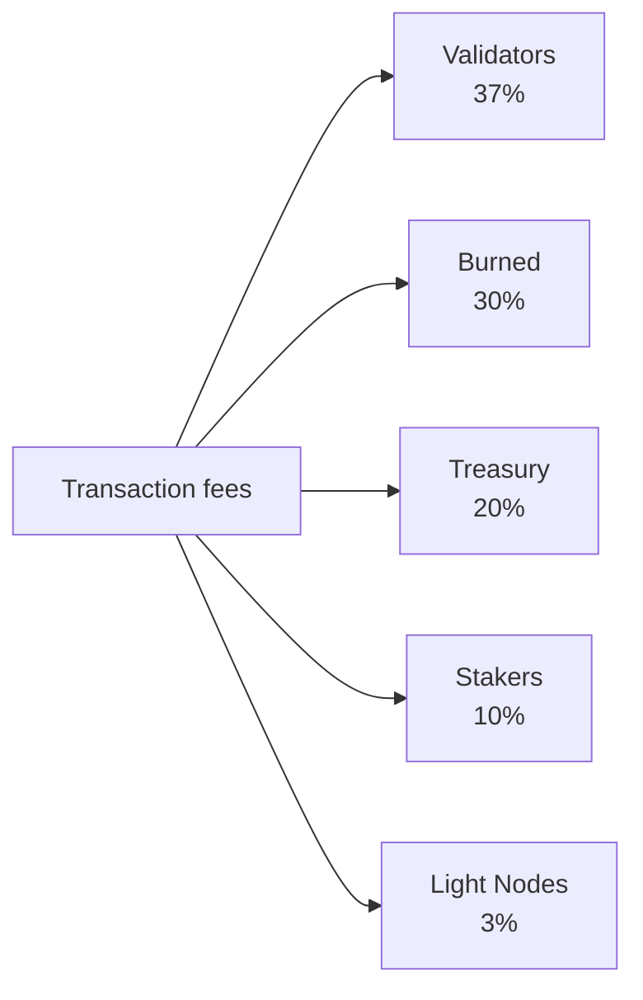

# Tokenomique

QoreChain utilise un modèle économique à **offre fixe** centré sur le token natif **QOR**. Plutôt que de gonfler l'offre au fil du temps, le réseau finance les récompenses de staking à partir d'un budget d'émission fini et pré-alloué, tandis qu'un moteur de burn multicanal applique une pression déflationniste soutenue à mesure que l'usage du réseau augmente.

---

## Notions de base sur le token

| Propriété              | Valeur                                                    |
| --------------------- | -------------------------------------------------------- |
| **Token d'affichage**     | QOR                                                      |
| **Dénomination de base** | uqor                                                     |
| **Précision décimale** | 10^6 (1 QOR = 1 000 000 uqor)                            |
| **Offre totale**      | 4 500 000 000 QOR (fixe)                                |
| **Chain ID**          | `qorechain-vladi` (mainnet, EVM chain ID 9801)          |
| **Préfixe Bech32**     | `qor` (comptes : `qor1...`, validateurs : `qorvaloper...`) |

:::note
Les chiffres de cette page décrivent le **mainnet** (`qorechain-vladi`, EVM chain ID **9801**), en service depuis le 7 juin 2026 sur la version de chaîne **v3.1.80**. Le testnet **`qorechain-diana`** (EVM chain ID **9800**) partage le même modèle économique.
:::

---

## Modèle d'offre et d'émission

QoreChain dispose d'une **offre totale fixe de 4 500 000 000 QOR**. De nouveaux QOR ne sont jamais frappés pour gonfler l'offre. Au lieu de cela :

* **80 000 000 QOR (1,78 % de l'offre)** ont été brûlés lors de l'événement de génération du token (TGE).
* Les récompenses de staking sont versées à partir d'un **budget d'émission fini de 590 000 000 QOR**, prélevé au fil du temps selon un calendrier décroissant.

Il s'agit d'un **modèle à offre fixe avec un budget d'émission fini**, et non d'un modèle de gonflement de l'offre. Une fois le budget d'émission épuisé, aucune émission de récompense supplémentaire ne se produit au-delà de ce que la gouvernance alloue à partir du budget restant.

### Calendrier des récompenses de staking {#staking-reward-schedule}

Les récompenses de staking sont distribuées à partir du budget d'émission de 590 000 000 QOR selon un calendrier décroissant :

| Période      | APY cible              | Budget d'émission                  |
| ----------- | ----------------------- | -------------------------------- |
| Année 1      | 8–12 % APY               | 127 500 000 QOR                  |
| Année 2      | 6–10 % APY               | 106 250 000 QOR                  |
| Années 3–4   | 5–8 % APY                | 85 000 000 QOR par an          |
| Année 5+     | Déterminé par la gouvernance   | ~186 000 000 QOR restants       |

Les plages d'APY sont des cibles qui dépendent du ratio de bonded ; les chiffres du budget d'émission sont les plafonds stricts de QOR libérés aux stakers à chaque période. À partir de l'année 5, les ~186 000 000 QOR restants sont libérés à un rythme fixé par la gouvernance.

---

## x/burn — Moteur de burn multicanal

Le module `x/burn` implémente un système de burn de tokens à 10 canaux. Chaque token brûlé est définitivement retiré de l'offre en circulation, créant une pression déflationniste soutenue à mesure que l'usage du réseau augmente.

### Canaux de burn

| #  | Canal            | Source                     | Description                                   |
| -- | ------------------ | -------------------------- | --------------------------------------------- |
| 1  | `gas_fee`          | Frais de transaction           | 30 % de tous les frais de gas sont brûlés                |
| 2  | `contract_create`  | Déploiement de smart contract  | Frais forfaitaire de 100 QOR brûlé par création de contrat |
| 3  | `ai_service`       | Frais d'utilisation du module IA      | 50 % des frais de service IA brûlés                 |
| 4  | `bridge_fee`       | Frais de bridge inter-chaînes    | 100 % des frais de bridge brûlés                    |
| 5  | `treasury_buyback` | Opérations de trésorerie        | Rachat-et-burn périodique depuis la trésorerie       |
| 6  | `failed_tx`        | Gas des transactions échouées     | 10 % du gas des transactions échouées brûlé    |
| 7  | `xqore_penalty`    | Pénalités de sortie anticipée xQORE | Montants de pénalité acheminés via le burn           |
| 8  | `auto_buyback`     | Programme de rachat automatisé  | Burns automatisés au niveau du protocole              |
| 9  | `tge`              | Événement de génération du token     | Burns ponctuels au genesis (80 000 000 QOR)       |
| 10 | `rollup_create`    | Déploiement de rollup          | 1 % du stake de création de rollup brûlé            |

### Distribution des frais

Tous les frais de transaction collectés par le réseau sont répartis entre cinq destinations, comme illustré ci-dessous. Les parts sont imposées on-chain et leur somme est toujours exactement égale à 100 %.



Tous les frais de transaction collectés par le réseau sont répartis entre cinq destinations :

| Destinataire       | Part | Description                                                          |
| --------------- | ----- | -------------------------------------------------------------------- |
| **Validators**  | 37 %   | Distribués à l'ensemble des validateurs actifs au prorata du stake        |
| **Burned**      | 30 %   | Définitivement retirés de l'offre via le canal de burn `gas_fee`       |
| **Treasury**    | 20 %   | Alloués à la trésorerie communautaire pour des dépenses dirigées par la gouvernance |
| **Stakers**     | 10 %   | Distribués à tous les stakers QOR au prorata de la délégation        |
| **Light Nodes** | 3 %    | Distribués aux nœuds légers pour la fourniture de données réseau                  |

Les parts sont imposées on-chain et leur somme doit toujours être exactement égale à 100 %.

### Paramètres de burn

| Paramètre              | Défaut                    | Description                              |
| ---------------------- | -------------------------- | ---------------------------------------- |
| `gas_burn_rate`        | 0.30                       | Fraction des frais de gas brûlée (30 %)        |
| `contract_create_fee`  | 100 000 000 uqor (100 QOR) | Frais de burn forfaitaire pour la création de contrat      |
| `ai_service_burn_rate` | 0.50                       | Fraction des frais de service IA brûlée (50 %) |
| `bridge_burn_rate`     | 1.00                       | Fraction des frais de bridge brûlée (100 %)    |
| `failed_tx_burn_rate`  | 0.10                       | Fraction du gas des TX échouées brûlée (10 %)   |

Chaque événement de burn est enregistré on-chain avec sa source, son montant, la hauteur de bloc et le hachage de transaction associé. Des statistiques agrégées sont interrogeables par canal et au total.

---

## x/xqore — Staking verrouillé et amplification de la gouvernance

Le module `x/xqore` introduit **xQORE**, un dérivé de staking verrouillé non transférable. Les utilisateurs verrouillent du QOR pour frapper du xQORE selon un ratio 1:1. Les détenteurs de xQORE bénéficient d'un pouvoir de gouvernance amplifié et d'une part des pénalités de sortie redistribuées.

### Mécanisme de verrouillage

* **Verrouillage** : envoyez du QOR au module xQORE pour frapper du xQORE selon un ratio 1:1.
* **Poids de gouvernance** : les détenteurs de xQORE bénéficient d'un **pouvoir de vote de gouvernance multiplié par 2** par rapport aux stakers QOR standards.
* **Non transférable** : le xQORE ne peut pas être envoyé entre comptes. Il est lié à l'adresse de verrouillage.

### Calendrier des pénalités de sortie

Un retrait anticipé du xQORE entraîne une pénalité qui diminue avec la durée de verrouillage :

| Durée de verrouillage  | Taux de pénalité | Description                                |
| -------------- | ------------ | ------------------------------------------ |
| &lt; 30 jours   | **50 %**      | La moitié du QOR verrouillé est perdue            |
| 30 -- 90 jours  | **35 %**      | Pénalité significative pour les verrouillages à court terme   |
| 90 -- 180 jours | **15 %**      | Pénalité réduite pour un engagement à moyen terme |
| > 180 jours     | **0 %**       | Retrait complet sans pénalité            |

### Redistribution par rebase PvP

Les pénalités collectées lors des sorties anticipées ne sont pas simplement détruites. Elles suivent plutôt un modèle de rebase PvP (joueur contre joueur) :

1. **50 %** des montants de pénalité sont brûlés (acheminés via `x/burn` à travers le canal `xqore_penalty`).
2. **50 %** sont redistribués au prorata à tous les détenteurs de xQORE restants.

Cela crée une dynamique à somme positive pour les détenteurs à long terme : chaque sortie anticipée augmente la valeur effective des positions xQORE restantes. Les rebases se produisent tous les **100 blocs**.

### Paramètres xQORE

| Paramètre               | Défaut                | Description                               |
| ----------------------- | ---------------------- | ----------------------------------------- |
| `governance_multiplier` | 2.0                    | Multiplicateur de pouvoir de vote pour les détenteurs de xQORE |
| `min_lock_amount`       | 1 000 000 uqor (1 QOR) | QOR minimal requis pour verrouiller              |
| `penalty_burn_rate`     | 0.50                   | Fraction des pénalités de sortie brûlée (50 %)   |
| `rebase_interval`       | 100 blocs             | Blocs entre les événements de rebase PvP          |
| `enabled`               | true                   | Indicateur d'activation du module                    |

---

## x/inflation — Calendrier du budget d'émission

Malgré son nom de module, le module `x/inflation` ne gonfle **pas** l'offre totale. Il régit la libération des récompenses de staking à partir du budget d'émission fini de **590 000 000 QOR** selon le [calendrier décroissant des récompenses de staking](#staking-reward-schedule). Les émissions sont calculées par époque et distribuées aux stakers et aux validateurs, prélevant le budget pré-alloué plutôt que de frapper une nouvelle offre.

### Mécanique des époques

* **Longueur d'une époque** : 17 280 blocs (\~1 jour avec des temps de bloc de 5 secondes)
* **Blocs par an** : \~6 311 520
* Au début de chaque époque, l'émission planifiée pour la période en cours est libérée du budget d'émission et distribuée aux stakers et aux validateurs.
* Le traceur d'époque enregistre le numéro d'époque en cours, l'année en cours, le bloc de départ, le cumul de QOR libéré du budget d'émission et le budget restant.

### Paramètres d'inflation

| Paramètre      | Défaut          | Description                                                |
| -------------- | ---------------- | ---------------------------------------------------------- |
| `schedule`     | declining        | Budget d'émission indexé par période (voir le calendrier des récompenses de staking) |
| `epoch_length` | 17 280 blocs    | Blocs par époque d'émission                                  |
| `enabled`      | true             | Indicateur d'activation du module                              |

---

## Dynamique déflationniste

Parce que l'offre est fixe et que l'émission est prélevée sur un budget fini, la dynamique nette du token de QoreChain tend vers la déflation à mesure que l'adoption croît :

```
Years 1-2:  Larger scheduled emissions from the budget offset burns → near-neutral supply
Years 3-4:  Scheduled emissions decline; burn volume grows with usage → convergence
Year 5+:    Emission budget is largely drawn down; burn channels (gas, bridge,
            contracts, rollups) scale with transaction volume → net deflationary
```

Les 10 canaux de burn garantissent que chaque activité réseau majeure retire des tokens de l'offre. À mesure que le volume de transactions, l'usage du bridge, les appels de service IA et les déploiements de rollups augmentent, les burns cumulés s'accélèrent tandis que les émissions planifiées diminuent vers la fin du budget fini.

---

## Ordre du cycle de vie des modules

Les modules économiques s'exécutent dans un ordre spécifique pendant l'`EndBlocker` de chaque bloc :

```
x/burn → x/xqore → x/inflation → x/rlconsensus
```

1. **x/burn** — Traite les enregistrements de burn en attente et met à jour les statistiques agrégées.
2. **x/xqore** — Exécute les rebases PvP (tous les `rebase_interval` blocs) et achemine les pénalités vers le burn.
3. **x/inflation** — Libère les émissions de récompenses de staking planifiées à partir du budget aux limites d'époque.
4. **x/rlconsensus** — Ajuste les paramètres de consensus en fonction des signaux d'apprentissage par renforcement de PRISM.

Cet ordre garantit que les burns sont finalisés avant les rebases, et que les rebases s'achèvent avant la libération des émissions planifiées, maintenant des transitions d'état économiques cohérentes.

## Liens connexes

* [Paramètres de la chaîne](/appendix/chain-parameters) — valeurs économiques et de consensus par défaut faisant autorité.
* [Staking et délégation](/user-guide/staking-and-delegation) — déléguez du QOR et gagnez des récompenses.
* [Staking xQORE](/user-guide/xqore-staking) — le mécanisme de staking par rebase PvP.
* [Récompenses des nœuds légers](/light-node/rewards-and-monitoring) — la part de récompense des nœuds légers.
