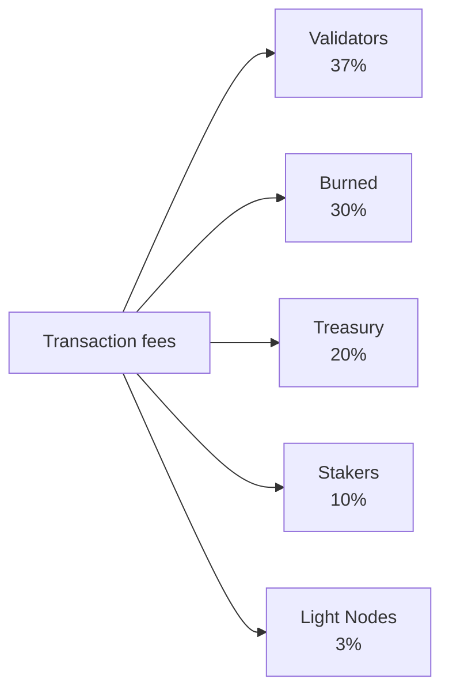

# Tokenomics

QoreChain utilise un modèle économique à **offre fixe** centré sur le jeton natif **QOR**. Plutôt que d'augmenter l'offre au fil du temps par inflation, le réseau finance les récompenses de staking à partir d'un budget d'émission fini et pré-alloué, tandis qu'un moteur de burn multicanal exerce une pression déflationniste soutenue à mesure que l'usage du réseau croît.

---

## Notions de base sur le jeton

| Propriété              | Valeur                                                    |
| --------------------- | -------------------------------------------------------- |
| **Jeton affiché**     | QOR                                                      |
| **Dénomination de base** | uqor                                                     |
| **Précision décimale** | 10^6 (1 QOR = 1 000 000 uqor)                            |
| **Offre totale**      | 4 500 000 000 QOR (fixe)                                |
| **ID de chaîne**          | `qorechain-vladi` (mainnet, ID de chaîne EVM 9801)          |
| **Préfixe Bech32**     | `qor` (comptes : `qor1...`, validateurs : `qorvaloper...`) |

:::note
Les chiffres de cette page décrivent le **mainnet** (`qorechain-vladi`, ID de chaîne EVM **9801**), actif depuis le 7 juin 2026 sur la version de chaîne **v3.1.95**. Le testnet **`qorechain-diana`** (ID de chaîne EVM **9800**) partage le même modèle économique.
:::

---

## Modèle d'offre et d'émission

QoreChain a une **offre totale fixe de 4 500 000 000 QOR**. Aucun nouveau QOR n'est jamais frappé pour gonfler l'offre. À la place :

* **80 000 000 QOR (1,78 % de l'offre)** ont été brûlés lors du Token Generation Event (TGE).
* Les récompenses de staking sont versées à partir d'un **budget d'émission fini de 590 000 000 QOR**, décaissé progressivement selon un barème dégressif.

Il s'agit d'un **modèle à offre fixe avec un budget d'émission fini**, et non d'un modèle d'inflation de l'offre. Une fois le budget d'émission épuisé, aucune émission de récompense supplémentaire ne se produit au-delà de ce que la gouvernance alloue depuis le budget restant.

### Barème des récompenses de staking {#staking-reward-schedule}

:::note L'émission a été plafonnée par la gouvernance le 26 août 2026
Le barème dégressif ci-dessous était la conception d'origine, visant un réseau mature avec la majeure partie de l'offre bondée. Rapporté au réseau tel qu'il se présentait réellement — environ 6,8 M QOR bondés, bien en-deçà de cette cible — il versait environ 20 % de la mise bondée *par jour*. La proposition de gouvernance n°4 a été adoptée avec 100 % de la mise bondée et appliquée à la hauteur de bloc 2 122 074 (2026-08-26 03:27 UTC, version de chaîne v3.1.94) : l'émission par époque est passée de 2 153 583 QOR à **16 239 QOR**, sous un nouveau plafond cumulatif strict de **114 285 714 QOR** pour ce module — une décision de conception, pas un correctif de bug. Au moment où le plafond a pris effet, **104 680 531 QOR (91,6 %) avaient déjà été émis** selon l'ancien barème ; au nouveau rythme, le solde restant devrait durer encore environ **1 an et 11 mois**, après quoi ce module cesse d'émettre définitivement et les récompenses des validateurs/stakers proviennent uniquement des frais de transaction (voir [Répartition des frais](#fee-distribution) ci-dessous). Le tableau ci-dessous est conservé comme référence de la conception d'origine — il ne décrit plus le taux de versement actuellement en vigueur.
:::

Les récompenses de staking sont distribuées à partir du budget d'émission de 590 000 000 QOR selon un barème dégressif :

| Période      | APY cible              | Budget d'émission                  |
| ----------- | ----------------------- | -------------------------------- |
| Année 1      | 8–12 % APY               | 127 500 000 QOR                  |
| Année 2      | 6–10 % APY               | 106 250 000 QOR                  |
| Années 3–4   | 5–8 % APY                | 85 000 000 QOR par an          |
| Année 5+     | Déterminé par la gouvernance   | ~186 000 000 QOR restants       |

Les fourchettes d'APY étaient les cibles de conception d'origine par période ; elles ne reflètent plus le taux de versement actuellement en vigueur depuis le plafonnement de l'émission décrit ci-dessus. QoreChain n'expose actuellement aucun point d'accès permettant de calculer un chiffre d'APY en direct — considérez tout pourcentage de rendement de staking spécifique que vous voyez cité (y compris sur cette page, historiquement) comme invérifiable par rapport à la chaîne aujourd'hui, et non comme un chiffre sur lequel planifier.

---

## x/burn — Moteur de burn multicanal

Le module `x/burn` implémente un système de burn de jetons à 10 canaux. Chaque jeton brûlé est retiré définitivement de l'offre en circulation, créant une pression déflationniste soutenue à mesure que l'usage du réseau croît.

### Canaux de burn

| #  | Canal            | Source                     | Description                                   |
| -- | ------------------ | -------------------------- | --------------------------------------------- |
| 1  | `gas_fee`          | Frais de transaction           | 30 % de tous les frais de gas sont brûlés                |
| 2  | `contract_create`  | Déploiement de smart contract  | Frais fixe de 100 QOR brûlé par création de contrat |
| 3  | `ai_service`       | Frais d'utilisation du module IA       | 50 % des frais de service IA brûlés                 |
| 4  | `bridge_fee`       | Frais du pont interchaînes    | 100 % des frais de pont brûlés                    |
| 5  | `treasury_buyback` | Opérations de trésorerie        | Rachat-et-burn périodique depuis la trésorerie       |
| 6  | `failed_tx`        | Gas des transactions échouées     | 10 % du gas des transactions échouées brûlé    |
| 7  | `xqore_penalty`    | Pénalités de sortie anticipée xQORE | Montants des pénalités acheminés vers le burn |
| 8  | `auto_buyback`     | Programme de rachat automatisé  | Burns automatisés au niveau du protocole |
| 9  | `tge`              | Token generation event     | Burns de genèse ponctuels (80 000 000 QOR)       |
| 10 | `rollup_create`    | Déploiement de rollup          | 1 % de la mise de création de rollup brûlée            |

### Répartition des frais {#fee-distribution}

Tous les frais de transaction collectés par le réseau sont répartis entre cinq destinations, comme indiqué ci-dessous. Les parts sont appliquées on-chain et totalisent toujours exactement 100 %.


```mermaid
flowchart LR
    F["Transaction fees"]
    F --> V["Validators<br/>37%"]
    F --> B["Burned<br/>30%"]
    F --> T["Treasury<br/>20%"]
    F --> S["Stakers<br/>10%"]
    F --> L["Light Nodes<br/>3%"]
```

Tous les frais de transaction collectés par le réseau sont répartis entre cinq destinations :

| Destinataire       | Part | Description                                                          |
| --------------- | ----- | -------------------------------------------------------------------- |
| **Validateurs**  | 37 %   | Distribués à l'ensemble des validateurs actifs proportionnellement à leur mise        |
| **Brûlé**      | 30 %   | Retiré définitivement de l'offre via le canal de burn `gas_fee`       |
| **Trésorerie**    | 20 %   | Alloué à la trésorerie communautaire pour des dépenses décidées par la gouvernance |
| **Stakers**     | 10 %   | Distribués à tous les stakers de QOR proportionnellement à leur délégation            |
| **Nœuds légers** | 3 %    | Distribués aux nœuds légers pour la mise à disposition des données du réseau                  |

Les parts sont appliquées on-chain et doivent toujours totaliser exactement 100 %.

:::note Ce sont les répartitions configurées, pas une mesure confirmée en conditions réelles
Le tableau ci-dessus reflète les paramètres configurés de `x/burn`. Un effort de mesure sur l'état réel de la chaîne a constaté que la part combinée effectivement perçue par les validateurs et les stakers ensemble était inférieure aux 47 % que ces deux lignes totalisent. Cet écart n'a pas encore été réconcilié de manière indépendante ; cette page indique donc les valeurs de conception configurées plutôt que d'affirmer que l'un ou l'autre chiffre est la valeur en direct confirmée — interrogez directement les paramètres et statistiques de `x/burn` (voir [Points d'accès REST/gRPC](/api-reference/rest-grpc-endpoints)) si votre cas d'usage dépend de la répartition exacte actuelle.
:::

### Paramètres de burn

| Paramètre              | Valeur par défaut                    | Description                              |
| ---------------------- | -------------------------- | ---------------------------------------- |
| `gas_burn_rate`        | 0.30                       | Fraction des frais de gas brûlée (30 %)        |
| `contract_create_fee`  | 100 000 000 uqor (100 QOR) | Frais fixe de burn pour la création de contrat      |
| `ai_service_burn_rate` | 0.50                       | Fraction des frais de service IA brûlée (50 %) |
| `bridge_burn_rate`     | 1.00                       | Fraction des frais de pont brûlée (100 %)    |
| `failed_tx_burn_rate`  | 0.10                       | Fraction du gas des TX échouées brûlée (10 %)   |

Chaque événement de burn est enregistré on-chain avec sa source, son montant, sa hauteur de bloc et le hash de transaction associé. Des statistiques agrégées sont interrogeables par canal et au total.

---

## x/xqore — Staking verrouillé et amplification de la gouvernance

Le module `x/xqore` introduit **xQORE**, un dérivé de staking verrouillé et non transférable. Les utilisateurs verrouillent du QOR pour frapper du xQORE dans un ratio de 1:1. Les détenteurs de xQORE reçoivent un pouvoir de gouvernance amplifié et une part des pénalités de sortie redistribuées.

### Mécanisme de verrouillage

* **Verrouillage** : envoyer du QOR au module xQORE pour frapper du xQORE dans un ratio de 1:1.
* **Poids de gouvernance** : les détenteurs de xQORE reçoivent un **pouvoir de vote de gouvernance 2x** par rapport aux stakers QOR standards.
* **Non transférable** : le xQORE ne peut pas être envoyé entre comptes. Il est lié à l'adresse de verrouillage.

### Barème de pénalité de sortie

Un retrait anticipé depuis xQORE entraîne une pénalité qui diminue avec la durée de verrouillage :

| Durée de verrouillage  | Taux de pénalité | Description                                |
| -------------- | ------------ | ------------------------------------------ |
| &lt; 30 jours   | **50 %**      | La moitié du QOR verrouillé est confisquée            |
| 30 -- 90 jours  | **35 %**      | Pénalité importante pour les verrouillages de courte durée   |
| 90 -- 180 jours | **15 %**      | Pénalité réduite pour un engagement de moyen terme |
| > 180 jours     | **0 %**       | Retrait intégral sans pénalité            |

### Redistribution par rebase PvP

Les pénalités collectées lors des sorties anticipées ne sont pas simplement détruites. Elles suivent plutôt un modèle de rebase PvP (player-versus-player) :

1. **50 %** des montants de pénalité sont brûlés (acheminés via `x/burn` par le canal `xqore_penalty`).
2. **50 %** sont redistribués au prorata à tous les détenteurs de xQORE restants.

Cela crée une dynamique à somme positive pour les détenteurs de long terme : chaque sortie anticipée augmente la valeur effective des positions xQORE restantes. Les rebases surviennent tous les **100 blocs**.

### Paramètres xQORE

| Paramètre               | Valeur par défaut                | Description                               |
| ----------------------- | ---------------------- | ------------------------------------------ |
| `governance_multiplier` | 2.0                    | Multiplicateur de pouvoir de vote pour les détenteurs de xQORE |
| `min_lock_amount`       | 1 000 000 uqor (1 QOR) | QOR minimum requis pour verrouiller              |
| `penalty_burn_rate`     | 0.50                   | Fraction des pénalités de sortie brûlée (50 %)   |
| `rebase_interval`       | 100 blocs             | Blocs entre les événements de rebase PvP          |
| `enabled`               | true                   | Indicateur d'activation du module                    |

---

## x/inflation — Barème du budget d'émission

Malgré son nom, le module `x/inflation` **n'**inflate **pas** l'offre totale. Il régit la libération des récompenses de staking depuis le budget d'émission fini de **590 000 000 QOR**, selon le [barème des récompenses de staking](#staking-reward-schedule) dégressif. Les émissions sont calculées par époque et distribuées aux stakers et validateurs, en décaissant le budget pré-alloué plutôt qu'en frappant une nouvelle offre.

### Mécanique des époques

* **Longueur d'une époque** : 17 280 blocs (\~1 jour avec des blocs de 5 secondes)
* **Blocs par an** : \~6 311 520
* Au début de chaque époque, l'émission prévue pour la période en cours est libérée depuis le budget d'émission et distribuée aux stakers et validateurs.
* Le suivi des époques enregistre le numéro de l'époque en cours, l'année en cours, le bloc de départ, le QOR cumulé libéré depuis le budget d'émission, et le budget restant.

### Paramètres d'inflation

| Paramètre      | Valeur par défaut          | Description                                                |
| -------------- | ---------------- | ---------------------------------------------------------- |
| `schedule`     | dégressif        | Budget d'émission indexé par période (voir le barème des récompenses de staking) |
| `epoch_length` | 17 280 blocs    | Blocs par époque d'émission                                  |
| `enabled`      | true             | Indicateur d'activation du module                                     |

---

## Dynamique déflationniste

Comme l'offre est fixe et que l'émission est prélevée sur un budget fini, la dynamique nette du jeton de QoreChain tend à devenir déflationniste à mesure que l'adoption croît :

```
Years 1-2:  Larger scheduled emissions from the budget offset burns → near-neutral supply
Years 3-4:  Scheduled emissions decline; burn volume grows with usage → convergence
Year 5+:    Emission budget is largely drawn down; burn channels (gas, bridge,
            contracts, rollups) scale with transaction volume → net deflationary
```

Les 10 canaux de burn garantissent que chaque activité majeure du réseau retire des jetons de l'offre. À mesure que le volume de transactions, l'usage du pont, les appels au service IA et les déploiements de rollups augmentent, les burns cumulés s'accélèrent tandis que les émissions prévues déclinent vers la fin du budget fini.

---

## Ordre du cycle de vie des modules

Les modules économiques s'exécutent dans un ordre précis lors de l'`EndBlocker` de chaque bloc :

```
x/burn → x/xqore → x/inflation → x/rlconsensus
```

1. **x/burn** — Traite les enregistrements de burn en attente et met à jour les statistiques agrégées.
2. **x/xqore** — Exécute les rebases PvP (tous les `rebase_interval` blocs) et achemine les pénalités vers le burn.
3. **x/inflation** — Libère les émissions programmées de récompenses de staking depuis le budget, aux limites d'époque.
4. **x/rlconsensus** — Ajuste les paramètres de consensus en fonction des signaux d'apprentissage par renforcement PRISM.

Cet ordonnancement garantit que les burns sont finalisés avant les rebases, et que les rebases se terminent avant que les émissions programmées ne soient libérées, maintenant des transitions d'état économique cohérentes.

## Voir aussi

* [Paramètres de la chaîne](/appendix/chain-parameters) — valeurs par défaut économiques et de consensus canoniques.
* [Staking et délégation](/user-guide/staking-and-delegation) — déléguer du QOR et gagner des récompenses.
* [Staking xQORE](/user-guide/xqore-staking) — le mécanisme de staking à rebase PvP.
* [Récompenses des nœuds légers](/light-node/rewards-and-monitoring) — la part de récompense des nœuds légers.
