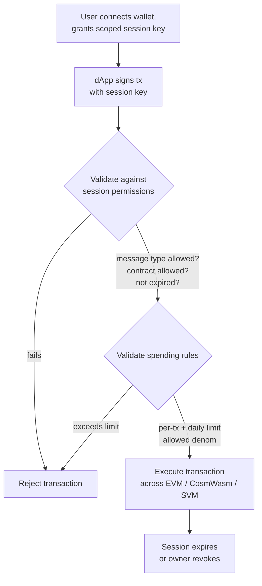

# Abstraction de compte

QoreChain fournit une **abstraction de compte au niveau du protocole** via le module `x/abstractaccount`. Cela permet des comptes programmables avec des règles d'authentification flexibles, des clés de session, des limites de dépenses et la récupération sociale — le tout sans nécessiter d'infrastructure de contrat intelligent externe.

:::note
Les commandes ci-dessous utilisent le mainnet **`qorechain-vladi`**, en service depuis le 7 juin 2026 et exécutant la version de chaîne **v3.1.82**. Remplacez par `--chain-id qorechain-diana` pour le testnet.
:::

## Aperçu

Les comptes blockchain traditionnels sont contrôlés par une seule clé privée. L'abstraction de compte dissocie le concept de « qui peut autoriser une transaction » d'une clé cryptographique unique, permettant :

* Des **comptes multisig** avec un seuil de signature configurable
* Des **comptes à récupération sociale** avec une récupération de clé basée sur des gardiens
* Des **comptes basés sur des sessions** avec des permissions granulaires et limitées dans le temps pour les dApps

Le module `x/abstractaccount` implémente ces capacités au niveau du protocole, ce qui signifie qu'elles fonctionnent sur les trois VM (EVM, CosmWasm, SVM) et bénéficient d'une efficacité de gaz native.

*Un flux de dApp basé sur une session : une clé de session restreinte signe une transaction, le module la valide par rapport à la session et aux règles de dépenses, puis exécute.*



## Types de comptes

| Type              | Description                             | Cas d'usage                       |
| ----------------- | --------------------------------------- | ------------------------------ |
| `multisig`        | Signature à seuil M-sur-N                | Trésoreries de DAO, portefeuilles partagés |
| `social_recovery` | Récupération de clé assistée par des gardiens          | Portefeuilles grand public, intégration   |
| `session_based`   | Clés de session déléguées avec contraintes | Sessions de dApp, portefeuilles mobiles  |

## Création d'un compte abstrait

### Compte basé sur une session

```bash
qorechaind tx abstractaccount create \
  --account-type session_based \
  --from mykey \
  --gas auto \
  -y
```

### Compte multisig

```bash
qorechaind tx abstractaccount create \
  --account-type multisig \
  --signers qor1alice...,qor1bob...,qor1carol... \
  --threshold 2 \
  --from mykey \
  --gas auto \
  -y
```

### Compte à récupération sociale

```bash
qorechaind tx abstractaccount create \
  --account-type social_recovery \
  --guardians qor1guardian1...,qor1guardian2...,qor1guardian3... \
  --recovery-threshold 2 \
  --from mykey \
  --gas auto \
  -y
```

## Clés de session

Les clés de session sont la pierre angulaire du type de compte `session_based`. Elles vous permettent d'accorder des **permissions temporaires et restreintes** à une clé secondaire — idéal pour les interactions avec les dApps où vous ne souhaitez pas exposer votre clé principale.

### Propriétés clés

| Propriété              | Description                                          |
| --------------------- | ---------------------------------------------------- |
| **Permissions**       | Quels types de messages la clé de session peut signer         |
| **Expiration**            | Expiration automatique après une durée configurable   |
| **Limites de dépenses**   | Montants maximaux que la clé de session peut dépenser            |
| **Contrats autorisés** | Restreindre les interactions à des adresses de contrat spécifiques |

### Accorder une clé de session

```bash
qorechaind tx abstractaccount grant-session \
  --session-key qor1sessionkey... \
  --permissions "bank/MsgSend,wasm/MsgExecuteContract" \
  --expiry "2026-03-01T00:00:00Z" \
  --allowed-contracts qor1contract1...,0x1234...abcd \
  --from mykey \
  -y
```

### Révoquer une clé de session

```bash
qorechaind tx abstractaccount revoke-session \
  --session-key qor1sessionkey... \
  --from mykey \
  -y
```

### Lister les sessions actives

```bash
qorechaind query abstractaccount sessions <account-address>
```

## Règles de dépenses

Les règles de dépenses ajoutent des garde-fous financiers aux comptes abstraits, quel que soit le type de compte :

| Règle             | Description                                     |
| ---------------- | ----------------------------------------------- |
| `daily_limit`    | Dépense totale maximale par fenêtre glissante de 24 heures  |
| `per_tx_limit`   | Dépense maximale par transaction individuelle        |
| `allowed_denoms` | Restreindre les dénominations de jetons pouvant être dépensées |

### Définir les règles de dépenses

```bash
qorechaind tx abstractaccount update-spending-rules \
  --daily-limit 1000000000uqor \
  --per-tx-limit 100000000uqor \
  --allowed-denoms uqor \
  --from mykey \
  -y
```

### Interroger les règles actuelles

```bash
qorechaind query abstractaccount spending-rules <account-address>
```

### Exemple de réponse

```json
{
  "daily_limit": {
    "denom": "uqor",
    "amount": "1000000000"
  },
  "per_tx_limit": {
    "denom": "uqor",
    "amount": "100000000"
  },
  "allowed_denoms": ["uqor"],
  "daily_spent": {
    "denom": "uqor",
    "amount": "250000000"
  },
  "window_reset": "2026-02-27T00:00:00Z"
}
```

## Interrogation des comptes abstraits

### CLI

```bash
# Get full account configuration
qorechaind query abstractaccount account <address>

# List all abstract accounts (paginated)
qorechaind query abstractaccount list --limit 10
```

### JSON-RPC

```bash
curl -X POST http://localhost:8545 \
  -H "Content-Type: application/json" \
  -d '{
    "jsonrpc": "2.0",
    "method": "qor_getAbstractAccount",
    "params": ["0xYourAddress"],
    "id": 1
  }'
```

### Exemple de réponse de compte

```json
{
  "address": "qor1myaccount...",
  "account_type": "session_based",
  "owner": "qor1owner...",
  "active_sessions": 2,
  "spending_rules": {
    "daily_limit": "1000000000uqor",
    "per_tx_limit": "100000000uqor",
    "allowed_denoms": ["uqor"]
  },
  "created_at_height": 54321
}
```

## Flux de récupération sociale

Si le propriétaire du compte perd l'accès à sa clé principale, les gardiens peuvent autoriser une rotation de clé.

1. **Le propriétaire signale une clé perdue (ou un gardien initie) :**

   ```bash
   qorechaind tx abstractaccount initiate-recovery \
     --account <account-address> \
     --new-owner qor1newkey... \
     --from guardian1 \
     -y
   ```

2. **Des gardiens supplémentaires approuvent** (doivent atteindre `recovery_threshold`) :

   ```bash
   qorechaind tx abstractaccount approve-recovery \
     --account <account-address> \
     --recovery-id <recovery-id> \
     --from guardian2 \
     -y
   ```

3. **La récupération s'exécute automatiquement** une fois le seuil atteint. Une **période de verrouillage temporel** (par défaut : 48 heures) donne au propriétaire d'origine une chance d'annuler une tentative de récupération frauduleuse.

## Intégration avec les dApps

Les clés de session permettent des expériences de dApp fluides :

1. **L'utilisateur connecte son portefeuille** et crée une clé de session restreinte au contrat de la dApp
2. **La dApp utilise la clé de session** pour soumettre des transactions au nom de l'utilisateur
3. **Aucune signature répétée** — la clé de session gère l'autorisation dans le cadre de ses permissions
4. **La session expire** automatiquement, ou l'utilisateur la révoque à tout moment

Ce modèle est particulièrement utile pour :

* Les portefeuilles mobiles où les invites biométriques répétées sont gênantes
* Les dApps de jeu qui nécessitent une signature rapide des transactions
* Les protocoles DeFi qui exécutent plusieurs opérations séquentielles

## Étapes suivantes

* [Exécuter un validateur](/developer-guide/running-a-validator) — Configurer et exploiter un nœud validateur
* [Développement EVM](/developer-guide/evm-development) — Intégrer les comptes abstraits avec des dApps Solidity
* [Interopérabilité inter-VM](/developer-guide/cross-vm-interoperability) — Messagerie inter-VM avec des comptes abstraits
