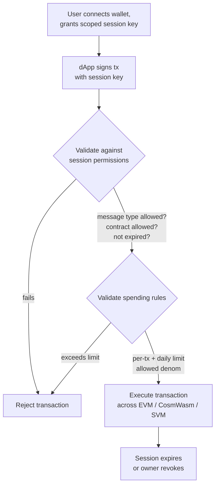

# Abstraction de compte

QoreChain fournit une **abstraction de compte au niveau du protocole** via le module `x/abstractaccount`. Elle permet des comptes programmables avec des règles d'authentification flexibles, des clés de session, des limites de dépenses et une récupération sociale — le tout sans nécessiter d'infrastructure externe de contrats intelligents.

:::note
Les commandes ci-dessous utilisent le mainnet **`qorechain-vladi`**, en production depuis le 7 juin 2026 et exécutant la version de chaîne **v3.1.85**. Remplacez par `--chain-id qorechain-diana` pour le testnet.
:::

## Vue d'ensemble

Les comptes blockchain traditionnels sont contrôlés par une seule clé privée. L'abstraction de compte dissocie la notion de « qui peut autoriser une transaction » d'une clé cryptographique unique, ce qui permet :

* Des **comptes multisignatures** avec signature à seuil configurable
* Des **comptes à récupération sociale** avec récupération de clé assistée par des gardiens
* Des **comptes basés sur des sessions** avec des permissions granulaires et limitées dans le temps pour les dApps

Le module `x/abstractaccount` implémente ces capacités au niveau du protocole, ce qui signifie qu'elles fonctionnent sur les trois VM (EVM, CosmWasm, SVM) et bénéficient de l'efficacité native en gaz.

*Un flux dApp basé sur une session : une clé de session à portée limitée signe une transaction, le module la valide par rapport à la session et aux règles de dépenses, puis l'exécute.*


```mermaid
flowchart TD
    A["User connects wallet,<br/>grants scoped session key"] --> B["dApp signs tx<br/>with session key"]
    B --> C{"Validate against<br/>session permissions"}
    C -- "message type allowed?<br/>contract allowed?<br/>not expired?" --> D{"Validate spending rules"}
    C -- "fails" --> R["Reject transaction"]
    D -- "per-tx + daily limit<br/>allowed denom" --> E["Execute transaction<br/>across EVM / CosmWasm / SVM"]
    D -- "exceeds limit" --> R
    E --> F["Session expires<br/>or owner revokes"]
```

## Types de comptes

| Type              | Description                             | Cas d'usage                       |
| ----------------- | --------------------------------------- | ------------------------------ |
| `multisig`        | Signature à seuil M-parmi-N                | Trésoreries de DAO, portefeuilles partagés |
| `social_recovery` | Récupération de clé assistée par des gardiens          | Portefeuilles grand public, onboarding   |
| `session_based`   | Clés de session déléguées avec contraintes | Sessions dApp, portefeuilles mobiles  |

## Créer un compte abstrait

### Compte basé sur une session

```bash
qorechaind tx abstractaccount create \
  --account-type session_based \
  --from mykey \
  --gas auto \
  -y
```

### Compte multisignature

```bash
qorechaind tx abstractaccount create \
  --account-type multisig \
  --signers qor1alice...,qor1bob...,qor1carol... \
  --threshold 2 \
  --from mykey \
  --gas auto \
  -y
```

### Compte à récupération sociale

```bash
qorechaind tx abstractaccount create \
  --account-type social_recovery \
  --guardians qor1guardian1...,qor1guardian2...,qor1guardian3... \
  --recovery-threshold 2 \
  --from mykey \
  --gas auto \
  -y
```

## Clés de session

Les clés de session sont la pierre angulaire du type de compte `session_based`. Elles vous permettent d'accorder des **permissions temporaires et à portée limitée** à une clé secondaire — idéal pour les interactions avec des dApps où vous ne souhaitez pas exposer votre clé principale.

### Propriétés clés

| Propriété              | Description                                          |
| --------------------- | ---------------------------------------------------- |
| **Permissions**       | Les types de messages que la clé de session peut signer         |
| **Expiration**            | Expiration automatique après une durée configurable   |
| **Limites de dépenses**   | Montants maximaux que la clé de session peut dépenser            |
| **Contrats autorisés** | Restreint les interactions à des adresses de contrats spécifiques |

### Accorder une clé de session

```bash
qorechaind tx abstractaccount grant-session \
  --session-key qor1sessionkey... \
  --permissions "bank/MsgSend,wasm/MsgExecuteContract" \
  --expiry "2026-03-01T00:00:00Z" \
  --allowed-contracts qor1contract1...,0x1234...abcd \
  --from mykey \
  -y
```

### Révoquer une clé de session

```bash
qorechaind tx abstractaccount revoke-session \
  --session-key qor1sessionkey... \
  --from mykey \
  -y
```

### Lister les sessions actives

```bash
qorechaind query abstractaccount sessions <account-address>
```

## Règles de dépenses

Les règles de dépenses ajoutent des garde-fous financiers aux comptes abstraits, quel que soit le type de compte :

| Règle             | Description                                     |
| ---------------- | ----------------------------------------------- |
| `daily_limit`    | Dépense totale maximale par fenêtre glissante de 24 heures  |
| `per_tx_limit`   | Dépense maximale par transaction individuelle        |
| `allowed_denoms` | Restreint les dénominations de jetons pouvant être dépensées |

### Définir les règles de dépenses

```bash
qorechaind tx abstractaccount update-spending-rules \
  --daily-limit 1000000000uqor \
  --per-tx-limit 100000000uqor \
  --allowed-denoms uqor \
  --from mykey \
  -y
```

### Interroger les règles actuelles

```bash
qorechaind query abstractaccount spending-rules <account-address>
```

### Exemple de réponse

```json
{
  "daily_limit": {
    "denom": "uqor",
    "amount": "1000000000"
  },
  "per_tx_limit": {
    "denom": "uqor",
    "amount": "100000000"
  },
  "allowed_denoms": ["uqor"],
  "daily_spent": {
    "denom": "uqor",
    "amount": "250000000"
  },
  "window_reset": "2026-02-27T00:00:00Z"
}
```

## Authentificateurs de portefeuilles liés — dépenses déléguées {#authenticators}

Depuis la version de chaîne **v3.1.85** (qui s'appuie sur le modèle de permissions de la v3.1.84), une **clé de portefeuille externe liée** — une clé Phantom (ed25519) ou un compte MetaMask (secp256k1) — peut **dépenser depuis le compte post-quantique canonique** selon des conditions révocables, à moindre privilège et à dépenses limitées. La clé externe ne produit jamais de signature ML-DSA ; un **relayeur** soumet et paie l'enveloppe de transaction (la propre signature PQC hybride du relayeur satisfait les exigences de signature de la chaîne), tandis que la signature de l'authentificateur sur des **octets de signature séparés par domaine et protégés contre le rejeu** constitue l'autorisation.

### Enregistrer un authentificateur {#register-authenticator}

Le propriétaire du compte enregistre la clé externe avec `MsgRegisterAuthenticator` (une transaction ordinaire signée par la clé racine), en lui attribuant un schéma, des permissions, une expiration et des limites de dépenses optionnelles :

```js
import { registerEthAuthenticatorMsg } from "@qorechain/wallet-adapter";

// Link a MetaMask account by its 20-byte address (EIP-191 verification):
const msg = registerEthAuthenticatorMsg({
  account: "qor1owner...",            // the canonical account
  ethAddress: "0xAbC...123",          // the MetaMask address to link
  permissions: ["evm"],               // least privilege — see the taxonomy below
  expirySeconds: 30 * 24 * 3600,      // ≤ 30 days recommended
  spendingRule: { perTxLimit: "100000000uqor", dailyLimit: "1000000000uqor" },
});
// Sign & broadcast this msg with the OWNER's normal hybrid-PQC signer.
```

Une clé Phantom s'enregistre de la même manière avec `scheme: "ed25519"` et la clé publique Phantom. La révocation est instantanée via `MsgRevokeAuthenticator`.

### Taxonomie des permissions {#permission-taxonomy}

Onze permissions canoniques encadrent ce qu'un authentificateur enregistré peut faire. La table de correspondance est **fermée par défaut (fail-closed)** : un type de message sans correspondance est refusé.

| Permission | Accorde |
| --- | --- |
| `send` | Transferts bancaires sur la voie native |
| `delegate` / `withdraw` / `vote` | Staking, retrait des récompenses, gouvernance |
| `evm` / `wasm` / `svm` | Exécution sur la voie de VM correspondante |
| `amm` / `ibc` / `deploy` | Opérations AMM, transferts IBC, déploiement de contrats |
| `all` | Tout message *délégable* |

**Les messages de gestion des clés ne sont jamais délégables** — `MsgRegisterAuthenticator`, `MsgRevokeAuthenticator`, l'enregistrement/la migration de clés PQC et `MsgRotatePQCKey` exigent toujours la clé racine, de sorte qu'une clé liée ne peut jamais élever ses propres privilèges.

Lisez la taxonomie en direct (avec `schema_version` pour détecter les dérives) au lieu de la coder en dur :

```bash
curl -s https://api.qore.host/qorechain/abstractaccount/v1/permission_schema | jq
# or: qorechaind query abstractaccount permission-schema
```

### Dépenser via une clé liée {#execute-messages}

Deux messages transportent les actions autorisées par un authentificateur. Dans les deux cas, le relayeur est le signataire/payeur de frais de la transaction ; la signature de l'authentificateur voyage à l'intérieur du message.

**`MsgExecuteEVM`** — un appel ou un transfert EVM **depuis l'adresse `0x…` du compte canonique**. L'authentificateur signe `sha256("qorechain-evm-auth-v1" ‖ chainId ‖ account ‖ pubkey ‖ to ‖ value ‖ data ‖ nonce)` (tous les champs sont préfixés par leur longueur). La protection anti-rejeu est le propre nonce EVM du compte.

**`MsgExecuteCosmos`** — un envoi bancaire sur la voie native depuis le compte canonique. L'authentificateur signe `sha256("qorechain-cosmos-auth-v1" ‖ chainId ‖ account ‖ pubkey ‖ to ‖ amount ‖ nonce)`. La protection anti-rejeu est une **séquence par authentificateur** tenue par le module (un envoi bancaire n'incrémente pas le nonce du compte). Les envois vers soi-même sont rejetés.

:::caution Règles de nonce
* `MsgExecuteEVM.nonce` = le nonce EVM **actuel** du compte (`eth_getTransactionCount(account0x, "latest")`). En production, le relayeur est un compte *différent*, donc n'ajoutez **pas** +1. Signer un nonce périmé renvoie le code `11`.
* `MsgExecuteCosmos.nonce` = la séquence par authentificateur (interrogez l'état d'authentificateur du compte), et **non** la séquence Cosmos du compte.
:::

**Exemple Phantom** (navigateur : Phantom signe, votre backend relaie) :

```js
import { buildPhantomExecuteCosmos } from "@qorechain/wallet-adapter";

// In the dApp: Phantom signs the digest with ed25519 signMessage.
const msg = await buildPhantomExecuteCosmos({
  provider: window.solana,            // Phantom
  chainId: "qorechain-vladi",
  account: "qor1owner...",            // canonical account being spent from
  to: "qor1recipient...",
  amount: { denom: "uqor", amount: "900000" },
  nonce: authSequence,                // per-authenticator sequence
});
// Send `msg` to your relayer; the relayer wraps it in a tx it signs
// (hybrid PQC) and broadcasts. The transfer moves the OWNER's funds.
```

**Exemple MetaMask** (`personal_sign` EIP-191 depuis l'adresse liée de 20 octets) :

```js
import { buildMetaMaskExecuteEvm } from "@qorechain/wallet-adapter";

const msg = await buildMetaMaskExecuteEvm({
  provider: window.ethereum,          // MetaMask (EIP-1193)
  chainId: "qorechain-vladi",
  account: "qor1owner...",
  to: "0xRecipient...",
  valueWei: 10n ** 16n,               // 0.01 QOR (18-dec EVM view)
  nonce: currentEvmNonce,             // eth_getTransactionCount(owner0x, "latest")
});
// Relay as above. The chain verifies the signature via EIP-191 + ecrecover
// against the registered 20-byte address.
```

Les mêmes constructeurs existent dans le [SDK QoreChain](/sdk/guides/authenticators) pour les cinq langages, ainsi que des équivalents CLI :

```bash
# Produce the exact sign bytes the chain verifies (for custom signers):
qorechaind query abstractaccount auth-sign-cosmos <account> <to> <amount> <nonce>
qorechaind query abstractaccount auth-sign-evm <account> <to> <value> <data-hex> <nonce>

# Relay a pre-signed authorization:
qorechaind tx abstractaccount execute-cosmos <account> <to> <amount> <auth-pubkey> <auth-sig> <nonce> --from relayer -y
qorechaind tx abstractaccount execute-evm    <account> <to> <value> <data-hex> <auth-pubkey> <auth-sig> <nonce> --from relayer -y
```

### Codes d'erreur {#authenticator-errors}

Les échecs d'application des règles renvoient des codes distincts (codespace `abstractaccount`) afin que les portefeuilles puissent afficher le bon message :

| Code | Signification | UX du portefeuille |
| --- | --- | --- |
| `5` | Limite de dépenses dépassée (par transaction ou quotidienne) | Afficher l'allocation restante |
| `6` | Authentificateur expiré | « Expiré — reliez à nouveau votre portefeuille » |
| `10` | Permission refusée (portée ou message non délégable) | Afficher la permission manquante |
| `11` | Rejeu refusé (nonce/séquence périmé) | Réinterroger le nonce et signer à nouveau |

(Codespace `pqc` code `21` = échec de la vérification de la signature hybride — un problème de signature côté relayeur, pas un problème d'autorisation.)

### Requêtes REST {#abstractaccount-rest}

Depuis la **v3.1.85**, les requêtes en lecture du module sont également servies via REST :

```
GET /qorechain/abstractaccount/v1/config
GET /qorechain/abstractaccount/v1/accounts
GET /qorechain/abstractaccount/v1/accounts/{address}
GET /qorechain/abstractaccount/v1/permission_schema
```

## Interroger les comptes abstraits

### CLI

```bash
# Get full account configuration
qorechaind query abstractaccount account <address>

# List all abstract accounts (paginated)
qorechaind query abstractaccount list --limit 10
```

### JSON-RPC

```bash
curl -X POST http://localhost:8545 \
  -H "Content-Type: application/json" \
  -d '{
    "jsonrpc": "2.0",
    "method": "qor_getAbstractAccount",
    "params": ["0xYourAddress"],
    "id": 1
  }'
```

### Exemple de réponse de compte

```json
{
  "address": "qor1myaccount...",
  "account_type": "session_based",
  "owner": "qor1owner...",
  "active_sessions": 2,
  "spending_rules": {
    "daily_limit": "1000000000uqor",
    "per_tx_limit": "100000000uqor",
    "allowed_denoms": ["uqor"]
  },
  "created_at_height": 54321
}
```

## Flux de récupération sociale

Si le propriétaire du compte perd l'accès à sa clé principale, les gardiens peuvent autoriser une rotation de clé.

1. **Le propriétaire signale la perte de la clé (ou un gardien initie la procédure) :**

   ```bash
   qorechaind tx abstractaccount initiate-recovery \
     --account <account-address> \
     --new-owner qor1newkey... \
     --from guardian1 \
     -y
   ```

2. **Des gardiens supplémentaires approuvent** (le `recovery_threshold` doit être atteint) :

   ```bash
   qorechaind tx abstractaccount approve-recovery \
     --account <account-address> \
     --recovery-id <recovery-id> \
     --from guardian2 \
     -y
   ```

3. **La récupération s'exécute automatiquement** dès que le seuil est atteint. Une **période de verrouillage temporel** (par défaut : 48 heures) donne au propriétaire d'origine la possibilité d'annuler une tentative de récupération frauduleuse.

## Intégration avec les dApps

Les clés de session permettent des expériences dApp fluides :

1. **L'utilisateur connecte son portefeuille** et crée une clé de session limitée au contrat de la dApp
2. **La dApp utilise la clé de session** pour soumettre des transactions au nom de l'utilisateur
3. **Aucune signature répétée** — la clé de session gère l'autorisation dans les limites de ses permissions
4. **La session expire** automatiquement, ou l'utilisateur la révoque à tout moment

Ce schéma est particulièrement utile pour :

* Les portefeuilles mobiles où les invites biométriques répétées sont gênantes
* Les dApps de jeu qui nécessitent une signature rapide des transactions
* Les protocoles DeFi qui exécutent plusieurs opérations séquentielles

## Prochaines étapes

* [Exploiter un validateur](/developer-guide/running-a-validator) — Mettre en place et exploiter un nœud de validation
* [Développement EVM](/developer-guide/evm-development) — Intégrer les comptes abstraits avec des dApps Solidity
* [Interopérabilité inter-VM](/developer-guide/cross-vm-interoperability) — Messagerie inter-VM avec les comptes abstraits
