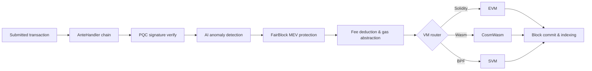

# Vue d'ensemble de l'architecture

QoreChain est un nœud blockchain modulaire composé de trois processus principaux — le nœud de chaîne, le sidecar IA et l'indexeur de blocs — soutenu par une base de données Postgres et surveillé via Prometheus et Grafana. Le mainnet (`qorechain-vladi`, EVM chain ID **9801**) est en service depuis le 7 juin 2026 sur la version de chaîne **v3.1.77**, avec un testnet parallèle (`qorechain-diana`, EVM chain ID **9800**). La chaîne est construite sur le Cosmos SDK v0.53. Le diagramme suivant montre la disposition de haut niveau des composants.

Le cycle de vie des transactions ci-dessous résume comment une transaction soumise circule à travers le nœud — depuis la chaîne de décorateurs AnteHandler (vérifications de sécurité et de frais) jusqu'à l'exécution par la VM et le règlement on-chain :



```
┌────────────────────────────────────────────────────────────────────────────┐
│                            QoreChain Node                                  │
│                                                                            │
│  ┌──────────────────── Virtual Machines ──────────────────────┐           │
│  │  ┌───────┐    ┌──────────┐    ┌───────┐                   │           │
│  │  │  EVM  │    │ CosmWasm │    │  SVM  │                   │           │
│  │  │(Sol.) │◄──►│ (Wasm)   │◄──►│ (BPF) │                   │           │
│  │  └───┬───┘    └────┬─────┘    └───┬───┘                   │           │
│  │      └─────────┬───┘──────────────┘                       │           │
│  │           x/crossvm (bridge)                               │           │
│  └────────────────────────────────────────────────────────────┘           │
│                                                                            │
│  ┌────────────────────── Tokenomics ─────────────────────────┐           │
│  │  ┌──────┐   ┌───────┐   ┌───────────┐                    │           │
│  │  │x/burn│   │x/xqore│   │x/inflation│                    │           │
│  │  │10 ch.│   │lock/  │   │finite     │                    │           │
│  │  │37/30/│   │unlock │   │emission   │                    │           │
│  │  │20/10/│   │PvP    │   │590M       │                    │           │
│  │  │3     │   │       │   │budget     │                    │           │
│  │  └──────┘   └───────┘   └───────────┘                    │           │
│  └────────────────────────────────────────────────────────────┘           │
│                                                                            │
│  ┌──────────── IBC / Bridges ────────────────────────────────┐           │
│  │  ┌──────────┐  ┌──────────┐  ┌───────────┐  ┌──────────┐ │           │
│  │  │x/bridge  │  │x/babylon │  │x/abstract │  │x/gas     │ │           │
│  │  │37 QCB +  │  │BTC re-   │  │ account   │  │abstract. │ │           │
│  │  │8 IBC     │  │staking   │  │session key│  │multi-tok │ │           │
│  │  └────┬─────┘  └────┬─────┘  └───────────┘  └──────────┘ │           │
│  │  QCB Bridge     Babylon IBC   ERC-4337-like   ibc/USDC    │           │
│  │  PQC-signed     BTC finality  social recov.   ibc/ATOM    │           │
│  │  36 ext chains  checkpoint    spending rules  fee convert  │           │
│  │  ┌──────────┐                                              │           │
│  │  │x/fair    │  5-Lane Prioritization: PQC|MEV|AI|Def|Free │           │
│  │  │ block    │  tIBE encrypted mempool framework           │           │
│  │  └──────────┘                                              │           │
│  └────────────────────────────────────────────────────────────┘           │
│                                                                            │
│  ┌──── Rollup Development Kit ───────────────────────────────┐           │
│  │  ┌──────────┐  ┌──────────┐  ┌───────────┐  ┌──────────┐ │           │
│  │  │ x/rdk    │  │Settlement│  │ DA Router │  │ Profiles │ │           │
│  │  │ 4 modes: │  │Optimistic│  │ Native    │  │ defi     │ │           │
│  │  │ opt/zk/  │  │ZK/Based/ │  │ Celestia* │  │ gaming   │ │           │
│  │  │ based/   │  │Sovereign │  │ Both      │  │ nft      │ │           │
│  │  │ sovereign│  │          │  │           │  │ social/  │ │           │
│  │  │          │  │          │  │           │  │ general  │ │           │
│  │  └────┬─────┘  └────┬─────┘  └───────────┘  └──────────┘ │           │
│  │  Bank escrow    Auto-finalize  SHA-256 commit  AI-assisted │           │
│  │  Burn on create EndBlocker     Blob pruning    PRISM sugg. │           │
│  │  → x/multilayer (RegisterSidechain + AnchorState)          │           │
│  └────────────────────────────────────────────────────────────┘           │
│                                                                            │
│  ┌──────────────┐ ┌──────┐ ┌────────────┐ ┌─────┐                       │
│  │x/rlconsensus │ │ x/ai │ │x/reputation│ │x/qca│                       │
│  │  PRISM (RL)  │ │      │ │            │ │     │                       │
│  └──────┬───────┘ └──┬───┘ └────┬──────┘ └──┬──┘                       │
│   PPO MLP         AI Engine   Scoring    CPoS Pools                      │
│   Obs/Action      Fraud Det.  Decay      Bonding                         │
│   Circuit Brk     Fee Opt.    Sigmoid    Slashing                        │
│   Rollup Adv.     TEE/FL                 QDRW Gov                        │
│                                                                            │
│  ┌──────┐ ┌──────────┐                                                   │
│  │x/pqc │ │ x/multi  │                                                   │
│  └──┬───┘ └────┬─────┘                                                   │
│  Dilithium    Layer Router                                                │
│  ML-KEM       Sidechains                                                  │
│  Hybrid Sig   + Rollups                                                   │
│  SHAKE-256                                                                │
│                                                                            │
│  ┌──────┐ ┌───────┐                                                      │
│  │x/svm │ │x/cross│                                                      │
│  └──┬───┘ └───┬───┘                                                      │
│  BPF Exec   CrossVM Msg                                                   │
└────────┬──────┬───────────────────────────────────────┬───────────────────┘
         │      │                                       │
   ┌─────┴─────┐│                              ┌───────┴──────┐
   │libqorepqc ││                              │  Indexer     │
   │(Rust PQC) ││                              │  (Postgres)  │
   └───────────┘│                              └──────────────┘
   ┌───────────┐│  ┌──────────┐
   │libqoresvm ││  │AI Sidecar│
   │(Rust BPF) │└──│ (gRPC)   │
   └───────────┘   └──────────┘
```

## Composants du nœud

QoreChain s'exécute sous la forme de trois processus coopérants, chacun avec son propre module Go et son propre binaire :

| Composant          | Description                                                                                                                                                                                                                                                                                          | Emplacement               |
| ------------------ | ---------------------------------------------------------------------------------------------------------------------------------------------------------------------------------------------------------------------------------------------------------------------------------------------------- | ------------------------- |
| **qorechain-node** | Le nœud blockchain central. Exécute le QoreChain Consensus Engine, exécute tous les modules personnalisés, gère les trois environnements d'exécution VM et expose les points de terminaison RPC, REST, gRPC et JSON-RPC.                                                                              | `qorechain-core/`         |
| **ai-sidecar**     | Un service gRPC qui fournit des capacités d'inférence IA avancées soutenues par le QCAI Backend. Le sidecar gère les requêtes d'inférence qui dépassent la portée de l'agent RL on-chain, telles que l'analyse en langage naturel et la reconnaissance de motifs complexes. Communique avec le nœud via gRPC sur le port 50051. | `qorechain-core/sidecar/` |
| **block-indexer**  | Un écouteur WebSocket qui s'abonne aux nouveaux blocs et transactions à partir du point de terminaison RPC du nœud, analyse les événements et écrit des données structurées dans une base de données Postgres pour une interrogation rapide par les explorateurs et les API.                          | `qorechain-core/indexer/` |

## Ports

| Port  | Protocole      | Service                                                                           |
| ----- | -------------- | --------------------------------------------------------------------------------- |
| 26657 | HTTP/WebSocket | RPC du QoreChain Consensus Engine (blocs, transactions, état du consensus)         |
| 1317  | HTTP           | API REST (points de terminaison de requête, diffusion de transactions)            |
| 9090  | gRPC           | Points de terminaison gRPC de requête et de transaction                           |
| 8545  | HTTP           | EVM JSON-RPC (espaces de noms `eth_`, `web3_`, `net_`, `txpool_`, `qor_`)         |
| 8546  | WebSocket      | EVM JSON-RPC (abonnements WebSocket)                                              |
| 8899  | HTTP           | SVM JSON-RPC (compatible Solana : `getAccountInfo`, `getBalance`, `getSlot`, etc.) |
| 50051 | gRPC           | Sidecar IA (requêtes d'inférence depuis le nœud)                                  |
| 5432  | TCP            | Postgres (stockage de l'indexeur de blocs)                                        |
| 9091  | HTTP           | Métriques Prometheus                                                              |
| 3000  | HTTP           | Tableaux de bord Grafana                                                          |

## Carte des modules

QoreChain enregistre **plus de 45 modules de genesis, dont plus de 20 modules personnalisés**, regroupés par fonction :

**Sécurité**

* `x/pqc` — Cryptographie post-quantique : Dilithium-5, ML-KEM-1024, hybride secp256k1 (ECDSA) + ML-DSA-87, SHAKE-256, agilité algorithmique

**IA et apprentissage automatique**

* `x/ai` — Routage de transactions, détection d'anomalies, détection de fraudes, optimisation des frais, attestation TEE, apprentissage fédéré
* `x/reputation` — Notation de réputation multifactorielle des validateurs avec décroissance temporelle
* `x/rlconsensus` — Agent RL on-chain (PPO MLP), réglage dynamique du consensus, disjoncteur, conseil aux rollups — la couche d'optimisation PRISM

**Consensus**

* `x/qca` — Triple-Pool Composite PoS (RPoS/DPoS/PoS) sur le QoreChain Consensus Engine, courbe de bonding personnalisée, slashing progressif, gouvernance QDRW

**Machines virtuelles**

* `x/vm` — Routage des VM et gestion du cycle de vie
* `x/svm` — Environnement d'exécution SVM : déploiement/exécution BPF, collecte de loyer, RPC compatible Solana
* `x/crossvm` — Communication inter-VM : precompile EVM-CosmWasm + événements asynchrones SVM

**Tokenomics et liquidité**

* `x/burn` — 10 canaux de burn, distribution des frais via EndBlocker (répartition 37/30/20/10/3)
* `x/xqore` — Staking amplifié par la gouvernance : verrouillage/déverrouillage, pénalités de sortie graduées, rebase PvP
* `x/inflation` — Émission à offre fixe à partir d'un budget fini de récompenses de staking selon un calendrier pluriannuel
* `x/amm` — Liquidité on-chain / teneur de marché automatisé

**Ponts et interopérabilité**

* `x/bridge` — 37 configurations QCB (36 chaînes externes + boucle de retour QoreChain) couvrant tous les principaux types de chaînes, attestations signées PQC, disjoncteurs
* `x/babylon` — Restaking BTC via Babylon Protocol, points de contrôle d'epoch
* `x/multilayer` — Gestion des couches de sidechains/paychains/rollups, ancrage d'état

**Extensions de gouvernance et de licence**

* `x/abstractaccount` — Comptes intelligents : multisig, récupération sociale, clés de session, règles de dépenses
* `x/fairblock` — Protection MEV : framework de mempool chiffré à seuil IBE
* `x/gasabstraction` — Paiement de gas multi-jetons : conversion de frais ibc/USDC, ibc/ATOM
* `x/license` — Licence de chaîne

**Rollups**

* `x/rdk` — Rollup Development Kit : 4 modes de règlement (optimistic, zk, based, sovereign), profils prédéfinis, DA native, séquestre bancaire

## Chaîne AnteHandler

Chaque transaction passe par la chaîne de décorateurs suivante avant son exécution. Les décorateurs s'exécutent dans l'ordre ; tout décorateur peut rejeter la transaction.

```
SetUpContext
  → CircuitBreaker
    → PQCVerify
      → PQCHybridVerify
        → AIAnomaly
          → FairBlock
            → SVMComputeBudget
              → SVMDeductFee
                → Extension
                  → ValidateBasic
                    → TxTimeout
                      → Memo
                        → MinGasPrice
                          → ConsumeTxSize
                            → GasAbstraction
                              → DeductFee
                                → SetPubKey
                                  → ValidateSigCount
                                    → SigGasConsume
                                      → SigVerify
                                        → IncrementSequence
```

Les décorateurs clés s'exécutent dans la séquence suivante (chaque décorateur s'exécute dans l'ordre et peut rejeter une transaction) :

1. **PQCVerify** — Module `x/pqc`. Vérifie les signatures Dilithium-5 sur les transactions marquées PQC.
2. **PQCHybridVerify** — Module `x/pqc`. Vérifie les signatures hybrides doubles secp256k1 (ECDSA) + ML-DSA-87.
3. **AIAnomaly** — Module `x/ai`. Exécute la détection d'anomalies par forêt d'isolation et la notation de risque.
4. **FairBlock** — Module `x/fairblock`. Traite les transactions chiffrées tIBE pour la protection MEV.
5. **SVMComputeBudget** — Module `x/svm`. Valide et alloue les unités de calcul pour les programmes SVM.
6. **SVMDeductFee** — Module `x/svm`. Déduit les frais d'exécution spécifiques au SVM.
7. **GasAbstraction** — Module `x/gasabstraction`. Convertit les jetons de frais non natifs (USDC, ATOM) avant déduction.

## Stack Docker Compose

La stack de développement complète s'exécute sous forme d'un déploiement Docker Compose à six services sur un réseau bridge partagé (`qorechain-net`) :

| Service          | Image                      | Objectif                                                      |
| ---------------- | -------------------------- | ------------------------------------------------------------ |
| `qorechain-node` | `qorechain-core:latest`    | Nœud de chaîne avec tous les modules, VM et points de terminaison RPC |
| `ai-sidecar`     | `qorechain-sidecar:latest` | Service d'inférence IA (gRPC + QCAI Backend)                 |
| `block-indexer`  | `qorechain-indexer:latest` | Indexeur de blocs/transactions (WebSocket + Postgres)        |
| `postgres`       | `postgres:16-alpine`       | Base de données pour l'indexeur de blocs                     |
| `prometheus`     | `prom/prometheus:latest`   | Collecte et stockage des métriques                           |
| `grafana`        | `grafana/grafana:latest`   | Tableaux de bord de surveillance et alertes                  |

Démarrer la stack complète :

```bash
docker compose up -d
```

Toutes les données persistantes sont stockées dans des volumes Docker nommés : `node-data`, `postgres-data`, `prometheus-data` et `grafana-data`.

## Liens connexes

* [Architecture multicouche](/architecture/multilayer-architecture) — enregistrement de sidechain et ancrage d'état.
* [Mécanisme de consensus](/architecture/consensus-mechanism) — production de blocs, finalité et slashing.
* [PRISM Consensus Engine](/architecture/prism-consensus-engine) — optimisation des paramètres pilotée par l'IA.
* [Sécurité post-quantique](/architecture/post-quantum-security) — signatures Dilithium-5 à travers toute la stack.
