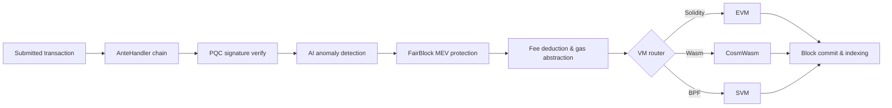

# Vue d'ensemble de l'architecture

QoreChain est un nœud blockchain modulaire composé de trois processus principaux — le nœud de la chaîne, le sidecar IA et l'indexeur de blocs — adossé à une base de données Postgres et surveillé via Prometheus et Grafana. Le mainnet (`qorechain-vladi`, ID de chaîne EVM **9801**) est en production depuis le 7 juin 2026 sur la version de chaîne **v3.1.95**, avec un testnet parallèle (`qorechain-diana`, ID de chaîne EVM **9800**). La chaîne est construite sur Cosmos SDK v0.53. Le diagramme suivant présente l'agencement des composants à haut niveau.

Le cycle de vie de transaction ci-dessous résume la manière dont une transaction soumise traverse le nœud — depuis la chaîne de décorateurs AnteHandler (vérifications de sécurité et de frais) jusqu'à l'exécution sur la VM et au règlement on-chain :


```mermaid
flowchart LR
    Tx[Submitted transaction] --> Ante[AnteHandler chain]
    Ante --> PQC[PQC signature verify]
    PQC --> AI[AI anomaly detection]
    AI --> Fair[FairBlock MEV protection]
    Fair --> Fee[Fee deduction & gas abstraction]
    Fee --> Router{VM router}
    Router -->|Solidity| EVM[EVM]
    Router -->|Wasm| Wasm[CosmWasm]
    Router -->|BPF| SVM[SVM]
    EVM --> Commit[Block commit & indexing]
    Wasm --> Commit
    SVM --> Commit
```

```
┌────────────────────────────────────────────────────────────────────────────┐
│                            QoreChain Node                                  │
│                                                                            │
│  ┌──────────────────── Virtual Machines ──────────────────────┐           │
│  │  ┌───────┐    ┌──────────┐    ┌───────┐                   │           │
│  │  │  EVM  │    │ CosmWasm │    │  SVM  │                   │           │
│  │  │(Sol.) │◄──►│ (Wasm)   │◄──►│ (BPF) │                   │           │
│  │  └───┬───┘    └────┬─────┘    └───┬───┘                   │           │
│  │      └─────────┬───┘──────────────┘                       │           │
│  │           x/crossvm (bridge)                               │           │
│  └────────────────────────────────────────────────────────────┘           │
│                                                                            │
│  ┌────────────────────── Tokenomics ─────────────────────────┐           │
│  │  ┌──────┐   ┌───────┐   ┌───────────┐                    │           │
│  │  │x/burn│   │x/xqore│   │x/inflation│                    │           │
│  │  │10 ch.│   │lock/  │   │finite     │                    │           │
│  │  │37/30/│   │unlock │   │emission   │                    │           │
│  │  │20/10/│   │PvP    │   │590M       │                    │           │
│  │  │3     │   │       │   │budget     │                    │           │
│  │  └──────┘   └───────┘   └───────────┘                    │           │
│  └────────────────────────────────────────────────────────────┘           │
│                                                                            │
│  ┌──────────── IBC / Bridges ────────────────────────────────┐           │
│  │  ┌──────────┐  ┌──────────┐  ┌───────────┐  ┌──────────┐ │           │
│  │  │x/bridge  │  │x/babylon │  │x/abstract │  │x/gas     │ │           │
│  │  │37 QCB +  │  │BTC re-   │  │ account   │  │abstract. │ │           │
│  │  │8 IBC     │  │staking   │  │session key│  │multi-tok │ │           │
│  │  └────┬─────┘  └────┬─────┘  └───────────┘  └──────────┘ │           │
│  │  QCB Bridge     Babylon IBC   ERC-4337-like   ibc/USDC    │           │
│  │  PQC-signed     BTC finality  social recov.   ibc/ATOM    │           │
│  │  36 ext chains  checkpoint    spending rules  fee convert  │           │
│  │  ┌──────────┐                                              │           │
│  │  │x/fair    │  5-Lane Prioritization: PQC|MEV|AI|Def|Free │           │
│  │  │ block    │  tIBE encrypted mempool framework           │           │
│  │  └──────────┘                                              │           │
│  └────────────────────────────────────────────────────────────┘           │
│                                                                            │
│  ┌──── Rollup Development Kit ───────────────────────────────┐           │
│  │  ┌──────────┐  ┌──────────┐  ┌───────────┐  ┌──────────┐ │           │
│  │  │ x/rdk    │  │Settlement│  │ DA Router │  │ Profiles │ │           │
│  │  │ 4 modes: │  │Optimistic│  │ Native    │  │ defi     │ │           │
│  │  │ opt/zk/  │  │ZK/Based/ │  │ Celestia* │  │ gaming   │ │           │
│  │  │ based/   │  │Sovereign │  │ Both      │  │ nft      │ │           │
│  │  │ sovereign│  │          │  │           │  │ social/  │ │           │
│  │  │          │  │          │  │           │  │ general  │ │           │
│  │  └────┬─────┘  └────┬─────┘  └───────────┘  └──────────┘ │           │
│  │  Bank escrow    Auto-finalize  SHA-256 commit  AI-assisted │           │
│  │  Burn on create EndBlocker     Blob pruning    PRISM sugg. │           │
│  │  → x/multilayer (RegisterSidechain + AnchorState)          │           │
│  └────────────────────────────────────────────────────────────┘           │
│                                                                            │
│  ┌──────────────┐ ┌──────┐ ┌────────────┐ ┌─────┐                       │
│  │x/rlconsensus │ │ x/ai │ │x/reputation│ │x/qca│                       │
│  │  PRISM (RL)  │ │      │ │            │ │     │                       │
│  └──────┬───────┘ └──┬───┘ └────┬──────┘ └──┬──┘                       │
│   PPO MLP         AI Engine   Scoring    CPoS Pools                      │
│   Obs/Action      Fraud Det.  Decay      Bonding                         │
│   Circuit Brk     Fee Opt.    Sigmoid    Slashing                        │
│   Rollup Adv.     TEE/FL                 QDRW Gov                        │
│                                                                            │
│  ┌──────┐ ┌──────────┐                                                   │
│  │x/pqc │ │ x/multi  │                                                   │
│  └──┬───┘ └────┬─────┘                                                   │
│  Dilithium    Layer Router                                                │
│  ML-KEM       Sidechains                                                  │
│  Hybrid Sig   + Rollups                                                   │
│  SHAKE-256                                                                │
│                                                                            │
│  ┌──────┐ ┌───────┐                                                      │
│  │x/svm │ │x/cross│                                                      │
│  └──┬───┘ └───┬───┘                                                      │
│  BPF Exec   CrossVM Msg                                                   │
└────────┬──────┬───────────────────────────────────────┬───────────────────┘
         │      │                                       │
   ┌─────┴─────┐│                              ┌───────┴──────┐
   │libqorepqc ││                              │  Indexer     │
   │(Rust PQC) ││                              │  (Postgres)  │
   └───────────┘│                              └──────────────┘
   ┌───────────┐│  ┌──────────┐
   │libqoresvm ││  │AI Sidecar│
   │(Rust BPF) │└──│ (gRPC)   │
   └───────────┘   └──────────┘
```

## Composants du nœud

QoreChain s'exécute sous la forme de trois processus coopérants, chacun disposant de son propre module Go et de son propre binaire :

| Component          | Description                                                                                                                                                                                                                                                                                          | Location                  |
| ------------------ | ---------------------------------------------------------------------------------------------------------------------------------------------------------------------------------------------------------------------------------------------------------------------------------------------------- | ------------------------- |
| **qorechain-node** | Le nœud principal de la blockchain. Exécute le QoreChain Consensus Engine, exécute tous les modules personnalisés, gère les trois runtimes de VM, et expose des points de terminaison RPC, REST, gRPC et JSON-RPC.                                                                                  | `qorechain-core/`         |
| **ai-sidecar**     | Un service gRPC qui fournit des capacités d'inférence IA avancées, adossé au QCAI Backend. Le sidecar traite les requêtes d'inférence qui dépassent le périmètre de l'agent RL on-chain, comme l'analyse du langage naturel et la reconnaissance de motifs complexes. Communique avec le nœud via gRPC sur le port 50051. | `qorechain-core/sidecar/` |
| **block-indexer**  | Un écouteur WebSocket qui s'abonne aux nouveaux blocs et transactions depuis le point de terminaison RPC du nœud, analyse les événements et écrit des données structurées dans une base Postgres pour des requêtes rapides par les explorateurs et les API.                                          | `qorechain-core/indexer/` |

## Ports

| Port  | Protocol       | Service                                                                           |
| ----- | -------------- | --------------------------------------------------------------------------------- |
| 26657 | HTTP/WebSocket | RPC du QoreChain Consensus Engine (blocs, transactions, état du consensus)        |
| 1317  | HTTP           | API REST (points de terminaison de requête, diffusion de transactions)            |
| 9090  | gRPC           | Points de terminaison gRPC pour les requêtes et les transactions                  |
| 8545  | HTTP           | JSON-RPC EVM (espaces de noms `eth_`, `web3_`, `net_`, `txpool_`, `qor_`)          |
| 8546  | WebSocket      | JSON-RPC EVM (abonnements WebSocket)                                              |
| 8899  | HTTP           | JSON-RPC SVM (compatible Solana : `getAccountInfo`, `getBalance`, `getSlot`, etc.) |
| 50051 | gRPC           | Sidecar IA (requêtes d'inférence depuis le nœud)                                  |
| 5432  | TCP            | Postgres (stockage de l'indexeur de blocs)                                        |
| 9091  | HTTP           | Métriques Prometheus                                                              |
| 3000  | HTTP           | Tableaux de bord Grafana                                                          |

## Cartographie des modules

QoreChain enregistre **45+ modules de genèse dont 20+ modules personnalisés**, regroupés par fonction :

**Sécurité**

* `x/pqc` — Cryptographie post-quantique : Dilithium-5, ML-KEM-1024, hybride secp256k1 (ECDSA) + ML-DSA-87, SHAKE-256, agilité algorithmique

**IA et apprentissage automatique**

* `x/ai` — Routage des transactions, détection d'anomalies, détection de fraude, optimisation des frais, attestation TEE, apprentissage fédéré
* `x/reputation` — Score de réputation des validateurs multi-facteurs avec décroissance temporelle
* `x/rlconsensus` — Agent RL on-chain (PPO MLP), ajustement dynamique du consensus, coupe-circuit, conseil pour les rollups — la couche d'optimisation PRISM

**Consensus**

* `x/qca` — PoS composite à triple pool (RPoS/DPoS/PoS) sur le QoreChain Consensus Engine, courbe de bonding personnalisée, slashing progressif, gouvernance QDRW

**Machines virtuelles**

* `x/vm` — Routage des VM et gestion de leur cycle de vie
* `x/svm` — Runtime SVM : déploiement/exécution BPF, collecte de loyer, RPC compatible Solana
* `x/crossvm` — Communication inter-VM : précompilé EVM-CosmWasm + événements asynchrones SVM

**Tokenomics et liquidité**

* `x/burn` — 10 canaux de burn, distribution des frais en EndBlocker (répartition 37/30/20/10/3)
* `x/xqore` — Staking boosté par la gouvernance : verrouillage/déverrouillage, pénalités de sortie graduées, rebase PvP
* `x/inflation` — Émission à offre fixe à partir d'un budget de récompenses de staking fini, selon un calendrier pluriannuel
* `x/amm` — Liquidité on-chain / teneur de marché automatisé

**Ponts et interopérabilité**

* `x/bridge` — 37 configurations QCB (36 chaînes externes + boucle QoreChain) couvrant tous les principaux types de chaînes, attestations signées PQC, coupe-circuits
* `x/babylon` — Restaking BTC via le protocole Babylon, points de contrôle d'époque
* `x/multilayer` — Gestion des couches sidechain/paychain/rollup, ancrage d'état

**Extensions de gouvernance et de licence**

* `x/abstractaccount` — Comptes intelligents : multisig, récupération sociale, clés de session, règles de dépense
* `x/fairblock` — Protection contre le MEV : cadre de mempool chiffré par IBE à seuil
* `x/gasabstraction` — Paiement de gas multi-tokens : conversion des frais ibc/USDC, ibc/ATOM
* `x/license` — Licence de la chaîne

**Rollups**

* `x/rdk` — Rollup Development Kit : 4 modes de règlement (optimistic, zk, based, sovereign), profils prédéfinis, DA native, séquestre bancaire

## Chaîne AnteHandler

Chaque transaction traverse la chaîne de décorateurs suivante avant son exécution. Les décorateurs s'exécutent dans l'ordre ; chaque décorateur peut rejeter la transaction.

```
SetUpContext
  → CircuitBreaker
    → PQCVerify
      → PQCHybridVerify
        → AIAnomaly
          → FairBlock
            → SVMComputeBudget
              → SVMDeductFee
                → Extension
                  → ValidateBasic
                    → TxTimeout
                      → Memo
                        → MinGasPrice
                          → ConsumeTxSize
                            → GasAbstraction
                              → DeductFee
                                → SetPubKey
                                  → ValidateSigCount
                                    → SigGasConsume
                                      → SigVerify
                                        → IncrementSequence
```

Les décorateurs clés s'exécutent dans la séquence suivante (chaque décorateur s'exécute dans l'ordre et peut rejeter une transaction) :

1. **PQCVerify** — Module `x/pqc`. Vérifie les signatures Dilithium-5 sur les transactions marquées PQC.
2. **PQCHybridVerify** — Module `x/pqc`. Vérifie les signatures hybrides doubles secp256k1 (ECDSA) + ML-DSA-87.
3. **AIAnomaly** — Module `x/ai`. Exécute la détection d'anomalies par forêt d'isolement et le calcul du score de risque.
4. **FairBlock** — Module `x/fairblock`. Traite les transactions chiffrées par tIBE pour la protection contre le MEV.
5. **SVMComputeBudget** — Module `x/svm`. Valide et alloue les unités de calcul pour les programmes SVM.
6. **SVMDeductFee** — Module `x/svm`. Déduit les frais d'exécution spécifiques à SVM.
7. **GasAbstraction** — Module `x/gasabstraction`. Convertit les tokens de frais non natifs (USDC, ATOM) avant déduction.

## Pile Docker Compose

La pile de développement complète s'exécute sous forme d'un déploiement Docker Compose à six services sur un réseau bridge partagé (`qorechain-net`) :

| Service          | Image                      | Purpose                                             |
| ---------------- | -------------------------- | --------------------------------------------------- |
| `qorechain-node` | `qorechain-core:latest`    | Nœud de la chaîne avec tous les modules, les VM et les points de terminaison RPC |
| `ai-sidecar`     | `qorechain-sidecar:latest` | Service d'inférence IA (gRPC + QCAI Backend)        |
| `block-indexer`  | `qorechain-indexer:latest` | Indexeur de blocs/transactions (WebSocket + Postgres) |
| `postgres`       | `postgres:16-alpine`       | Base de données pour l'indexeur de blocs            |
| `prometheus`     | `prom/prometheus:latest`   | Collecte et stockage des métriques                  |
| `grafana`        | `grafana/grafana:latest`   | Tableaux de bord de supervision et alertes           |

Démarrer la pile complète :

```bash
docker compose up -d
```

Toutes les données persistantes sont stockées dans des volumes Docker nommés : `node-data`, `postgres-data`, `prometheus-data` et `grafana-data`.

## Voir aussi

* [Architecture multicouche](/architecture/multilayer-architecture) — enregistrement des sidechains et ancrage d'état.
* [Mécanisme de consensus](/architecture/consensus-mechanism) — production de blocs, finalité et slashing.
* [Moteur de consensus PRISM](/architecture/prism-consensus-engine) — optimisation des paramètres pilotée par IA.
* [Sécurité post-quantique](/architecture/post-quantum-security) — signatures Dilithium-5 dans toute la pile.
