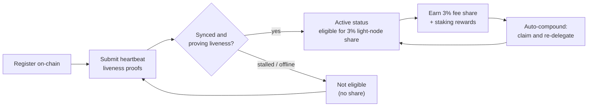

# Récompenses et supervision

Un nœud léger à la fois **gagne des récompenses** et **doit rester en bonne santé** pour continuer à en gagner. Cette page traite de la part de récompense de 3 % réservée aux nœuds légers, du fonctionnement du staking délégué et de l'auto-capitalisation, ainsi que de la supervision du nœud.

## La part de 3 % des récompenses de bloc

La distribution des frais de QoreChain réserve une **part fixe de 3 % aux nœuds légers** qui servent les données du réseau. C'est l'une des cinq destinations de la répartition des récompenses du protocole — validateurs (37 %), brûlé (30 %), trésorerie (20 %), stakers (10 %) et **nœuds légers (3 %)** — appliquée on-chain. Voir [Tokenomics](/architecture/tokenomics) pour la ventilation complète.

Pour être éligible à cette part, un nœud doit être **enregistré on-chain et prouver activement sa vivacité** via des preuves de heartbeat. Un nœud enregistré mais hors ligne ne gagne pas la part. Voir [Enregistrement et licences](/light-node/registration-and-licensing) pour comprendre le fonctionnement de l'enregistrement et des heartbeats.

*Éligibilité aux récompenses : enregistrez-vous on-chain, prouvez votre vivacité via les heartbeats pour atteindre le statut actif, gagnez la part de 3 %, puis capitalisez-la automatiquement dans votre stake.*



## Fonctionnement des récompenses

Au-delà de la part des nœuds légers, le nœud gère le stake délégué et les récompenses de staking qu'il produit. Le comportement est piloté par la section `[delegation]` de `config.toml`.

### Staking délégué avec répartition multi-validateurs

Vous pouvez déléguer sur **plusieurs validateurs** plutôt que de concentrer le stake sur un seul. Le nœud suit chaque délégation et la part de stake attribuée à chaque validateur à l'aide de **poids de répartition** configurables, ce qui vous permet de répartir le risque sur l'ensemble.

### Auto-capitalisation des récompenses

Le nœud peut **percevoir les récompenses et les redéléguer automatiquement** selon un intervalle configurable. Par défaut, l'auto-capitalisation est activée avec un intervalle de `1h`, avec un seuil de récompense minimal (en `uqor`) qui doit s'accumuler avant qu'une perception ne soit déclenchée. La capitalisation transforme les récompenses gagnées en stake supplémentaire sans intervention manuelle.

### Rééquilibrage tenant compte de la réputation

Lorsque le rééquilibrage est activé, le nœud peut **déplacer automatiquement la délégation vers des validateurs de meilleure réputation**, sous réserve d'un score de réputation minimal configurable. Cela maintient le stake actif auprès de validateurs performants plutôt que de le laisser auprès de ceux dont les performances se sont dégradées.

### Inspecter les récompenses et les délégations

L'édition SX expose des commandes pour inspecter cet état :

```bash
lightnode-sx delegation   # current delegations and their split
lightnode-sx rewards      # pending staking rewards (uqor)
lightnode-sx validators   # the bonded validator set
```

Dans l'édition UX, la vue **Delegation** affiche les mêmes informations de délégation et de récompense dans le navigateur.

## Supervision

Maintenir le nœud en bonne santé est ce qui le garde éligible aux récompenses. Trois éléments méritent d'être surveillés.

### Télémétrie

La télémétrie en temps réel couvre les validateurs, le consensus/réseau, le pont (bridge) et la tokenomics, chacun rafraîchi à son propre intervalle (configuré sous `[telemetry]` dans `config.toml`). Depuis la CLI :

```bash
lightnode-sx status    # node and light-client sync status
lightnode-sx network   # recent synced headers and latest height
```

L'édition UX présente les mêmes données en direct dans ses vues **Overview**, **Network**, **Bridge** et **Tokenomics** — voir [Édition UX](/light-node/ux-edition).

### Santé de la synchronisation et du heartbeat

La commande `status` indique l'ID de chaîne, la dernière hauteur de bloc, si la chaîne est en cours de rattrapage, ainsi que la hauteur synchronisée du client léger et son état de synchronisation. Un nœud enregistré, synchronisé et en fonctionnement continue de soumettre des **preuves de vivacité par heartbeat** et reste ainsi éligible à la part de récompense. Ces heartbeats sont produits via un **pipeline de transaction co-signé PQC** (hybride Dilithium-5 / ML-DSA-87), cohérent avec le réglage PQC obligatoire par défaut de la chaîne — voir [Enregistrement et licences](/light-node/registration-and-licensing#pqc-cosigned-heartbeat-pipeline) pour comprendre le fonctionnement du pipeline et activer les heartbeats on-chain. Si `status` indique que le nœud est bloqué ou ne se synchronise pas, il peut être en train d'échouer à prouver sa vivacité — enquêtez avant que l'éligibilité ne soit affectée.

### Santé via l'auto-test

Si vous soupçonnez un problème avec la pile cryptographique, exécutez l'auto-test PQC à tout moment :

```bash
lightnode-sx selftest
```

Il exécute keygen → signature → vérification → détection d'altération (cinq vérifications) et se termine avec un code non nul en cas d'échec. C'est le moyen le plus rapide d'écarter une bibliothèque `libqorepqc` cassée ou manquante lors du diagnostic de problèmes de nœud. Voir [Édition SX](/light-node/sx-edition) pour le détail complet de l'auto-test.

## Pour aller plus loin

- [Enregistrement et licences](/light-node/registration-and-licensing) — s'enregistrer et rester actif.
- [Tokenomics](/architecture/tokenomics) — le modèle complet de récompense et de burn.
