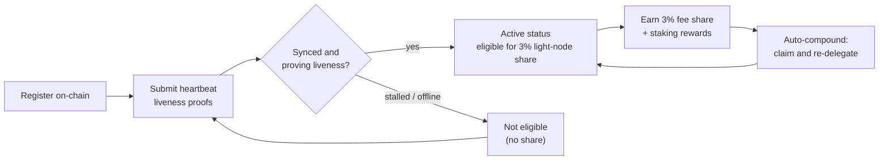

# Récompenses et surveillance

Un light node **gagne des récompenses** tout en devant **rester en bonne santé** pour continuer à les gagner. Cette page couvre la part de 3 % des récompenses de bloc réservée aux light nodes, le fonctionnement du staking délégué et de la capitalisation automatique, ainsi que la surveillance du nœud.

## La part de 3 % des récompenses de bloc

La distribution des frais de QoreChain réserve une part fixe de **3 % aux light nodes** qui servent des données réseau. C'est l'une des cinq destinations de la répartition des récompenses du protocole — validateurs (37 %), brûlés (30 %), trésorerie (20 %), stakers (10 %) et **light nodes (3 %)** — appliquée on-chain. Voir [Tokenomics](/architecture/tokenomics) pour la répartition complète.

Pour être éligible à cette part, un nœud doit remplir trois conditions, vérifiées on-chain plutôt que déclarées par le nœud lui-même : une licence `lightnode_operator` active, un minimum de **1 000 QOR délégués** — comptabilisés comme votre total cumulé sur l'ensemble des validateurs auxquels vous déléguez, et non par validateur — et des frais d'enregistrement on-chain de **1 QOR**. La participation est également plafonnée à l'échelle du réseau à **10 000 light nodes**. Voir [Enregistrement et licences](/light-node/registration-and-licensing) pour le fonctionnement de l'enregistrement et des licences, y compris le statut actuel de l'inscription au programme de récompenses.

Une fois enregistré et délégué, rester éligible revient à rester actif. Un nœud doit maintenir au moins **80 % de disponibilité (uptime)**, et doit continuer à soumettre des preuves de vivacité (heartbeats) sur un intervalle d'environ **1 000 blocs (~39 minutes)**, avec une période de grâce d'environ **100 blocs (~4 minutes)** après un heartbeat manqué avant d'être marqué inactif. Un nœud marqué inactif cesse de gagner la part tant qu'il ne prouve pas à nouveau sa vivacité.

*Éligibilité aux récompenses : détenir une licence on-chain active et le stake délégué minimum, s'enregistrer, puis continuer à prouver sa vivacité via des heartbeats pour rester au-dessus des seuils de disponibilité et d'intervalle de heartbeat qui maintiennent le versement de la part.*


```mermaid
flowchart LR
    A["Register on-chain"] --> B["Submit heartbeat<br/>liveness proofs"]
    B --> C{"Synced and<br/>proving liveness?"}
    C -- "yes" --> D["Active status<br/>eligible for 3% light-node share"]
    C -- "stalled / offline" --> E["Not eligible<br/>(no share)"]
    E --> B
    D --> F["Earn 3% fee share<br/>+ staking rewards"]
    F --> G["Auto-compound:<br/>claim and re-delegate"]
    G --> D
```

## Fonctionnement des récompenses

Au-delà de la part réservée aux light nodes, le nœud gère le stake délégué et les récompenses de staking qu'il produit. Le comportement est piloté par la section `[delegation]` de `config.toml`.

### Staking délégué avec répartition multi-validateurs

Vous pouvez déléguer sur **plusieurs validateurs** plutôt que de concentrer le stake sur un seul. Le nœud suit chaque délégation et la part de stake attribuée à chaque validateur à l'aide de **poids de répartition** configurables, ce qui permet de répartir le risque sur l'ensemble.

### Capitalisation automatique des récompenses

Le nœud peut **réclamer les récompenses et les re-déléguer automatiquement** selon un intervalle configurable. Par défaut, la capitalisation automatique est activée sur un intervalle de `1h`, avec un seuil minimal de récompense (en `uqor`) devant s'accumuler avant qu'une réclamation ne soit déclenchée. La capitalisation transforme les récompenses gagnées en stake supplémentaire sans intervention manuelle.

### Rééquilibrage tenant compte de la réputation

Lorsque le rééquilibrage est activé, le nœud peut **déplacer la délégation vers des validateurs à réputation plus élevée** automatiquement, sous réserve d'un score de réputation minimal configurable. Cela permet de garder le stake actif auprès des validateurs qui performent bien plutôt que de le laisser auprès de ceux dont la performance s'est dégradée.

### Inspection des récompenses et des délégations

L'édition SX expose des commandes pour inspecter cet état :

```bash
lightnode-sx delegation   # current delegations and their split
lightnode-sx rewards      # pending staking rewards (uqor)
lightnode-sx validators   # the bonded validator set
```

Dans l'édition UX, la vue **Delegation** affiche les mêmes informations de délégation et de récompenses dans le navigateur.

## Surveillance

Maintenir le nœud en bonne santé est ce qui le maintient éligible aux récompenses. Trois points méritent d'être surveillés.

### Télémétrie

La télémétrie en temps réel couvre les validateurs, le consensus/réseau, le bridge et la tokenomics, chacun étant actualisé selon son propre intervalle (configuré sous `[telemetry]` dans `config.toml`). Depuis la CLI :

```bash
lightnode-sx status    # node and light-client sync status
lightnode-sx network   # recent synced headers and latest height
```

L'édition UX affiche les mêmes données en direct dans ses vues **Overview**, **Network**, **Bridge** et **Tokenomics** — voir [Édition UX](/light-node/ux-edition).

### Santé de la synchronisation et des heartbeats

La commande `status` indique l'ID de la chaîne, la hauteur de bloc la plus récente, si la chaîne est en train de rattraper son retard, ainsi que la hauteur synchronisée et l'état de synchronisation du light client. Un nœud enregistré, synchronisé et en cours d'exécution continue à soumettre des **preuves de vivacité (heartbeats)** et reste ainsi éligible à la part de récompenses. Ces heartbeats sont produits via un **pipeline de transactions co-signées PQC** (hybride Dilithium-5 / ML-DSA-87), cohérent avec le défaut de la chaîne exigeant la PQC — voir [Enregistrement et licences](/light-node/registration-and-licensing#pqc-cosigned-heartbeat-pipeline) pour le fonctionnement du pipeline et la manière d'activer les heartbeats on-chain. Si `status` indique que le nœud est bloqué ou ne se synchronise pas, il se peut qu'il échoue à prouver sa vivacité — investiguez avant que l'éligibilité ne soit affectée.

### Santé de l'auto-test

Si vous suspectez un problème avec la pile cryptographique, exécutez l'auto-test PQC à tout moment :

```bash
lightnode-sx selftest
```

Il exécute génération de clés → signature → vérification → détection d'altération (cinq vérifications) et se termine avec un code non nul en cas d'échec. C'est le moyen le plus rapide d'écarter un problème avec la pile de signature post-quantique lors du diagnostic des problèmes de nœud. Voir [Édition SX](/light-node/sx-edition) pour le détail complet de l'auto-test.

## Où aller ensuite

- [Enregistrement et licences](/light-node/registration-and-licensing) — s'enregistrer et rester actif.
- [Tokenomics](/architecture/tokenomics) — le modèle complet de récompenses et de burn.
