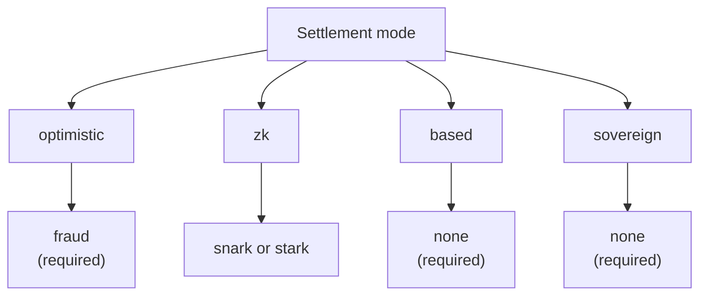

# Présentation des Rollups

Le **Rollup Development Kit (RDK)** de QoreChain — le module `x/rdk` — permet aux développeurs de lancer des rollups spécifiques à une application qui se règlent sur QoreChain. Chaque rollup est un environnement d'exécution indépendant doté de son propre temps de bloc, de sa propre machine virtuelle, de son propre modèle de frais et de son propre séquençage, tout en héritant des garanties de sécurité, de cryptographie post-quantique et de disponibilité des données de QoreChain.

:::caution
Le RDK et la couche de règlement des rollups constituent une capacité en évolution active. Considérez les modes de règlement, les systèmes de preuve, les préréglages et la maturité de chaque fonctionnalité décrits dans cette section comme une intention de conception susceptible de changer, et validez tout déploiement sur le testnet **`qorechain-diana`** avant de cibler le mainnet (**`qorechain-vladi`**, EVM chain ID **9801**, version de chaîne **v3.1.77**).
:::

Pour la référence de module de plus bas niveau — paramètres du module, internes du cycle de vie, intégration du burn et ancrage multicouche — consultez la page **[Rollup Development Kit](/architecture/rollup-development-kit)** dans la section Architecture. Cette section Rollups est le guide pratique orienté développeur : ce qu'est le RDK, quel paradigme choisir, comment déployer, comment fonctionne la disponibilité des données et comment les retraits se règlent de la L2 vers la L1.

---

## Ce que le RDK vous apporte

Un rollup créé via le RDK regroupe quatre aspects configurables :

| Aspect | Ce qu'il contrôle | Options |
| ------- | ---------------- | ------- |
| **Mode de règlement** | Comment les transitions d'état du rollup sont vérifiées et finalisées sur QoreChain | `optimistic`, `zk`, `based`, `sovereign` |
| **Système de preuve** | Le mécanisme cryptographique ou économique qui soutient le règlement | `fraud`, `snark`, `stark`, `none` |
| **Mode du séquenceur** | Qui ordonne les transactions avant qu'elles ne soient réglées | `dedicated`, `shared`, `based` |
| **Disponibilité des données** | Où les données de transaction sont publiées pour que quiconque puisse reconstruire l'état | `native`, `celestia`, `both` |

Chaque rollup est enregistré avec un `rollup-id` unique, adossé à une caution en QOR, et se voit attribuer un statut de cycle de vie (`pending`, `active`, `paused`, `stopped`). Consultez **[Déployer un Rollup](/rollups/deploying-a-rollup)** pour le flux complet de création et de cycle de vie.

---

## Ce qui distingue le RDK de QoreChain

Au-delà des fonctionnalités de base de tout kit de rollup, le RDK de QoreChain expose trois capacités qui dépendent de la Layer 1 de QoreChain et qu'aucun kit construit sur une couche de base non post-quantique et non IA ne peut offrir — auxquelles s'ajoute un auto-contestataire de tour de guet (watchtower). Le RDK est disponible en cinq langages (TypeScript, Python, Go, Rust, Java), tous actuellement en **v0.4.0**.

| Différenciateur | Ce qu'il fait |
| -------------- | ------------ |
| **[Reçus de règlement résistants au quantique](/rollups/settlement-receipts)** | Transforment un ancrage de règlement en un reçu portable vérifiable **entièrement hors ligne** sous une signature post-quantique (ML-DSA-87 / Dilithium-5) — octet par octet sur les cinq clients. |
| **[QCAI Rollup Copilot](/rollups/qcai-copilot)** | Agrège les services d'IA/RL on-chain de QoreChain (agent de politique de frais, recommandations, enquêtes de fraude, disjoncteurs) en un avis consultatif en langage clair et en lecture seule pour un rollup. |
| **[Appels inter-VM Multi-VM](/rollups/multi-vm)** | Appellent un contrat CosmWasm depuis un contrat de rollup EVM/Solidity via le précompilé inter-VM (`0x…0901`). |
| **[Watchtower](/rollups/watchtower)** | Un cadre d'auto-contestation pour les rollups optimistes qui fait remonter les nouveaux lots et les échéances de la fenêtre de contestation, et conteste les lots invalides au regard de votre prédicat de validité. |

Consultez **[Pourquoi le RDK QoreChain](/rollups/why)** pour la justification complète et des exemples de code.

---

## Les quatre paradigmes de règlement

Le RDK QoreChain prend en charge quatre modes de règlement distincts, chacun avec des hypothèses de confiance, des caractéristiques de finalité et des exigences de preuve différentes. La combinaison du mode de règlement et du système de preuve est validée on-chain — un appariement incompatible est rejeté à la création. Le diagramme ci-dessous associe chaque mode de règlement à son système de preuve valide.

### Optimistic

Les rollups optimistes supposent par défaut que les lots soumis sont valides et s'appuient sur des **preuves de fraude** pour la résolution des litiges.

* **Système de preuve** : `fraud` — preuves de fraude interactives
* **Séquenceur** : `dedicated` ou `shared`
* **Finalité** : différée jusqu'à l'expiration d'une fenêtre de contestation configurable sans contestation réussie
* **Litiges** : quiconque peut soumettre une contestation par preuve de fraude contre un lot soumis pendant la fenêtre ; une contestation réussie rejette le lot

### ZK (Zero-Knowledge)

Les rollups ZK attachent une preuve de validité cryptographique à chaque lot, prouvant l'exactitude de la transition d'état sans réexécution.

* **Système de preuve** : `snark` (preuves succinctes) ou `stark` (preuves transparentes, sans configuration de confiance)
* **Séquenceur** : `dedicated` ou `shared`
* **Finalité** : à la vérification d'une preuve valide — aucune fenêtre de contestation requise
* **Maturité** : la vérification ZK et STARK est encore en cours de maturation. Considérez le règlement ZK comme n'étant pas encore durci pour la production et validez-le sur le testnet. Consultez **[ZK / STARK & Retraits](/rollups/zk-stark-withdrawals)** pour les détails.

### Based

Les rollups based délèguent le séquençage des transactions aux proposeurs QoreChain (L1), héritant de la vivacité et de la résistance à la censure de la chaîne hôte.

* **Système de preuve** : `none` — les proposeurs L1 sont la source de vérité de l'ordonnancement
* **Séquenceur** : `based` (requis — imposé par la validation on-chain)
* **Finalité** : suit la confirmation de la chaîne hôte
* **Compromis** : le modèle opérationnel le plus simple, puisque les validateurs QoreChain gèrent le séquençage, au prix du contrôle de la latence offert par un séquenceur dédié

### Sovereign

Les rollups souverains exécutent leur propre consensus et s'auto-séquencent. Ils ancrent leur état sur QoreChain pour la vérifiabilité mais ne dépendent pas de la chaîne hôte pour la finalité.

* **Système de preuve** : `none`
* **Séquenceur** : auto-géré par le rollup
* **Finalité** : indépendante — déterminée par le consensus propre du rollup
* **Ancrage de l'état** : les racines d'état sont publiées sur QoreChain pour la transparence, mais la chaîne hôte ne les impose pas

---

## Compatibilité système de preuve

Le mode de règlement contraint les systèmes de preuve valides. Ces appariements sont imposés lorsqu'un rollup est créé.

| Mode de règlement | `fraud` | `snark` | `stark` | `none` |
| --------------- | :-----: | :-----: | :-----: | :----: |
| **optimistic**  | Requis | — | — | — |
| **zk**          | — | Pris en charge | Pris en charge | — |
| **based**       | — | — | — | Requis |
| **sovereign**   | — | — | — | Requis |

---

## Modes du séquenceur

Le séquenceur détermine qui ordonne les transactions au sein d'un bloc de rollup avant le règlement.

| Mode | Qui séquence | Notes |
| ---- | ------------- | ----- |
| **`dedicated`** | Une unique adresse d'opérateur désignée | Latence la plus faible ; nécessite de faire confiance à l'opérateur pour la vivacité et l'ordonnancement équitable |
| **`shared`** | Un ensemble de séquenceurs partagé | Ordonnancement réparti sur l'ensemble ; surcoût de coordination légèrement plus élevé |
| **`based`** | Proposeurs L1 de QoreChain | Hérite de la sécurité des validateurs de la chaîne hôte et de la résistance à la censure ; requis pour le règlement `based` |

---

## Choisir un paradigme

| Si vous voulez... | Envisagez |
| -------------- | -------- |
| La configuration opérationnelle la plus simple, avec les validateurs QoreChain qui séquencent | **based** |
| Une finalité rapide avec des garanties cryptographiques (en maturation) | **zk** (`snark` / `stark`) |
| Un modèle bien compris avec résolution économique des litiges | **optimistic** (`fraud`) |
| Une indépendance totale avec votre propre consensus, ancré pour la vérifiabilité | **sovereign** |

Vous ne savez pas par où commencer ? Le RDK fournit des **profils préréglés** qui regroupent ces choix pour les catégories d'applications courantes — consultez **[Profils préréglés](/rollups/preset-profiles)** — ainsi qu'une requête `suggest-profile` qui en recommande un à partir d'une description en langage clair de votre cas d'usage.

Pour les développeurs, le RDK est également fourni sous la forme du SDK TypeScript public **`@qorechain/rdk`** ainsi que du générateur de structure **`create-qorechain-rollup`**, qui pilotent le même module on-chain depuis le code — consultez **[Déployer un Rollup](/rollups/deploying-a-rollup#deploy-with-the-typescript-rdk-qorechainrdk)**.

## Connexes

* [Déployer un Rollup](/rollups/deploying-a-rollup) — lancez un rollup depuis la CLI ou le RDK TypeScript.
* [Profils préréglés](/rollups/preset-profiles) — des ensembles en un clic pour les catégories d'applications courantes.
* [Disponibilité des données](/rollups/data-availability) — le routeur DA natif et le stockage de blobs.
* [Retraits ZK / STARK](/rollups/zk-stark-withdrawals) — les flux de retrait adossés à des preuves.
