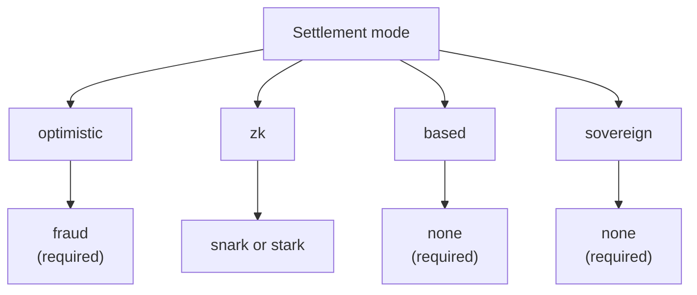

# Aperçu des Rollups

Le **Rollup Development Kit (RDK)** de QoreChain — le module `x/rdk` — permet aux développeurs de lancer des rollups spécifiques à une application qui se règlent sur QoreChain. Chaque rollup est un environnement d'exécution indépendant avec son propre temps de bloc, sa propre machine virtuelle, son propre modèle de frais et son propre séquencement, tout en héritant des garanties de sécurité, de cryptographie post-quantique et de disponibilité des données de QoreChain.

:::caution
Le RDK et la couche de règlement des rollups constituent une capacité en évolution active. Considérez les modes de règlement, les systèmes de preuve, les préréglages et le niveau de maturité par fonctionnalité décrits dans cette section comme une intention de conception susceptible d'évoluer, et validez tout déploiement sur le testnet **`qorechain-diana`** avant de cibler le mainnet (**`qorechain-vladi`**, EVM chain ID **9801**, version de la chaîne **v3.1.92**).
:::

Pour la référence de bas niveau du module — paramètres du module, éléments internes du cycle de vie, intégration du burn et ancrage multicouche — voir la page **[Rollup Development Kit](/architecture/rollup-development-kit)** dans la section Architecture. Cette section Rollups est le guide pratique destiné aux développeurs : ce qu'est le RDK, quel paradigme choisir, comment déployer, comment fonctionne la disponibilité des données, et comment les retraits se règlent du L2 vers le L1.

---

## Ce que le RDK vous apporte

Un rollup créé via le RDK regroupe quatre aspects configurables :

| Aspect | Ce qu'il contrôle | Options |
| ------- | ---------------- | ------- |
| **Mode de règlement** | Comment les transitions d'état du rollup sont vérifiées et finalisées sur QoreChain | `optimistic`, `zk`, `based`, `sovereign` |
| **Système de preuve** | Le mécanisme cryptographique ou économique garantissant le règlement | `fraud`, `snark`, `stark`, `none` |
| **Mode de séquenceur** | Qui ordonne les transactions avant leur règlement | `dedicated`, `shared`, `based` |
| **Disponibilité des données** | Où les données de transaction sont publiées afin que quiconque puisse reconstruire l'état | `native`, `celestia`, `both` |

Chaque rollup est enregistré avec un `rollup-id` unique, garanti par une caution de stake en QOR, et se voit attribuer un statut de cycle de vie (`pending`, `active`, `paused`, `stopped`). Voir **[Déployer un rollup](/rollups/deploying-a-rollup)** pour le flux complet de création et de cycle de vie.

---

## Ce qui distingue le RDK de QoreChain

Au-delà des fonctionnalités standard de tout kit de rollup, le RDK de QoreChain expose trois capacités qui dépendent de la Layer 1 de QoreChain et qu'aucun kit construit sur une couche de base non post-quantique et sans IA ne peut offrir — plus un auto-challenger watchtower. Le RDK est livré en cinq langages (TypeScript, Python, Go, Rust, Java), alignés en version sur **v0.4.4** sur npm, PyPI et Maven Central (sur crates.io, installez la dernière version publiée ou compilez depuis le dépôt). Depuis la v0.4.2, les préréglages `mainnet` et `testnet` intègrent directement les points de terminaison publics `qore.host`, de sorte que `createRdkClient({ network })` accède à la chaîne sans configuration manuelle de point de terminaison.

| Différenciateur | Ce qu'il fait |
| -------------- | ------------ |
| **[Reçus de règlement à sécurité quantique](/rollups/settlement-receipts)** | Transforme un ancrage de règlement en un reçu portable, vérifiable **entièrement hors ligne** sous une signature post-quantique (ML-DSA-87 / Dilithium-5) — identique au bit près sur les cinq clients. |
| **[QCAI Rollup Copilot](/rollups/qcai-copilot)** | Regroupe les services d'IA/RL on-chain de QoreChain (agent de politique de frais, recommandations, enquêtes anti-fraude, coupe-circuits) en un avis consultatif en lecture seule et en langage clair pour un rollup donné. |
| **[Appels cross-VM Multi-VM](/rollups/multi-vm)** | Appelle un contrat CosmWasm depuis un contrat de rollup EVM/Solidity via le précompilé cross-VM (`0x…0901`). |
| **[Watchtower](/rollups/watchtower)** | Un framework d'auto-challenger pour les rollups optimistes qui signale les nouveaux batches et les échéances de fenêtre de contestation, et conteste les batches invalides selon votre prédicat de validité. |

Voir **[Pourquoi le RDK QoreChain](/rollups/why)** pour la justification complète et des exemples de code.

---

## Les quatre paradigmes de règlement

Le RDK QoreChain prend en charge quatre modes de règlement distincts, chacun avec des hypothèses de confiance, des caractéristiques de finalité et des exigences de preuve différentes. La combinaison du mode de règlement et du système de preuve est validée on-chain — un appariement incompatible est rejeté à la création. Le diagramme ci-dessous met en correspondance chaque mode de règlement avec son système de preuve valide.

```mermaid
flowchart TD
    S["Settlement mode"]
    S --> O["optimistic"]
    S --> Z["zk"]
    S --> BA["based"]
    S --> SV["sovereign"]
    O --> OF["fraud<br/>(required)"]
    Z --> ZS["snark or stark"]
    BA --> BN["none<br/>(required)"]
    SV --> SN["none<br/>(required)"]
```

### Optimistic

Les rollups optimistes considèrent par défaut que les batches soumis sont valides et s'appuient sur les **preuves de fraude** (fraud proofs) pour la résolution des litiges.

* **Système de preuve** : `fraud` — preuves de fraude interactives
* **Séquenceur** : `dedicated` ou `shared`
* **Finalité** : Différée jusqu'à l'expiration d'une fenêtre de contestation configurable sans contestation réussie
* **Litiges** : Quiconque peut soumettre une contestation par preuve de fraude contre un batch soumis dans la fenêtre ; une contestation réussie rejette le batch

### ZK (Zero-Knowledge)

Les rollups ZK associent une preuve cryptographique de validité à chaque batch, prouvant la correction de la transition d'état sans réexécution.

* **Système de preuve** : `snark` (preuves succinctes) ou `stark` (preuves transparentes, sans configuration de confiance)
* **Séquenceur** : `dedicated` ou `shared`
* **Finalité** : Dès la vérification d'une preuve valide — aucune fenêtre de contestation requise
* **Maturité** : La vérification ZK et STARK est encore en cours de maturation. Considérez le règlement ZK comme n'étant pas encore éprouvé pour la production et validez-le sur le testnet. Voir **[ZK / STARK et retraits](/rollups/zk-stark-withdrawals)** pour plus de détails.

### Based

Les rollups Based délèguent le séquencement des transactions aux proposeurs de QoreChain (L1), héritant ainsi de la vivacité et de la résistance à la censure de la chaîne hôte.

* **Système de preuve** : `none` — les proposeurs L1 sont la source de vérité pour l'ordonnancement
* **Séquenceur** : `based` (obligatoire — imposé par la validation on-chain)
* **Finalité** : Suit la confirmation de la chaîne hôte
* **Compromis** : Modèle opérationnel le plus simple, puisque les validateurs QoreChain gèrent le séquencement, au prix du contrôle de latence d'un séquenceur dédié

### Sovereign

Les rollups Sovereign exécutent leur propre consensus et s'auto-séquencent. Ils ancrent leur état sur QoreChain à des fins de vérifiabilité, mais ne dépendent pas de la chaîne hôte pour la finalité.

* **Système de preuve** : `none`
* **Séquenceur** : autogéré par le rollup
* **Finalité** : Indépendante — déterminée par le consensus propre du rollup
* **Ancrage d'état** : Les racines d'état sont publiées sur QoreChain à des fins de transparence, mais la chaîne hôte ne les impose pas

---

## Compatibilité des systèmes de preuve

Le mode de règlement détermine les systèmes de preuve valides. Ces appariements sont imposés lors de la création d'un rollup.

| Mode de règlement | `fraud` | `snark` | `stark` | `none` |
| --------------- | :-----: | :-----: | :-----: | :----: |
| **optimistic**  | Obligatoire | — | — | — |
| **zk**          | — | Pris en charge | Pris en charge | — |
| **based**       | — | — | — | Obligatoire |
| **sovereign**   | — | — | — | Obligatoire |

---

## Modes de séquenceur

Le séquenceur détermine qui ordonne les transactions au sein d'un bloc de rollup avant le règlement.

| Mode | Qui séquence | Notes |
| ---- | ------------- | ----- |
| **`dedicated`** | Une seule adresse d'opérateur désignée | Latence la plus faible ; nécessite de faire confiance à l'opérateur pour la vivacité et l'équité de l'ordonnancement |
| **`shared`** | Un ensemble de séquenceurs partagé | Ordonnancement réparti sur l'ensemble ; surcharge de coordination légèrement plus élevée |
| **`based`** | Proposeurs L1 de QoreChain | Hérite de la sécurité des validateurs et de la résistance à la censure de la chaîne hôte ; requis pour le règlement `based` |

---

## Choisir un paradigme

| Si vous voulez... | Envisagez |
| -------------- | -------- |
| La configuration opérationnelle la plus simple, avec le séquencement assuré par les validateurs QoreChain | **based** |
| Une finalité rapide avec des garanties cryptographiques (en cours de maturation) | **zk** (`snark` / `stark`) |
| Un modèle bien maîtrisé avec résolution économique des litiges | **optimistic** (`fraud`) |
| Une indépendance totale avec votre propre consensus, ancré à des fins de vérifiabilité | **sovereign** |

Vous ne savez pas par où commencer ? Le RDK propose des **profils préréglés** qui regroupent ces choix pour les catégories d'applications courantes — voir **[Profils préréglés](/rollups/preset-profiles)** — ainsi qu'une requête `suggest-profile` qui en recommande un à partir d'une description en langage clair de votre cas d'usage.

Pour les développeurs, le RDK est également disponible sous forme de SDK TypeScript public **`@qorechain/rdk`**, accompagné du générateur de projet **`create-qorechain-rollup`**, qui pilotent tous deux le même module on-chain depuis le code — voir **[Déployer un rollup](/rollups/deploying-a-rollup#deploy-with-the-typescript-rdk-qorechainrdk)**.

## Voir aussi

* [Déployer un rollup](/rollups/deploying-a-rollup) — lancez un rollup depuis la CLI ou le RDK TypeScript.
* [Profils préréglés](/rollups/preset-profiles) — des configurations en un clic pour les catégories d'applications courantes.
* [Disponibilité des données](/rollups/data-availability) — le routeur DA natif et le stockage de blobs.
* [Retraits ZK / STARK](/rollups/zk-stark-withdrawals) — des flux de retrait garantis par preuve.
