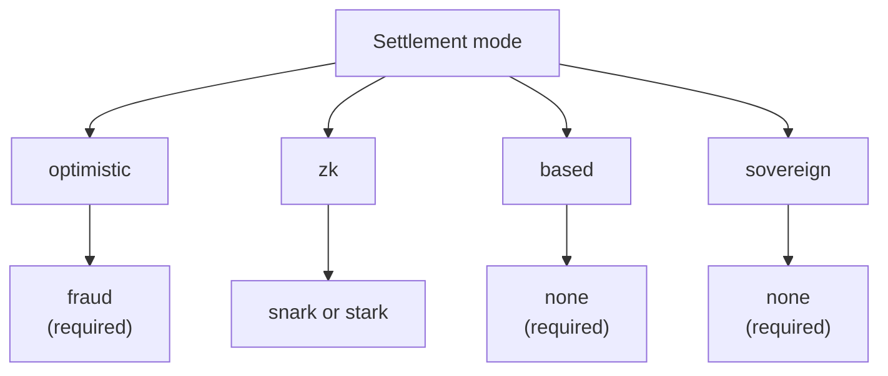

# Présentation des Rollups

Le **Rollup Development Kit (RDK)** de QoreChain — le module `x/rdk` — permet aux développeurs de lancer des rollups spécifiques à une application qui se règlent sur QoreChain. Chaque rollup est un environnement d'exécution indépendant doté de son propre temps de bloc, de sa propre machine virtuelle, de son propre modèle de frais et de son propre séquençage, tout en héritant des garanties de sécurité, de cryptographie post-quantique et de disponibilité des données de QoreChain.

:::caution
Le RDK et la couche de règlement des rollups constituent une capacité en évolution active. Considérez les modes de règlement, les systèmes de preuve, les presets et la maturité de chaque fonctionnalité décrits dans cette section comme une intention de conception susceptible d'évoluer, et validez tout déploiement sur le testnet **`qorechain-diana`** avant de viser le mainnet (**`qorechain-vladi`**, chain ID EVM **9801**, version de la chaîne **v3.1.85**).
:::

Pour la référence de plus bas niveau du module — paramètres du module, mécanismes internes du cycle de vie, intégration du burn et ancrage multicouche — consultez la page **[Rollup Development Kit](/architecture/rollup-development-kit)** de la section Architecture. Cette section Rollups est le guide pratique destiné aux développeurs : ce qu'est le RDK, quel paradigme choisir, comment déployer, comment fonctionne la disponibilité des données et comment les retraits se règlent du L2 vers le L1.

---

## Ce que le RDK vous apporte

Un rollup créé via le RDK regroupe quatre aspects configurables :

| Aspect | Ce qu'il contrôle | Options |
| ------- | ---------------- | ------- |
| **Mode de règlement** | Comment les transitions d'état du rollup sont vérifiées et finalisées sur QoreChain | `optimistic`, `zk`, `based`, `sovereign` |
| **Système de preuve** | Le mécanisme cryptographique ou économique qui sous-tend le règlement | `fraud`, `snark`, `stark`, `none` |
| **Mode de séquenceur** | Qui ordonne les transactions avant leur règlement | `dedicated`, `shared`, `based` |
| **Disponibilité des données** | Où les données de transaction sont publiées afin que quiconque puisse reconstruire l'état | `native`, `celestia`, `both` |

Chaque rollup est enregistré avec un `rollup-id` unique, adossé à une caution en QOR et doté d'un statut de cycle de vie (`pending`, `active`, `paused`, `stopped`). Consultez **[Déployer un Rollup](/rollups/deploying-a-rollup)** pour le flux complet de création et de cycle de vie.

---

## Ce qui distingue le RDK de QoreChain

Au-delà des fonctionnalités de base de tout kit de rollup, le RDK de QoreChain expose trois capacités qui reposent sur la couche 1 de QoreChain et qu'aucun kit construit sur une couche de base ni post-quantique ni dotée d'IA ne peut offrir — plus un auto-challenger de type watchtower. Le RDK est publié en cinq langages (TypeScript, Python, Go, Rust, Java), alignés sur la version **v0.4.4** sur npm, PyPI et Maven Central (sur crates.io, installez la dernière version publiée ou compilez depuis le dépôt). Depuis la v0.4.2, les presets `mainnet` et `testnet` intègrent d'origine les endpoints publics `qore.host`, de sorte que `createRdkClient({ network })` atteint la chaîne sans aucune configuration manuelle d'endpoint.

| Différenciateur | Ce qu'il fait |
| -------------- | ------------ |
| **[Reçus de règlement résistants au quantique](/rollups/settlement-receipts)** | Transforme une ancre de règlement en un reçu portable vérifiable **entièrement hors ligne** sous une signature post-quantique (ML-DSA-87 / Dilithium-5) — identique octet par octet dans les cinq clients. |
| **[QCAI Rollup Copilot](/rollups/qcai-copilot)** | Agrège les services on-chain d'IA/RL de QoreChain (agent de politique de frais, recommandations, investigations de fraude, coupe-circuits) en un avis consultatif en langage clair, en lecture seule, pour un rollup donné. |
| **[Appels inter-VM multi-VM](/rollups/multi-vm)** | Appelez un contrat CosmWasm depuis un contrat de rollup EVM/Solidity via la precompile inter-VM (`0x…0901`). |
| **[Watchtower](/rollups/watchtower)** | Un framework d'auto-challenger pour rollups optimistes qui met en évidence les nouveaux batches et les échéances de fenêtre de contestation, et conteste les batches invalides selon votre prédicat de validité. |

Consultez **[Pourquoi le RDK QoreChain](/rollups/why)** pour la justification complète et des exemples de code.

---

## Les quatre paradigmes de règlement

Le RDK QoreChain prend en charge quatre modes de règlement distincts, chacun avec des hypothèses de confiance, des caractéristiques de finalité et des exigences de preuve différentes. La combinaison du mode de règlement et du système de preuve est validée on-chain — un appariement incompatible est rejeté à la création. Le diagramme ci-dessous associe chaque mode de règlement à son système de preuve valide.

```mermaid
flowchart TD
    S["Settlement mode"]
    S --> O["optimistic"]
    S --> Z["zk"]
    S --> BA["based"]
    S --> SV["sovereign"]
    O --> OF["fraud<br/>(required)"]
    Z --> ZS["snark or stark"]
    BA --> BN["none<br/>(required)"]
    SV --> SN["none<br/>(required)"]
```

### Optimistic

Les rollups optimistes supposent par défaut que les batches soumis sont valides et s'appuient sur des **preuves de fraude** pour la résolution des litiges.

* **Système de preuve** : `fraud` — preuves de fraude interactives
* **Séquenceur** : `dedicated` ou `shared`
* **Finalité** : différée jusqu'à l'expiration d'une fenêtre de contestation configurable sans contestation aboutie
* **Litiges** : quiconque peut soumettre une contestation par preuve de fraude contre un batch soumis pendant la fenêtre ; une contestation aboutie entraîne le rejet du batch

### ZK (Zero-Knowledge)

Les rollups ZK joignent une preuve de validité cryptographique à chaque batch, prouvant la correction de la transition d'état sans ré-exécution.

* **Système de preuve** : `snark` (preuves succinctes) ou `stark` (preuves transparentes, sans trusted setup)
* **Séquenceur** : `dedicated` ou `shared`
* **Finalité** : dès la vérification d'une preuve valide — aucune fenêtre de contestation requise
* **Maturité** : la vérification ZK et STARK est encore en cours de maturation. Considérez le règlement ZK comme n'étant pas encore éprouvé pour la production et validez-le sur testnet. Consultez **[ZK / STARK et retraits](/rollups/zk-stark-withdrawals)** pour les détails.

### Based

Les rollups based délèguent le séquençage des transactions aux proposeurs de QoreChain (L1), héritant ainsi de la vivacité et de la résistance à la censure de la chaîne hôte.

* **Système de preuve** : `none` — les proposeurs L1 sont la source de vérité de l'ordonnancement
* **Séquenceur** : `based` (requis — imposé par la validation on-chain)
* **Finalité** : suit la confirmation de la chaîne hôte
* **Compromis** : le modèle opérationnel le plus simple, puisque les validateurs QoreChain gèrent le séquençage, au prix du contrôle de latence qu'offre un séquenceur dédié

### Sovereign

Les rollups souverains exécutent leur propre consensus et s'auto-séquencent. Ils ancrent leur état sur QoreChain à des fins de vérifiabilité, mais ne dépendent pas de la chaîne hôte pour la finalité.

* **Système de preuve** : `none`
* **Séquenceur** : autogéré par le rollup
* **Finalité** : indépendante — déterminée par le consensus propre du rollup
* **Ancrage d'état** : les racines d'état sont publiées sur QoreChain pour la transparence, mais la chaîne hôte ne les fait pas respecter

---

## Compatibilité des systèmes de preuve

Le mode de règlement restreint les systèmes de preuve valides. Ces appariements sont imposés à la création d'un rollup.

| Mode de règlement | `fraud` | `snark` | `stark` | `none` |
| --------------- | :-----: | :-----: | :-----: | :----: |
| **optimistic**  | Requis | — | — | — |
| **zk**          | — | Pris en charge | Pris en charge | — |
| **based**       | — | — | — | Requis |
| **sovereign**   | — | — | — | Requis |

---

## Modes de séquenceur

Le séquenceur détermine qui ordonne les transactions au sein d'un bloc de rollup avant le règlement.

| Mode | Qui séquence | Remarques |
| ---- | ------------- | ----- |
| **`dedicated`** | Une seule adresse d'opérateur désignée | Latence la plus faible ; exige de faire confiance à l'opérateur pour la vivacité et l'ordonnancement équitable |
| **`shared`** | Un ensemble de séquenceurs partagé | Ordonnancement réparti sur l'ensemble ; surcoût de coordination légèrement plus élevé |
| **`based`** | Les proposeurs L1 de QoreChain | Hérite de la sécurité des validateurs de la chaîne hôte et de la résistance à la censure ; requis pour le règlement `based` |

---

## Choisir un paradigme

| Si vous voulez... | Envisagez |
| -------------- | -------- |
| La configuration opérationnelle la plus simple, avec le séquençage assuré par les validateurs QoreChain | **based** |
| Une finalité rapide avec des garanties cryptographiques (en cours de maturation) | **zk** (`snark` / `stark`) |
| Un modèle éprouvé avec résolution économique des litiges | **optimistic** (`fraud`) |
| Une indépendance totale avec votre propre consensus, ancré pour la vérifiabilité | **sovereign** |

Vous ne savez pas par où commencer ? Le RDK fournit des **profils presets** qui regroupent ces choix pour les catégories d'applications courantes — consultez **[Profils Presets](/rollups/preset-profiles)** — ainsi qu'une requête `suggest-profile` qui en recommande un à partir d'une description en langage clair de votre cas d'usage.

Pour les développeurs, le RDK est également disponible sous la forme du SDK TypeScript public **`@qorechain/rdk`** ainsi que du scaffolder **`create-qorechain-rollup`**, qui pilotent le même module on-chain depuis du code — consultez **[Déployer un Rollup](/rollups/deploying-a-rollup#deploy-with-the-typescript-rdk-qorechainrdk)**.

## Voir aussi

* [Déployer un Rollup](/rollups/deploying-a-rollup) — lancez un rollup depuis la CLI ou le RDK TypeScript.
* [Profils Presets](/rollups/preset-profiles) — des bundles en un clic pour les catégories d'applications courantes.
* [Disponibilité des données](/rollups/data-availability) — le routeur DA natif et le stockage de blobs.
* [Retraits ZK / STARK](/rollups/zk-stark-withdrawals) — flux de retrait adossés à des preuves.
