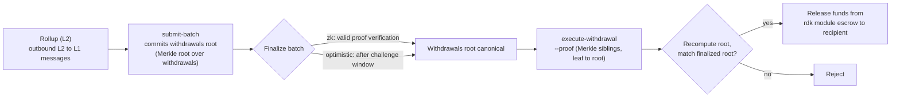

# ZK / STARK et retraits

Cette page couvre deux sujets connexes : les **systèmes de preuve ZK** (`snark` et `stark`) utilisés par les rollups réglés en ZK, et le **flux de retrait L2 → L1** qui ramène des fonds d'un rollup vers QoreChain une fois qu'un lot est finalisé.

:::caution
La vérification ZK et STARK est une partie du RDK en pleine maturation. Considérez les systèmes de preuve et le flux de retrait décrits ici comme une intention de conception, validez sur le testnet **`qorechain-diana`**, et ne présumez pas encore de garanties cryptographiques durcies pour la production sur le mainnet.
:::

---

## Systèmes de preuve ZK

Un rollup réglé en ZK (mode de règlement `zk`) attache une preuve de validité à chaque lot de règlement, prouvant que la transition d'état est correcte sans réexécuter les transactions du rollup. Le règlement ZK prend en charge deux systèmes de preuve :

| Système de preuve | Caractéristiques |
| ------------ | --------------- |
| **`snark`** | Preuves succinctes |
| **`stark`** | Preuves transparentes — pas de configuration de confiance |

Le mode de règlement `zk` requiert l'un de `snark` ou `stark` ; l'appariement est imposé on-chain lors de la création du rollup. À l'inverse, le règlement `optimistic` utilise le système de preuve `fraud`, et les règlements `based` et `sovereign` utilisent `none`. Consultez la **[Vue d'ensemble des rollups](/rollups/overview)** pour la matrice de compatibilité complète.

### Finalité

Contrairement aux rollups optimistes — qui attendent la fin d'une fenêtre de contestation par preuve de fraude — un lot ZK peut être finalisé sur **vérification d'une preuve valide**, sans fenêtre de litige. C'est le compromis fondamental du règlement ZK : une finalité plus forte et plus rapide en échange du coût et de la complexité de la génération des preuves.

### Maturité

La vérification des preuves ZK et STARK est encore en maturation. Considérez le règlement ZK comme **pas encore durci pour la production** : prototypez et validez sur le testnet, et suivez les notes de version du RDK pour connaître l'état de la vérification complète des preuves avant de vous y fier pour des rollups mainnet porteurs de valeur.

---

## Comment les lots transportent les retraits

Lorsqu'un rollup règle un lot, ce lot peut aussi valider les messages inter-couches sortants du rollup — ses **retraits L2 → L1**. Conceptuellement :

* Un lot finalisé peut transporter un engagement (commitment) sur son ensemble de retraits (une racine de Merkle sur les messages de retrait du lot).
* Chaque retrait individuel est une feuille sous cette racine, identifiée par son index de lot et un index de retrait.
* Une fois le lot finalisé, n'importe quelle partie peut prouver qu'une feuille de retrait spécifique est incluse sous la racine engagée, et déclencher le paiement.

C'est pourquoi les retraits dépendent du règlement : un retrait ne peut être exécuté que sur un lot **finalisé**, car c'est la finalisation qui rend canonique la racine des retraits engagée.

Pour savoir comment les lots sont soumis et finalisés — y compris `submit-batch` et le chemin de litige `challenge-batch` pour les rollups optimistes — consultez **[Déployer un rollup](/rollups/deploying-a-rollup)**.

---

## Exécuter un retrait : `execute-withdrawal`

La commande `execute-withdrawal` finalise un retrait L2 → L1 sur la racine des retraits d'un lot finalisé. Elle prouve qu'une feuille de retrait est engagée dans cette racine et paie le destinataire depuis l'escrow du module rdk. L'action est **sans permission** — quiconque peut soumettre une preuve valide.

```bash
qorechaind tx rdk execute-withdrawal \
  [rollup-id] [batch-index] [withdrawal-index] [recipient] [denom] [amount] \
  --proof <sibling-hash-1>,<sibling-hash-2>,... \
  --from mykey \
  --chain-id qorechain-diana \
  --fees 500uqor
```

**Arguments positionnels :**

| Argument | Description |
| -------- | ----------- |
| `rollup-id` | Le rollup auquel appartient le retrait |
| `batch-index` | Le lot finalisé dont la racine des retraits engage ce retrait |
| `withdrawal-index` | L'index de la feuille de retrait au sein de ce lot |
| `recipient` | L'adresse à laquelle payer |
| `denom` | La dénomination à payer |
| `amount` | Le montant à payer |

**Drapeau :**

| Drapeau | Description |
| ---- | ----------- |
| `--proof` | Hachages frères (siblings) de Merkle hexadécimaux séparés par des virgules, ordonnés de la feuille à la racine, qui prouvent que la feuille de retrait est engagée dans la racine des retraits du lot |

La valeur `--proof` est la preuve d'inclusion : les hachages frères le long du chemin allant de la feuille de retrait jusqu'à la racine des retraits engagée du lot. Le module recalcule la racine à partir de la feuille et des frères fournis, et la compare à la racine engagée du lot finalisé avant de libérer les fonds sous escrow.

---

## Flux de retrait de bout en bout

*Le chemin L2 vers L1 : un lot de règlement engage une racine de retraits, le lot est finalisé, puis une preuve d'inclusion sans permission libère les fonds sous escrow sur QoreChain.*



1. **Régler un lot.** L'opérateur du rollup soumet un lot de règlement avec `submit-batch`. Le lot peut engager une racine de retraits sur ses messages sortants L2 → L1.
2. **Finaliser.** Le lot est finalisé selon le mode de règlement du rollup — sur vérification d'une preuve valide pour `zk`, ou après la fenêtre de contestation pour `optimistic` (durant laquelle `challenge-batch` peut le contester).
3. **Prouver et exécuter.** Une fois finalisé, n'importe qui soumet `execute-withdrawal` avec la preuve d'inclusion de Merkle (`--proof`) pour la feuille de retrait spécifique. Le module vérifie l'inclusion par rapport à la racine des retraits du lot finalisé et paie le destinataire depuis l'escrow.

Comme l'étape 3 est sans permission et basée sur une preuve, un retrait ne dépend pas de la coopération de l'opérateur du rollup une fois que le lot qui le transporte est finalisé.

---

## Connexe

* **[Vue d'ensemble des rollups](/rollups/overview)** — paradigmes de règlement et matrice de compatibilité des systèmes de preuve.
* **[Déployer un rollup](/rollups/deploying-a-rollup)** — commandes opérateur `submit-batch` et `challenge-batch`.
* **[Kit de développement de rollups](/architecture/rollup-development-kit)** — la référence du module de plus bas niveau.
