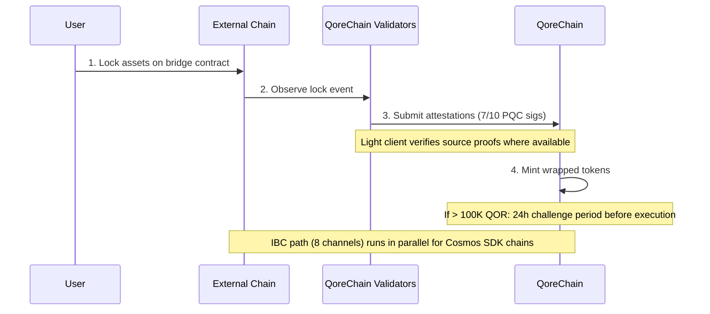

# Architettura del bridge

Il modulo `x/bridge` è progettato per connettere QoreChain all'ecosistema blockchain più ampio attraverso **37 configurazioni di chain QCB (QoreChain Bridge) e 8 canali IBC (Inter-Blockchain Communication)**. Ogni operazione del bridge è protetta da crittografia post-quantistica.

:::caution
Il bridge cross-chain è **attualmente in testnet e in attesa — non è ancora un sistema di produzione**. Le configurazioni di chain, i light client e i flussi descritti di seguito riflettono il bridge così come è progettato e così come è stato esercitato in testnet. La connettività esterna viene distribuita progressivamente; considera tutti i target come intento di progettazione piuttosto che garanzie attive di mainnet.
:::

## Panoramica delle connessioni

QoreChain è progettata per supportare due protocolli di bridge che operano in parallelo:

| Protocollo | Connessioni          | Modello di sicurezza                 | Caso d'uso                              |
| ---------- | -------------------- | ------------------------------------ | --------------------------------------- |
| **IBC**    | 8 canali             | IBC standard + firme PQC dei pacchetti | Chain compatibili con Cosmos SDK       |
| **QCB**    | 37 configurazioni di chain | multisig Dilithium-5 7-su-10    | Chain non IBC (EVM, Solana, TON, ecc.)  |

Le **37 configurazioni di chain QCB** includono **36 chain esterne** più **QoreChain stessa** come configurazione nativa/loopback (utilizzata per l'instradamento interno e il regolamento autoreferenziale). Gli 8 canali IBC si connettono a chain compatibili con Cosmos SDK.

## Canali IBC

QoreChain è progettata per mantenere connessioni IBC alle seguenti 8 chain, instradate tramite Hermes v1.x:

| Chain      | Descrizione                    |
| ---------- | ------------------------------ |
| Cosmos Hub | Connessione hub primaria       |
| Osmosis    | Instradamento della liquidità DEX |
| Noble      | Emissione nativa di USDC       |
| Celestia   | Livello di disponibilità dei dati |
| Stride     | Liquid staking                 |
| Akash      | Calcolo decentralizzato        |
| Babylon    | Protocollo di restaking BTC    |
| Injective  | Interoperabilità DeFi / orderbook |

### Configurazione del relayer IBC

* **Software del relayer**: Hermes v1.x
* **Aggiornamenti del client**: Aggiornamento automatico del light client
* **Rilevamento di comportamenti scorretti**: Abilitato — il relayer monitora i casi di equivocazione
* **Pulizia dei pacchetti**: Ogni 100 blocchi, i pacchetti IBC in sospeso vengono ripuliti
* **Miglioramento PQC**: Ogni pacchetto IBC originato da QoreChain include una firma Dilithium-5 opzionale per la sicurezza quantistica futura. Le chain riceventi compatibili con PQC possono verificare questa firma insieme alla verifica IBC standard.

## Protocollo QCB (QoreChain Bridge)

Il protocollo QCB utilizza un'architettura hub-and-spoke protetta da crittografia post-quantistica. QoreChain funge da hub, con configurazioni spoke per ogni chain esterna più una configurazione nativa/loopback per QoreChain stessa.

### Configurazioni di chain esterne (36)

Il protocollo QCB è progettato per puntare alle seguenti 36 chain esterne. Combinata con la configurazione nativa/loopback di QoreChain stessa, questo dà **37 configurazioni di chain QCB in totale (inclusa QoreChain stessa)**.

**Chain di base (10)**

Ethereum, Solana, TON, BSC, Avalanche, Polygon, Arbitrum, Optimism, Base, Sui.

**Chain della famiglia EVM (14)**

zkSync Era, Linea, Scroll, Blast, Mantle, Hyperliquid, Berachain, Sonic, Sei, Monad, Plasma, Filecoin FVM, Cronos, Kaia.

**Chain non EVM (5)**

Starknet, XRP Ledger, Stellar, Hedera, Algorand.

**Chain in attesa (7)**

NEAR, Bitcoin, Cardano, Polkadot, Tezos, Tron, Aptos.

:::note
Verifica del conteggio: 10 di base + 14 famiglia EVM + 5 non EVM + 7 in attesa = **36 chain esterne**. Aggiungendo la configurazione nativa/loopback di QoreChain stessa si ottengono **37 configurazioni di chain QCB**.
:::

### Formati degli indirizzi

Il protocollo QCB classifica le chain per tipo per validare gli indirizzi di destinazione:

| Tipo di chain | Chain di esempio                                                        | Formato dell'indirizzo                             |
| ------------- | ----------------------------------------------------------------------- | -------------------------------------------------- |
| `evm`         | Ethereum, BSC, Avalanche, Polygon, Arbitrum, Optimism, Base             | `0x` + 40 caratteri esadecimali                    |
| `solana`      | Solana                                                                  | Base58, 32-44 caratteri                            |
| `ton`         | TON                                                                     | `EQ` + codificato base64                           |
| `sui_move`    | Sui                                                                     | `0x` + 64 caratteri esadecimali                    |
| `aptos_move`  | Aptos                                                                   | `0x` + 64 caratteri esadecimali                    |
| `bitcoin`     | Bitcoin                                                                 | Bech32 (`bc1`), P2SH (`3...`), o legacy (`1...`)   |
| `near`        | NEAR Protocol                                                           | suffisso `.near` o implicito                       |
| `cardano`     | Cardano                                                                 | `addr1` (pagamento) o `stake1` (staking)           |
| `polkadot`    | Polkadot                                                                | codificato SS58                                    |
| `tezos`       | Tezos                                                                   | `tz1`/`tz2`/`tz3` (implicito) o `KT1` (originato)  |
| `tron`        | TRON                                                                    | `T` + base58, 34 caratteri                         |

## Light client

Per verificare gli eventi delle chain esterne senza necessità di fiducia, il bridge è progettato per eseguire light client on-chain su misura per il sistema di consenso e di prova di ogni chain di origine. Questi light client consentono a QoreChain di validare depositi e prelievi senza fare affidamento esclusivamente sulle attestazioni dei validatori.

| Light client            | Chain di origine    | Primitive di verifica                                               |
| ----------------------- | ------------------- | ------------------------------------------------------------------- |
| **Light client Ethereum** | Ethereum / EVM L1 | Verifica delle firme BLS12-381, serializzazione SSZ, prove di stato MPT |
| **Bitcoin SPV**         | Bitcoin             | Simplified Payment Verification rispetto agli header dei blocchi    |
| **Starknet STARK**      | Starknet            | Verifica delle prove STARK delle transizioni di stato di Starknet   |
| **Sui BLS**             | Sui                 | Verifica delle firme aggregate BLS dei checkpoint di Sui            |
| **Wormhole / Solana VAA** | Solana (via Wormhole) | Verifica della firma dei guardian del Verified Action Approval (VAA) |

## Flusso di deposito (da esterno a QoreChain)

La sequenza seguente mostra un deposito QCB: gli asset vengono bloccati su una chain esterna, i validatori di QoreChain inviano attestazioni firmate con PQC (7-su-10 Dilithium-5) e i token wrapped vengono coniati. Le chain compatibili con Cosmos SDK utilizzano invece il percorso IBC parallelo (8 canali, con firme dei pacchetti Dilithium-5 opzionali). Entrambi i percorsi sono in testnet/in attesa.



```
External Chain          QoreChain Validators           QoreChain
     |                         |                          |
     | 1. Lock assets on       |                          |
     |    bridge contract      |                          |
     |------------------------>|                          |
     |                         | 2. Observe & attest      |
     |                         |    (7/10 PQC sigs)       |
     |                         |------------------------->|
     |                         |                          | 3. Mint wrapped
     |                         |                          |    tokens
     |                         |                          |
     |                         |    [If > 100K QOR]       |
     |                         |    24h challenge period   |
     |                         |    before execution       |
```

1. **Lock** — L'utente blocca gli asset nel contratto del bridge sulla chain esterna.
2. **Attestazione** — I validatori del bridge osservano la transazione di lock e inviano attestazioni firmate con Dilithium-5. Sono richieste un minimo di **7 su 10** attestazioni dei validatori. Dove è disponibile un light client per la chain di origine, l'evento di lock viene inoltre verificato rispetto alle prove proprie della chain.
3. **Mint** — Una volta raggiunta la soglia di attestazione, i token wrapped vengono coniati su QoreChain.
4. **Periodo di contestazione** — Per i trasferimenti che superano l'equivalente di 100.000 QOR, si applica un **periodo di contestazione di 24 ore** prima dell'esecuzione. Durante questa finestra, i validatori possono segnalare attività sospette.

## Flusso di prelievo (da QoreChain a esterno)

```
QoreChain               QoreChain Validators           External Chain
     |                         |                          |
     | 1. Burn wrapped tokens  |                          |
     |------------------------>|                          |
     |                         | 2. Attest burn           |
     |                         |    (7/10 PQC sigs)       |
     |                         |------------------------->|
     |                         |                          | 3. Unlock original
     |                         |                          |    assets
```

1. **Burn** — L'utente brucia i token wrapped su QoreChain.
2. **Attestazione** — I validatori attestano l'evento di burn con firme Dilithium-5 (soglia 7/10).
3. **Unlock** — Una volta raggiunta la soglia, gli asset originali vengono sbloccati sulla chain esterna.

Tutte le commissioni del bridge raccolte durante i prelievi vengono instradate al modulo `x/burn` tramite il canale di burn `bridge_fee` (il 100% delle commissioni del bridge viene bruciato).

### Flusso di prelievo L2 → L1 (regolamento dei rollup)

Il bridge è inoltre progettato per regolare i **prelievi dai rollup (L2) verso la loro chain host (L1)**. I rollup distribuiti tramite il [Rollup Development Kit](/architecture/rollup-development-kit) ancorano periodicamente il loro stato a QoreChain; il bridge consuma quegli ancoraggi finalizzati per autorizzare i prelievi dal rollup alla chain host:

1. Un utente avvia un prelievo sul rollup (L2), che viene incluso in un batch di regolamento.
2. Il batch viene ancorato a QoreChain e provato/finalizzato in base alla modalità di regolamento del rollup (ad esempio, dopo la scadenza della finestra di contestazione ottimistica, o al momento della verifica di una prova valida).
3. Una volta finalizzato l'ancoraggio, il prelievo diventa rivendicabile e gli asset corrispondenti vengono rilasciati sulla chain host (L1) attraverso il percorso standard di burn-and-attest.

Questo lega la finalità del rollup direttamente alle garanzie di regolamento della chain host, in modo che i prelievi L2 non possano essere rilasciati prima che il corrispondente stato L2 sia regolato in modo irreversibile.

## Architettura di sicurezza

### Multisig PQC

Tutte le operazioni del bridge QCB richiedono una **soglia 7-su-10** di firme post-quantistiche Dilithium-5 da parte dei validatori del bridge registrati. Ogni validatore del bridge si registra con:

* Un indirizzo di validatore QoreChain
* Una chiave pubblica Dilithium-5 (2.592 byte)
* Un elenco di chain supportate
* Un punteggio di reputazione (mantenuto da `x/reputation`)

### Circuit breaker

Ogni chain connessa dispone di protezioni circuit breaker indipendenti:

| Protezione                       | Descrizione                                                                          |
| -------------------------------- | ------------------------------------------------------------------------------------ |
| **Limite di trasferimento singolo** | Importo massimo per qualsiasi singola operazione del bridge per chain             |
| **Limite aggregato giornaliero** | Tetto al volume totale per chain per finestra di 24 ore                              |
| **Pausa manuale**                | Arresto di emergenza per chain attivato dalla governance o dai validatori            |
| **Rilevamento di anomalie**      | Pausa automatica se >50 operazioni in una finestra breve o il volume supera 5x il limite giornaliero |

Lo stato del circuit breaker viene tracciato per chain e include: trasferimento singolo massimo, limite giornaliero, utilizzo giornaliero corrente, ultima altezza di reset e stato di pausa con motivo.

### Periodo di contestazione

Per i trasferimenti di grandi dimensioni (>100.000 equivalente in QOR, configurabile tramite `large_transfer_threshold`):

* Si applica un **periodo di contestazione di 24 ore** (86.400 secondi) dopo che la soglia di attestazione è stata raggiunta.
* Durante questa finestra, qualsiasi validatore può segnalare l'operazione.
* Se non contestata, l'operazione viene eseguita automaticamente dopo la scadenza del periodo.
* Le operazioni contestate vengono congelate per la revisione della governance.

### Ottimizzazione del percorso tramite AI

Il modulo del bridge si integra con il sottosistema AI per l'ottimizzazione del percorso. Per i trasferimenti che possono attraversare più percorsi (ad esempio, dalla chain A alla chain B tramite un intermediario), l'ottimizzatore del percorso valuta:

* Le commissioni stimate sui vari percorsi
* Il tempo di completamento stimato
* Il punteggio di sicurezza per percorso
* Il livello di confidenza della stima

## Endpoint API REST

A partire dalla versione della chain **v3.1.77**, lo stato del bridge è inoltre interrogabile **in sola lettura tramite REST** attraverso grpc-gateway con il prefisso `/qorechain/bridge/v1/...` (`config`, `chains`, `chains/{chain_id}`, `validators`, `validators/{address}`, `operations`, `operations/{id}`) — in precedenza solo gRPC. Questi servono JSON on-chain reale tramite HTTP per explorer e telemetria dei light node. Vedi [Endpoint REST / gRPC](/api-reference/rest-grpc-endpoints#bridge-module) per l'elenco completo.

| Metodo | Endpoint                                           | Descrizione                                      |
| ------ | -------------------------------------------------- | ------------------------------------------------ |
| GET    | `/bridge/v1/chains`                                | Elenca tutte le configurazioni di chain supportate |
| GET    | `/bridge/v1/chains/{chain_id}`                     | Ottiene la configurazione per una chain specifica |
| GET    | `/bridge/v1/validators`                            | Elenca tutti i validatori del bridge registrati  |
| GET    | `/bridge/v1/operations`                            | Elenca tutte le operazioni del bridge (le più recenti prima) |
| GET    | `/bridge/v1/operations/{operation_id}`             | Ottiene i dettagli di un'operazione specifica    |
| GET    | `/bridge/v1/locked/{chain}/{asset}`                | Ottiene gli importi bloccati/coniati per una coppia chain/asset |
| GET    | `/bridge/v1/circuit-breakers`                      | Elenca tutti gli stati dei circuit breaker       |
| GET    | `/bridge/v1/estimate/{from}/{to}/{asset}/{amount}` | Ottiene una stima del percorso ottimizzata dall'AI |

## Eventi del bridge

Il modulo del bridge emette i seguenti eventi on-chain:

| Tipo di evento                | Descrizione                                     |
| ----------------------------- | ----------------------------------------------- |
| `bridge_deposit`              | Nuova operazione di deposito creata             |
| `bridge_withdraw`             | Nuova operazione di prelievo creata             |
| `bridge_attestation`          | Attestazione del validatore inviata             |
| `bridge_operation_executed`   | Operazione finalizzata ed eseguita              |
| `bridge_circuit_breaker_trip` | Circuit breaker attivato o disattivato          |
| `bridge_validator_registered` | Nuovo validatore del bridge registrato          |
| `bridge_pqc_verification`     | Risultato della verifica della firma PQC (pacchetti IBC) |

## Correlati

* [Bridging degli asset](/user-guide/bridging-assets) — sposta gli asset tra le chain passo dopo passo.
* [Dashboard Bridge](/dashboard/bridge) — l'interfaccia del bridge per gli utenti di tutti i giorni.
* [BTC Restaking tramite Babylon](/architecture/btc-restaking-babylon) — sicurezza supportata da Bitcoin.
* [Sicurezza post-quantistica](/architecture/post-quantum-security) — verifica PQC sui pacchetti IBC.
