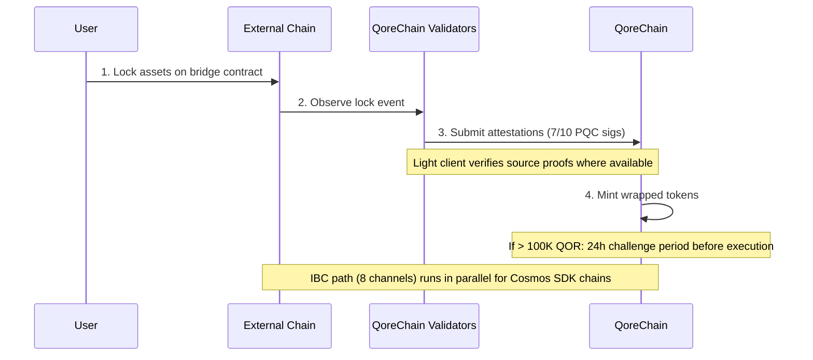

# Architettura del Bridge

Il modulo `x/bridge` è progettato per connettere QoreChain all'ecosistema blockchain più ampio attraverso **37 configurazioni di catena QCB (QoreChain Bridge) e 8 canali IBC (Inter-Blockchain Communication)**. Ogni operazione del bridge è protetta dalla crittografia post-quantistica.

:::caution
Il bridge cross-chain è **attualmente in testnet e in attesa — non è ancora un sistema di produzione**. Le configurazioni di catena, i light client e i flussi descritti di seguito riflettono il bridge così come è stato progettato e così come è stato sperimentato sulla testnet. La connettività esterna viene distribuita progressivamente; considerate tutti i target come intenzioni di progettazione piuttosto che garanzie attive di mainnet.
:::

## Panoramica delle Connessioni

QoreChain è progettata per supportare due protocolli di bridge operanti in parallelo:

| Protocollo | Connessioni          | Modello di Sicurezza                 | Caso d'Uso                              |
| ---------- | -------------------- | ------------------------------------ | --------------------------------------- |
| **IBC**    | 8 canali             | IBC standard + firme PQC sui pacchetti | Catene compatibili con Cosmos SDK     |
| **QCB**    | 37 config di catena  | multisig Dilithium-5 7-su-10         | Catene non-IBC (EVM, Solana, TON, ecc.) |

Le **37 configurazioni di catena QCB** comprendono **36 catene esterne** più **QoreChain stessa** come configurazione nativa/di loopback (utilizzata per il routing interno e il regolamento auto-referenziale). Gli 8 canali IBC si connettono a catene compatibili con Cosmos SDK.

## Canali IBC

QoreChain è progettata per mantenere connessioni IBC verso le seguenti 8 catene, relayate tramite Hermes v1.x:

| Catena     | Descrizione                    |
| ---------- | ------------------------------ |
| Cosmos Hub | Connessione hub primaria       |
| Osmosis    | Routing della liquidità DEX    |
| Noble      | Emissione nativa di USDC       |
| Celestia   | Livello di disponibilità dati  |
| Stride     | Liquid staking                 |
| Akash      | Calcolo decentralizzato        |
| Babylon    | Protocollo di restaking BTC    |
| Injective  | Interoperabilità DeFi / orderbook |

### Configurazione del Relayer IBC

* **Software del relayer**: Hermes v1.x
* **Aggiornamenti del client**: Refresh automatico del light client
* **Rilevamento di comportamenti scorretti**: Abilitato — il relayer monitora l'equivocazione
* **Clearing dei pacchetti**: Ogni 100 blocchi, i pacchetti IBC in sospeso vengono ripuliti
* **Miglioramento PQC**: Ogni pacchetto IBC originato da QoreChain include una firma Dilithium-5 opzionale per la sicurezza quantistica a lungo termine. Le catene riceventi compatibili con PQC possono verificare questa firma insieme alla verifica IBC standard.

## Protocollo QCB (QoreChain Bridge)

Il protocollo QCB utilizza un'architettura hub-and-spoke protetta dalla crittografia post-quantistica. QoreChain funge da hub, con configurazioni spoke per ciascuna catena esterna più una configurazione nativa/di loopback per QoreChain stessa.

### Configurazioni di Catene Esterne (36)

Il protocollo QCB è progettato per indirizzarsi alle seguenti 36 catene esterne. Combinate con la configurazione nativa/di loopback di QoreChain, ciò dà **37 config di catena QCB in totale (inclusa QoreChain stessa)**.

**Catene di base (10)**

Ethereum, Solana, TON, BSC, Avalanche, Polygon, Arbitrum, Optimism, Base, Sui.

**Catene della famiglia EVM (14)**

zkSync Era, Linea, Scroll, Blast, Mantle, Hyperliquid, Berachain, Sonic, Sei, Monad, Plasma, Filecoin FVM, Cronos, Kaia.

**Catene non-EVM (5)**

Starknet, XRP Ledger, Stellar, Hedera, Algorand.

**Catene in attesa (7)**

NEAR, Bitcoin, Cardano, Polkadot, Tezos, Tron, Aptos.

:::note
Verifica del conteggio: 10 di base + 14 famiglia EVM + 5 non-EVM + 7 in attesa = **36 catene esterne**. Aggiungendo la configurazione nativa/di loopback di QoreChain si ottengono **37 config di catena QCB**.
:::

### Formati degli Indirizzi

Il protocollo QCB classifica le catene per tipo al fine di validare gli indirizzi di destinazione:

| Tipo di Catena | Catene di Esempio                                                       | Formato dell'Indirizzo                             |
| ------------ | ----------------------------------------------------------------------- | -------------------------------------------------- |
| `evm`        | Ethereum, BSC, Avalanche, Polygon, Arbitrum, Optimism, Base             | `0x` + 40 caratteri esadecimali                    |
| `solana`     | Solana                                                                  | Base58, 32-44 caratteri                            |
| `ton`        | TON                                                                     | `EQ` + codifica base64                             |
| `sui_move`   | Sui                                                                     | `0x` + 64 caratteri esadecimali                    |
| `aptos_move` | Aptos                                                                   | `0x` + 64 caratteri esadecimali                    |
| `bitcoin`    | Bitcoin                                                                 | Bech32 (`bc1`), P2SH (`3...`), o legacy (`1...`)   |
| `near`       | NEAR Protocol                                                           | suffisso `.near` o implicito                       |
| `cardano`    | Cardano                                                                 | `addr1` (pagamento) o `stake1` (staking)           |
| `polkadot`   | Polkadot                                                                | codifica SS58                                      |
| `tezos`      | Tezos                                                                   | `tz1`/`tz2`/`tz3` (implicito) o `KT1` (originato)  |
| `tron`       | TRON                                                                    | `T` + base58, 34 caratteri                         |

## Light Client

Per verificare gli eventi delle catene esterne in modo trustless, il bridge è progettato per eseguire light client on-chain adattati al sistema di consenso e di prova di ciascuna catena di origine. Questi light client consentono a QoreChain di validare depositi e prelievi senza affidarsi esclusivamente alle attestazioni dei validatori.

| Light Client            | Catena di Origine   | Primitive di Verifica                                                |
| ----------------------- | ------------------- | ------------------------------------------------------------------- |
| **Ethereum light client** | Ethereum / EVM L1 | Verifica delle firme BLS12-381, serializzazione SSZ, prove di stato MPT |
| **Bitcoin SPV**         | Bitcoin             | Simplified Payment Verification contro gli header dei blocchi        |
| **Starknet STARK**      | Starknet            | Verifica delle prove STARK delle transizioni di stato di Starknet   |
| **Sui BLS**             | Sui                 | Verifica delle firme aggregate BLS dei checkpoint di Sui            |
| **Wormhole / Solana VAA** | Solana (tramite Wormhole) | Verifica delle firme dei guardian Verified Action Approval (VAA) |

## Flusso di Deposito (da Esterno a QoreChain)

La sequenza seguente mostra un deposito QCB: gli asset vengono bloccati su una catena esterna, i validatori di QoreChain inviano attestazioni firmate con PQC (7-su-10 Dilithium-5) e i token wrapped vengono coniati. Le catene compatibili con Cosmos SDK utilizzano invece il percorso IBC parallelo (8 canali, con firme dei pacchetti Dilithium-5 opzionali). Entrambi i percorsi sono in testnet/in attesa.



```
External Chain          QoreChain Validators           QoreChain
     |                         |                          |
     | 1. Lock assets on       |                          |
     |    bridge contract      |                          |
     |------------------------>|                          |
     |                         | 2. Observe & attest      |
     |                         |    (7/10 PQC sigs)       |
     |                         |------------------------->|
     |                         |                          | 3. Mint wrapped
     |                         |                          |    tokens
     |                         |                          |
     |                         |    [If > 100K QOR]       |
     |                         |    24h challenge period   |
     |                         |    before execution       |
```

1. **Lock** — L'utente blocca gli asset nel contratto del bridge sulla catena esterna.
2. **Attest** — I validatori del bridge osservano la transazione di lock e inviano attestazioni firmate con Dilithium-5. È richiesto un minimo di **7 su 10** attestazioni dei validatori. Laddove sia disponibile un light client per la catena di origine, l'evento di lock viene inoltre verificato contro le prove proprie della catena.
3. **Mint** — Una volta raggiunta la soglia di attestazione, i token wrapped vengono coniati su QoreChain.
4. **Periodo di sfida** — Per i trasferimenti che superano l'equivalente di 100.000 QOR, si applica un **periodo di sfida di 24 ore** prima dell'esecuzione. Durante questa finestra, i validatori possono segnalare attività sospette.

## Flusso di Prelievo (da QoreChain a Esterno)

```
QoreChain               QoreChain Validators           External Chain
     |                         |                          |
     | 1. Burn wrapped tokens  |                          |
     |------------------------>|                          |
     |                         | 2. Attest burn           |
     |                         |    (7/10 PQC sigs)       |
     |                         |------------------------->|
     |                         |                          | 3. Unlock original
     |                         |                          |    assets
```

1. **Burn** — L'utente brucia i token wrapped su QoreChain.
2. **Attest** — I validatori attestano l'evento di burn con firme Dilithium-5 (soglia 7/10).
3. **Unlock** — Una volta raggiunta la soglia, gli asset originali vengono sbloccati sulla catena esterna.

Tutte le commissioni del bridge raccolte durante i prelievi vengono instradate al modulo `x/burn` tramite il canale di burn `bridge_fee` (il 100% delle commissioni del bridge viene bruciato).

### Flusso di Prelievo L2 → L1 (Regolamento Rollup)

Il bridge è inoltre progettato per regolare i **prelievi rollup (L2) di ritorno alla loro catena host (L1)**. I rollup distribuiti tramite il [Rollup Development Kit](/architecture/rollup-development-kit) ancorano periodicamente il loro stato a QoreChain; il bridge consuma quegli anchor finalizzati per autorizzare i prelievi dal rollup alla catena host:

1. Un utente avvia un prelievo sul rollup (L2), che viene incluso in un batch di regolamento.
2. Il batch viene ancorato a QoreChain e provato/finalizzato secondo la modalità di regolamento del rollup (ad esempio, dopo la scadenza della finestra di sfida ottimistica, o in seguito a una valida verifica della prova).
3. Una volta finalizzato l'anchor, il prelievo diventa rivendicabile e i corrispondenti asset vengono rilasciati sulla catena host (L1) attraverso il percorso standard burn-and-attest.

Questo lega la finalità del rollup direttamente alle garanzie di regolamento della catena host, in modo che i prelievi L2 non possano essere rilasciati prima che il corrispondente stato L2 sia regolato in modo irreversibile.

## Architettura di Sicurezza

### Multisig PQC

Tutte le operazioni del bridge QCB richiedono una **soglia 7-su-10** di firme post-quantistiche Dilithium-5 dai validatori del bridge registrati. Ogni validatore del bridge si registra con:

* Un indirizzo di validatore QoreChain
* Una chiave pubblica Dilithium-5 (2.592 byte)
* Un elenco di catene supportate
* Un punteggio di reputazione (mantenuto da `x/reputation`)

### Circuit Breaker

Ogni catena connessa dispone di protezioni circuit breaker indipendenti:

| Protezione                | Descrizione                                                                          |
| ------------------------- | ------------------------------------------------------------------------------------ |
| **Limite singolo trasferimento** | Importo massimo per qualsiasi operazione di bridge individuale per catena     |
| **Limite aggregato giornaliero** | Tetto di volume totale per catena per finestra di 24 ore                       |
| **Pausa manuale**         | Arresto di emergenza per catena attivato da governance o validatore                  |
| **Rilevamento anomalie**  | Pausa automatica se >50 operazioni in una finestra breve o se il volume supera di 5x il limite giornaliero |

Lo stato del circuit breaker viene tracciato per catena e include: trasferimento singolo massimo, limite giornaliero, utilizzo giornaliero corrente, altezza dell'ultimo reset e stato di pausa con motivazione.

### Periodo di Sfida

Per i trasferimenti di grande entità (>100.000 QOR equivalenti, configurabile tramite `large_transfer_threshold`):

* Si applica un **periodo di sfida di 24 ore** (86.400 secondi) dopo il raggiungimento della soglia di attestazione.
* Durante questa finestra, qualsiasi validatore può segnalare l'operazione.
* Se non viene contestata, l'operazione viene eseguita automaticamente alla scadenza del periodo.
* Le operazioni contestate vengono congelate per la revisione da parte della governance.

### Ottimizzazione del Percorso tramite AI

Il modulo del bridge si integra con il sottosistema AI per l'ottimizzazione dei percorsi. Per i trasferimenti che possono attraversare percorsi multipli (ad es. dalla catena A alla catena B tramite un intermediario), l'ottimizzatore di percorso valuta:

* Le commissioni stimate tra i percorsi
* Il tempo stimato di completamento
* Il punteggio di sicurezza per percorso
* Il livello di confidenza della stima

## Amministrazione del Bridge

### Attivazione della catena post-deploy (senza governance)

A partire dalla versione di catena **v3.1.78**, una catena del bridge può essere attivata e riconfigurata dopo il deployment con una singola transazione firmata — senza proposta di governance e senza upgrade della catena. Una chiave `bridge_admin` (impostata in `BridgeConfig.BridgeAdmin` al genesis) o un titolare della licenza `qcb_bridge` può:

* **`tx bridge update-chain-config`** — impostare l'indirizzo del contratto di una catena, il numero di conferme, l'architettura e lo stato (`MsgUpdateChainConfig`).
* **`tx bridge set-verifier-bootstrap`** — selezionare il verifier attivo per una catena e installarne la trust root (`MsgSetVerifierBootstrap`).

Questo consente a un operatore di portare online il bridge di una catena connessa — o di ruotarne il verifier — direttamente, con l'autorizzazione verificata rispetto alla chiave di amministrazione del bridge.

### Validazione delle reti connesse

A partire dalla versione di catena **v3.1.79**, un validatore che detiene la licenza `validator_<chain>` (o `qcb_bridge`) corrispondente può eseguire il client della rete esterna sullo stesso nodo, provisionato automaticamente sotto l'orchestrazione di QoreChain una volta attivata la licenza. I driver vengono forniti per tutte le 37 reti del bridge, classificate per modello di partecipazione (validatore permissionless, capped/elected/admission, full-node L2 e non-staking/trust-list). Lo stake e le chiavi di firma della rete esterna sono forniti dall'operatore per ciascuna rete. Vedi [Eseguire un Validatore](/developer-guide/running-a-validator#connected-networks) per i passaggi dell'operatore.

## Endpoint REST API

A partire dalla versione di catena **v3.1.77**, lo stato del bridge è anche interrogabile **in sola lettura tramite REST** via grpc-gateway sotto il prefisso `/qorechain/bridge/v1/...` (`config`, `chains`, `chains/{chain_id}`, `validators`, `validators/{address}`, `operations`, `operations/{id}`) — in precedenza solo gRPC. Questi forniscono JSON on-chain reali su HTTP per explorer e telemetria di light node. Vedi [Endpoint REST / gRPC](/api-reference/rest-grpc-endpoints#bridge-module) per l'elenco completo.

| Metodo | Endpoint                                           | Descrizione                                      |
| ------ | -------------------------------------------------- | ------------------------------------------------ |
| GET    | `/bridge/v1/chains`                                | Elenca tutte le configurazioni di catena supportate |
| GET    | `/bridge/v1/chains/{chain_id}`                     | Ottiene la configurazione per una catena specifica  |
| GET    | `/bridge/v1/validators`                            | Elenca tutti i validatori del bridge registrati     |
| GET    | `/bridge/v1/operations`                            | Elenca tutte le operazioni del bridge (più recenti per prime) |
| GET    | `/bridge/v1/operations/{operation_id}`             | Ottiene i dettagli di un'operazione specifica       |
| GET    | `/bridge/v1/locked/{chain}/{asset}`                | Ottiene gli importi bloccati/coniati per una coppia catena/asset |
| GET    | `/bridge/v1/circuit-breakers`                      | Elenca tutti gli stati dei circuit breaker          |
| GET    | `/bridge/v1/estimate/{from}/{to}/{asset}/{amount}` | Ottiene una stima del percorso ottimizzata tramite AI |

## Eventi del Bridge

Il modulo del bridge emette i seguenti eventi on-chain:

| Tipo di Evento                | Descrizione                                     |
| ----------------------------- | ----------------------------------------------- |
| `bridge_deposit`              | Nuova operazione di deposito creata             |
| `bridge_withdraw`             | Nuova operazione di prelievo creata             |
| `bridge_attestation`          | Attestazione del validatore inviata             |
| `bridge_operation_executed`   | Operazione finalizzata ed eseguita              |
| `bridge_circuit_breaker_trip` | Circuit breaker attivato o disattivato          |
| `bridge_validator_registered` | Nuovo validatore del bridge registrato          |
| `bridge_pqc_verification`     | Risultato della verifica della firma PQC (pacchetti IBC) |

## Correlati

* [Trasferimento di Asset](/user-guide/bridging-assets) — sposta gli asset tra le catene passo dopo passo.
* [Bridge della Dashboard](/dashboard/bridge) — l'interfaccia del bridge per gli utenti quotidiani.
* [Restaking BTC tramite Babylon](/architecture/btc-restaking-babylon) — sicurezza supportata da Bitcoin.
* [Sicurezza Post-Quantistica](/architecture/post-quantum-security) — verifica PQC sui pacchetti IBC.
