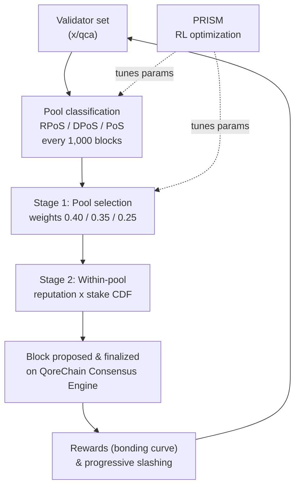

# Meccanismo di Consenso

QoreChain implementa il **Triple-Pool Composite Proof-of-Stake (CPoS)**, un meccanismo di consenso che classifica i validatori in tre pool specializzati e utilizza una selezione ponderata in base alla reputazione per bilanciare sicurezza, decentralizzazione e prestazioni. Il CPoS è implementato nel modulo `x/qca` e opera al di sopra del **QoreChain Consensus Engine**.

Il livello di ottimizzazione tramite apprendimento per rinforzo che regola i parametri di consenso in fase di esecuzione porta il marchio **PRISM** (Policy-driven Reinforcement-learning for Intelligent State Machines). Per i dettagli consulta il [PRISM Consensus Engine](/architecture/prism-consensus-engine).

Il diagramma seguente riassume un ciclo di blocco/consenso del Triple-Pool CPoS sul QoreChain Consensus Engine e mostra dove PRISM retroagisce sui parametri regolabili di `x/qca`.



---

## Architettura Triple-Pool

Il CPoS suddivide l'insieme attivo dei validatori in tre pool sulla base di metriche di reputazione, stake e delega. Ogni pool svolge un ruolo distinto nel processo di consenso.

### Classificazione dei pool

| Pool                                 | Criteri                                                                  | Peso di selezione |
| ------------------------------------ | ----------------------------------------------------------------------- | ----------------- |
| **RPoS** (Reputation Proof-of-Stake) | Punteggio di reputazione >= 70° percentile **E** stake auto-bonded >= mediana | 40%               |
| **DPoS** (Delegated Proof-of-Stake)  | Delega totale >= 10.000 QOR                                              | 35%               |
| **PoS** (Standard Proof-of-Stake)    | Tutti i restanti validatori attivi                                       | 25%               |

La classificazione viene valutata con la seguente priorità: **RPoS > DPoS > PoS**. Un validatore che soddisfa i requisiti sia per RPoS che per DPoS viene assegnato a RPoS.

La riclassificazione avviene ogni **1.000 blocchi**. Ad ogni epoca di riclassificazione:

1. **Raccolta dei punteggi di reputazione** — I punteggi di reputazione vengono raccolti dal modulo `x/reputation` per tutti i validatori attivi.
2. **Calcolo della soglia di reputazione** — La soglia di reputazione al 70° percentile viene calcolata dalla distribuzione ordinata dei punteggi.
3. **Calcolo dello stake auto-bonded mediano** — Lo stake auto-bonded mediano viene calcolato dalla distribuzione ordinata dello stake.
4. **Riassegnazione dei validatori** — Ogni validatore attivo viene riassegnato al pool di priorità più alta per cui soddisfa i requisiti.
5. **Assegnazione predefinita** — I validatori non classificati (quelli non ancora valutati) vengono assegnati per impostazione predefinita al pool PoS.

---

## Selezione del proponente ponderata per pool

La selezione del proponente del blocco segue un processo deterministico in due fasi.

### Fase 1: Selezione del pool

Un valore casuale deterministico seleziona quale pool propone il prossimo blocco:

```
seed = SHA256(lastBlockHash || height || "pool")
randVal = uint64(seed[:8]) / MaxUint64    // uniform in [0, 1)
```

Il pool viene scelto confrontando `randVal` con le soglie di peso cumulativo:

* `randVal < 0.40` → pool RPoS
* `0.40 <= randVal < 0.75` → pool DPoS
* `randVal >= 0.75` → pool PoS

### Fase 2: Selezione all'interno del pool

All'interno del pool selezionato, il proponente viene scelto tramite una **CDF ponderata per reputazione × stake**. Per ogni validatore nel pool:

1. Il punteggio di reputazione `r` viene recuperato da `x/reputation`.
2. Il peso composito è `w = r * tokens`.
3. Una funzione di distribuzione cumulativa (CDF) viene costruita a partire da tutti i pesi compositi.
4. Il proponente viene selezionato utilizzando un'estrazione casuale deterministica rispetto alla CDF, inizializzata dall'hash e dall'altezza del blocco.

### Comportamento di fallback

Se il pool selezionato è vuoto, il sistema ripiega sul pool PoS. Se anche il pool PoS è vuoto, la selezione ripiega su una selezione ponderata per reputazione sull'intero insieme attivo dei validatori.

---

## Bonding Curve personalizzata

Le ricompense dei validatori vengono calcolate utilizzando una bonding curve multifattoriale che incentiva la partecipazione a lungo termine, l'alta reputazione e l'allineamento con le fasi di crescita del protocollo.

### Formula

```
R(v, t) = beta * S_v * (1 + alpha * ln(1 + L_v)) * Q(r_v) * P(t)
```

### Definizioni dei fattori

| Fattore                  | Simbolo  | Descrizione                                                  | Predefinito |
| ------------------------ | -------- | ----------------------------------------------------------- | ----------- |
| Moltiplicatore base ricompensa | `beta`   | Scala l'entità complessiva della ricompensa                 | 1.0         |
| Stake auto-bonded        | `S_v`    | I token auto-bonded del validatore (uqor)                   | --          |
| Sensibilità alla fedeltà | `alpha`  | Controlla quanto la durata della fedeltà amplifica le ricompense | 0.1         |
| Durata della fedeltà     | `L_v`    | Numero di blocchi consecutivi in cui il validatore è stato attivo | --          |
| Qualità della reputazione | `Q(r_v)` | Mappa la reputazione `r` su un moltiplicatore di ricompensa in \[0.75, 1.25] | --          |
| Fase del protocollo      | `P(t)`   | Moltiplicatore dipendente dalla fase per avviare o moderare le ricompense | Vedi sotto  |

### Funzione di qualità della reputazione

```
Q(r) = 1 + 0.5 * (r - 0.5)
```

Il risultato viene limitato all'intervallo **\[0.75, 1.25]**:

| Punteggio di reputazione | Q(r)  |
| ------------------------ | ----- |
| 0.0                      | 0.75  |
| 0.25                     | 0.875 |
| 0.5                      | 1.0   |
| 0.75                     | 1.125 |
| 1.0                      | 1.25  |

### Moltiplicatori della fase del protocollo

| Fase    | P(t) | Descrizione                                          |
| ------- | ---- | --------------------------------------------------- |
| Genesis | 1.5  | Ricompense più elevate per avviare l'insieme dei validatori |
| Growth  | 1.0  | Ricompense standard durante l'espansione della rete |
| Mature  | 0.8  | Emissione ridotta man mano che la rete si stabilizza |

### Matematica deterministica

Il calcolo di `ln(1 + L_v)` utilizza un'approssimazione in serie di Taylor con riduzione dell'argomento (`TaylorLn1PlusX`), operando interamente su decimali a precisione fissa `LegacyDec`. Non viene utilizzata aritmetica in virgola mobile nei calcoli delle ricompense critici per il consenso.

---

## Progressive Slashing

QoreChain sostituisce le aliquote di slashing fisse con un **modello di penalità progressivo** che intensifica le conseguenze per i recidivi, consentendo al contempo alle infrazioni di decadere nel tempo.

### Formula

```
penalty = base_rate * escalation_factor^effective_count * severity_factor
```

### Decadimento temporale

Le infrazioni passate contribuiscono con un peso decrescente al conteggio effettivo:

```
effective_count = SUM( 0.5^(blocks_since_i / decay_halflife) )
```

Per ogni infrazione passata `i`, il contributo si dimezza ogni `decay_halflife` blocchi (predefinito: 100.000). Ciò significa che una singola vecchia infrazione avvenuta 200.000 blocchi fa contribuisce solo con 0,25 al conteggio effettivo.

### Fattori di gravità

| Tipo di infrazione   | Fattore di gravità |
| ------------------- | ------------------ |
| Downtime            | 1.0                |
| Double Sign         | 2.0                |
| Light Client Attack | 3.0                |

### Penalità massima

La penalità è limitata al **33%** per evento di slash, indipendentemente da quante infrazioni passate un validatore ha accumulato.

### Esempio di calcolo

Un validatore con 2 infrazioni precedenti (una avvenuta 50.000 blocchi fa, una 150.000 blocchi fa) commette un double-sign:

1. **Contributi di decadimento**:
   * Infrazione 1: `0.5^(50000 / 100000) = 0.5^0.5 = 0.707`
   * Infrazione 2: `0.5^(150000 / 100000) = 0.5^1.5 = 0.354`
   * `effective_count = 0.707 + 0.354 = 1.061`
2. **Escalation**: `1.5^1.061 = 1.516`
3. **Penalità**: `0.01 * 1.516 * 2.0 = 0.0303` (3,03%)

Confronta questo con un trasgressore alla prima infrazione: `0.01 * 1.5^0 * 2.0 = 0.02` (2,0%).

---

## Governance QDRW

La governance di QoreChain utilizza la **Quadratic Delegation with Reputation Weighting (QDRW)** per prevenire la cattura plutocratica premiando al contempo i partecipanti di lungo termine della rete.

### Formula del potere di voto

```
VP(v) = sqrt(staked + 2 * xQORE) * ReputationMultiplier(r)
```

Dove:

* `staked` = i token QOR bonded del votante
* `xQORE` = il saldo xQORE del votante (derivato dallo staking a lungo termine)
* `2` = il moltiplicatore di peso xQORE (configurabile dalla governance)
* `r` = il punteggio di reputazione del votante da `x/reputation`

### Moltiplicatore di reputazione

Il moltiplicatore di reputazione mappa `r` in \[0, 1] su un moltiplicatore in \[0.5, 2.0] tramite una curva sigmoidale:

```
ReputationMultiplier(r) = 0.5 + 1.5 * sigmoid(6 * (r - 0.5))
```

| Punteggio di reputazione | Moltiplicatore |
| ------------------------ | -------------- |
| 0.0                      | 0.50           |
| 0.1                      | 0.52           |
| 0.2                      | 0.58           |
| 0.3                      | 0.71           |
| 0.4                      | 0.93           |
| 0.5                      | 1.25           |
| 0.6                      | 1.57           |
| 0.7                      | 1.79           |
| 0.8                      | 1.92           |
| 0.9                      | 1.98           |
| 1.0                      | 2.00           |

### Scalatura quadratica

La funzione radice quadrata garantisce che il potere di voto scali in modo sub-lineare con lo stake. Un votante con 4 volte lo stake di un altro votante riceve solo 2 volte il potere di voto, non 4 volte. Ciò impedisce ai grandi detentori di token di dominare le decisioni di governance.

### Matematica deterministica

`IntegerSqrt` utilizza il metodo di Newton con precisione `LegacyDec`. `SigmoidApprox` utilizza una `ExpApprox` in serie di Taylor con 12 termini. Tutta la matematica della governance è completamente deterministica su tutti i nodi validatori.

---

## Parametri QCA

La tabella seguente elenca tutti i parametri configurabili dalla governance nel modulo `x/qca`:

### Parametri principali

| Parametro                  | Tipo    | Predefinito | Descrizione                                         |
| -------------------------- | ------- | ----------- | --------------------------------------------------- |
| `use_reputation_weighting` | bool    | `true`      | Abilita la selezione del proponente ponderata per reputazione |
| `min_reputation_score`     | float64 | `0.1`       | Punteggio di reputazione minimo per la partecipazione attiva |

### Configurazione dei pool

| Parametro                 | Tipo      | Predefinito      | Descrizione                                      |
| ------------------------- | --------- | ---------------- | ------------------------------------------------ |
| `classification_interval` | uint64    | `1000`           | Blocchi tra le riclassificazioni dei pool        |
| `weight_rpos`             | LegacyDec | `0.40`           | Peso di selezione del pool RPoS                   |
| `weight_dpos`             | LegacyDec | `0.35`           | Peso di selezione del pool DPoS                   |
| `min_delegation_dpos`     | uint64    | `10,000,000,000` | Delega minima per DPoS (10.000 QOR in uqor)      |
| `rep_percentile_rpos`     | uint64    | `70`             | Soglia di percentile di reputazione per RPoS     |

### Configurazione della bonding curve

| Parametro          | Tipo      | Predefinito | Descrizione                                       |
| ------------------ | --------- | ----------- | ------------------------------------------------- |
| `alpha`            | LegacyDec | `0.1`       | Coefficiente di sensibilità alla fedeltà          |
| `beta`             | LegacyDec | `1.0`       | Moltiplicatore base della ricompensa              |
| `phase_multiplier` | LegacyDec | `1.5`       | Moltiplicatore di ricompensa della fase del protocollo (fase Genesis) |

### Configurazione dello slashing

| Parametro           | Tipo      | Predefinito | Descrizione                            |
| ------------------- | --------- | ----------- | -------------------------------------- |
| `base_rate`         | LegacyDec | `0.01`      | Aliquota base di slash (1%)            |
| `escalation_factor` | LegacyDec | `1.5`       | Base di escalation progressiva         |
| `max_penalty`       | LegacyDec | `0.33`      | Penalità massima per evento (33%)      |
| `decay_halflife`    | uint64    | `100,000`   | Blocchi per l'emivita del peso delle infrazioni |

### Configurazione della governance QDRW

| Parametro            | Tipo      | Predefinito | Descrizione                            |
| -------------------- | --------- | ----------- | -------------------------------------- |
| `enabled`            | bool      | `false`     | Abilita il conteggio della governance QDRW |
| `xqore_multiplier`   | LegacyDec | `2.0`       | Peso xQORE rispetto ai token staked    |
| `rep_min_multiplier` | LegacyDec | `0.5`       | Moltiplicatore di reputazione minimo   |
| `rep_max_multiplier` | LegacyDec | `2.0`       | Moltiplicatore di reputazione massimo  |

## Correlati

* [PRISM Consensus Engine](/architecture/prism-consensus-engine) — il livello AI che regola i parametri di consenso.
* [Architettura Multilivello](/architecture/multilayer-architecture) — come le sidechain si ancorano al livello base.
* [Gestione di un validatore](/developer-guide/running-a-validator) — gestire un validatore che protegge la chain.
* [Tokenomics](/architecture/tokenomics) — ricompense di staking, inflazione ed economia dello slashing.
