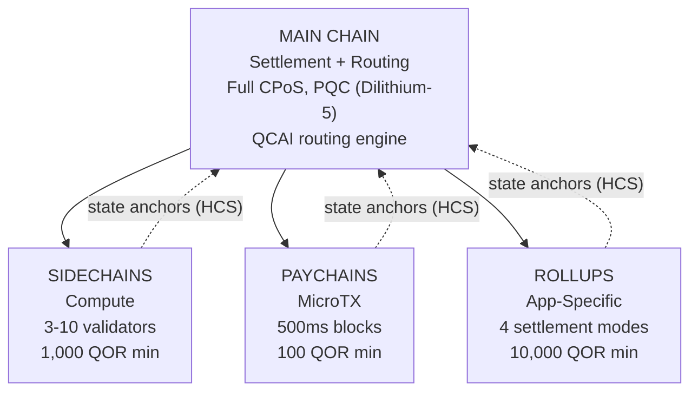

# Architettura Multilayer

QoreChain implementa un'**architettura gerarchica a 4 livelli** tramite il modulo `x/multilayer`. La main chain funge da radice di regolamento e di fiducia, mentre i livelli sussidiari (sidechain, paychain e rollup) gestiscono carichi di lavoro specializzati con diversi compromessi tra prestazioni e sicurezza.

---

## Panoramica del sistema

La gerarchia a 4 livelli mostrata di seguito illustra la main chain come radice di regolamento e di fiducia, con tre tipi di livello sussidiario che ancorano le proprie state root ad essa tramite gli Hierarchical Commitment Schemes (HCS).



```
                    +---------------------------+
                    |       MAIN CHAIN          |
                    |  (Settlement + Routing)   |
                    |  Full CPoS consensus      |
                    |  PQC-secured (Dilithium-5)|
                    |  QCAI routing engine       |
                    +------+------+------+------+
                           |      |      |
              +------------+      |      +------------+
              |                   |                    |
    +---------v--------+ +-------v--------+ +---------v---------+
    |   SIDECHAINS     | |   PAYCHAINS    | |     ROLLUPS       |
    |  (Compute)       | |  (MicroTX)     | |  (App-Specific)   |
    |  3-10 validators | |  500ms blocks  | |  4 settlement     |
    |  1,000 QOR min   | |  100 QOR min   | |    modes          |
    |  Max: 10         | |  Max: 50       | |  10,000 QOR min   |
    +------------------+ +----------------+ |  Max: 100         |
                                            +-------------------+
```

---

## Tipi di livello

### Main Chain

La main chain è la radice di fiducia per l'intero ecosistema QoreChain.

| Proprietà   | Valore                                                                          |
| ----------- | ------------------------------------------------------------------------------ |
| Consenso    | Full Triple-Pool CPoS (vedi [Meccanismo di consenso](/architecture/consensus-mechanism)) |
| Sicurezza   | Protetta con PQC tramite firme Dilithium-5                                     |
| Ruolo       | Livello di regolamento, archiviazione degli state anchor, QCAI routing engine, radice di fiducia |
| Tempo di blocco | \~5 secondi                                                                |

Tutti i livelli sussidiari ancorano periodicamente le proprie state root alla main chain tramite gli Hierarchical Commitment Schemes (HCS).

### Sidechain

Le sidechain gestiscono **operazioni a forte intensità di calcolo** come protocolli DeFi, motori di gioco ed elaborazione di dati IoT.

| Parametro                  | Valore            |
| -------------------------- | ----------------- |
| Validatori minimi          | 3                 |
| Validatori massimi         | 10                |
| Stake minimo del creatore  | 1,000 QOR         |
| Sidechain attive massime   | 10                |
| Domini di destinazione     | DeFi, Gaming, IoT |

### Paychain

Le paychain sono ottimizzate per **microtransazioni ad alta frequenza** con latenza minima.

| Parametro                 | Valore                                  |
| ------------------------- | --------------------------------------- |
| Tempo di blocco target    | 500 ms                                  |
| Paychain attive massime   | 50                                      |
| Stake minimo del creatore | 100 QOR                                 |
| Domini di destinazione    | Pagamenti, streaming, micro-transazioni |

### Rollup

I rollup sono **chain specifiche per applicazione** distribuite tramite il Rollup Development Kit (`x/rdk`). Si registrano come tipo di livello rollup all'interno del modulo multilayer.

| Parametro                 | Valore                                      |
| ------------------------- | ------------------------------------------- |
| Modalità di regolamento   | 4 (optimistic, zk, based, sovereign)        |
| Rollup attivi massimi     | 100                                         |
| Stake minimo del creatore | 10,000 QOR                                  |
| Tipo di livello           | `rollup`                                    |
| Domini di destinazione    | DeFi, Gaming, NFT, Enterprise               |

Il deployment e la configurazione dei rollup sono trattati in dettaglio nel [Rollup Development Kit](/architecture/rollup-development-kit).

---

## Routing delle transazioni QCAI

Il router QCAI valuta tutti i livelli attivi per ogni transazione in ingresso e seleziona la destinazione ottimale utilizzando un modello di punteggio ponderato a 4 fattori.

### Formula di punteggio

Ogni livello candidato riceve un punteggio composito (più alto è meglio):

```
Score = w_congestion * (1 - Congestion) + w_capability * Capability + w_cost * (1 - Cost) + w_latency * (1 - Latency)
```

| Fattore    | Peso   | Descrizione                                                                  |
| ---------- | ------ | --------------------------------------------------------------------------- |
| Congestion | 0.30   | Livello di carico attuale (invertito: minore congestione = punteggio più alto) |
| Capability | 0.40   | Quanto bene il livello soddisfa i requisiti della transazione               |
| Cost       | 0.20   | Moltiplicatore delle commissioni rispetto alla main chain (invertito: costo inferiore = punteggio più alto) |
| Latency    | 0.10   | Tempo previsto fino alla finalità (invertito: latenza inferiore = punteggio più alto) |

### Soglia di confidenza

Il router richiede un punteggio di confidenza minimo di **0.6** prima di instradare una transazione verso un livello sussidiario. Se nessun livello soddisfa questa soglia, la transazione viene inviata per impostazione predefinita alla main chain.

Il mittente della transazione può fornire un suggerimento di livello preferito. Se il livello preferito raggiunge un punteggio pari almeno all'80% della soglia di confidenza (ossia 0.48), viene accettato come destinazione del routing.

### Euristiche del payload

Quando i metadati dettagliati della transazione non sono disponibili, il router utilizza la dimensione del payload come segnale di classificazione:

| Dimensione del payload | Livello preferito | Motivazione                                  |
| ---------------------- | ----------------- | -------------------------------------------- |
| &lt; 256 bytes         | Paychain          | Probabilmente un semplice trasferimento o una microtransazione |
| 256 - 1,024 bytes      | Main Chain        | Complessità di transazione standard          |
| > 1,024 bytes          | Sidechain         | Probabilmente un'interazione complessa con un contratto |

---

## Hierarchical Commitment Schemes (HCS)

I livelli sussidiari sottopongono periodicamente il proprio stato alla main chain tramite **state anchor**. Ogni anchor contiene una prova crittografica dello stato della chain sussidiaria a una determinata altezza.

### Contenuto dell'anchor

| Campo                     | Descrizione                                          |
| ------------------------- | ---------------------------------------------------- |
| `layer_id`                | Identificatore del livello sussidiario               |
| `layer_height`            | Altezza del blocco sulla chain sussidiaria           |
| `state_root`              | Merkle root dell'albero di stato della chain sussidiaria |
| `validator_set_hash`      | Hash dell'insieme di validatori che ha firmato il commitment |
| `pqc_aggregate_signature` | Firma aggregata Dilithium-5 sui dati dell'anchor     |
| `transaction_count`       | Numero di transazioni dall'ultimo anchor             |
| `compressed_state_proof`  | Prova compressa della transizione di stato           |

### Invio dell'anchor

Gli anchor vengono inviati alla main chain tramite `MsgAnchorState`. Il keeper convalida l'anchor secondo i seguenti passaggi:

1. **Il livello esiste ed è attivo** — Il keeper verifica che il livello esista nello stato e abbia attualmente stato `active`.
2. **Intervallo minimo tra anchor trascorso** — Il keeper controlla che siano trascorsi almeno `min_anchor_interval` blocchi (predefinito: 100) dall'ultimo anchor per questo livello.
3. **Firma aggregata PQC** — Il keeper garantisce che la firma aggregata PQC sia presente e valida per i dati dell'anchor.

### Periodo di contestazione

Ogni anchor entra in un **periodo di contestazione** di **24 ore** (86,400 secondi, configurabile per livello). Durante questo periodo, qualsiasi parte può contestare l'anchor inviando una prova di frode tramite `MsgChallengeAnchor`. Se la prova di frode è valida, l'anchor viene invalidato e lo stato della chain sussidiaria viene riportato all'anchor precedente.

Una volta scaduto il periodo di contestazione senza una contestazione andata a buon fine, l'anchor è considerato finalizzato.

### Lettura degli anchor

A partire dalla versione della chain **v3.1.80**, gli anchor sono anche **leggibili** tramite il servizio di query multilayer. Due query espongono lo stato degli anchor sia su gRPC che su REST:

* **`Anchor`** (`/qorechain/multilayer/v1/anchor/{layer_id}`) — restituisce l'ultimo state anchor finalizzato per un livello.
* **`Anchors`** (`/qorechain/multilayer/v1/anchors/{layer_id}`) — restituisce la cronologia degli anchor per un livello.

Poiché ogni anchor porta una firma Dilithium-5 sul messaggio canonico `layer_id || layer_height || state_root || validator_set_hash` (verificata rispetto alla chiave PQC registrata del creatore del livello), un client può recuperare un anchor e verificarlo **offline**, senza fidarsi del nodo che lo serve. Questa è la primitiva on-chain alla base delle [ricevute di regolamento quantum-safe](/rollups/settlement-receipts) del Rollup Development Kit.

---

## Cross-Layer Fee Bundling (CLFB)

Il CLFB consente a un singolo pagamento di commissione sul livello di origine di coprire l'esecuzione attraverso più livelli in un percorso di transazione cross-layer.

### Calcolo della commissione

```
avgMultiplier = sum(layer_multiplier_i) / num_layers
bundledFee = (totalGas / 1000) * avgMultiplier
```

Dove:

* `layer_multiplier_i` è il moltiplicatore della commissione base per ciascun livello nel percorso della transazione (main chain = 1.0).
* `totalGas` è il consumo totale di gas stimato attraverso tutti i livelli.
* Il risultato è denominato in **uqor** con una commissione minima di 1 uqor.

### Esempio

Una transazione cross-layer tocca tre livelli: main chain (moltiplicatore 1.0), una sidechain (moltiplicatore 0.5) e una paychain (moltiplicatore 0.1).

```
avgMultiplier = (1.0 + 0.5 + 0.1) / 3 = 0.533
bundledFee = (150,000 / 1000) * 0.533 = 80 uqor
```

Il CLFB può essere abilitato o disabilitato globalmente tramite il parametro `cross_layer_fee_bundling`, e i singoli livelli possono escludersi tramite il proprio flag di configurazione `cross_layer_fee_bundling_enabled`.

---

## Ciclo di vita del livello

Ogni livello sussidiario attraversa un ciclo di vita ben definito:

```
Proposed --> Active --> Suspended --> Decommissioned
                  \                /
                   +-- Active <--+
```

| Stato              | Descrizione                                                                     | Transizioni consentite    |
| ------------------ | ------------------------------------------------------------------------------- | ------------------------- |
| **Proposed**       | Il livello è stato registrato ma non ancora attivato                            | Active, Decommissioned    |
| **Active**         | Il livello è operativo e accetta transazioni                                    | Suspended, Decommissioned |
| **Suspended**      | Il livello è temporaneamente in pausa (ad es. per manutenzione o per motivi di sicurezza) | Active, Decommissioned    |
| **Decommissioned** | Il livello è definitivamente disattivato (stato terminale)                      | Nessuna                   |

Le transizioni di stato sono applicate dal keeper. Le transizioni non valide (ad es. da Decommissioned ad Active) vengono rifiutate.

---

## Parametri

| Parametro                      | Tipo   | Predefinito     | Descrizione                                            |
| ------------------------------ | ------ | --------------- | ------------------------------------------------------- |
| `max_sidechains`               | uint64 | `10`            | Numero massimo di sidechain attive                     |
| `max_paychains`                | uint64 | `50`            | Numero massimo di paychain attive                      |
| `min_anchor_interval`          | uint64 | `100`           | Blocchi minimi tra gli state anchor                    |
| `max_anchor_interval`          | uint64 | `1,000`         | Blocchi massimi tra gli state anchor (anchor forzato)  |
| `default_challenge_period`     | uint64 | `86,400`        | Periodo di contestazione predefinito in secondi (24 ore) |
| `min_sidechain_stake`          | string | `1,000,000,000` | Stake minimo per creare una sidechain (1,000 QOR in uqor) |
| `min_paychain_stake`           | string | `100,000,000`   | Stake minimo per creare una paychain (100 QOR in uqor) |
| `routing_enabled`              | bool   | `true`          | Abilita il routing delle transazioni basato su QCAI    |
| `routing_confidence_threshold` | string | `0.6`           | Confidenza minima per le decisioni di routing QCAI     |
| `cross_layer_fee_bundling`     | bool   | `true`          | Abilita il Cross-Layer Fee Bundling globale            |
