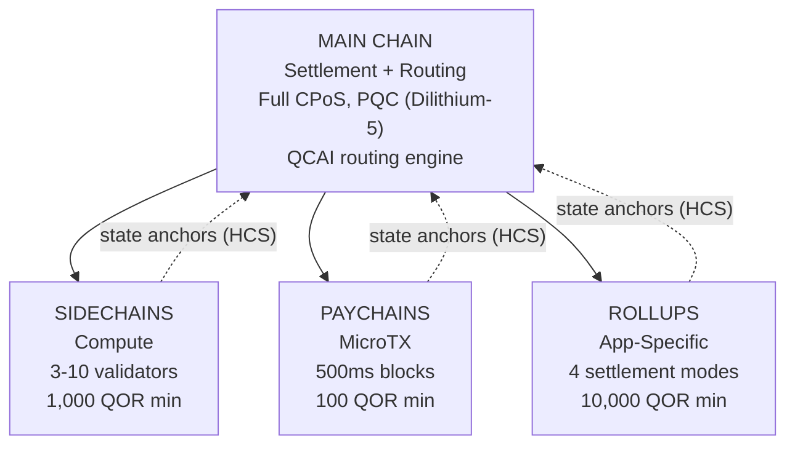

# Architettura Multilivello

QoreChain implementa un'**architettura gerarchica di chain a 4 livelli** attraverso il modulo `x/multilayer`. La chain principale funge da radice di settlement e di fiducia, mentre i livelli sussidiari (sidechain, paychain e rollup) gestiscono carichi di lavoro specializzati con diversi compromessi di prestazioni e sicurezza.

---

## Panoramica del sistema

La gerarchia a 4 livelli seguente mostra la chain principale come radice di settlement e di fiducia, con tre tipi di livello sussidiario che ancorano le proprie radici di stato ad essa tramite gli Hierarchical Commitment Schemes (HCS).



```
                    +---------------------------+
                    |       MAIN CHAIN          |
                    |  (Settlement + Routing)   |
                    |  Full CPoS consensus      |
                    |  PQC-secured (Dilithium-5)|
                    |  QCAI routing engine       |
                    +------+------+------+------+
                           |      |      |
              +------------+      |      +------------+
              |                   |                    |
    +---------v--------+ +-------v--------+ +---------v---------+
    |   SIDECHAINS     | |   PAYCHAINS    | |     ROLLUPS       |
    |  (Compute)       | |  (MicroTX)     | |  (App-Specific)   |
    |  3-10 validators | |  500ms blocks  | |  4 settlement     |
    |  1,000 QOR min   | |  100 QOR min   | |    modes          |
    |  Max: 10         | |  Max: 50       | |  10,000 QOR min   |
    +------------------+ +----------------+ |  Max: 100         |
                                            +-------------------+
```

---

## Tipi di livello

### Chain principale

La chain principale è la radice di fiducia per l'intero ecosistema QoreChain.

| Proprietà   | Valore                                                                          |
| ----------- | ------------------------------------------------------------------------------ |
| Consenso    | Full Triple-Pool CPoS (vedi [Meccanismo di Consenso](/architecture/consensus-mechanism)) |
| Sicurezza   | Protetta con PQC tramite firme Dilithium-5                                      |
| Ruolo       | Livello di settlement, archiviazione degli ancoraggi di stato, motore di routing QCAI, radice di fiducia |
| Block time  | \~5 secondi                                                                    |

Tutti i livelli sussidiari ancorano periodicamente le proprie radici di stato alla chain principale tramite gli Hierarchical Commitment Schemes (HCS).

### Sidechain

Le sidechain gestiscono **operazioni a uso intensivo di calcolo** come protocolli DeFi, motori di gioco ed elaborazione di dati IoT.

| Parametro                 | Valore            |
| ------------------------- | ----------------- |
| Validatori minimi         | 3                 |
| Validatori massimi        | 10                |
| Stake minimo del creatore | 1.000 QOR         |
| Sidechain attive massime  | 10                |
| Domini di destinazione    | DeFi, Gaming, IoT |

### Paychain

Le paychain sono ottimizzate per **microtransazioni ad alta frequenza** con latenza minima.

| Parametro                | Valore                                  |
| ------------------------ | --------------------------------------- |
| Block time obiettivo      | 500 ms                                  |
| Paychain attive massime  | 50                                      |
| Stake minimo del creatore | 100 QOR                                |
| Domini di destinazione   | Pagamenti, streaming, micro-transazioni |

### Rollup

I rollup sono **chain specifiche per applicazione** distribuite tramite il Rollup Development Kit (`x/rdk`). Si registrano come tipo di livello rollup all'interno del modulo multilayer.

| Parametro              | Valore                                      |
| ---------------------- | ------------------------------------------- |
| Modalità di settlement  | 4 (optimistic, zk, based, sovereign)        |
| Rollup attivi massimi  | 100                                         |
| Stake minimo del creatore | 10.000 QOR                              |
| Tipo di livello        | `rollup`                                    |
| Domini di destinazione | DeFi, Gaming, NFT, Enterprise               |

La distribuzione e la configurazione dei rollup sono trattate in dettaglio nel [Rollup Development Kit](/architecture/rollup-development-kit).

---

## Routing delle transazioni QCAI

Il router QCAI valuta tutti i livelli attivi per ogni transazione in arrivo e seleziona la destinazione ottimale utilizzando un modello di scoring ponderato a 4 fattori.

### Formula di scoring

Ogni livello candidato riceve un punteggio composito (più alto è meglio):

```
Score = w_congestion * (1 - Congestion) + w_capability * Capability + w_cost * (1 - Cost) + w_latency * (1 - Latency)
```

| Fattore     | Peso   | Descrizione                                                                 |
| ----------- | ------ | --------------------------------------------------------------------------- |
| Congestion  | 0.30   | Livello di carico attuale (invertito: minore congestione = punteggio più alto) |
| Capability  | 0.40   | Quanto bene il livello corrisponde ai requisiti della transazione           |
| Cost        | 0.20   | Moltiplicatore di commissione rispetto alla chain principale (invertito: minore costo = punteggio più alto) |
| Latency     | 0.10   | Tempo previsto fino alla finalità (invertito: minore latenza = punteggio più alto) |

### Soglia di confidenza

Il router richiede un punteggio di confidenza minimo di **0.6** prima di instradare una transazione a un livello sussidiario. Se nessun livello soddisfa questa soglia, la transazione viene assegnata per impostazione predefinita alla chain principale.

Il mittente della transazione può fornire un suggerimento di livello preferito. Se il livello preferito ottiene un punteggio di almeno l'80% della soglia di confidenza (ovvero 0,48), viene accettato come destinazione di routing.

### Euristiche del payload

Quando i metadati dettagliati della transazione non sono disponibili, il router utilizza la dimensione del payload come segnale di classificazione:

| Dimensione del payload | Livello preferito | Motivazione                                  |
| ---------------------- | ----------------- | -------------------------------------------- |
| &lt; 256 byte          | Paychain          | Probabilmente un semplice trasferimento o microtransazione |
| 256 - 1.024 byte       | Chain principale  | Complessità di transazione standard          |
| > 1.024 byte           | Sidechain         | Probabilmente un'interazione complessa con uno smart contract |

---

## Hierarchical Commitment Schemes (HCS)

I livelli sussidiari committano periodicamente il proprio stato alla chain principale tramite **ancoraggi di stato**. Ogni ancoraggio contiene una prova crittografica dello stato della chain sussidiaria a una data altezza.

### Contenuto dell'ancoraggio

| Campo                     | Descrizione                                          |
| ------------------------- | ---------------------------------------------------- |
| `layer_id`                | Identificatore del livello sussidiario               |
| `layer_height`            | Altezza del blocco sulla chain sussidiaria           |
| `state_root`              | Radice Merkle dell'albero di stato della chain sussidiaria |
| `validator_set_hash`      | Hash dell'insieme dei validatori che ha firmato il commitment |
| `pqc_aggregate_signature` | Firma aggregata Dilithium-5 sui dati dell'ancoraggio |
| `transaction_count`       | Numero di transazioni dall'ultimo ancoraggio         |
| `compressed_state_proof`  | Prova compressa della transizione di stato           |

### Invio dell'ancoraggio

Gli ancoraggi vengono inviati alla chain principale tramite `MsgAnchorState`. Il keeper convalida l'ancoraggio secondo i seguenti passaggi:

1. **Il livello esiste ed è attivo** — Il keeper verifica che il livello esista nello stato e abbia attualmente lo stato `active`.
2. **Intervallo minimo di ancoraggio trascorso** — Il keeper verifica che siano trascorsi almeno `min_anchor_interval` blocchi (predefinito: 100) dall'ultimo ancoraggio per questo livello.
3. **Firma aggregata PQC** — Il keeper si assicura che la firma aggregata PQC sia presente e valida per i dati dell'ancoraggio.

### Periodo di contestazione

Ogni ancoraggio entra in un **periodo di contestazione** di **24 ore** (86.400 secondi, configurabile per livello). Durante questo periodo, qualsiasi parte può contestare l'ancoraggio inviando una prova di frode tramite `MsgChallengeAnchor`. Se la prova di frode è valida, l'ancoraggio viene invalidato e lo stato della chain sussidiaria viene riportato all'ancoraggio precedente.

Dopo la scadenza del periodo di contestazione senza una contestazione riuscita, l'ancoraggio è considerato finalizzato.

---

## Cross-Layer Fee Bundling (CLFB)

Il CLFB consente a un singolo pagamento di commissione sul livello di origine di coprire l'esecuzione su più livelli in un percorso di transazione cross-layer.

### Calcolo della commissione

```
avgMultiplier = sum(layer_multiplier_i) / num_layers
bundledFee = (totalGas / 1000) * avgMultiplier
```

Dove:

* `layer_multiplier_i` è il moltiplicatore di commissione base per ogni livello nel percorso della transazione (chain principale = 1.0).
* `totalGas` è il consumo totale stimato di gas su tutti i livelli.
* Il risultato è denominato in **uqor** con una commissione minima di 1 uqor.

### Esempio

Una transazione cross-layer tocca tre livelli: chain principale (moltiplicatore 1.0), una sidechain (moltiplicatore 0.5) e una paychain (moltiplicatore 0.1).

```
avgMultiplier = (1.0 + 0.5 + 0.1) / 3 = 0.533
bundledFee = (150,000 / 1000) * 0.533 = 80 uqor
```

Il CLFB può essere abilitato o disabilitato globalmente tramite il parametro `cross_layer_fee_bundling`, e i singoli livelli possono rinunciarvi tramite il proprio flag di configurazione `cross_layer_fee_bundling_enabled`.

---

## Ciclo di vita del livello

Ogni livello sussidiario attraversa un ciclo di vita ben definito:

```
Proposed --> Active --> Suspended --> Decommissioned
                  \                /
                   +-- Active <--+
```

| Stato              | Descrizione                                                                     | Transizioni consentite    |
| ------------------ | ------------------------------------------------------------------------------- | ------------------------- |
| **Proposed**       | Il livello è stato registrato ma non ancora attivato                            | Active, Decommissioned    |
| **Active**         | Il livello è operativo e accetta transazioni                                    | Suspended, Decommissioned |
| **Suspended**      | Il livello è temporaneamente in pausa (ad es. per manutenzione o per motivi di sicurezza) | Active, Decommissioned    |
| **Decommissioned** | Il livello è chiuso permanentemente (stato terminale)                           | Nessuna                   |

Le transizioni di stato sono applicate dal keeper. Le transizioni non valide (ad es. da Decommissioned ad Active) vengono rifiutate.

---

## Parametri

| Parametro                      | Tipo   | Predefinito     | Descrizione                                             |
| ------------------------------ | ------ | --------------- | ------------------------------------------------------- |
| `max_sidechains`               | uint64 | `10`            | Numero massimo di sidechain attive                      |
| `max_paychains`                | uint64 | `50`            | Numero massimo di paychain attive                       |
| `min_anchor_interval`          | uint64 | `100`           | Blocchi minimi tra gli ancoraggi di stato               |
| `max_anchor_interval`          | uint64 | `1,000`         | Blocchi massimi tra gli ancoraggi di stato (ancoraggio forzato) |
| `default_challenge_period`     | uint64 | `86,400`        | Periodo di contestazione predefinito in secondi (24 ore) |
| `min_sidechain_stake`          | string | `1,000,000,000` | Stake minimo per creare una sidechain (1.000 QOR in uqor) |
| `min_paychain_stake`           | string | `100,000,000`   | Stake minimo per creare una paychain (100 QOR in uqor)  |
| `routing_enabled`              | bool   | `true`          | Abilita il routing delle transazioni basato su QCAI     |
| `routing_confidence_threshold` | string | `0.6`           | Confidenza minima per le decisioni di routing QCAI      |
| `cross_layer_fee_bundling`     | bool   | `true`          | Abilita il Cross-Layer Fee Bundling globale             |
