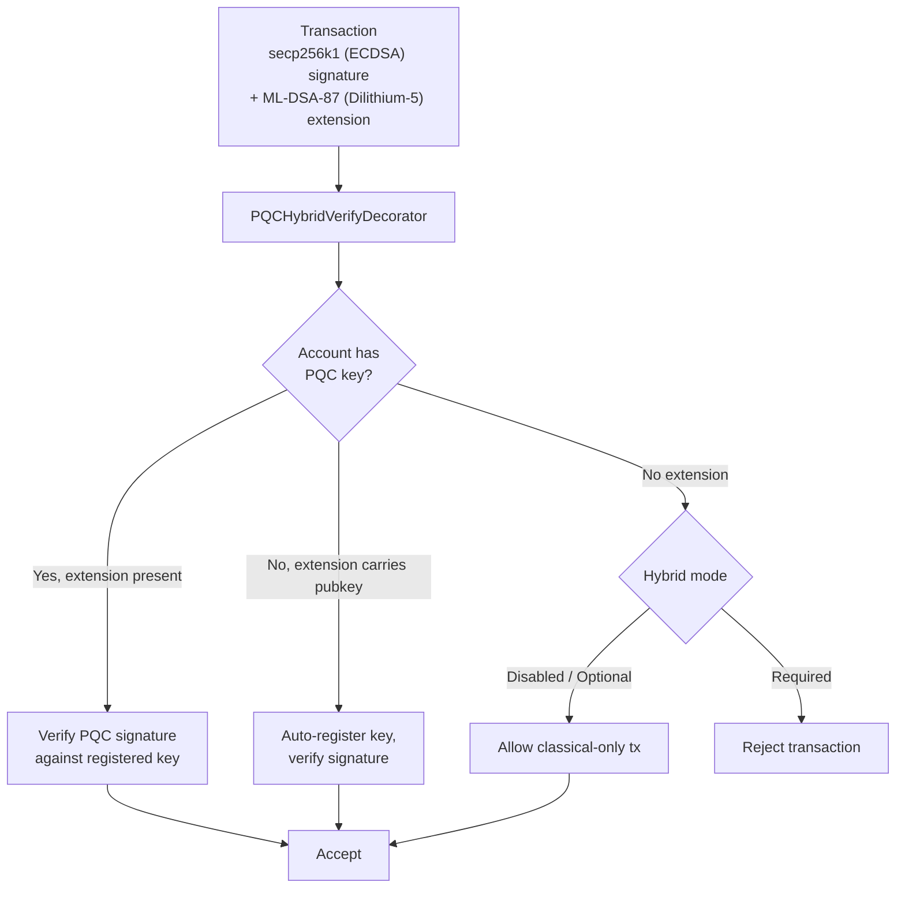

# Sicurezza Post-Quantistica

QoreChain è costruita con la **crittografia post-quantistica (PQC) sin dal genesis** — non aggiunta successivamente come aggiornamento. Il modulo `x/pqc` fornisce firme digitali basate su reticoli e incapsulamento di chiavi come primitive crittografiche principali, con un framework di agilità degli algoritmi controllato dalla governance per una resilienza a lungo termine.

La baseline PQC completa — **Dilithium-5 (firme) + ML-KEM-1024 (KEM) + SHAKE-256 (hash)** — è ora completa ed è il valore predefinito della rete. A partire dall'attuale versione della chain (**v3.1.77**), le firme ibride sono **richieste per impostazione predefinita** sul percorso delle transazioni cosmos: `hybrid_signature_mode = required` e `allow_classical_fallback = false`. Ogni transazione del percorso cosmos deve recare una firma Dilithium-5 accanto alla sua firma classica secp256k1; le transazioni solo classiche da un account PQC vengono rifiutate e il percorso di downgrade classico è chiuso.

## Principi di progettazione

* **PQC richiesta per impostazione predefinita**: Le firme post-quantistiche sono obbligatorie sul percorso cosmos. Le sole firme classiche secp256k1 non sono più sufficienti — `allow_classical_fallback = false`.
* **Ibrida per impostazione predefinita**: Le transazioni cosmos recano simultaneamente sia una firma classica secp256k1 sia una firma PQC Dilithium-5. Il fallback solo classico è chiuso.
* **Agilità degli algoritmi**: Il registro degli algoritmi crittografici è controllato dalla governance, consentendo alla rete di adottare nuovi algoritmi o di deprecare quelli compromessi senza hard fork.
* **Verifica deterministica**: Tutta la verifica delle firme è deterministica e riproducibile su tutti i nodi validatori.

## Algoritmi supportati

| Algoritmo       | Standard             | Categoria         | Livello NIST | Chiave pubblica | Chiave privata | Firma / Ciphertext | Segreto condiviso |
| --------------- | -------------------- | ----------------- | ------------ | --------------- | -------------- | ------------------ | ----------------- |
| **Dilithium-5** | ML-DSA-87 (FIPS 204) | Firma             | 5            | 2.592 byte      | 4.896 byte     | 4.627 byte         | --                |
| **ML-KEM-1024** | FIPS 203             | Incapsulamento di chiavi | 5     | 1.568 byte      | 3.168 byte     | 1.568 byte         | 32 byte           |

Entrambi gli algoritmi operano al **NIST Security Level 5**, la più alta categoria di sicurezza standardizzata, fornendo una protezione equivalente ad AES-256 contro avversari sia classici che quantistici.

## Backend crittografico

Le operazioni PQC sono implementate in un backend crittografico ad alte prestazioni e memory-safe che espone la firma, la verifica e l'incapsulamento di chiavi basati su reticoli al runtime di QoreChain. Il backend fornisce:

Operazioni specifiche per algoritmo:

* Generazione di chiavi, firma e verifica Dilithium-5
* Generazione di chiavi, incapsulamento e decapsulamento ML-KEM-1024
* Generazione deterministica del beacon casuale (`seed`, `epoch`)

Operazioni consapevoli dell'algoritmo:

* `Keygen(algorithmID)` — Genera una coppia di chiavi per qualsiasi algoritmo registrato
* `Sign(algorithmID, privkey, message)` — Crea una firma
* `Verify(algorithmID, pubkey, message, signature)` — Verifica una firma
* `AlgorithmInfo(algorithmID)` — Interroga le dimensioni di chiave/output
* `ListAlgorithms()` — Enumera tutti gli algoritmi supportati

Tutte le operazioni di firma e verifica sono deterministiche e producono risultati identici su ogni nodo validatore e piattaforma supportata.

Queste stesse primitive — ML-DSA (FIPS-204), ML-KEM (FIPS-203) e SHAKE-256 (FIPS-202) — sono disponibili per wallet e integratori attraverso la libreria open-source [**qorechain-pqc**](https://github.com/qorechain/qorechain-pqc), che fornisce un'unica API coerente e byte-compatibile in sei linguaggi (JavaScript/TypeScript, Rust, Go, C, Python, Java). Vedi [Firma Post-Quantistica](/developer-guide/post-quantum-signing).

## Registrazione delle chiavi

Gli account registrano le chiavi PQC tramite `MsgRegisterPQCKey` (legacy, predefinito Dilithium-5) o `MsgRegisterPQCKeyV2` (consapevole dell'algoritmo). Ogni messaggio include:

* **Sender**: L'indirizzo dell'account che registra la chiave.
* **PublicKey**: I byte della chiave pubblica PQC.
* **AlgorithmID**: L'identificatore dell'algoritmo PQC (solo v2).
* **KeyType**: Una di tre modalità di registrazione:

| Tipo di chiave   | Descrizione                                                              |
| ---------------- | ------------------------------------------------------------------------ |
| `hybrid`         | Sia chiavi classiche (ECDSA) che PQC. Le transazioni recano doppie firme. |
| `pqc_only`       | Solo chiave PQC. La firma classica non è richiesta.                      |
| `classical_only` | Solo chiave classica. Nessuna protezione PQC (non consigliato).          |

## Firme ibride

Il sistema di firme ibride richiede che le transazioni del percorso cosmos rechino **sia** una firma classica sia una firma PQC simultaneamente. Ciò fornisce una difesa in profondità: anche se uno schema viene violato, l'altro protegge la transazione.

Con il valore predefinito della rete `hybrid_signature_mode = required`, ogni transazione del percorso cosmos deve includere l'estensione Dilithium-5 accanto alla firma secp256k1. Le uniche esenzioni (per il bootstrap) sono i **gentx di genesis (altezza 0)** e le **transazioni di registrazione/migrazione delle chiavi PQC** (`MsgRegisterPQCKey`, `MsgRegisterPQCKeyV2`, `MsgMigratePQCKey`), a cui è consentito di essere solo classiche affinché gli account possano registrare la loro prima chiave PQC.

**Le transazioni EVM non sono interessate.** Le transazioni EVM vengono autenticate su un percorso ante `eth_secp256k1` separato (il percorso del QoreChain EVM Engine) e non richiedono mai l'estensione ibrida PQC. Il requisito ibrido si applica solo al percorso delle transazioni cosmos.

### Flusso di cofirma

Per produrre una transazione cosmos conforme, la firma classica secp256k1 viene calcolata sui sign bytes standard (che escludono l'estensione PQC), e una firma Dilithium-5 viene calcolata e allegata come estensione `PQCHybridSignature`. Il tooling standard CosmJS / relayer deve produrre questa estensione per transare sul percorso cosmos. Oggi ciò viene fatto tramite:

* `qorechaind tx pqc gen-key` — genera una chiave Dilithium-5.
* `qorechaind tx pqc cosign` — allega la cofirma Dilithium-5 a una transazione.
* La firma ibrida del QoreChain SDK — `buildHybridTx` con `includePqcPublicKey` (incorpora la chiave pubblica PQC per la registrazione automatica al primo utilizzo).

*Una transazione firmata con secp256k1 (ECDSA) più ML-DSA-87 (Dilithium-5), verificata dall'ante handler nella modalità di applicazione a livello di chain.*



### Formato dell'estensione TX

Le firme PQC vengono allegate alle transazioni come **estensione TX** con il type URL `/qorechain.pqc.v1.PQCHybridSignature`:

```text
{
  "algorithm_id": 1,
  "pqc_signature": "<4627 bytes for Dilithium-5>",
  "pqc_public_key": "<2592 bytes, optional>"
}
```

Il campo `pqc_public_key` è opzionale. Se presente e l'account non ha una chiave PQC registrata, l'ante handler eseguirà la **registrazione automatica** della chiave al primo utilizzo.

### PQCHybridVerifyDecorator

L'ante handler `PQCHybridVerifyDecorator` elabora le firme ibride con una logica di verifica a tre vie:

| Scenario | L'account ha una chiave PQC | Estensione presente | Chiave pubblica nell'estensione | Risultato                                           |
| -------- | --------------------------- | ------------------- | ------------------------------- | --------------------------------------------------- |
| Path 1   | Sì                          | Sì                  | --                              | Verifica la firma PQC rispetto alla chiave registrata |
| Path 2   | No                          | Sì                  | Sì                              | Registrazione automatica della chiave, verifica della firma |
| Path 3a  | No                          | No                  | --                              | **Modalità Optional**: Consente la transazione solo classica |
| Path 3b  | No                          | No                  | --                              | **Modalità Required**: Rifiuta la transazione       |
| Path 4   | Sì                          | No                  | --                              | Gestito dal PQCVerifyDecorator standard             |

### Modalità delle firme ibride

Il livello di applicazione ibrida a livello di chain è configurabile dalla governance. Il **valore predefinito attuale della rete è `required`**:

| Modalità     | ID | Predefinito | Comportamento                                                                                                    |
| ------------ | -- | ----------- | ----------------------------------------------------------------------------------------------------------------- |
| **Disabled** | 0  | No          | Solo firme classiche. Le estensioni PQC vengono ignorate.                                                        |
| **Optional** | 1  | No          | Le estensioni PQC vengono verificate se presenti. Gli account senza chiavi PQC possono transare con sole firme classiche. |
| **Required** | 2  | **Sì**      | Tutte le transazioni del percorso cosmos devono recare sia firme classiche che PQC. Le transazioni senza un'estensione PQC vengono rifiutate. |

La rete ha completato la sua migrazione: **Optional** (genesis) → **Required** (il valore predefinito attuale dalla v3.1.71, con `allow_classical_fallback = false`). Le tre modalità rimangono controllate dalla governance e possono essere modificate tramite proposta.

## Framework di agilità degli algoritmi

Il framework di agilità degli algoritmi fornisce un registro controllato dalla governance per gli algoritmi PQC, consentendo alla rete di aggiungere nuovi algoritmi, deprecare quelli vulnerabili e migrare gli account — il tutto senza hard fork.

### Ciclo di vita dell'algoritmo

Ogni algoritmo registrato ha uno stato del ciclo di vita:

```
active --> migrating --> deprecated --> disabled
```

| Stato          | Descrizione                                                                                                                                 |
| -------------- | ------------------------------------------------------------------------------------------------------------------------------------------- |
| **Active**     | Pienamente operativo. Vengono accettate nuove registrazioni di chiavi e verifiche.                                                          |
| **Migrating**  | Il periodo di doppia firma è attivo. Gli account sono incoraggiati a migrare all'algoritmo sostitutivo. Vengono accettate sia le vecchie che le nuove firme. |
| **Deprecated** | Le firme esistenti possono ancora essere verificate, ma non vengono accettate nuove registrazioni di chiavi.                                |
| **Disabled**   | Kill switch di emergenza. L'algoritmo non può verificare alcuna firma. Utilizzato quando viene scoperta una vulnerabilità.                  |

### Migrazione a doppia firma

Quando un algoritmo viene deprecato, inizia un **periodo di migrazione** (predefinito: 1.000.000 blocchi, circa 69 giorni a 6s/blocco). Durante questo periodo:

1. Gli account con chiavi che utilizzano l'algoritmo deprecato devono migrare al sostitutivo.
2. La migrazione richiede doppie firme (`MsgMigratePQCKey`): una dalla vecchia chiave e una dalla nuova chiave, a dimostrazione del possesso di entrambe.
3. Entrambi gli algoritmi vengono accettati per la verifica per tutta la durata del periodo di migrazione.

### Messaggi di governance

| Messaggio               | Descrizione                                                                                                                                                       |
| ----------------------- | ----------------------------------------------------------------------------------------------------------------------------------------------------------------- |
| `MsgAddAlgorithm`       | Propone l'aggiunta di un nuovo algoritmo PQC al registro. Include le `AlgorithmInfo` complete (nome, categoria, livello NIST, dimensioni delle chiavi). Deve essere inviato tramite la governance. |
| `MsgDeprecateAlgorithm` | Avvia il processo di deprecazione di un algoritmo. Specifica l'algoritmo sostitutivo e il periodo di migrazione in blocchi.                                       |
| `MsgDisableAlgorithm`   | Disabilita immediatamente un algoritmo in emergenza. Richiede una stringa di motivazione. Utilizzato quando viene scoperta una vulnerabilità crittografica.      |

### Estensibilità

L'aggiunta di un nuovo algoritmo richiede:

1. Implementare l'algoritmo nel backend crittografico dietro l'interfaccia unificata di firma e verifica.
2. Inviare una proposta di governance `MsgAddAlgorithm` con i metadati dell'algoritmo.
3. Una volta approvato, l'algoritmo diventa disponibile per la registrazione delle chiavi e la verifica.

## Hash SHAKE-256

A partire dalla v3.1.73, **SHAKE-256** (funzione a output estendibile SHA-3) è l'**hash applicativo predefinito** in tutta QoreChain — fornito dal package `qorehash` — completando la baseline crittografica resistente ai quanti accanto alle firme Dilithium-5 e all'incapsulamento di chiavi ML-KEM-1024. Il modulo `x/pqc` fornisce utilità SHAKE-256 in puro Go:

| Funzione                           | Descrizione                       | Output           |
| ---------------------------------- | --------------------------------- | ---------------- |
| `SHAKE256Hash(data, outputLen)`    | Digest SHAKE-256 a lunghezza variabile | Lunghezza arbitraria |
| `SHAKE256Hash32(data)`             | Digest SHAKE-256 standard a 256 bit | 32 byte          |
| `SHAKE256ConcatHash(left, right)`  | Hash di input concatenati         | 32 byte          |
| `SHAKE256DomainHash(domain, data)` | Hash separato per dominio         | 32 byte          |

Queste utilità supportano l'hash applicativo predefinito e vengono utilizzate per:

* Hashing dei nodi dell'albero Merkle
* Hash commitment nelle attestazioni cross-layer
* Separazione per dominio per diversi contesti di hash (ad es. `"leaf:"` vs `"node:"`)

## Bridge PQC

Tutte le attestazioni e i commitment di stato del bridge cross-chain utilizzano firme **Dilithium-5**. Il modulo `x/multilayer` richiede firme aggregate PQC su ogni invio di `MsgAnchorState`, e i commitment ML-KEM proteggono i canali di scambio di chiavi tra i relayer del bridge.

Ciò garantisce che la sicurezza cross-chain non venga degradata dall'uso della crittografia classica nell'infrastruttura del bridge, mantenendo la resistenza ai quanti su tutto lo stack del protocollo.

## Parametri del modulo

| Parametro                  | Tipo                | Predefinito       | Descrizione                                           |
| -------------------------- | ------------------- | ----------------- | ----------------------------------------------------- |
| `pqc_primary`              | bool                | `true`            | PQC è lo schema di firma principale                   |
| `allow_classical_fallback` | bool                | `false`           | Il fallback solo classico è chiuso; le tx cosmos devono essere ibride |
| `min_security_level`       | int32               | `5`               | Livello di sicurezza NIST minimo per gli algoritmi accettati |
| `default_migration_blocks` | int64               | `1,000,000`       | Periodo di migrazione a doppia firma predefinito in blocchi |
| `default_signature_algo`   | AlgorithmID         | `1` (Dilithium-5) | Algoritmo di firma predefinito per le nuove registrazioni di chiavi |
| `hybrid_signature_mode`    | HybridSignatureMode | `2` (Required)    | Livello di applicazione delle firme ibride a livello di chain |

## Correlati

* [Firma Post-Quantistica](/developer-guide/post-quantum-signing) — la libreria open-source `qorechain-pqc` (sei linguaggi) per queste primitive e la firma ibrida.
* [Configurazione del wallet](/getting-started/wallet-setup) — creare e gestire account protetti da PQC.
* [Account SDK e firma PQC](/sdk/concepts/accounts-pqc) — chiavi e firma post-quantistica dal codice.
* [Parametri della chain](/appendix/chain-parameters) — algoritmi predefiniti e impostazioni di migrazione.
* [Architettura del bridge](/architecture/bridge-architecture) — verifica PQC sui pacchetti cross-chain.
