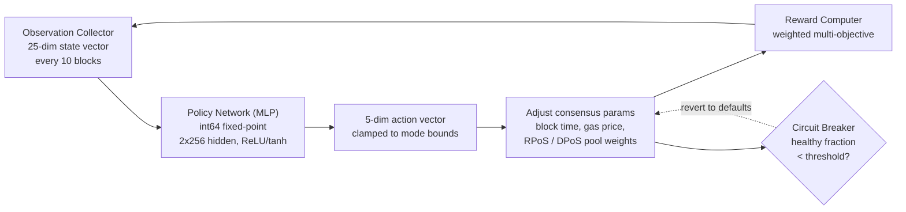

# PRISM Consensus Engine

QoreChain incorpora **PRISM** (Policy-driven Reinforcement-learning for Intelligent State Machines), un livello di ottimizzazione tramite apprendimento per rinforzo, direttamente nel livello di consenso tramite il modulo `x/rlconsensus`. PRISM osserva le metriche della chain ogni N blocchi, esegue l'inferenza attraverso una rete neurale a virgola fissa e propone aggiustamenti dei parametri di consenso — il tutto in modo deterministico, senza aritmetica in virgola mobile nei percorsi critici per il consenso.

*Il ciclo di ottimizzazione di PRISM: osserva lo stato della chain, esegue l'inferenza della policy, limita e applica le modifiche dei parametri, quindi retroaziona il risultato.*



---

## Panoramica dell'architettura

PRISM è composto da quattro componenti:

1. **Observation Collector** — Raccoglie vettori di stato della chain a 25 dimensioni a intervalli configurabili.
2. **Policy Network (MLP)** — Un percettrone multistrato nativo in Go che mappa le osservazioni sulle azioni.
3. **Reward Computer** — Valuta la qualità delle modifiche dei parametri utilizzando una funzione multi-obiettivo ponderata.
4. **Circuit Breaker** — Monitora la salute della chain e ripristina tutti i parametri regolati da PRISM se viene rilevata instabilità.

Tutti i componenti operano all'interno del ciclo di vita ABCI e producono output deterministici e verificabili su tutti i nodi validatori.

---

## Policy Network

La policy network è un percettrone multistrato (MLP) feedforward implementato interamente in Go con **aritmetica a virgola fissa int64** (scalata di 10^8).

### Architettura della rete

| Proprietà             | Valore                             |
| --------------------- | ---------------------------------- |
| Dimensioni di input   | 25                                 |
| Strati nascosti       | 2                                  |
| Dimensioni degli strati nascosti | 256, 256                |
| Dimensioni di output  | 5                                  |
| Attivazione (nascosti)| ReLU                               |
| Attivazione (output)  | tanh                               |
| Parametri totali      | 73.733                             |
| Precisione            | virgola fissa int64 (scalata di 10^8) |

### Suddivisione del conteggio dei parametri

```
Layer 1: 25 * 256 + 256   =  6,656  (input -> hidden_1)
Layer 2: 256 * 256 + 256   = 65,792  (hidden_1 -> hidden_2)
Layer 3: 256 * 5 + 5       =  1,285  (hidden_2 -> output)
Total:                       73,733
```

### Aritmetica a virgola fissa

Tutti i calcoli dell'MLP utilizzano valori `int64` scalati di `FixedPointScale = 10^8`. Ciò elimina il non determinismo derivante dalle differenze di arrotondamento in virgola mobile IEEE 754 tra le diverse piattaforme hardware.

* **Moltiplicazione**: `fixMul(a, b) = (a / SCALE) * b + (a % SCALE) * b / SCALE` (suddivisa per prevenire l'overflow)
* **ReLU**: `relu(x) = max(0, x)`
* **tanh**: Approssimante di Padé `tanh(x) ~ x * (3*S - x^2) / (3*S + x^2)` per `|x| <= 2.5*SCALE`, altrimenti limitato a +/- SCALE

I pesi della policy sono memorizzati on-chain come vettore `[]int64` appiattito e possono essere aggiornati tramite proposta di governance.

---

## Vettore di osservazione

PRISM raccoglie un vettore di osservazione a 25 dimensioni a ogni intervallo di osservazione (predefinito: ogni 10 blocchi).

| Indice | Dimensione             | Descrizione                                      |
| ------ | ---------------------- | ------------------------------------------------ |
| 0      | `block_utilization`    | Gas del blocco utilizzato / limite di gas del blocco |
| 1      | `tx_count`             | Numero di transazioni nel blocco                 |
| 2      | `avg_tx_size`          | Dimensione media delle transazioni in byte       |
| 3      | `block_time`           | Tempo trascorso dal blocco precedente (ms)       |
| 4      | `block_time_delta`     | Block time meno il block time obiettivo (ms)     |
| 5      | `gas_price_50th`       | Prezzo del gas mediano                            |
| 6      | `gas_price_95th`       | Prezzo del gas al 95° percentile                 |
| 7      | `mempool_size`         | Numero di transazioni in attesa                  |
| 8      | `mempool_bytes`        | Byte totali delle transazioni in attesa          |
| 9      | `validator_count`      | Conteggio dei validatori attivi                  |
| 10     | `validator_gini`       | Coefficiente di Gini della distribuzione del potere dei validatori |
| 11     | `missed_block_ratio`   | Frazione di validatori che hanno mancato la firma |
| 12     | `avg_commit_latency`   | Latenza media del round di commit (ms)           |
| 13     | `max_commit_latency`   | Latenza massima del round di commit (ms)         |
| 14     | `precommit_ratio`      | Frazione di precommit ricevuti                   |
| 15     | `failed_tx_ratio`      | Frazione di transazioni fallite                  |
| 16     | `avg_gas_per_tx`       | Gas medio consumato per transazione              |
| 17     | `reward_per_validator` | Ricompensa media per validatore (uqor)           |
| 18     | `slash_count`          | Numero di eventi di slashing nella finestra di osservazione |
| 19     | `jail_count`           | Numero di eventi di jail nella finestra di osservazione |
| 20     | `inflation_rate`       | Tasso di emissione attuale                       |
| 21     | `bonded_ratio`         | Token bonded / fornitura totale                  |
| 22     | `reputation_mean`      | Punteggio di reputazione medio tra i validatori attivi |
| 23     | `reputation_stddev`    | Deviazione standard dei punteggi di reputazione  |
| 24     | `mev_estimate`         | MEV stimato estratto (euristica)                 |

Tutti i valori sono memorizzati come rappresentazioni stringa `LegacyDec` e convertiti in virgola fissa int64 prima dell'inferenza.

---

## Spazio delle azioni

L'output dell'MLP è un vettore di azioni a 5 dimensioni, in cui ogni dimensione rappresenta una modifica proposta a un parametro di consenso. L'attivazione tanh vincola gli output grezzi a \[-1, 1], che vengono poi scalati in base ai limiti specifici della modalità.

| Indice | Dimensione dell'azione     | Descrizione                                                             |
| ------ | -------------------------- | ----------------------------------------------------------------------- |
| 0      | `block_time_delta`         | Modifica proposta al block time obiettivo (ms)                          |
| 1      | `gas_price_delta`          | Modifica proposta al prezzo base del gas                                |
| 2      | `validator_set_size_delta` | Modifica proposta alla dimensione obiettivo dell'insieme dei validatori (solo registrata, non applicata) |
| 3      | `pool_weight_rpos_delta`   | Modifica proposta al peso di priorità del pool RPoS                     |
| 4      | `pool_weight_dpos_delta`   | Modifica proposta al peso di priorità del pool DPoS                     |

Le azioni vengono **limitate** ai limiti di modifica massimi definiti dalla modalità PRISM corrente prima dell'applicazione.

---

## Funzione di ricompensa

Il segnale di ricompensa valuta quanto bene le recenti modifiche dei parametri hanno migliorato le prestazioni della chain. Viene calcolato come somma ponderata di cinque obiettivi:

```
R = 0.30 * delta_throughput
  + 0.25 * delta_finality
  + 0.20 * delta_decentralization
  - 0.15 * mev_estimate
  - 0.10 * failed_tx_ratio
```

| Componente          | Peso   | Direzione | Metrica di origine                            |
| ------------------- | ------ | --------- | --------------------------------------------- |
| Throughput          | +0.30  | Massimizza | Variazione nell'utilizzo del blocco           |
| Finalità            | +0.25  | Massimizza | Variazione nel rapporto di precommit          |
| Decentralizzazione  | +0.20  | Massimizza | Variazione negativa nel coefficiente di Gini dei validatori |
| MEV                 | -0.15  | Minimizza  | Stima MEV attuale                             |
| Transazioni fallite | -0.10  | Minimizza  | Rapporto attuale di transazioni fallite       |

I pesi della ricompensa sono configurabili dalla governance e devono sommare esattamente a 1.0.

---

## Modalità PRISM

PRISM opera in una di quattro modalità, controllabili tramite la governance:

| Modalità         | ID | Modifica max | Comportamento                                                                              |
| ---------------- | -- | ------------ | ------------------------------------------------------------------------------------------ |
| **Shadow**       | 0  | 0%           | Osserva e registra solo le raccomandazioni. Nessun parametro viene modificato. Questa è la modalità predefinita. |
| **Conservative** | 1  | +/- 10%      | Applica modifiche dei parametri entro limiti stretti. Adatta per il deployment live iniziale. |
| **Autonomous**   | 2  | +/- 25%      | Applica modifiche dei parametri entro limiti più ampi. Per reti mature con policy validate. |
| **Paused**       | 3  | 0%           | PRISM è completamente inattivo. Non vengono raccolte osservazioni e non viene eseguita alcuna inferenza. |

Le transizioni di modalità richiedono una proposta di governance. Il percorso di deployment consigliato è: Shadow → Conservative → Autonomous.

---

## Circuit Breaker

Il circuit breaker è un meccanismo di sicurezza che monitora la salute della chain e ripristina automaticamente tutti i parametri regolati da PRISM se viene rilevata instabilità.

### Logica di rilevamento

Il circuit breaker valuta gli ultimi **50 blocchi** (configurabile tramite `circuit_breaker_window`):

1. **Calcola i delta del block time** — Per ogni coppia consecutiva di timestamp dei blocchi, calcola il delta del block time.
2. **Classifica i blocchi sani** — Un blocco è considerato **sano** se il suo delta è positivo ed entro 2 volte il block time obiettivo.
3. **Calcola la frazione sana** — Calcola la **frazione sana** = blocchi sani / delta totali.

### Condizione di attivazione

Se la frazione sana scende al di sotto della soglia (predefinito: **50%**), il circuit breaker si attiva.

### Risposta

Quando attivato, il circuit breaker:

1. **Ripristina** tutti i parametri applicati da PRISM (block time, prezzo del gas, pesi dei pool) ai loro valori predefiniti.
2. **Mette in pausa** PRISM (imposta `CircuitBreakerActive = true`).
3. **Cancella** la policy in memoria per forzare un nuovo ricaricamento.
4. **Emette** un evento `circuit_breaker_triggered`.

Il circuit breaker si annulla automaticamente quando la frazione sana risale al di sopra della soglia nelle valutazioni successive.

---

## Funzioni di consulenza per i rollup

PRISM fornisce funzioni di consulenza per l'ottimizzazione dei parametri dei rollup:

* **`SuggestRollupProfile`** — Analizza le condizioni attuali della chain e suggerisce i parametri di configurazione ottimali del rollup (block time, limite di gas, frequenza di settlement).
* **`OptimizeRollupGas`** — Raccomanda aggiustamenti del prezzo del gas per le transazioni di settlement dei rollup in base ai pattern di congestione della chain principale.

Queste funzioni sono solo informative e non modificano lo stato della chain.

---

## Libreria matematica deterministica

Tutti i calcoli di PRISM utilizzano il package `mathutil`, che fornisce alternative deterministiche alla matematica standard in virgola mobile:

| Funzione                  | Descrizione                 | Metodo                                                    |
| ------------------------- | --------------------------- | --------------------------------------------------------- |
| `IntegerSqrt(x)`          | Radice quadrata             | Metodo di Newton su `LegacyDec`, convergenza a 100 iterazioni |
| `TaylorLn1PlusX(x)`       | Logaritmo naturale `ln(1+x)` | Riduzione dell'argomento + serie di Taylor a 15 termini   |
| `ExpApprox(x)`            | Esponenziale `e^x`          | Serie di Taylor a 12 termini                              |
| `SigmoidApprox(x)`        | Sigmoide `1/(1+e^-x)`       | `ExpApprox` con simmetria per input negativi             |
| `ReputationMultiplier(r)` | Mappa \[0,1] su \[0.5,2.0]  | Sigmoide con scala e offset                              |

Tutte le funzioni operano su valori `cosmossdk.io/math.LegacyDec`, garantendo risultati identici su tutte le piattaforme hardware e versioni del compilatore Go.

---

## Parametri

| Parametro                        | Tipo      | Predefinito  | Descrizione                                          |
| -------------------------------- | --------- | ------------ | ---------------------------------------------------- |
| `enabled`                        | bool      | `true`       | Abilita PRISM                                         |
| `observation_interval`           | uint64    | `10`         | Blocchi tra le raccolte di osservazioni              |
| `agent_mode`                     | PrismMode | `0` (Shadow) | Modalità operativa attuale                           |
| `max_change_conservative`        | LegacyDec | `0.10`       | Modifica massima dei parametri in modalità Conservative |
| `max_change_autonomous`          | LegacyDec | `0.25`       | Modifica massima dei parametri in modalità Autonomous |
| `circuit_breaker_window`         | uint64    | `50`         | Numero di blocchi recenti monitorati dal circuit breaker |
| `circuit_breaker_threshold`      | LegacyDec | `0.50`       | Frazione minima di blocchi sani prima dell'attivazione |
| `default_block_time_ms`          | int64     | `5000`       | Block time obiettivo predefinito (ms)                |
| `default_base_gas_price`         | LegacyDec | `100`        | Prezzo base del gas predefinito                      |
| `default_validator_set_size`     | uint64    | `100`        | Dimensione obiettivo predefinita dell'insieme dei validatori |
| `reward_weight_throughput`       | LegacyDec | `0.30`       | Peso della ricompensa per il miglioramento del throughput |
| `reward_weight_finality`         | LegacyDec | `0.25`       | Peso della ricompensa per il miglioramento della finalità |
| `reward_weight_decentralization` | LegacyDec | `0.20`       | Peso della ricompensa per il miglioramento della decentralizzazione |
| `reward_weight_mev`              | LegacyDec | `0.15`       | Peso della penalità per l'estrazione di MEV          |
| `reward_weight_failed_txs`       | LegacyDec | `0.10`       | Peso della penalità per le transazioni fallite       |

## Correlati

* [Meccanismo di Consenso](/architecture/consensus-mechanism) — il livello di consenso che PRISM ottimizza.
* [AI Engine](/architecture/ai-engine) — i più ampi servizi ed endpoint AI on-chain.
* [Tokenomics](/architecture/tokenomics) — come i segnali RL alimentano gli aggiustamenti delle ricompense e dei parametri.
