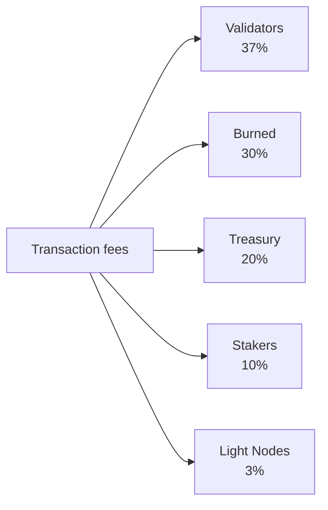

# Tokenomics

QoreChain utilizza un modello economico a **offerta fissa** incentrato sul token nativo **QOR**. Anziché aumentare l'offerta nel tempo, la rete finanzia le ricompense di staking da un budget di emissione finito e pre-allocato, mentre un motore di burn multi-canale applica una pressione deflazionistica costante man mano che l'utilizzo della rete cresce.

---

## Nozioni di base sul token

| Proprietà              | Valore                                                    |
| --------------------- | -------------------------------------------------------- |
| **Token visualizzato**     | QOR                                                      |
| **Denominazione base** | uqor                                                     |
| **Precisione decimale** | 10^6 (1 QOR = 1.000.000 uqor)                            |
| **Offerta totale**      | 4.500.000.000 QOR (fissa)                                |
| **Chain ID**          | `qorechain-vladi` (mainnet, EVM chain ID 9801)          |
| **Prefisso Bech32**     | `qor` (account: `qor1...`, validatori: `qorvaloper...`) |

:::note
Le cifre in questa pagina descrivono la **mainnet** (`qorechain-vladi`, EVM chain ID **9801**), live dal 7 giugno 2026 sulla versione della chain **v3.1.77**. La testnet **`qorechain-diana`** (EVM chain ID **9800**) condivide lo stesso modello economico.
:::

---

## Modello di offerta ed emissione

QoreChain ha un'**offerta totale fissa di 4.500.000.000 QOR**. Nuovi QOR non vengono mai coniati per gonfiare l'offerta. Al contrario:

* **80.000.000 QOR (1,78% dell'offerta)** sono stati bruciati al Token Generation Event (TGE).
* Le ricompense di staking sono pagate da un **budget di emissione finito di 590.000.000 QOR**, prelevato nel tempo secondo un programma decrescente.

Questo è un **modello a offerta fissa con un budget di emissione finito**, non un modello di gonfiamento dell'offerta. Una volta esaurito il budget di emissione, non si verifica alcuna ulteriore emissione di ricompense oltre a quanto la governance alloca dal budget rimanente.

### Programma delle ricompense di staking {#staking-reward-schedule}

Le ricompense di staking sono distribuite dal budget di emissione di 590.000.000 QOR secondo un programma decrescente:

| Periodo      | APY target              | Budget di emissione                  |
| ----------- | ----------------------- | -------------------------------- |
| Anno 1      | APY 8–12%               | 127.500.000 QOR                  |
| Anno 2      | APY 6–10%               | 106.250.000 QOR                  |
| Anni 3–4   | APY 5–8%                | 85.000.000 QOR all'anno          |
| Anno 5+     | Determinato dalla governance   | ~186.000.000 QOR rimanenti       |

Gli intervalli di APY sono target che dipendono dal rapporto di bonding; le cifre del budget di emissione sono i limiti rigidi di QOR rilasciati agli staker in ciascun periodo. Dall'Anno 5 in poi, i restanti ~186.000.000 QOR vengono rilasciati a un tasso stabilito dalla governance.

---

## x/burn — Motore di burn multi-canale

Il modulo `x/burn` implementa un sistema di burn dei token a 10 canali. Ogni token bruciato viene rimosso permanentemente dall'offerta circolante, creando una pressione deflazionistica costante man mano che l'utilizzo della rete cresce.

### Canali di burn

| #  | Canale            | Fonte                     | Descrizione                                   |
| -- | ------------------ | -------------------------- | --------------------------------------------- |
| 1  | `gas_fee`          | Commissioni sulle transazioni           | Il 30% di tutte le gas fee viene bruciato                |
| 2  | `contract_create`  | Deployment di smart contract  | Commissione fissa di 100 QOR bruciata per ogni creazione di contratto |
| 3  | `ai_service`       | Commissioni di utilizzo del modulo IA       | Il 50% delle commissioni dei servizi IA viene bruciato                 |
| 4  | `bridge_fee`       | Commissioni del bridge cross-chain    | Il 100% delle commissioni del bridge viene bruciato                  |
| 5  | `treasury_buyback` | Operazioni di tesoreria        | Buyback-and-burn periodico dalla tesoreria       |
| 6  | `failed_tx`        | Gas delle transazioni fallite     | Il 10% del gas delle transazioni fallite viene bruciato    |
| 7  | `xqore_penalty`    | Penali di uscita anticipata da xQORE | Importi delle penali instradati attraverso il burn         |
| 8  | `auto_buyback`     | Programma di buyback automatizzato  | Burn automatizzati a livello di protocollo             |
| 9  | `tge`              | Token generation event     | Burn di genesi una tantum (80.000.000 QOR)       |
| 10 | `rollup_create`    | Deployment di rollup          | L'1% dello stake di creazione del rollup viene bruciato            |

### Distribuzione delle commissioni

Tutte le commissioni sulle transazioni raccolte dalla rete vengono ripartite tra cinque destinazioni, come mostrato di seguito. Le quote sono imposte on-chain e ammontano sempre esattamente al 100%.



Tutte le commissioni sulle transazioni raccolte dalla rete vengono ripartite tra cinque destinazioni:

| Destinatario       | Quota | Descrizione                                                          |
| --------------- | ----- | -------------------------------------------------------------------- |
| **Validatori**  | 37%   | Distribuita all'insieme di validatori attivi in proporzione allo stake        |
| **Bruciato**      | 30%   | Rimosso permanentemente dall'offerta tramite il canale di burn `gas_fee`       |
| **Tesoreria**    | 20%   | Allocata alla tesoreria della community per spese decise dalla governance |
| **Staker**     | 10%   | Distribuita a tutti gli staker di QOR in proporzione alla delega        |
| **Light Node** | 3%    | Distribuita ai light node per la fornitura di dati di rete                  |

Le quote sono imposte on-chain e devono sempre ammontare esattamente al 100%.

### Parametri di burn

| Parametro              | Predefinito                    | Descrizione                              |
| ---------------------- | -------------------------- | ---------------------------------------- |
| `gas_burn_rate`        | 0.30                       | Frazione delle gas fee bruciate (30%)        |
| `contract_create_fee`  | 100.000.000 uqor (100 QOR) | Commissione di burn fissa per la creazione di contratto      |
| `ai_service_burn_rate` | 0.50                       | Frazione delle commissioni dei servizi IA bruciate (50%) |
| `bridge_burn_rate`     | 1.00                       | Frazione delle commissioni del bridge bruciate (100%)    |
| `failed_tx_burn_rate`  | 0.10                       | Frazione del gas delle TX fallite bruciato (10%)   |

Ogni evento di burn viene registrato on-chain con la sua fonte, l'importo, l'altezza del blocco e l'hash della transazione associata. Le statistiche aggregate sono interrogabili per canale e in totale.

---

## x/xqore — Staking bloccato e amplificazione della governance

Il modulo `x/xqore` introduce **xQORE**, un derivato di staking bloccato non trasferibile. Gli utenti bloccano QOR per coniare xQORE in rapporto 1:1. I detentori di xQORE ricevono un potere di governance amplificato e una quota delle penali di uscita ridistribuite.

### Meccanismo di blocco

* **Blocco**: invia QOR al modulo xQORE per coniare xQORE in rapporto 1:1.
* **Peso di governance**: i detentori di xQORE ricevono un **potere di voto di governance 2x** rispetto agli staker standard di QOR.
* **Non trasferibile**: xQORE non può essere inviato tra account. È vincolato all'indirizzo che ha effettuato il blocco.

### Programma delle penali di uscita

Il prelievo anticipato da xQORE comporta una penale che diminuisce con la durata del blocco:

| Durata del blocco  | Tasso di penale | Descrizione                                |
| -------------- | ------------ | ------------------------------------------ |
| &lt; 30 giorni   | **50%**      | Metà dei QOR bloccati viene perduta            |
| 30 -- 90 giorni  | **35%**      | Penale significativa per blocchi a breve termine   |
| 90 -- 180 giorni | **15%**      | Penale ridotta per impegno a medio termine |
| > 180 giorni     | **0%**       | Prelievo completo senza penale            |

### Ridistribuzione con rebase PvP

Le penali raccolte dalle uscite anticipate non vengono semplicemente distrutte. Seguono invece un modello di rebase PvP (player-versus-player):

1. Il **50%** degli importi delle penali viene bruciato (instradato attraverso `x/burn` tramite il canale `xqore_penalty`).
2. Il **50%** viene ridistribuito pro-rata a tutti i restanti detentori di xQORE.

Questo crea una dinamica a somma positiva per i detentori a lungo termine: ogni uscita anticipata aumenta il valore effettivo delle posizioni xQORE rimanenti. I rebase avvengono ogni **100 blocchi**.

### Parametri di xQORE

| Parametro               | Predefinito                | Descrizione                               |
| ----------------------- | ---------------------- | ----------------------------------------- |
| `governance_multiplier` | 2.0                    | Moltiplicatore del potere di voto per i detentori di xQORE |
| `min_lock_amount`       | 1.000.000 uqor (1 QOR) | QOR minimo richiesto per il blocco              |
| `penalty_burn_rate`     | 0.50                   | Frazione delle penali di uscita bruciate (50%)   |
| `rebase_interval`       | 100 blocchi             | Blocchi tra gli eventi di rebase PvP          |
| `enabled`               | true                   | Flag di attivazione del modulo                    |

---

## x/inflation — Programma del budget di emissione

Nonostante il nome del modulo, il modulo `x/inflation` **non** gonfia l'offerta totale. Governa il rilascio delle ricompense di staking dal budget di emissione finito di **590.000.000 QOR** secondo il [programma decrescente delle ricompense di staking](#staking-reward-schedule). Le emissioni sono calcolate per epoca e distribuite a staker e validatori, prelevando dal budget pre-allocato anziché coniare nuova offerta.

### Meccanica delle epoche

* **Durata dell'epoca**: 17.280 blocchi (\~1 giorno con tempi di blocco di 5 secondi)
* **Blocchi all'anno**: \~6.311.520
* All'inizio di ogni epoca, l'emissione programmata per il periodo corrente viene rilasciata dal budget di emissione e distribuita a staker e validatori.
* Il tracker delle epoche registra il numero dell'epoca corrente, l'anno corrente, il blocco iniziale, il totale cumulativo di QOR rilasciati dal budget di emissione e il budget rimanente.

### Parametri di inflation

| Parametro      | Predefinito          | Descrizione                                                |
| -------------- | ---------------- | ---------------------------------------------------------- |
| `schedule`     | declining        | Budget di emissione indicizzato per periodo (vedi il programma delle ricompense di staking) |
| `epoch_length` | 17.280 blocchi    | Blocchi per epoca di emissione                                  |
| `enabled`      | true             | Flag di attivazione del modulo                            |

---

## Dinamiche deflazionistiche

Poiché l'offerta è fissa e l'emissione è prelevata da un budget finito, le dinamiche nette del token di QoreChain tendono al deflazionistico man mano che l'adozione cresce:

```
Years 1-2:  Larger scheduled emissions from the budget offset burns → near-neutral supply
Years 3-4:  Scheduled emissions decline; burn volume grows with usage → convergence
Year 5+:    Emission budget is largely drawn down; burn channels (gas, bridge,
            contracts, rollups) scale with transaction volume → net deflationary
```

I 10 canali di burn assicurano che ogni attività di rete importante rimuova token dall'offerta. Man mano che aumentano il volume delle transazioni, l'utilizzo del bridge, le chiamate ai servizi IA e i deployment di rollup, i burn cumulativi accelerano mentre le emissioni programmate diminuiscono verso la fine del budget finito.

---

## Ordine del ciclo di vita dei moduli

I moduli economici vengono eseguiti in un ordine specifico durante l'`EndBlocker` di ogni blocco:

```
x/burn → x/xqore → x/inflation → x/rlconsensus
```

1. **x/burn** — Elabora i record di burn in sospeso e aggiorna le statistiche aggregate.
2. **x/xqore** — Esegue i rebase PvP (ogni `rebase_interval` blocchi) e instrada le penali al burn.
3. **x/inflation** — Rilascia le emissioni programmate delle ricompense di staking dal budget ai confini delle epoche.
4. **x/rlconsensus** — Regola i parametri di consenso in base ai segnali di reinforcement-learning di PRISM.

Questo ordinamento assicura che i burn siano finalizzati prima dei rebase, e che i rebase siano completati prima del rilascio delle emissioni programmate, mantenendo transizioni di stato economiche coerenti.

## Correlati

* [Parametri della chain](/appendix/chain-parameters) — valori economici e di consenso canonici predefiniti.
* [Staking e delega](/user-guide/staking-and-delegation) — delega QOR e guadagna ricompense.
* [Staking xQORE](/user-guide/xqore-staking) — il meccanismo di staking con rebase PvP.
* [Ricompense dei light node](/light-node/rewards-and-monitoring) — la quota di ricompensa dei light node.
