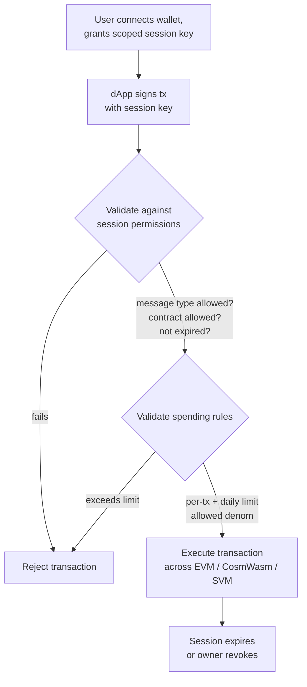

# Account Abstraction

QoreChain fornisce l'**account abstraction a livello di protocollo** tramite il modulo `x/abstractaccount`. Questo consente account programmabili con regole di autenticazione flessibili, session key, limiti di spesa e recupero sociale — il tutto senza richiedere un'infrastruttura esterna di smart contract.

:::note
I comandi seguenti utilizzano la mainnet **`qorechain-vladi`**, attiva dal 7 giugno 2026, che esegue la versione di chain **v3.1.77**. Sostituisci `--chain-id qorechain-diana` per la testnet.
:::

## Panoramica

Gli account blockchain tradizionali sono controllati da una singola chiave privata. L'account abstraction disaccoppia il concetto di "chi può autorizzare una transazione" da una singola chiave crittografica, abilitando:

* **Account multisig** con firma a soglia configurabile
* **Account con recupero sociale** con recupero delle chiavi basato su guardiani
* **Account basati su sessione** con permessi granulari e a tempo limitato per le dApp

Il modulo `x/abstractaccount` implementa queste funzionalità a livello di protocollo, il che significa che funzionano su tutte e tre le VM (EVM, CosmWasm, SVM) e beneficiano dell'efficienza del gas nativa.

*Un flusso dApp basato su sessione: una session key con ambito ristretto firma una transazione, il modulo la convalida rispetto alla sessione e alle regole di spesa, quindi la esegue.*



## Tipi di account

| Type              | Descrizione                             | Caso d'uso                     |
| ----------------- | --------------------------------------- | ------------------------------ |
| `multisig`        | Firma a soglia M-di-N                    | Tesorerie di DAO, wallet condivisi |
| `social_recovery` | Recupero delle chiavi assistito da guardiani | Wallet consumer, onboarding   |
| `session_based`   | Session key delegate con vincoli         | Sessioni dApp, wallet mobili  |

## Creazione di un account astratto

### Account basato su sessione

```bash
qorechaind tx abstractaccount create \
  --account-type session_based \
  --from mykey \
  --gas auto \
  -y
```

### Account multisig

```bash
qorechaind tx abstractaccount create \
  --account-type multisig \
  --signers qor1alice...,qor1bob...,qor1carol... \
  --threshold 2 \
  --from mykey \
  --gas auto \
  -y
```

### Account con recupero sociale

```bash
qorechaind tx abstractaccount create \
  --account-type social_recovery \
  --guardians qor1guardian1...,qor1guardian2...,qor1guardian3... \
  --recovery-threshold 2 \
  --from mykey \
  --gas auto \
  -y
```

## Session key

Le session key sono il fondamento del tipo di account `session_based`. Ti permettono di concedere **permessi temporanei e con ambito ristretto** a una chiave secondaria — perfetto per le interazioni con le dApp in cui non vuoi esporre la tua chiave primaria.

### Proprietà chiave

| Proprietà             | Descrizione                                          |
| --------------------- | ---------------------------------------------------- |
| **Permessi**          | Quali tipi di messaggio la session key può firmare   |
| **Scadenza**          | Scadenza automatica dopo una durata configurabile    |
| **Limiti di spesa**   | Importi massimi che la session key può spendere      |
| **Contratti consentiti** | Limita le interazioni a indirizzi di contratto specifici |

### Concedere una session key

```bash
qorechaind tx abstractaccount grant-session \
  --session-key qor1sessionkey... \
  --permissions "bank/MsgSend,wasm/MsgExecuteContract" \
  --expiry "2026-03-01T00:00:00Z" \
  --allowed-contracts qor1contract1...,0x1234...abcd \
  --from mykey \
  -y
```

### Revocare una session key

```bash
qorechaind tx abstractaccount revoke-session \
  --session-key qor1sessionkey... \
  --from mykey \
  -y
```

### Elencare le sessioni attive

```bash
qorechaind query abstractaccount sessions <account-address>
```

## Regole di spesa

Le regole di spesa aggiungono protezioni finanziarie agli account astratti, indipendentemente dal tipo di account:

| Regola           | Descrizione                                     |
| ---------------- | ----------------------------------------------- |
| `daily_limit`    | Spesa totale massima per finestra mobile di 24 ore |
| `per_tx_limit`   | Spesa massima per singola transazione           |
| `allowed_denoms` | Limita quali denominazioni di token possono essere spese |

### Impostare le regole di spesa

```bash
qorechaind tx abstractaccount update-spending-rules \
  --daily-limit 1000000000uqor \
  --per-tx-limit 100000000uqor \
  --allowed-denoms uqor \
  --from mykey \
  -y
```

### Interrogare le regole correnti

```bash
qorechaind query abstractaccount spending-rules <account-address>
```

### Esempio di risposta

```json
{
  "daily_limit": {
    "denom": "uqor",
    "amount": "1000000000"
  },
  "per_tx_limit": {
    "denom": "uqor",
    "amount": "100000000"
  },
  "allowed_denoms": ["uqor"],
  "daily_spent": {
    "denom": "uqor",
    "amount": "250000000"
  },
  "window_reset": "2026-02-27T00:00:00Z"
}
```

## Interrogazione degli account astratti

### CLI

```bash
# Get full account configuration
qorechaind query abstractaccount account <address>

# List all abstract accounts (paginated)
qorechaind query abstractaccount list --limit 10
```

### JSON-RPC

```bash
curl -X POST http://localhost:8545 \
  -H "Content-Type: application/json" \
  -d '{
    "jsonrpc": "2.0",
    "method": "qor_getAbstractAccount",
    "params": ["0xYourAddress"],
    "id": 1
  }'
```

### Esempio di risposta dell'account

```json
{
  "address": "qor1myaccount...",
  "account_type": "session_based",
  "owner": "qor1owner...",
  "active_sessions": 2,
  "spending_rules": {
    "daily_limit": "1000000000uqor",
    "per_tx_limit": "100000000uqor",
    "allowed_denoms": ["uqor"]
  },
  "created_at_height": 54321
}
```

## Flusso di recupero sociale

Se il proprietario dell'account perde l'accesso alla sua chiave primaria, i guardiani possono autorizzare una rotazione delle chiavi.

1. **Il proprietario segnala la chiave persa (o un guardiano avvia il processo):**

   ```bash
   qorechaind tx abstractaccount initiate-recovery \
     --account <account-address> \
     --new-owner qor1newkey... \
     --from guardian1 \
     -y
   ```

2. **Altri guardiani approvano** (devono soddisfare `recovery_threshold`):

   ```bash
   qorechaind tx abstractaccount approve-recovery \
     --account <account-address> \
     --recovery-id <recovery-id> \
     --from guardian2 \
     -y
   ```

3. **Il recupero viene eseguito automaticamente** una volta raggiunta la soglia. Un **periodo di time-lock** (predefinito: 48 ore) dà al proprietario originale la possibilità di annullare un tentativo di recupero fraudolento.

## Integrazione con le dApp

Le session key consentono esperienze dApp fluide:

1. **L'utente collega il wallet** e crea una session key con ambito limitato al contratto della dApp
2. **La dApp utilizza la session key** per inviare transazioni per conto dell'utente
3. **Nessuna firma ripetuta** — la session key gestisce l'autorizzazione entro i suoi permessi
4. **La sessione scade** automaticamente, oppure l'utente la revoca in qualsiasi momento

Questo schema è particolarmente utile per:

* Wallet mobili in cui le ripetute richieste biometriche risultano fastidiose
* dApp di gaming che necessitano di una firma rapida delle transazioni
* Protocolli DeFi che eseguono più operazioni sequenziali

## Prossimi passi

* [Eseguire un validator](/developer-guide/running-a-validator) — Configura e gestisci un nodo validator
* [Sviluppo EVM](/developer-guide/evm-development) — Integra gli account astratti con le dApp Solidity
* [Interoperabilità Cross-VM](/developer-guide/cross-vm-interoperability) — Messaggistica Cross-VM con account astratti
