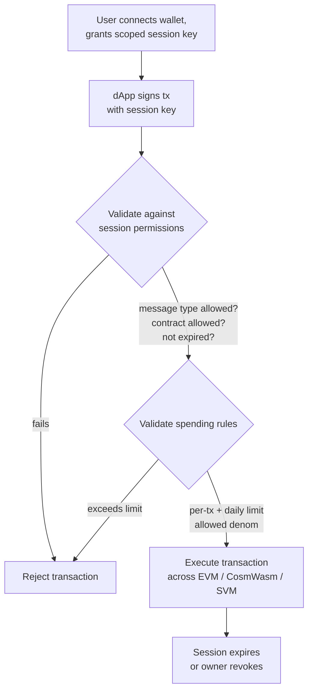

# Astrazione dell'Account

QoreChain offre **astrazione dell'account a livello di protocollo** tramite il modulo `x/abstractaccount`. Questo abilita account programmabili con regole di autenticazione flessibili, chiavi di sessione, limiti di spesa e recupero sociale — tutto senza richiedere un'infrastruttura di smart contract esterna.

:::note
I comandi seguenti usano la mainnet **`qorechain-vladi`**, attiva dal 7 giugno 2026 e in esecuzione sulla versione della chain **v3.1.95**. Sostituisci con `--chain-id qorechain-diana` per la testnet.
:::

## Panoramica

Gli account blockchain tradizionali sono controllati da una singola chiave privata. L'astrazione dell'account disaccoppia il concetto di "chi può autorizzare una transazione" da un'unica chiave crittografica, abilitando:

* **Account multisig** con firma a soglia configurabile
* **Account con recupero sociale** basati su guardiani per il recupero della chiave
* **Account basati su sessione** con permessi granulari e a tempo limitato per le dApp

Il modulo `x/abstractaccount` implementa queste funzionalità a livello di protocollo, il che significa che funzionano su tutte e tre le VM (EVM, CosmWasm, SVM) e beneficiano dell'efficienza nativa del gas.

*Un flusso dApp basato su sessione: una chiave di sessione con ambito limitato firma una transazione, il modulo la valida rispetto alla sessione e alle regole di spesa, quindi la esegue.*


```mermaid
flowchart TD
    A["User connects wallet,<br/>grants scoped session key"] --> B["dApp signs tx<br/>with session key"]
    B --> C{"Validate against<br/>session permissions"}
    C -- "message type allowed?<br/>contract allowed?<br/>not expired?" --> D{"Validate spending rules"}
    C -- "fails" --> R["Reject transaction"]
    D -- "per-tx + daily limit<br/>allowed denom" --> E["Execute transaction<br/>across EVM / CosmWasm / SVM"]
    D -- "exceeds limit" --> R
    E --> F["Session expires<br/>or owner revokes"]
```

## Tipi di Account

| Tipo               | Descrizione                              | Caso d'uso                        |
| ----------------- | --------------------------------------- | ------------------------------ |
| `multisig`        | Firma a soglia M-su-N                   | Tesorerie DAO, wallet condivisi |
| `social_recovery` | Recupero chiave assistito da guardiani  | Wallet consumer, onboarding    |
| `session_based`   | Chiavi di sessione delegate con vincoli | Sessioni dApp, wallet mobili   |

## Creazione di un Account Astratto

### Account Basato su Sessione

```bash
qorechaind tx abstractaccount create \
  --account-type session_based \
  --from mykey \
  --gas auto \
  -y
```

### Account Multisig

```bash
qorechaind tx abstractaccount create \
  --account-type multisig \
  --signers qor1alice...,qor1bob...,qor1carol... \
  --threshold 2 \
  --from mykey \
  --gas auto \
  -y
```

### Account con Recupero Sociale

```bash
qorechaind tx abstractaccount create \
  --account-type social_recovery \
  --guardians qor1guardian1...,qor1guardian2...,qor1guardian3... \
  --recovery-threshold 2 \
  --from mykey \
  --gas auto \
  -y
```

## Chiavi di Sessione

Le chiavi di sessione sono il fondamento del tipo di account `session_based`. Permettono di concedere **permessi temporanei e con ambito limitato** a una chiave secondaria — perfette per le interazioni con le dApp quando non si vuole esporre la chiave primaria.

### Proprietà della Chiave

| Proprietà              | Descrizione                                          |
| --------------------- | ---------------------------------------------------- |
| **Permessi**       | Quali tipi di messaggio la chiave di sessione può firmare         |
| **Scadenza**            | Scadenza automatica dopo una durata configurabile   |
| **Limiti di spesa**   | Importi massimi che la chiave di sessione può spendere            |
| **Contratti consentiti** | Limita le interazioni a indirizzi di contratto specifici |

### Concedere una Chiave di Sessione

```bash
qorechaind tx abstractaccount grant-session \
  --session-key qor1sessionkey... \
  --permissions "bank/MsgSend,wasm/MsgExecuteContract" \
  --expiry "2026-03-01T00:00:00Z" \
  --allowed-contracts qor1contract1...,0x1234...abcd \
  --from mykey \
  -y
```

### Revocare una Chiave di Sessione

```bash
qorechaind tx abstractaccount revoke-session \
  --session-key qor1sessionkey... \
  --from mykey \
  -y
```

### Elenco delle Sessioni Attive

```bash
qorechaind query abstractaccount sessions <account-address>
```

## Regole di Spesa

Le regole di spesa aggiungono limiti finanziari agli account astratti, indipendentemente dal tipo di account:

| Regola             | Descrizione                                     |
| ---------------- | ----------------------------------------------- |
| `daily_limit`    | Spesa totale massima in una finestra mobile di 24 ore  |
| `per_tx_limit`   | Spesa massima per singola transazione        |
| `allowed_denoms` | Limita quali denominazioni di token possono essere spese |

### Impostare le Regole di Spesa

```bash
qorechaind tx abstractaccount update-spending-rules \
  --daily-limit 1000000000uqor \
  --per-tx-limit 100000000uqor \
  --allowed-denoms uqor \
  --from mykey \
  -y
```

### Interrogare le Regole Correnti

```bash
qorechaind query abstractaccount spending-rules <account-address>
```

### Esempio di Risposta

```json
{
  "daily_limit": {
    "denom": "uqor",
    "amount": "1000000000"
  },
  "per_tx_limit": {
    "denom": "uqor",
    "amount": "100000000"
  },
  "allowed_denoms": ["uqor"],
  "daily_spent": {
    "denom": "uqor",
    "amount": "250000000"
  },
  "window_reset": "2026-02-27T00:00:00Z"
}
```

## Autenticatori di Wallet Collegati — Spesa Delegata {#authenticators}

A partire dalla versione della chain **v3.1.85** (basata sul modello di permessi v3.1.84), una **chiave di wallet esterno collegata** — una chiave Phantom (ed25519) o un account MetaMask (secp256k1) — può **spendere dall'account post-quantistico canonico** con termini a privilegio minimo, con limite di spesa e revocabili. La chiave esterna non produce mai una firma ML-DSA; un **relayer** invia e paga la busta della transazione (la firma PQC ibrida propria del relayer soddisfa i requisiti di firma della chain), mentre la firma dell'autenticatore sui **byte di firma separati per dominio e vincolati contro il replay** costituisce l'autorizzazione.

### Registrare un autenticatore {#register-authenticator}

Il proprietario dell'account registra la chiave esterna con `MsgRegisterAuthenticator` (una normale transazione con la chiave root), assegnandole uno schema, dei permessi, una scadenza e limiti di spesa opzionali:

```js
import { registerEthAuthenticatorMsg } from "@qorechain/wallet-adapter";

// Link a MetaMask account by its 20-byte address (EIP-191 verification):
const msg = registerEthAuthenticatorMsg({
  account: "qor1owner...",            // the canonical account
  ethAddress: "0xAbC...123",          // the MetaMask address to link
  permissions: ["evm"],               // least privilege — see the taxonomy below
  expirySeconds: 30 * 24 * 3600,      // ≤ 30 days recommended
  spendingRule: { perTxLimit: "100000000uqor", dailyLimit: "1000000000uqor" },
});
// Sign & broadcast this msg with the OWNER's normal hybrid-PQC signer.
```

Una chiave Phantom viene registrata allo stesso modo con `scheme: "ed25519"` e la chiave pubblica Phantom. La revoca è istantanea tramite `MsgRevokeAuthenticator`.

### Tassonomia dei permessi {#permission-taxonomy}

Undici permessi canonici regolano ciò che un autenticatore registrato può fare. La mappatura è **a chiusura predefinita (fail-closed)**: un tipo di messaggio senza mappatura viene negato.

| Permesso | Concede |
| --- | --- |
| `send` | Trasferimenti bancari sul lane nativo |
| `delegate` / `withdraw` / `vote` | Staking, prelievo delle ricompense, governance |
| `evm` / `wasm` / `svm` | Esecuzione sul rispettivo lane VM |
| `amm` / `ibc` / `deploy` | Operazioni AMM, trasferimenti IBC, deployment di contratti |
| `all` | Qualsiasi messaggio *delegabile* |

**I messaggi di gestione delle chiavi non sono mai delegabili** — `MsgRegisterAuthenticator`, `MsgRevokeAuthenticator`, la registrazione/migrazione della chiave PQC e `MsgRotatePQCKey` richiedono sempre la chiave root, così una chiave collegata non può mai elevare i propri privilegi.

Leggi la tassonomia live (con `schema_version` per il rilevamento delle deviazioni) invece di codificarla staticamente:

```bash
curl -s https://api.qore.host/qorechain/abstractaccount/v1/permission_schema | jq
# or: qorechaind query abstractaccount permission-schema
```

### Spendere tramite una chiave collegata {#execute-messages}

Due messaggi trasportano azioni autorizzate dall'autenticatore. In entrambi, il relayer è il firmatario/pagatore delle commissioni della transazione; la firma dell'autenticatore viaggia all'interno del messaggio.

**`MsgExecuteEVM`** — una chiamata EVM o un trasferimento **dall'indirizzo `0x…` dell'account canonico**. L'autenticatore firma `sha256("qorechain-evm-auth-v1" ‖ chainId ‖ account ‖ pubkey ‖ to ‖ value ‖ data ‖ nonce)` (tutti i campi con prefisso di lunghezza). La protezione dal replay è il nonce EVM proprio dell'account.

**`MsgExecuteCosmos`** — un invio bancario sul lane nativo dall'account canonico. L'autenticatore firma `sha256("qorechain-cosmos-auth-v1" ‖ chainId ‖ account ‖ pubkey ‖ to ‖ amount ‖ nonce)`. La protezione dal replay è una **sequenza per-autenticatore** mantenuta dal modulo (un invio bancario non incrementa il nonce dell'account). Gli auto-invii vengono rifiutati.

:::caution Regole sul nonce
* `MsgExecuteEVM.nonce` = il nonce EVM **corrente** dell'account (`eth_getTransactionCount(account0x, "latest")`). In produzione il relayer è un account *diverso*, quindi **non** aggiungere +1. Firmare un nonce obsoleto restituisce il codice `11`.
* `MsgExecuteCosmos.nonce` = la sequenza per-autenticatore (interroga lo stato dell'autenticatore dell'account), **non** la sequenza Cosmos dell'account.
:::

**Esempio Phantom** (browser: Phantom firma, il tuo backend inoltra):

```js
import { buildPhantomExecuteCosmos } from "@qorechain/wallet-adapter";

// In the dApp: Phantom signs the digest with ed25519 signMessage.
const msg = await buildPhantomExecuteCosmos({
  provider: window.solana,            // Phantom
  chainId: "qorechain-vladi",
  account: "qor1owner...",            // canonical account being spent from
  to: "qor1recipient...",
  amount: { denom: "uqor", amount: "900000" },
  nonce: authSequence,                // per-authenticator sequence
});
// Send `msg` to your relayer; the relayer wraps it in a tx it signs
// (hybrid PQC) and broadcasts. The transfer moves the OWNER's funds.
```

**Esempio MetaMask** (`personal_sign` EIP-191 dall'indirizzo collegato a 20 byte):

```js
import { buildMetaMaskExecuteEvm } from "@qorechain/wallet-adapter";

const msg = await buildMetaMaskExecuteEvm({
  provider: window.ethereum,          // MetaMask (EIP-1193)
  chainId: "qorechain-vladi",
  account: "qor1owner...",
  to: "0xRecipient...",
  valueWei: 10n ** 16n,               // 0.01 QOR (18-dec EVM view)
  nonce: currentEvmNonce,             // eth_getTransactionCount(owner0x, "latest")
});
// Relay as above. The chain verifies the signature via EIP-191 + ecrecover
// against the registered 20-byte address.
```

Gli stessi builder esistono nell'[SDK di QoreChain](/sdk/guides/authenticators) per tutti e cinque i linguaggi, oltre agli equivalenti da riga di comando:

```bash
# Produce the exact sign bytes the chain verifies (for custom signers):
qorechaind query abstractaccount auth-sign-cosmos <account> <to> <amount> <nonce>
qorechaind query abstractaccount auth-sign-evm <account> <to> <value> <data-hex> <nonce>

# Relay a pre-signed authorization:
qorechaind tx abstractaccount execute-cosmos <account> <to> <amount> <auth-pubkey> <auth-sig> <nonce> --from relayer -y
qorechaind tx abstractaccount execute-evm    <account> <to> <value> <data-hex> <auth-pubkey> <auth-sig> <nonce> --from relayer -y
```

### Codici di errore {#authenticator-errors}

I fallimenti di enforcement restituiscono codici distinti (codespace `abstractaccount`) così i wallet possono mostrare il messaggio corretto:

| Codice | Significato | UX del wallet |
| --- | --- | --- |
| `5` | Limite di spesa superato (per transazione o giornaliero) | Mostra l'allowance residua |
| `6` | Autenticatore scaduto | "Scaduto — ricollega il tuo wallet" |
| `10` | Permesso negato (ambito o messaggio non delegabile) | Mostra il permesso mancante |
| `11` | Replay rifiutato (nonce/sequenza obsoleti) | Interroga di nuovo il nonce e ri-firma |

(Codespace `pqc` codice `21` = verifica della firma ibrida fallita — un problema di firma lato relayer, non di autorizzazione.)

### Query REST {#abstractaccount-rest}

A partire dalla **v3.1.85** le query in lettura del modulo sono servite anche via REST:

```
GET /qorechain/abstractaccount/v1/config
GET /qorechain/abstractaccount/v1/accounts
GET /qorechain/abstractaccount/v1/accounts/{address}
GET /qorechain/abstractaccount/v1/permission_schema
```

## Interrogare gli Account Astratti

### CLI

```bash
# Get full account configuration
qorechaind query abstractaccount account <address>

# List all abstract accounts (paginated)
qorechaind query abstractaccount list --limit 10
```

### JSON-RPC

```bash
curl -X POST http://localhost:8545 \
  -H "Content-Type: application/json" \
  -d '{
    "jsonrpc": "2.0",
    "method": "qor_getAbstractAccount",
    "params": ["0xYourAddress"],
    "id": 1
  }'
```

### Esempio di Risposta dell'Account

```json
{
  "address": "qor1myaccount...",
  "account_type": "session_based",
  "owner": "qor1owner...",
  "active_sessions": 2,
  "spending_rules": {
    "daily_limit": "1000000000uqor",
    "per_tx_limit": "100000000uqor",
    "allowed_denoms": ["uqor"]
  },
  "created_at_height": 54321
}
```

## Flusso di Recupero Sociale

Se il proprietario dell'account perde l'accesso alla propria chiave primaria, i guardiani possono autorizzare una rotazione della chiave.

1. **Il proprietario segnala la chiave persa (oppure un guardiano avvia il processo):**

   ```bash
   qorechaind tx abstractaccount initiate-recovery \
     --account <account-address> \
     --new-owner qor1newkey... \
     --from guardian1 \
     -y
   ```

2. **Ulteriori guardiani approvano** (deve essere raggiunta la `recovery_threshold`):

   ```bash
   qorechaind tx abstractaccount approve-recovery \
     --account <account-address> \
     --recovery-id <recovery-id> \
     --from guardian2 \
     -y
   ```

3. **Il recupero viene eseguito automaticamente** una volta raggiunta la soglia. Un **periodo di time-lock** (predefinito: 48 ore) dà al proprietario originale la possibilità di annullare un tentativo di recupero fraudolento.

## Integrazione con le dApp

Le chiavi di sessione abilitano esperienze dApp fluide:

1. **L'utente collega il wallet** e crea una chiave di sessione con ambito limitato al contratto della dApp
2. **La dApp usa la chiave di sessione** per inviare transazioni per conto dell'utente
3. **Nessuna firma ripetuta** — la chiave di sessione gestisce l'autorizzazione entro i propri permessi
4. **La sessione scade** automaticamente, oppure l'utente la revoca in qualsiasi momento

Questo schema è particolarmente utile per:

* Wallet mobili dove le richieste biometriche ripetute sono fastidiose
* dApp di gaming che necessitano di firma rapida delle transazioni
* Protocolli DeFi che eseguono operazioni sequenziali multiple

## Prossimi Passi

* [Gestire un Validatore](/developer-guide/running-a-validator) — Configura e gestisci un nodo validatore
* [Sviluppo EVM](/developer-guide/evm-development) — Integra gli account astratti con le dApp Solidity
* [Interoperabilità Cross-VM](/developer-guide/cross-vm-interoperability) — Messaggistica cross-VM con account astratti
