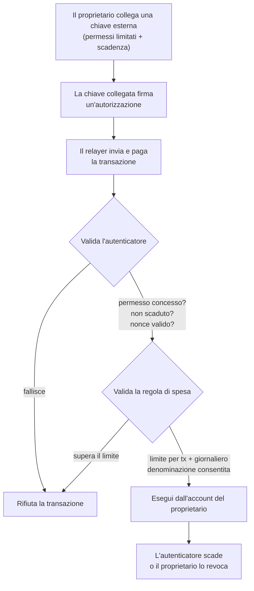

# Astrazione dell'Account

QoreChain offre **astrazione dell'account a livello di protocollo** tramite il modulo `x/abstractaccount`. Il modulo registra account astratti con regole di spesa e consente al proprietario dell'account di collegare chiavi esterne (**autenticatori**) che possono spendere dall'account entro i limiti di permessi e di spesa, senza un'infrastruttura di smart contract esterna.

:::danger Non abilitato sulla mainnet; abilitato sulla testnet
Il modulo di account astratti è **disattivato sulla mainnet `qorechain-vladi`** al momento della stesura (verificato il 27 ottobre 2026): `qorechaind query abstractaccount config` (e `GET /qorechain/abstractaccount/v1/config`) riportano `enabled: false`. Sulla **testnet `qorechain-diana`** è stato attivato da una decisione di governance (proposta 18, approvata il 27 ottobre 2026) e riporta `enabled: true`. Dalla versione della chain v3.2.0 il flag viene applicato su ogni percorso: dove è `false` la chain rifiuta la creazione di account, la registrazione degli autenticatori ed entrambe le lane di esecuzione (`MsgExecuteEVM`, `MsgExecuteCosmos`) con `abstract accounts are disabled on this chain`. Nessuna transazione ordinaria può attivare il modulo; l'impostazione cambia solo con una decisione di governance. Nessuna transazione di account astratto è mai stata inclusa sulla mainnet. Tutto ciò che segue descrive le interfacce del modulo; provalo sulla testnet e non costruire un flusso di chiave collegata o di spesa delegata per la mainnet finché il modulo non è abilitato lì. Controlla sempre prima il flag.
:::

:::note
I comandi seguenti usano la mainnet **`qorechain-vladi`** (attiva dal 7 giugno 2026), che esegue la release del nodo **v3.2.4** (applicata all'altezza 3.742.566 il 23 ottobre 2026, proposta di governance 13). Sostituisci con `--chain-id qorechain-diana` per la testnet, che esegue la v3.2.6 (v3.2.4 dal 19 ottobre 2026).
:::

:::caution Ogni transazione sulla lane Cosmos richiede la co-firma ibrida post-quantistica
Gli esempi `qorechaind tx` in questa pagina mostrano solo i flag delle commissioni. Sulle reti live ogni transazione sulla lane Cosmos deve portare anche la co-firma ibrida ML-DSA-87, quindi costruisci la transazione con `--generate-only` e firmala con `qorechaind tx pqc cosign` (oppure usa QoreX o l'SDK, che lo fanno per te). La build community di `qorechaind` non può produrre quella firma; usa il binario della release dal [manifest di download](/developer-guide/running-a-node#fetch-the-manifest). La soglia minima delle commissioni è di **0,1 uqor per unità di gas**, quindi `--gas 400000` richiede almeno `--fees 40000uqor`. Vedi [Firma post-quantistica](/developer-guide/post-quantum-signing).
:::

## Panoramica

Gli account blockchain tradizionali sono controllati da una singola chiave privata. L'astrazione dell'account disaccoppia il concetto di "chi può autorizzare una transazione" da un'unica chiave crittografica. Il modulo `x/abstractaccount` fornisce:

* **Account astratti** con un tipo di account e un proprietario registrati
* **Regole di spesa** (limiti per transazione e giornalieri, denominazioni consentite) che delimitano ciò che le chiavi collegate possono spendere
* **Autenticatori**: chiavi esterne (una chiave ed25519 Phantom o un indirizzo secp256k1 MetaMask) che il proprietario collega con permessi limitati e una scadenza, e che può revocare in qualsiasi momento

*Un flusso con chiave collegata (autenticatore): la chiave collegata firma un'autorizzazione, un relayer la invia, il modulo verifica permessi, scadenza e regole di spesa, quindi esegue dall'account del proprietario.*


```mermaid
flowchart TD
    A["Il proprietario collega una chiave esterna<br/>(permessi limitati + scadenza)"] --> B["La chiave collegata firma<br/>un'autorizzazione"]
    B --> C["Il relayer invia e paga<br/>la transazione"]
    C --> D{"Valida l'autenticatore"}
    D -- "permesso concesso?<br/>non scaduto?<br/>nonce valido?" --> E{"Valida la regola di spesa"}
    D -- "fallisce" --> R["Rifiuta la transazione"]
    E -- "limite per tx + giornaliero<br/>denominazione consentita" --> F["Esegui dall'account del proprietario"]
    E -- "supera il limite" --> R
    F --> G["L'autenticatore scade<br/>o il proprietario lo revoca"]
```

## Tipi di Account

`create` registra uno dei tre tipi di account. Il tipo è memorizzato sull'account e fa parte del modo in cui ne viene derivato l'indirizzo; il modulo non ha transazioni proprie di multisig, chiavi di sessione o recupero (il servizio di transazioni comprende `create`, `update-rules`, `register-authenticator`, `revoke-authenticator`, `execute-cosmos`, `execute-evm`).

| Tipo              | Uso previsto                    |
| ----------------- | ------------------------------- |
| `multisig`        | Tesorerie DAO, wallet condivisi |
| `social_recovery` | Wallet consumer, onboarding     |
| `session_based`   | Sessioni dApp, wallet mobili    |

## Creazione di un Account Astratto

`create` accetta il tipo di account come argomento posizionale (`multisig`, `social_recovery` o `session_based`):

```bash
qorechaind tx abstractaccount create session_based \
  --from mykey \
  --gas 400000 --fees 40000uqor
```

Il comando non ha flag per firmatari, soglie o guardiani.

## Autenticatori (chiavi collegate)

Il meccanismo di chiave delegata del modulo è l'**autenticatore**, descritto in [Autenticatori di Wallet Collegati](#authenticators) più sotto: il proprietario collega una chiave esterna (ed25519 o secp256k1) con un insieme di permessi e una scadenza, e la revoca in qualsiasi momento:

```bash
qorechaind tx abstractaccount register-authenticator <account-address> <scheme> <pubkey-base64> <permissions-csv> <expiry-unix> <label> \
  --from mykey --gas 400000 --fees 40000uqor
qorechaind tx abstractaccount revoke-authenticator <account-address> <scheme> <pubkey-base64> \
  --from mykey --gas 400000 --fees 40000uqor
```

`scheme` è `ed25519` (ad esempio Phantom) oppure `secp256k1` (ad esempio MetaMask). Non esistono i comandi `grant-session`, `revoke-session` né `query abstractaccount sessions`.

## Regole di Spesa

Le regole di spesa aggiungono limiti finanziari agli account astratti:

| Regola           | Descrizione                                           |
| ---------------- | ----------------------------------------------------- |
| `daily_limit`    | Spesa totale massima per giorno di calendario UTC     |
| `per_tx_limit`   | Spesa massima per singola esecuzione autorizzata      |
| `allowed_denoms` | Limita quali denominazioni di token possono essere spese (un ERC-20 è elencato come `erc20/<EIP-55 0x address>`, la grafia propria della regola di spesa con la barra; la chain confronta l'indirizzo nella sua forma EIP-55, quindi le maiuscole e minuscole che digiti non creano un token diverso. Non è la denominazione bank di una coppia di token registrata, che si scrive `erc20:<EIP-55 0x address>` con i due punti e distingue maiuscole e minuscole, vedi [Sviluppo EVM](/developer-guide/evm-development#fest-tokens)) |
| `denom_limits`   | Limiti per denominazione come stringhe decimali (v3.2.2): `{"denom","per_tx_limit","daily_limit"}`; sostituiscono `per_tx_limit` e `daily_limit` per le denominazioni che nominano, così è possibile limitare un token a 18 decimali |
| `allowed_evm_calls` | Chiamate EVM che una chiave vincolata a una regola può effettuare **con call data** (v3.2.2), come `0x<target>` (qualsiasi funzione di quel contratto) oppure `0x<target>/0x<selector>` (solo quella funzione). Senza una voce, una chiave vincolata a una regola può soltanto inviare valore, eseguire il deploy (con il permesso `deploy`) e spostare i token ERC-20 elencati in `allowed_denoms`. Elencare un target significa fidarsi di ogni argomento delle chiamate effettuate verso di esso, destinatari inclusi |

### Impostare le Regole di Spesa

`update-rules` sostituisce le regole dell'account con un array JSON di oggetti `SpendingRule` (JSON inline, non un file e non flag):

```bash
qorechaind tx abstractaccount update-rules <account-address> \
  '[{"id":"daily","enabled":true,"daily_limit":1000000000,"per_tx_limit":100000000,"allowed_denoms":["uqor"]}]' \
  --from mykey --gas 400000 --fees 40000uqor
```

I limiti sono espressi nell'unità base (`uqor`) e contano per esecuzione autorizzata; il limite giornaliero delimita il totale per giorno di calendario UTC. Le regole sostituiscono nel loro insieme quelle memorizzate, quindi un campo omesso viene rimosso. Dalla v3.2.2 la lane EVM misura ciò che una chiamata sposta effettivamente (valore nativo, la diminuzione del saldo nativo dell'account, le coin bank spese e la variazione di saldo o di allowance di ogni ERC-20 elencato) anziché soltanto `msg.value`, e la creazione di contratti richiede il permesso separato `deploy`. Un esempio più ricco (l'ERC-20 mostrato è il token di test fUSD della testnet; usa l'indirizzo del contratto del tuo token, e nota la barra in `erc20/<address>` in una regola rispetto ai due punti nel denom bank `erc20:<address>`):

```bash
qorechaind tx abstractaccount update-rules <account-address> \
  '[{"id":"daily","enabled":true,"daily_limit":5000000,"allowed_denoms":["uqor","erc20/0x97143B771D34ddb9130b807b135Ae675A5a963CA"],"allowed_evm_calls":["0xROUTER/0x38ed1739"],"denom_limits":[{"denom":"erc20/0x97143B771D34ddb9130b807b135Ae675A5a963CA","per_tx_limit":"100000000000000000000","daily_limit":"500000000000000000000"}]}]' \
  --from mykey --gas 400000 --fees 40000uqor
```

### Interrogare le Regole Correnti

Il record dell'account include le sue regole e il numero di chiavi collegate:

```bash
qorechaind query abstractaccount account <account-address>
```

:::caution Una regola delimita una chiave solo se esiste
La chain risolve il limite in questo ordine: la regola propria dell'autenticatore se impostata e `enabled`; altrimenti la prima regola `enabled` sull'account; altrimenti **non c'è alcun limite**. Una regola memorizzata con `enabled: false` significa nessun limite, non un limite pari a zero. `MsgRegisterAuthenticator` non porta alcuna regola, quindi una chiave collegata con questo solo messaggio è delimitata unicamente da una regola a livello di account. Imposta una regola deliberatamente con `update-rules` e registra solo i permessi di cui la chiave ha bisogno. Un limite circoscrive il danno che una chiave collegata può fare; non sostituisce la revoca della chiave.
:::

## Autenticatori di Wallet Collegati — Spesa Delegata {#authenticators}

Il design degli autenticatori è stato introdotto nella versione della chain **v3.1.85** (basata sul modello di permessi v3.1.84). **Non è utilizzabile sulla mainnet finché il modulo è disattivato lì**, ed è disponibile sulla testnet, dove il modulo è abilitato (vedi il riquadro di stato in cima a questa pagina). Una **chiave di wallet esterno collegata** — una chiave Phantom (ed25519) o un account MetaMask (secp256k1) — può **spendere dall'account post-quantistico canonico** con termini a privilegio minimo, con limite di spesa e revocabili. La chiave esterna non produce mai una firma ML-DSA; un **relayer** invia e paga la busta della transazione (la firma PQC ibrida propria del relayer soddisfa i requisiti di firma della chain), mentre la firma dell'autenticatore sui **byte di firma separati per dominio e vincolati contro il replay** costituisce l'autorizzazione.

### Registrare un autenticatore {#register-authenticator}

Il proprietario dell'account registra la chiave esterna con `MsgRegisterAuthenticator` (una normale transazione con la chiave root), assegnandole uno schema, dei permessi, una scadenza e limiti di spesa opzionali:

```js
import { registerEthAuthenticatorMsg } from "@qorechain/wallet-adapter";

// Link a MetaMask account by its 20-byte address (EIP-191 verification):
const msg = registerEthAuthenticatorMsg({
  owner: "qor1owner...",              // the canonical account (signs this message)
  ethAddress: "0xAbC...123",          // the MetaMask address to link
  permissions: ["evm"],               // least privilege — see the taxonomy below
  expiryUnix: Math.floor(Date.now() / 1000) + 30 * 24 * 3600, // absolute Unix seconds, ≤ 30 days recommended
  label: "metamask",
});
// Limits are a separate message (MsgUpdateSpendingRules), see "Spending Rules" above.
// Sign & broadcast this msg with the OWNER's normal hybrid-PQC signer.
```

Una chiave Phantom viene registrata allo stesso modo con lo schema `ed25519` e la chiave pubblica Phantom (`register-authenticator` da CLI). La revoca è istantanea tramite `MsgRevokeAuthenticator`.

### Tassonomia dei permessi {#permission-taxonomy}

Undici permessi canonici regolano ciò che un autenticatore registrato può fare. La mappatura è **a chiusura predefinita (fail-closed)**: un tipo di messaggio senza mappatura viene negato.

| Permesso | Concede |
| --- | --- |
| `send` | Trasferimenti bancari sulla lane nativa |
| `delegate` / `withdraw` / `vote` | Staking, prelievo delle ricompense, governance |
| `evm` / `wasm` / `svm` | Esecuzione sulla rispettiva lane VM |
| `amm` / `ibc` / `deploy` | Operazioni AMM, trasferimenti IBC, deployment di contratti |
| `all` | Qualsiasi messaggio *delegabile* |

**I messaggi di gestione delle chiavi non sono mai delegabili** — `MsgRegisterAuthenticator`, `MsgRevokeAuthenticator`, la registrazione/migrazione della chiave PQC e `MsgRotatePQCKey` richiedono sempre la chiave root, così una chiave collegata non può mai elevare i propri privilegi. Lo schema (`schema_version` 2) elenca anche `lane_rules`: la creazione di un contratto dall'indirizzo dell'account, una chiamata che fa avanzare il nonce EVM dell'account e una chiamata all'account stesso quando il suo codice è una delega EIP-7702 richiedono ciascuna il permesso `deploy` o `all`. Dalla v3.2.3 la registrazione rifiuta stringhe di permesso sconosciute e chiavi secp256k1 da 65 byte che non potrebbero mai essere verificate.

Leggi la tassonomia live (con `schema_version` per il rilevamento delle deviazioni) invece di codificarla staticamente:

```bash
curl -s https://api.qore.host/qorechain/abstractaccount/v1/permission_schema | jq
# or: qorechaind query abstractaccount permission-schema
```

### Spendere tramite una chiave collegata {#execute-messages}

Due messaggi trasportano azioni autorizzate dall'autenticatore. In entrambi, il relayer è il firmatario/pagatore delle commissioni della transazione; la firma dell'autenticatore viaggia all'interno del messaggio.

**`MsgExecuteEVM`** — una chiamata EVM o un trasferimento **dall'indirizzo `0x…` dell'account canonico**. L'autenticatore firma `sha256("qorechain-evm-auth-v1" ‖ chainId ‖ account ‖ pubkey ‖ to ‖ value ‖ data ‖ nonce)` (tutti i campi con prefisso di lunghezza). Dalla v3.2.3 (la funzionalità `abstractaccount-hardening`) la chain richiede il **digest v2**, `sha256("qorechain-evm-auth-v2" ‖ … ‖ nonce ‖ gasLimit)`, che vincola anche il limite di gas della chiamata (8 byte big-endian) così che un relayer non possa riprodurre la firma con un limite diverso; nessun blocco accetta entrambe le forme. `qorechaind query abstractaccount auth-sign-evm` accetta `--gas-limit` a questo scopo, e lo stesso valore va passato a `execute-evm`. La protezione dal replay è il nonce EVM proprio dell'account.

**`MsgExecuteCosmos`** — un invio bancario sulla lane nativa dall'account canonico. L'autenticatore firma `sha256("qorechain-cosmos-auth-v1" ‖ chainId ‖ account ‖ pubkey ‖ to ‖ amount ‖ nonce)`. La protezione dal replay è una **sequenza per-autenticatore** mantenuta dal modulo (un invio bancario non incrementa il nonce dell'account). Gli auto-invii vengono rifiutati.

:::caution Regole sul nonce
* `MsgExecuteEVM.nonce` = il nonce EVM **corrente** dell'account (`eth_getTransactionCount(account0x, "latest")`). In produzione il relayer è un account *diverso*, quindi **non** aggiungere +1. Firmare un nonce obsoleto restituisce il codice `11`.
* `MsgExecuteCosmos.nonce` = la sequenza per-autenticatore (interroga lo stato dell'autenticatore dell'account), **non** la sequenza Cosmos dell'account. Dalla v3.2.4 (testnet dal 19 ottobre 2026, mainnet dal 23 ottobre 2026), `GET /qorechain/abstractaccount/v1/auth_nonce/{address}/{pubkey_hex}` restituisce direttamente quella sequenza (`nonce`, `linked`).
:::

**Esempio Phantom** (browser: Phantom firma, il tuo backend inoltra):

```js
import { buildPhantomExecuteCosmos } from "@qorechain/wallet-adapter";

// In the dApp: Phantom signs the digest with ed25519 signMessage.
const msg = await buildPhantomExecuteCosmos({
  wallet: window.solana,              // Phantom: { publicKey, signMessage }
  relayer: "qor1relayer...",          // submits the tx and pays the fee (a different account)
  chainId: "qorechain-vladi",
  account: "qor1owner...",            // canonical account being spent from
  to: "qor1recipient...",
  amount: "900000uqor",               // single-coin string
  nonce: authSequence,                // per-authenticator sequence
});
// Send `msg` to your relayer; the relayer wraps it in a tx it signs
// (hybrid PQC) and broadcasts. The transfer moves the OWNER's funds.
```

**Esempio MetaMask** (`personal_sign` EIP-191 dall'indirizzo collegato a 20 byte):

```js
import { buildMetaMaskExecuteEvm } from "@qorechain/wallet-adapter";

const msg = await buildMetaMaskExecuteEvm({
  provider: window.ethereum,          // MetaMask (EIP-1193)
  address: ethAddress,                // the linked 20-byte address
  relayer: "qor1relayer...",
  chainId: "qorechain-vladi",
  account: "qor1owner...",
  to: "0xRecipient...",
  value: (10n ** 16n).toString(),     // 0.01 QOR in wei (18-decimal EVM view), as a decimal string
  gasLimit: 100000,
  nonce: currentEvmNonce,             // eth_getTransactionCount(owner0x, "latest")
});
// Relay as above. The chain verifies the signature via EIP-191 + ecrecover
// against the registered 20-byte address.
```

Gli stessi builder esistono nell'[SDK di QoreChain](/sdk/guides/authenticators) per tutti e cinque i linguaggi, oltre agli equivalenti da riga di comando:

```bash
# Generate an ed25519 authenticator key: the seed goes to a new 0600 file, only the public key is printed
qorechaind query abstractaccount auth-keygen --out authenticator.seed

# Sign the exact bytes the chain verifies (seed from --seed-file, "-" for stdin, QORE_AUTH_SEED, or a prompt)
qorechaind query abstractaccount auth-sign-cosmos <chain-id> <account> <to> <amount> <nonce> --seed-file authenticator.seed
qorechaind query abstractaccount auth-sign-evm <chain-id> <account> <to-0xhex> <value-wei> <data-hex> <nonce> --seed-file authenticator.seed

# Relay a pre-signed authorization (the relayer's --from key pays; cosign the envelope with `tx pqc cosign`)
qorechaind tx abstractaccount execute-cosmos <account> <to> <amount> <scheme> <pubkey-base64> <signature-base64> <nonce> --from relayer --generate-only > tx.json
qorechaind tx abstractaccount execute-evm <account> <to-0xhex> <value-wei> <data-hex> <gas-limit> <scheme> <pubkey-base64> <signature-base64> <nonce> --from relayer --generate-only > tx.json
```

Le chiavi e le firme in questi comandi sono in base64. Gli helper `auth-sign-*` leggono il seed da un file, da stdin o dall'ambiente anziché da un argomento della riga di comando (release del nodo v3.2.1 e successive), così non compare nella cronologia della shell. I flag per la gestione del seed (`--out`, `--seed-file`) esistono solo nei binari v3.2.1 e successivi.

### Codici di errore {#authenticator-errors}

I fallimenti di enforcement restituiscono codici distinti (codespace `abstractaccount`) così i wallet possono mostrare il messaggio corretto:

| Codice | Significato | UX del wallet |
| --- | --- | --- |
| `5` | Limite di spesa superato (per transazione o giornaliero) | Mostra l'allowance residua |
| `6` | Autenticatore scaduto | "Scaduto — ricollega il tuo wallet" |
| `9` | Modulo disattivato (lo stato attuale sulla mainnet) | "I wallet collegati non sono ancora disponibili" |
| `10` | Permesso negato (ambito o messaggio non delegabile) | Mostra il permesso mancante |
| `11` | Replay rifiutato (nonce/sequenza obsoleti) | Interroga di nuovo il nonce e ri-firma |

(Codespace `pqc` codice `21` = verifica della firma ibrida fallita — un problema di firma lato relayer, non di autorizzazione.)

### Query REST {#abstractaccount-rest}

Le query in lettura del modulo sono servite via REST (a partire dalla **v3.1.85**):

```
GET /qorechain/abstractaccount/v1/config      # {"config":{"enabled":false,...}} on mainnet today; enabled: true on the testnet
GET /qorechain/abstractaccount/v1/accounts
GET /qorechain/abstractaccount/v1/accounts/{address}
GET /qorechain/abstractaccount/v1/permission_schema
```

## Interrogare gli Account Astratti

### CLI

```bash
# Module configuration (enabled flag and limits)
qorechaind query abstractaccount config

# Get full account configuration
qorechaind query abstractaccount account <address>

# List all abstract accounts (paginated)
qorechaind query abstractaccount accounts --page-limit 10
```

Sulla mainnet l'elenco degli account è vuoto. La testnet elenca alcuni account (quattro al 27 ottobre 2026), alcuni creati prima che il flag di abilitazione venisse applicato su ogni percorso.

### JSON-RPC

> **Non ancora servito:** nessuna build del nodo rilasciata serve il namespace JSON-RPC `qor_`, quindi `qor_getAbstractAccount` restituisce `-32601` (metodo non trovato) su ogni endpoint pubblico oggi. Usa le route REST qui sopra o la CLI. Vedi [il namespace `qor_`](/api-reference/json-rpc-qor_-namespace).

### Esempio di Risposta dell'Account

La forma di un record di account astratto (valori illustrativi):

```json
{
  "address": "qor1myaccount...",
  "account_type": "session_based",
  "owner": "qor1owner...",
  "spending_rules": [
    {
      "id": "daily",
      "enabled": true,
      "daily_limit": "1000000000",
      "per_tx_limit": "100000000",
      "allowed_denoms": ["uqor"]
    }
  ]
}
```

## Recupero Sociale

`social_recovery` è un tipo di account, ma il modulo non ha transazioni di recupero: non esistono i comandi `initiate-recovery` né `approve-recovery` e nessun messaggio di recupero nel servizio di transazioni del modulo. Il recupero della chiave di un account QoreChain si effettua ri-derivando la chiave post-quantistica dell'account dalla sua mnemonica (`tx pqc recover-key`) e, se necessario, ruotandola (`tx pqc rotate-key`); vedi [Firma post-quantistica](/developer-guide/post-quantum-signing).

## Integrazione con le dApp

Quando il modulo è abilitato, l'autorizzazione tramite chiave collegata è pensata per flussi come:

* Wallet mobili dove le richieste biometriche ripetute sono fastidiose
* dApp di gaming che necessitano di firma rapida delle transazioni entro un'allowance delimitata
* Utenti Phantom o MetaMask che spendono dal proprio account QoreChain tramite un relayer

Il backend di una dApp agisce da relayer: riceve l'autorizzazione firmata della chiave collegata, la racchiude in una transazione che firma esso stesso e la trasmette. La chiave collegata può essere revocata, o può scadere, in qualsiasi momento. Finché il modulo non è abilitato sulla rete che ti interessa, usa la firma ordinaria tramite [QoreX o l'SDK](/sdk/overview).

## Prossimi Passi

* [Gestire un Validatore](/developer-guide/running-a-validator) — Configura e gestisci un nodo validatore
* [Sviluppo EVM](/developer-guide/evm-development) — Strumenti EVM, account e finestra di autorizzazione EVM
* [Interoperabilità Cross-VM](/developer-guide/cross-vm-interoperability) — Messaggistica cross-VM
