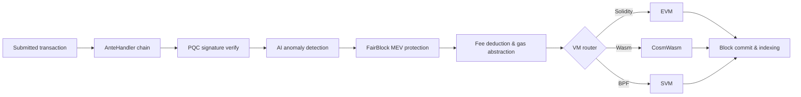

# Panoramica dell'Architettura

QoreChain è un nodo blockchain modulare composto da tre processi principali — il nodo della chain, il sidecar AI e l'indicizzatore di blocchi — supportati da un database Postgres e monitorati tramite Prometheus e Grafana. La mainnet (`qorechain-vladi`, EVM chain ID **9801**) è attiva dal 7 giugno 2026 sulla versione della chain **v3.1.82**, con una testnet parallela (`qorechain-diana`, EVM chain ID **9800**). La chain è costruita su Cosmos SDK v0.53. Il diagramma seguente mostra la disposizione di alto livello dei componenti.

Il ciclo di vita della transazione riportato di seguito riassume come una transazione inviata attraversa il nodo — dalla catena di decorator dell'AnteHandler (controlli di sicurezza e delle commissioni) all'esecuzione nella VM e al regolamento on-chain:



```
┌────────────────────────────────────────────────────────────────────────────┐
│                            QoreChain Node                                  │
│                                                                            │
│  ┌──────────────────── Virtual Machines ──────────────────────┐           │
│  │  ┌───────┐    ┌──────────┐    ┌───────┐                   │           │
│  │  │  EVM  │    │ CosmWasm │    │  SVM  │                   │           │
│  │  │(Sol.) │◄──►│ (Wasm)   │◄──►│ (BPF) │                   │           │
│  │  └───┬───┘    └────┬─────┘    └───┬───┘                   │           │
│  │      └─────────┬───┘──────────────┘                       │           │
│  │           x/crossvm (bridge)                               │           │
│  └────────────────────────────────────────────────────────────┘           │
│                                                                            │
│  ┌────────────────────── Tokenomics ─────────────────────────┐           │
│  │  ┌──────┐   ┌───────┐   ┌───────────┐                    │           │
│  │  │x/burn│   │x/xqore│   │x/inflation│                    │           │
│  │  │10 ch.│   │lock/  │   │finite     │                    │           │
│  │  │37/30/│   │unlock │   │emission   │                    │           │
│  │  │20/10/│   │PvP    │   │590M       │                    │           │
│  │  │3     │   │       │   │budget     │                    │           │
│  │  └──────┘   └───────┘   └───────────┘                    │           │
│  └────────────────────────────────────────────────────────────┘           │
│                                                                            │
│  ┌──────────── IBC / Bridges ────────────────────────────────┐           │
│  │  ┌──────────┐  ┌──────────┐  ┌───────────┐  ┌──────────┐ │           │
│  │  │x/bridge  │  │x/babylon │  │x/abstract │  │x/gas     │ │           │
│  │  │37 QCB +  │  │BTC re-   │  │ account   │  │abstract. │ │           │
│  │  │8 IBC     │  │staking   │  │session key│  │multi-tok │ │           │
│  │  └────┬─────┘  └────┬─────┘  └───────────┘  └──────────┘ │           │
│  │  QCB Bridge     Babylon IBC   ERC-4337-like   ibc/USDC    │           │
│  │  PQC-signed     BTC finality  social recov.   ibc/ATOM    │           │
│  │  36 ext chains  checkpoint    spending rules  fee convert  │           │
│  │  ┌──────────┐                                              │           │
│  │  │x/fair    │  5-Lane Prioritization: PQC|MEV|AI|Def|Free │           │
│  │  │ block    │  tIBE encrypted mempool framework           │           │
│  │  └──────────┘                                              │           │
│  └────────────────────────────────────────────────────────────┘           │
│                                                                            │
│  ┌──── Rollup Development Kit ───────────────────────────────┐           │
│  │  ┌──────────┐  ┌──────────┐  ┌───────────┐  ┌──────────┐ │           │
│  │  │ x/rdk    │  │Settlement│  │ DA Router │  │ Profiles │ │           │
│  │  │ 4 modes: │  │Optimistic│  │ Native    │  │ defi     │ │           │
│  │  │ opt/zk/  │  │ZK/Based/ │  │ Celestia* │  │ gaming   │ │           │
│  │  │ based/   │  │Sovereign │  │ Both      │  │ nft      │ │           │
│  │  │ sovereign│  │          │  │           │  │ social/  │ │           │
│  │  │          │  │          │  │           │  │ general  │ │           │
│  │  └────┬─────┘  └────┬─────┘  └───────────┘  └──────────┘ │           │
│  │  Bank escrow    Auto-finalize  SHA-256 commit  AI-assisted │           │
│  │  Burn on create EndBlocker     Blob pruning    PRISM sugg. │           │
│  │  → x/multilayer (RegisterSidechain + AnchorState)          │           │
│  └────────────────────────────────────────────────────────────┘           │
│                                                                            │
│  ┌──────────────┐ ┌──────┐ ┌────────────┐ ┌─────┐                       │
│  │x/rlconsensus │ │ x/ai │ │x/reputation│ │x/qca│                       │
│  │  PRISM (RL)  │ │      │ │            │ │     │                       │
│  └──────┬───────┘ └──┬───┘ └────┬──────┘ └──┬──┘                       │
│   PPO MLP         AI Engine   Scoring    CPoS Pools                      │
│   Obs/Action      Fraud Det.  Decay      Bonding                         │
│   Circuit Brk     Fee Opt.    Sigmoid    Slashing                        │
│   Rollup Adv.     TEE/FL                 QDRW Gov                        │
│                                                                            │
│  ┌──────┐ ┌──────────┐                                                   │
│  │x/pqc │ │ x/multi  │                                                   │
│  └──┬───┘ └────┬─────┘                                                   │
│  Dilithium    Layer Router                                                │
│  ML-KEM       Sidechains                                                  │
│  Hybrid Sig   + Rollups                                                   │
│  SHAKE-256                                                                │
│                                                                            │
│  ┌──────┐ ┌───────┐                                                      │
│  │x/svm │ │x/cross│                                                      │
│  └──┬───┘ └───┬───┘                                                      │
│  BPF Exec   CrossVM Msg                                                   │
└────────┬──────┬───────────────────────────────────────┬───────────────────┘
         │      │                                       │
   ┌─────┴─────┐│                              ┌───────┴──────┐
   │libqorepqc ││                              │  Indexer     │
   │(Rust PQC) ││                              │  (Postgres)  │
   └───────────┘│                              └──────────────┘
   ┌───────────┐│  ┌──────────┐
   │libqoresvm ││  │AI Sidecar│
   │(Rust BPF) │└──│ (gRPC)   │
   └───────────┘   └──────────┘
```

## Componenti del Nodo

QoreChain viene eseguito come tre processi cooperanti, ciascuno con il proprio modulo Go e binario:

| Componente         | Descrizione                                                                                                                                                                                                                                                                                          | Posizione                 |
| ------------------ | ---------------------------------------------------------------------------------------------------------------------------------------------------------------------------------------------------------------------------------------------------------------------------------------------------- | ------------------------- |
| **qorechain-node** | Il nodo blockchain principale. Esegue il QoreChain Consensus Engine, esegue tutti i moduli personalizzati, gestisce tutti e tre i runtime VM ed espone endpoint RPC, REST, gRPC e JSON-RPC.                                                                                                          | `qorechain-core/`         |
| **ai-sidecar**     | Un servizio gRPC che fornisce capacità avanzate di inferenza AI supportate dal QCAI Backend. Il sidecar gestisce le richieste di inferenza che superano l'ambito dell'agente RL on-chain, come l'analisi del linguaggio naturale e il riconoscimento di pattern complessi. Comunica con il nodo tramite gRPC sulla porta 50051. | `qorechain-core/sidecar/` |
| **block-indexer**  | Un listener WebSocket che si sottoscrive ai nuovi blocchi e alle transazioni dall'endpoint RPC del nodo, analizza gli eventi e scrive dati strutturati in un database Postgres per query rapide da parte di explorer e API.                                                                          | `qorechain-core/indexer/` |

## Porte

| Porta | Protocollo     | Servizio                                                                          |
| ----- | -------------- | --------------------------------------------------------------------------------- |
| 26657 | HTTP/WebSocket | RPC del QoreChain Consensus Engine (blocchi, transazioni, stato del consenso)     |
| 1317  | HTTP           | API REST (endpoint di query, broadcast delle transazioni)                         |
| 9090  | gRPC           | Endpoint gRPC per query e transazioni                                             |
| 8545  | HTTP           | EVM JSON-RPC (namespace `eth_`, `web3_`, `net_`, `txpool_`, `qor_`)               |
| 8546  | WebSocket      | EVM JSON-RPC (sottoscrizioni WebSocket)                                           |
| 8899  | HTTP           | SVM JSON-RPC (compatibile con Solana: `getAccountInfo`, `getBalance`, `getSlot`, ecc.) |
| 50051 | gRPC           | AI Sidecar (richieste di inferenza dal nodo)                                      |
| 5432  | TCP            | Postgres (archiviazione dell'indicizzatore di blocchi)                            |
| 9091  | HTTP           | Metriche Prometheus                                                               |
| 3000  | HTTP           | Dashboard Grafana                                                                 |

## Mappa dei Moduli

QoreChain registra **45+ moduli di genesis, inclusi 20+ moduli personalizzati**, raggruppati per funzione:

**Sicurezza**

* `x/pqc` — Crittografia post-quantistica: Dilithium-5, ML-KEM-1024, ibrida secp256k1 (ECDSA) + ML-DSA-87, SHAKE-256, agilità algoritmica

**AI e Machine Learning**

* `x/ai` — Routing delle transazioni, rilevamento di anomalie, rilevamento di frodi, ottimizzazione delle commissioni, attestazione TEE, apprendimento federato
* `x/reputation` — Punteggio di reputazione multi-fattore dei validatori con decadimento temporale
* `x/rlconsensus` — Agente RL on-chain (PPO MLP), tuning dinamico del consenso, circuit breaker, advisory per i rollup — il livello di ottimizzazione PRISM

**Consenso**

* `x/qca` — Triple-Pool Composite PoS (RPoS/DPoS/PoS) sul QoreChain Consensus Engine, bonding curve personalizzata, slashing progressivo, governance QDRW

**Macchine Virtuali**

* `x/vm` — Routing delle VM e gestione del ciclo di vita
* `x/svm` — Runtime SVM: distribuzione/esecuzione BPF, riscossione del rent, RPC compatibile con Solana
* `x/crossvm` — Comunicazione cross-VM: precompile EVM-CosmWasm + eventi asincroni SVM

**Tokenomics e Liquidità**

* `x/burn` — 10 canali di burn, distribuzione delle commissioni nell'EndBlocker (suddivisione 37/30/20/10/3)
* `x/xqore` — Staking potenziato dalla governance: lock/unlock, penalità di uscita graduate, rebase PvP
* `x/inflation` — Emissione a offerta fissa da un budget finito di ricompense di staking su un calendario pluriennale
* `x/amm` — Liquidità on-chain / market maker automatizzato

**Bridge e Interoperabilità**

* `x/bridge` — 37 configurazioni QCB (36 chain esterne + loopback di QoreChain) per ogni tipo di chain principale, attestazioni firmate con PQC, circuit breaker
* `x/babylon` — Restaking BTC tramite Babylon Protocol, checkpoint di epoca
* `x/multilayer` — Gestione dei livelli di sidechain/paychain/rollup, ancoraggio dello stato

**Estensioni di Governance e Licensing**

* `x/abstractaccount` — Smart account: multisig, social recovery, session key, regole di spesa
* `x/fairblock` — Protezione MEV: framework di mempool cifrato con threshold IBE
* `x/gasabstraction` — Pagamento del gas multi-token: conversione delle commissioni ibc/USDC, ibc/ATOM
* `x/license` — Licensing della chain

**Rollup**

* `x/rdk` — Rollup Development Kit: 4 modalità di settlement (optimistic, zk, based, sovereign), profili preconfigurati, DA native, escrow bancario

## Catena AnteHandler

Ogni transazione passa attraverso la seguente catena di decorator prima dell'esecuzione. I decorator vengono eseguiti in ordine; qualsiasi decorator può rifiutare la transazione.

```
SetUpContext
  → CircuitBreaker
    → PQCVerify
      → PQCHybridVerify
        → AIAnomaly
          → FairBlock
            → SVMComputeBudget
              → SVMDeductFee
                → Extension
                  → ValidateBasic
                    → TxTimeout
                      → Memo
                        → MinGasPrice
                          → ConsumeTxSize
                            → GasAbstraction
                              → DeductFee
                                → SetPubKey
                                  → ValidateSigCount
                                    → SigGasConsume
                                      → SigVerify
                                        → IncrementSequence
```

I decorator principali vengono eseguiti nella seguente sequenza (ogni decorator viene eseguito in ordine e può rifiutare una transazione):

1. **PQCVerify** — Modulo `x/pqc`. Verifica le firme Dilithium-5 sulle transazioni contrassegnate come PQC.
2. **PQCHybridVerify** — Modulo `x/pqc`. Verifica le firme ibride duali secp256k1 (ECDSA) + ML-DSA-87.
3. **AIAnomaly** — Modulo `x/ai`. Esegue il rilevamento di anomalie con isolation forest e il punteggio di rischio.
4. **FairBlock** — Modulo `x/fairblock`. Elabora le transazioni cifrate con tIBE per la protezione MEV.
5. **SVMComputeBudget** — Modulo `x/svm`. Convalida e alloca le compute unit per i programmi SVM.
6. **SVMDeductFee** — Modulo `x/svm`. Deduce le commissioni di esecuzione specifiche di SVM.
7. **GasAbstraction** — Modulo `x/gasabstraction`. Converte i token di commissione non nativi (USDC, ATOM) prima della deduzione.

## Stack Docker Compose

L'intero stack di sviluppo viene eseguito come un deployment Docker Compose a sei servizi su una rete bridge condivisa (`qorechain-net`):

| Servizio         | Immagine                   | Scopo                                                |
| ---------------- | -------------------------- | --------------------------------------------------- |
| `qorechain-node` | `qorechain-core:latest`    | Nodo della chain con tutti i moduli, le VM e gli endpoint RPC |
| `ai-sidecar`     | `qorechain-sidecar:latest` | Servizio di inferenza AI (gRPC + QCAI Backend)      |
| `block-indexer`  | `qorechain-indexer:latest` | Indicizzatore di blocchi/transazioni (WebSocket + Postgres) |
| `postgres`       | `postgres:16-alpine`       | Database per l'indicizzatore di blocchi             |
| `prometheus`     | `prom/prometheus:latest`   | Raccolta e archiviazione delle metriche             |
| `grafana`        | `grafana/grafana:latest`   | Dashboard di monitoraggio e alerting                |

Avvia l'intero stack:

```bash
docker compose up -d
```

Tutti i dati persistenti sono archiviati in volumi Docker denominati: `node-data`, `postgres-data`, `prometheus-data` e `grafana-data`.

## Correlati

* [Architettura Multilayer](/architecture/multilayer-architecture) — registrazione delle sidechain e ancoraggio dello stato.
* [Meccanismo di Consenso](/architecture/consensus-mechanism) — produzione dei blocchi, finalità e slashing.
* [Motore di Consenso PRISM](/architecture/prism-consensus-engine) — ottimizzazione dei parametri guidata dall'AI.
* [Sicurezza Post-Quantistica](/architecture/post-quantum-security) — firme Dilithium-5 in tutto lo stack.
