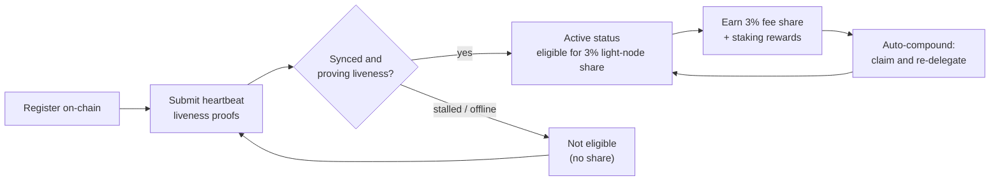

# Ricompense e monitoraggio

Un light node sia **guadagna ricompense** sia **deve restare in salute** per continuare a guadagnarle. Questa pagina spiega la quota di ricompensa del 3% riservata ai light node, come funzionano lo staking delegato e l'auto-capitalizzazione, e come monitorare il nodo.

## La quota del 3% sulle ricompense di blocco

La distribuzione delle commissioni di QoreChain riserva una **quota fissa del 3% ai light node** che servono dati di rete. Questa è una delle cinque destinazioni nella ripartizione delle ricompense del protocollo — validatori (37%), bruciato (30%), tesoreria (20%), staker (10%) e **light node (3%)** — imposta on-chain. Consulta [Tokenomics](/architecture/tokenomics) per la ripartizione completa.

Per essere idoneo a questa quota, un nodo deve essere **registrato on-chain e dimostrare attivamente la liveness** tramite prove heartbeat. Un nodo registrato ma offline non guadagna la quota. Consulta [Registrazione e licenze](/light-node/registration-and-licensing) per come funzionano la registrazione e gli heartbeat.

*Idoneità alle ricompense: registrarsi on-chain, dimostrare la liveness tramite heartbeat per raggiungere lo stato attivo, guadagnare la quota del 3% e poi capitalizzarla automaticamente nello stake.*



## Come funzionano le ricompense

Oltre alla quota riservata ai light node, il nodo gestisce lo stake delegato e le ricompense di staking che esso produce. Il comportamento è determinato dalla sezione `[delegation]` di `config.toml`.

### Staking delegato con suddivisione multi-validatore

Puoi delegare su **più validatori** invece di concentrare lo stake su uno solo. Il nodo tiene traccia di ciascuna delega e della quota di stake assegnata a ciascun validatore tramite **pesi di suddivisione** configurabili, così da poter distribuire il rischio su tutto l'insieme.

### Auto-capitalizzazione delle ricompense

Il nodo può **riscuotere le ricompense e ridelegarle automaticamente** a un intervallo configurabile. Per impostazione predefinita l'auto-capitalizzazione è abilitata con un intervallo di `1h`, con una soglia minima di ricompensa (in `uqor`) che deve accumularsi prima che venga attivata una riscossione. La capitalizzazione trasforma le ricompense guadagnate in stake aggiuntivo senza intervento manuale.

### Ribilanciamento basato sulla reputazione

Quando il ribilanciamento è abilitato, il nodo può **spostare automaticamente la delega verso validatori con reputazione più alta**, nel rispetto di un punteggio minimo di reputazione configurabile. In questo modo lo stake resta produttivo presso validatori che stanno performando bene, anziché restare presso quelli peggiorati.

### Ispezione di ricompense e deleghe

L'edizione SX espone comandi per ispezionare questo stato:

```bash
lightnode-sx delegation   # current delegations and their split
lightnode-sx rewards      # pending staking rewards (uqor)
lightnode-sx validators   # the bonded validator set
```

Nell'edizione UX, la vista **Delegation** mostra le stesse informazioni su deleghe e ricompense nel browser.

## Monitoraggio

Mantenere il nodo in salute è ciò che lo mantiene idoneo alle ricompense. Ci sono tre cose che vale la pena tenere d'occhio.

### Telemetria

La telemetria in tempo reale copre validatori, consenso/rete, il bridge e la tokenomics, ciascuno aggiornato secondo il proprio intervallo (configurato sotto `[telemetry]` in `config.toml`). Dalla CLI:

```bash
lightnode-sx status    # node and light-client sync status
lightnode-sx network   # recent synced headers and latest height
```

L'edizione UX mostra gli stessi dati in tempo reale nelle sue viste **Overview**, **Network**, **Bridge** e **Tokenomics** — consulta [Edizione UX](/light-node/ux-edition).

### Salute di sincronizzazione e heartbeat

Il comando `status` riporta il chain ID, l'altezza dell'ultimo blocco, se la chain è in fase di recupero, e l'altezza sincronizzata e lo stato di sincronizzazione del light client. Un nodo registrato, sincronizzato e in esecuzione continua a inviare **prove di liveness tramite heartbeat** e quindi resta idoneo alla quota di ricompensa. Questi heartbeat sono prodotti tramite una **pipeline di transazioni co-firmate PQC** (ibrida Dilithium-5 / ML-DSA-87), coerentemente con l'impostazione predefinita PQC-required della chain — consulta [Registrazione e licenze](/light-node/registration-and-licensing#pqc-cosigned-heartbeat-pipeline) per come funziona la pipeline e come abilitare gli heartbeat on-chain. Se `status` mostra il nodo bloccato o non in sincronizzazione, potrebbe non riuscire a dimostrare la liveness — indaga prima che l'idoneità ne risenta.

### Salute tramite self-test

Se sospetti un problema con lo stack crittografico, esegui il self-test PQC in qualsiasi momento:

```bash
lightnode-sx selftest
```

Esegue keygen → sign → verify → rilevamento manomissioni (cinque controlli) e termina con codice diverso da zero in caso di qualsiasi fallimento. Questo è il modo più rapido per escludere una libreria `libqorepqc` rotta o mancante quando si diagnosticano problemi del nodo. Consulta [Edizione SX](/light-node/sx-edition) per la suddivisione completa del self-test.

## Dove andare ora

- [Registrazione e licenze](/light-node/registration-and-licensing) — registrati e resta attivo.
- [Tokenomics](/architecture/tokenomics) — il modello completo di ricompensa e burn.
