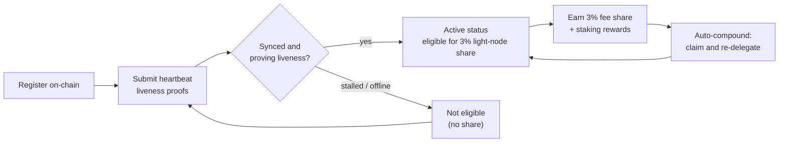

# Ricompense e Monitoraggio

Un light node **guadagna ricompense** e allo stesso tempo **deve restare in salute** per continuare a guadagnarle. Questa pagina descrive la quota del 3% di ricompensa riservata ai light node, come funzionano lo staking delegato e l'auto-compounding, e come monitorare il nodo.

## La quota del 3% sulle ricompense di blocco

La distribuzione delle commissioni di QoreChain riserva una quota fissa del **3% ai light node** che servono dati di rete. Questa è una delle cinque destinazioni nella ripartizione delle ricompense del protocollo — validatori (37%), bruciato (30%), tesoreria (20%), staker (10%) e **light node (3%)** — applicata on-chain. Vedi [Tokenomics](/architecture/tokenomics) per la ripartizione completa.

Per essere idoneo a questa quota, un nodo deve soddisfare tre condizioni, verificate on-chain e non auto-dichiarate: una licenza `lightnode_operator` attiva, un minimo di **1.000 QOR delegati** — conteggiati come totale su tutti i validatori a cui deleghi, non per singolo validatore — e una commissione di registrazione on-chain di **1 QOR**. La partecipazione è inoltre limitata a livello di rete a **10.000 light node**. Vedi [Registrazione e Licenze](/light-node/registration-and-licensing) per come funzionano registrazione e licenza, incluso lo stato attuale dell'iscrizione al programma di ricompense.

Una volta registrato e con la delega attiva, restare idonei è solo questione di restare attivi. Un nodo deve mantenere almeno l'**80% di uptime**, e deve continuare a inviare prove di liveness tramite heartbeat a un intervallo di circa **1.000 blocchi (~39 minuti)**, con un periodo di grazia di circa **100 blocchi (~4 minuti)** dopo un heartbeat mancato prima di essere marcato come inattivo. Un nodo marcato come inattivo smette di guadagnare la quota finché non dimostra nuovamente la propria liveness.

*Idoneità alla ricompensa: possedere una licenza on-chain attiva e lo stake minimo delegato, registrarsi, e poi continuare a dimostrare la liveness tramite heartbeat per restare sopra le soglie di uptime e di intervallo heartbeat che mantengono attiva l'erogazione della quota.*


```mermaid
flowchart LR
    A["Register on-chain"] --> B["Submit heartbeat<br/>liveness proofs"]
    B --> C{"Synced and<br/>proving liveness?"}
    C -- "yes" --> D["Active status<br/>eligible for 3% light-node share"]
    C -- "stalled / offline" --> E["Not eligible<br/>(no share)"]
    E --> B
    D --> F["Earn 3% fee share<br/>+ staking rewards"]
    F --> G["Auto-compound:<br/>claim and re-delegate"]
    G --> D
```

## Come funzionano le ricompense

Oltre alla quota riservata ai light node, il nodo gestisce lo stake delegato e le ricompense di staking che produce. Il comportamento è determinato dalla sezione `[delegation]` di `config.toml`.

### Staking delegato con suddivisione multi-validatore

Puoi delegare su **più validatori** invece di concentrare lo stake su uno solo. Il nodo tiene traccia di ciascuna delega e della quota di stake assegnata a ciascun validatore tramite **pesi di suddivisione** configurabili, così da poter distribuire il rischio sull'insieme.

### Ricompense con auto-compounding

Il nodo può **riscattare le ricompense e ridelegarle automaticamente** a un intervallo configurabile. Per impostazione predefinita l'auto-compounding è abilitato con un intervallo di `1h`, con una soglia minima di ricompensa (in `uqor`) che deve accumularsi prima che venga attivato un riscatto. Il compounding trasforma le ricompense guadagnate in stake aggiuntivo senza intervento manuale.

### Ribilanciamento basato sulla reputazione

Quando il ribilanciamento è abilitato, il nodo può **spostare la delega verso validatori con reputazione più alta** in modo automatico, soggetto a un punteggio minimo di reputazione configurabile. Questo mantiene lo stake impiegato con validatori che stanno performando bene, invece di lasciarlo con quelli la cui reputazione si è degradata.

### Ispezionare ricompense e deleghe

L'edizione SX espone comandi per ispezionare questo stato:

```bash
lightnode-sx delegation   # current delegations and their split
lightnode-sx rewards      # pending staking rewards (uqor)
lightnode-sx validators   # the bonded validator set
```

Nell'edizione UX, la vista **Delegation** mostra le stesse informazioni su deleghe e ricompense nel browser.

## Monitoraggio

Mantenere il nodo in salute è ciò che lo mantiene idoneo alle ricompense. Ci sono tre aspetti da tenere sotto controllo.

### Telemetria

La telemetria in tempo reale copre validatori, consenso/rete, il bridge e la tokenomics, ciascuna aggiornata secondo il proprio intervallo (configurato sotto `[telemetry]` in `config.toml`). Dalla CLI:

```bash
lightnode-sx status    # node and light-client sync status
lightnode-sx network   # recent synced headers and latest height
```

L'edizione UX mostra gli stessi dati in tempo reale nelle sue viste **Overview**, **Network**, **Bridge** e **Tokenomics** — vedi [Edizione UX](/light-node/ux-edition).

### Salute di sincronizzazione e heartbeat

Il comando `status` riporta l'ID della chain, l'altezza dell'ultimo blocco, se la chain è in fase di recupero (catching up), e l'altezza sincronizzata e lo stato di sincronizzazione del light client. Un nodo che è registrato, sincronizzato e in esecuzione continua a inviare **prove di liveness tramite heartbeat** e quindi resta idoneo alla quota di ricompensa. Questi heartbeat vengono prodotti tramite una **pipeline di transazioni co-firmate PQC** (ibrida Dilithium-5 / ML-DSA-87), coerentemente con il requisito PQC predefinito della chain — vedi [Registrazione e Licenze](/light-node/registration-and-licensing#pqc-cosigned-heartbeat-pipeline) per il funzionamento della pipeline e come abilitare gli heartbeat on-chain. Se `status` mostra il nodo bloccato o non in sincronizzazione, potrebbe non riuscire a dimostrare la liveness — indaga prima che l'idoneità venga compromessa.

### Salute tramite self-test

Se sospetti un problema con lo stack crittografico, esegui in qualsiasi momento il self-test PQC:

```bash
lightnode-sx selftest
```

Esegue keygen → sign → verify → rilevamento manomissioni (cinque controlli) e termina con codice diverso da zero in caso di qualsiasi errore. Questo è il modo più rapido per escludere un problema nello stack di firma post-quantistica quando si diagnosticano problemi del nodo. Vedi [Edizione SX](/light-node/sx-edition) per la descrizione completa del self-test.

## Prossimi passi

- [Registrazione e Licenze](/light-node/registration-and-licensing) — registrati e resta attivo.
- [Tokenomics](/architecture/tokenomics) — il modello completo di ricompense e burn.
