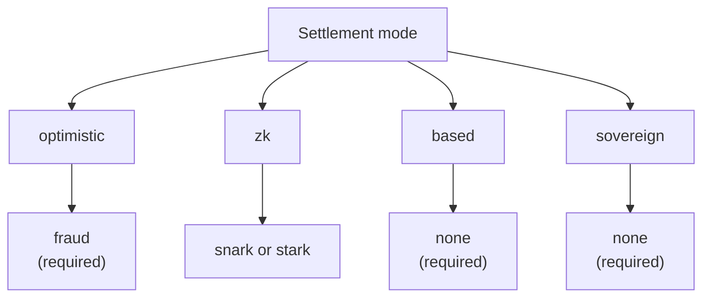

# Panoramica dei Rollup

Il **Rollup Development Kit (RDK)** di QoreChain — il modulo `x/rdk` — consente agli sviluppatori di lanciare rollup specifici per applicazione che si regolano su QoreChain. Ogni rollup è un ambiente di esecuzione indipendente con il proprio block time, la propria macchina virtuale, il proprio modello di commissioni e il proprio sequencing, mentre eredita le garanzie di QoreChain in termini di sicurezza, crittografia post-quantum e disponibilità dei dati.

:::caution
L'RDK e il livello di settlement dei rollup sono una funzionalità in attiva evoluzione. Considera le modalità di settlement, i sistemi di prova, i preset e la maturità delle singole funzionalità descritti in questa sezione come intenzione progettuale soggetta a modifiche, e valida ogni deployment sulla testnet **`qorechain-diana`** prima di puntare alla mainnet (**`qorechain-vladi`**, EVM chain ID **9801**, versione della chain **v3.1.80**).
:::

Per il riferimento al modulo di livello più basso — parametri del modulo, dettagli interni del ciclo di vita, integrazione del burn e anchoring multilivello — consulta la pagina **[Rollup Development Kit](/architecture/rollup-development-kit)** nella sezione Architettura. Questa sezione Rollup è la guida pratica rivolta agli sviluppatori: cos'è l'RDK, quale paradigma scegliere, come effettuare il deploy, come funziona la disponibilità dei dati e come si regolano i prelievi dall'L2 verso l'L1.

---

## Cosa ti offre l'RDK

Un rollup creato tramite l'RDK raggruppa quattro aspetti configurabili:

| Aspetto | Cosa controlla | Opzioni |
| ------- | ---------------- | ------- |
| **Modalità di settlement** | Come le transizioni di stato del rollup vengono verificate e finalizzate su QoreChain | `optimistic`, `zk`, `based`, `sovereign` |
| **Sistema di prova** | Il meccanismo crittografico o economico a supporto del settlement | `fraud`, `snark`, `stark`, `none` |
| **Modalità sequencer** | Chi ordina le transazioni prima che vengano regolate | `dedicated`, `shared`, `based` |
| **Disponibilità dei dati** | Dove vengono pubblicati i dati delle transazioni in modo che chiunque possa ricostruire lo stato | `native`, `celestia`, `both` |

Ogni rollup viene registrato con un `rollup-id` univoco, supportato da uno stake bond in QOR e a cui è assegnato uno stato del ciclo di vita (`pending`, `active`, `paused`, `stopped`). Vedi **[Deploying a Rollup](/rollups/deploying-a-rollup)** per il flusso completo di creazione e ciclo di vita.

---

## Cosa rende diverso l'RDK di QoreChain

Oltre alle funzionalità di base di qualsiasi kit per rollup, l'RDK di QoreChain espone tre capacità che dipendono dal Layer 1 di QoreChain e che nessun kit costruito su un livello base non post-quantum e non AI può offrire — più un auto-challenger watchtower. L'RDK è disponibile in cinque linguaggi (TypeScript, Python, Go, Rust, Java), tutti attualmente alla versione **v0.4.0**.

| Elemento distintivo | Cosa fa |
| -------------- | ------------ |
| **[Ricevute di settlement quantum-safe](/rollups/settlement-receipts)** | Trasforma un anchor di settlement in una ricevuta portabile verificabile **completamente offline** sotto una firma post-quantum (ML-DSA-87 / Dilithium-5) — byte per byte su tutti e cinque i client. |
| **[QCAI Rollup Copilot](/rollups/qcai-copilot)** | Aggrega i servizi AI/RL on-chain di QoreChain (agente di fee-policy, raccomandazioni, indagini sulle frodi, circuit breaker) in un'advisory in sola lettura e linguaggio chiaro per un singolo rollup. |
| **[Chiamate cross-VM Multi-VM](/rollups/multi-vm)** | Chiama un contratto CosmWasm da un contratto rollup EVM/Solidity tramite il precompile cross-VM (`0x…0901`). |
| **[Watchtower](/rollups/watchtower)** | Un framework auto-challenger per rollup ottimistici che evidenzia i nuovi batch e le scadenze delle finestre di challenge e contesta i batch non validi rispetto al tuo predicato di validità. |

Vedi **[Perché l'RDK di QoreChain](/rollups/why)** per la spiegazione completa e gli esempi di codice.

---

## I quattro paradigmi di settlement

L'RDK di QoreChain supporta quattro distinte modalità di settlement, ciascuna con diverse assunzioni di fiducia, caratteristiche di finalità e requisiti di prova. La combinazione di modalità di settlement e sistema di prova è validata on-chain: un abbinamento incompatibile viene rifiutato alla creazione. Il diagramma seguente mappa ciascuna modalità di settlement al suo sistema di prova valido.

### Optimistic

I rollup ottimistici assumono per impostazione predefinita che i batch inviati siano validi e si affidano alle **prove di frode** per la risoluzione delle controversie.

* **Sistema di prova**: `fraud` — prove di frode interattive
* **Sequencer**: `dedicated` o `shared`
* **Finalità**: ritardata fino allo scadere di una finestra di challenge configurabile senza alcuna challenge andata a buon fine
* **Controversie**: chiunque può inviare una challenge con prova di frode contro un batch inviato all'interno della finestra; una challenge andata a buon fine rifiuta il batch

### ZK (Zero-Knowledge)

I rollup ZK allegano una prova crittografica di validità a ciascun batch, dimostrando la correttezza della transizione di stato senza ri-esecuzione.

* **Sistema di prova**: `snark` (prove succinte) o `stark` (prove trasparenti, senza trusted setup)
* **Sequencer**: `dedicated` o `shared`
* **Finalità**: alla verifica della prova valida — non è richiesta alcuna finestra di challenge
* **Maturità**: la verifica ZK e STARK è ancora in fase di maturazione. Considera il settlement ZK come non ancora consolidato per la produzione e validalo sulla testnet. Vedi **[ZK / STARK e prelievi](/rollups/zk-stark-withdrawals)** per i dettagli.

### Based

I rollup based delegano il sequencing delle transazioni ai proposer di QoreChain (L1), ereditando la liveness e la resistenza alla censura della chain host.

* **Sistema di prova**: `none` — i proposer dell'L1 sono la fonte di verità dell'ordinamento
* **Sequencer**: `based` (obbligatorio — applicato dalla validazione on-chain)
* **Finalità**: segue la conferma della chain host
* **Compromesso**: il modello operativo più semplice, poiché i validatori di QoreChain gestiscono il sequencing, a costo del controllo della latenza tipico di un sequencer dedicato

### Sovereign

I rollup sovereign eseguono il proprio consenso e gestiscono autonomamente il sequencing. Ancorano lo stato a QoreChain per la verificabilità ma non dipendono dalla chain host per la finalità.

* **Sistema di prova**: `none`
* **Sequencer**: gestito autonomamente dal rollup
* **Finalità**: indipendente — determinata dal consenso proprio del rollup
* **Anchoring dello stato**: le state root vengono pubblicate su QoreChain per trasparenza, ma la chain host non le impone

---

## Compatibilità dei sistemi di prova

La modalità di settlement vincola quali sistemi di prova sono validi. Questi abbinamenti vengono applicati alla creazione di un rollup.

| Modalità di settlement | `fraud` | `snark` | `stark` | `none` |
| --------------- | :-----: | :-----: | :-----: | :----: |
| **optimistic**  | Obbligatorio | — | — | — |
| **zk**          | — | Supportato | Supportato | — |
| **based**       | — | — | — | Obbligatorio |
| **sovereign**   | — | — | — | Obbligatorio |

---

## Modalità sequencer

Il sequencer determina chi ordina le transazioni all'interno di un blocco del rollup prima del settlement.

| Modalità | Chi effettua il sequencing | Note |
| ---- | ------------- | ----- |
| **`dedicated`** | Un singolo indirizzo operatore designato | Latenza più bassa; richiede fiducia nell'operatore per liveness e ordinamento equo |
| **`shared`** | Un insieme di sequencer condiviso | Ordinamento distribuito sull'insieme; overhead di coordinamento leggermente maggiore |
| **`based`** | Proposer L1 di QoreChain | Eredita la sicurezza dei validatori della chain host e la resistenza alla censura; obbligatorio per il settlement `based` |

---

## Scelta di un paradigma

| Se vuoi... | Considera |
| -------------- | -------- |
| La configurazione operativa più semplice, con il sequencing dei validatori di QoreChain | **based** |
| Finalità rapida con garanzie crittografiche (in maturazione) | **zk** (`snark` / `stark`) |
| Un modello ben consolidato con risoluzione economica delle controversie | **optimistic** (`fraud`) |
| Piena indipendenza con il proprio consenso, ancorato per la verificabilità | **sovereign** |

Non sai da dove iniziare? L'RDK include **profili preset** che raggruppano queste scelte per le categorie applicative più comuni — vedi **[Profili Preset](/rollups/preset-profiles)** — e una query `suggest-profile` che ne raccomanda uno a partire da una descrizione in linguaggio chiaro del tuo caso d'uso.

Per gli sviluppatori, l'RDK è disponibile anche come SDK TypeScript pubblico **`@qorechain/rdk`** più lo scaffolder **`create-qorechain-rollup`**, che pilotano lo stesso modulo on-chain da codice — vedi **[Deploying a Rollup](/rollups/deploying-a-rollup#deploy-with-the-typescript-rdk-qorechainrdk)**.

## Correlati

* [Deploying a Rollup](/rollups/deploying-a-rollup) — lancia un rollup dalla CLI o dall'RDK TypeScript.
* [Profili Preset](/rollups/preset-profiles) — bundle one-click per le categorie applicative più comuni.
* [Disponibilità dei dati](/rollups/data-availability) — il router DA nativo e lo storage dei blob.
* [Prelievi ZK / STARK](/rollups/zk-stark-withdrawals) — flussi di prelievo supportati da prove.
