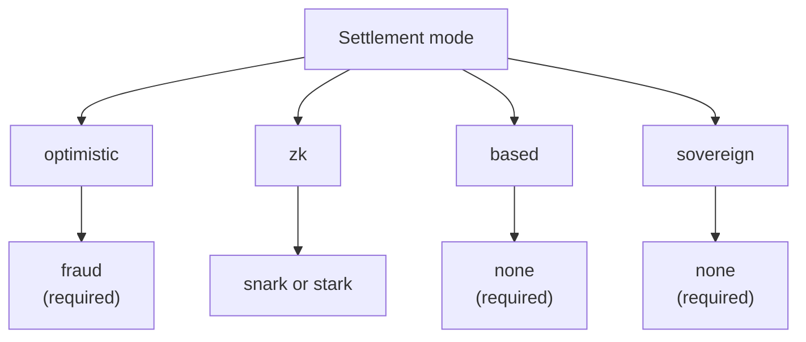

# Panoramica dei Rollup

Il **Rollup Development Kit (RDK)** di QoreChain — il modulo `x/rdk` — consente agli sviluppatori di lanciare rollup specifici per applicazione che si regolano (settle) su QoreChain. Ogni rollup è un ambiente di esecuzione indipendente con il proprio block time, la propria macchina virtuale, il proprio modello di commissioni e il proprio sequencing, pur ereditando le garanzie di sicurezza, crittografia post-quantistica e disponibilità dei dati di QoreChain.

:::caution
L'RDK e il livello di settlement dei rollup sono una funzionalità in evoluzione attiva. Considerate le modalità di settlement, i sistemi di prova, i preset e il livello di maturità di ogni singola funzionalità descritti in questa sezione come intenti di design soggetti a modifiche, e validate ogni deployment sulla testnet **`qorechain-diana`** prima di puntare alla mainnet (**`qorechain-vladi`**, chain ID EVM **9801**, versione della chain **v3.1.92**).
:::

Per il riferimento a livello di modulo più tecnico — parametri del modulo, dettagli interni del ciclo di vita, integrazione del burn e ancoraggio multilayer — consultate la pagina **[Rollup Development Kit](/architecture/rollup-development-kit)** nella sezione Architecture. Questa sezione Rollups è la guida pratica rivolta agli sviluppatori: cos'è l'RDK, quale paradigma scegliere, come eseguire il deployment, come funziona la disponibilità dei dati e come si regolano i prelievi da L2 a L1.

---

## Cosa offre l'RDK

Un rollup creato tramite l'RDK raggruppa quattro aspetti configurabili:

| Aspetto | Cosa controlla | Opzioni |
| ------- | ---------------- | ------- |
| **Modalità di settlement** | Come vengono verificate e finalizzate su QoreChain le transizioni di stato del rollup | `optimistic`, `zk`, `based`, `sovereign` |
| **Sistema di prova** | Il meccanismo crittografico o economico alla base del settlement | `fraud`, `snark`, `stark`, `none` |
| **Modalità sequencer** | Chi ordina le transazioni prima che vengano regolate | `dedicated`, `shared`, `based` |
| **Disponibilità dei dati** | Dove vengono pubblicati i dati delle transazioni affinché chiunque possa ricostruire lo stato | `native`, `celestia`, `both` |

Ogni rollup viene registrato con un `rollup-id` univoco, garantito da uno stake bond in QOR, e assegnato a uno stato del ciclo di vita (`pending`, `active`, `paused`, `stopped`). Consultate **[Deploying a Rollup](/rollups/deploying-a-rollup)** per il flusso completo di creazione e ciclo di vita.

---

## Cosa rende diverso l'RDK di QoreChain

Al di là delle funzionalità di base comuni a qualsiasi kit per rollup, l'RDK di QoreChain espone tre capacità che dipendono dal Layer 1 di QoreChain e che nessun kit costruito su un livello base non post-quantistico e non-AI può offrire — oltre a un watchtower con auto-challenger. L'RDK viene distribuito in cinque linguaggi (TypeScript, Python, Go, Rust, Java), allineati in versione alla **v0.4.4** su npm, PyPI e Maven Central (su crates.io, installate l'ultima release pubblicata oppure compilate dal repository). Dalla v0.4.2 i preset `mainnet` e `testnet` includono già gli endpoint pubblici `qore.host` incorporati, quindi `createRdkClient({ network })` raggiunge la chain senza alcuna configurazione manuale degli endpoint.

| Differenziatore | Cosa fa |
| -------------- | ------------ |
| **[Ricevute di settlement quantum-safe](/rollups/settlement-receipts)** | Trasforma un'ancora di settlement in una ricevuta portabile verificabile **completamente offline** sotto una firma post-quantistica (ML-DSA-87 / Dilithium-5) — identica byte per byte su tutti e cinque i client. |
| **[QCAI Rollup Copilot](/rollups/qcai-copilot)** | Aggrega i servizi AI/RL on-chain di QoreChain (agente di fee-policy, raccomandazioni, indagini sulle frodi, circuit breaker) in una consulenza in linguaggio semplice, di sola lettura, per un singolo rollup. |
| **[Chiamate cross-VM multi-VM](/rollups/multi-vm)** | Chiama un contratto CosmWasm da un contratto rollup EVM/Solidity attraverso il precompile cross-VM (`0x…0901`). |
| **[Watchtower](/rollups/watchtower)** | Un framework di auto-challenger per rollup optimistic che segnala nuovi batch e scadenze della finestra di contestazione, e contesta i batch non validi rispetto al vostro predicato di validità. |

Consultate **[Why QoreChain RDK](/rollups/why)** per la motivazione completa e degli esempi di codice.

---

## I quattro paradigmi di settlement

L'RDK di QoreChain supporta quattro distinte modalità di settlement, ciascuna con assunzioni di fiducia, caratteristiche di finalità e requisiti di prova diversi. La combinazione di modalità di settlement e sistema di prova viene validata on-chain — un abbinamento incompatibile viene rifiutato al momento della creazione. Il diagramma seguente mappa ogni modalità di settlement al proprio sistema di prova valido.

```mermaid
flowchart TD
    S["Settlement mode"]
    S --> O["optimistic"]
    S --> Z["zk"]
    S --> BA["based"]
    S --> SV["sovereign"]
    O --> OF["fraud<br/>(required)"]
    Z --> ZS["snark or stark"]
    BA --> BN["none<br/>(required)"]
    SV --> SN["none<br/>(required)"]
```

### Optimistic

I rollup optimistic assumono per default che i batch inviati siano validi e si affidano alle **prove di frode (fraud proof)** per la risoluzione delle contestazioni.

* **Sistema di prova**: `fraud` — prove di frode interattive
* **Sequencer**: `dedicated` o `shared`
* **Finalità**: Ritardata fino alla scadenza di una finestra di contestazione configurabile senza contestazioni riuscite
* **Contestazioni**: Chiunque può presentare una contestazione tramite fraud-proof contro un batch inviato entro la finestra; una contestazione riuscita respinge il batch

### ZK (Zero-Knowledge)

I rollup ZK allegano una prova di validità crittografica a ogni batch, dimostrando la correttezza della transizione di stato senza dover rieseguire le transazioni.

* **Sistema di prova**: `snark` (prove succinte) o `stark` (prove trasparenti, senza trusted setup)
* **Sequencer**: `dedicated` o `shared`
* **Finalità**: Al momento della verifica della prova valida — nessuna finestra di contestazione richiesta
* **Maturità**: La verifica ZK e STARK è ancora in fase di maturazione. Considerate il settlement ZK come non ancora pronto per la produzione e validatelo su testnet. Consultate **[ZK / STARK & Withdrawals](/rollups/zk-stark-withdrawals)** per i dettagli.

### Based

I rollup based delegano il sequencing delle transazioni ai proposer di QoreChain (L1), ereditando la liveness e la resistenza alla censura della chain ospitante.

* **Sistema di prova**: `none` — i proposer L1 sono la fonte di verità per l'ordinamento
* **Sequencer**: `based` (obbligatorio — imposto dalla validazione on-chain)
* **Finalità**: Segue la conferma della chain ospitante
* **Compromesso**: Modello operativo più semplice, poiché i validatori di QoreChain gestiscono il sequencing, al costo del controllo di latenza di un sequencer dedicato

### Sovereign

I rollup sovereign eseguono il proprio consensus e si auto-sequenziano. Ancorano lo stato a QoreChain per la verificabilità, ma non dipendono dalla chain ospitante per la finalità.

* **Sistema di prova**: `none`
* **Sequencer**: gestito autonomamente dal rollup
* **Finalità**: Indipendente — determinata dal consensus proprio del rollup
* **Ancoraggio dello stato**: Le state root vengono pubblicate su QoreChain per trasparenza, ma la chain ospitante non le impone

---

## Compatibilità tra modalità di settlement e sistema di prova

La modalità di settlement vincola quali sistemi di prova sono validi. Questi abbinamenti sono imposti al momento della creazione di un rollup.

| Modalità di settlement | `fraud` | `snark` | `stark` | `none` |
| --------------- | :-----: | :-----: | :-----: | :----: |
| **optimistic**  | Obbligatorio | — | — | — |
| **zk**          | — | Supportato | Supportato | — |
| **based**       | — | — | — | Obbligatorio |
| **sovereign**   | — | — | — | Obbligatorio |

---

## Modalità sequencer

Il sequencer determina chi ordina le transazioni all'interno di un blocco del rollup prima del settlement.

| Modalità | Chi sequenzia | Note |
| ---- | ------------- | ----- |
| **`dedicated`** | Un singolo indirizzo operatore designato | Latenza minima; richiede fiducia nell'operatore per la liveness e l'ordinamento equo |
| **`shared`** | Un insieme condiviso di sequencer | Ordinamento distribuito tra l'insieme; overhead di coordinamento leggermente maggiore |
| **`based`** | I proposer L1 di QoreChain | Eredita la sicurezza dei validatori della chain ospitante e la resistenza alla censura; obbligatorio per il settlement `based` |

---

## Scegliere un paradigma

| Se volete... | Considerate |
| -------------- | -------- |
| La configurazione operativa più semplice, con i validatori di QoreChain che sequenziano | **based** |
| Finalità rapida con garanzie crittografiche (in fase di maturazione) | **zk** (`snark` / `stark`) |
| Un modello ben consolidato con risoluzione economica delle contestazioni | **optimistic** (`fraud`) |
| Piena indipendenza con un proprio consensus, ancorato per la verificabilità | **sovereign** |

Non sapete da dove iniziare? L'RDK offre **profili preset** che raggruppano queste scelte per le categorie di applicazioni più comuni — consultate **[Preset Profiles](/rollups/preset-profiles)** — e una query `suggest-profile` che ne consiglia uno a partire da una descrizione in linguaggio naturale del vostro caso d'uso.

Per gli sviluppatori, l'RDK è disponibile anche come SDK TypeScript pubblico **`@qorechain/rdk`** insieme allo scaffolder **`create-qorechain-rollup`**, che pilotano lo stesso modulo on-chain direttamente da codice — consultate **[Deploying a Rollup](/rollups/deploying-a-rollup#deploy-with-the-typescript-rdk-qorechainrdk)**.

## Correlati

* [Deploying a Rollup](/rollups/deploying-a-rollup) — lanciate un rollup dalla CLI o dall'RDK TypeScript.
* [Preset Profiles](/rollups/preset-profiles) — bundle a un clic per le categorie di applicazioni più comuni.
* [Data Availability](/rollups/data-availability) — il router DA nativo e l'archiviazione dei blob.
* [ZK / STARK Withdrawals](/rollups/zk-stark-withdrawals) — flussi di prelievo garantiti da prova.
