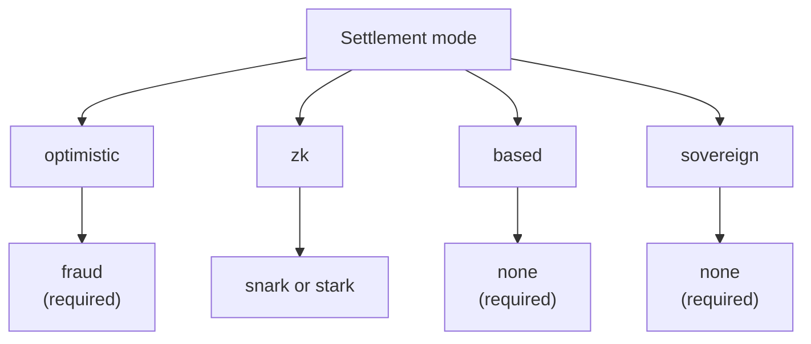

# Panoramica dei Rollup

Il **Rollup Development Kit (RDK)** di QoreChain — il modulo `x/rdk` — consente agli sviluppatori di lanciare rollup specifici per applicazione che si regolano su QoreChain. Ogni rollup è un ambiente di esecuzione indipendente con il proprio tempo di blocco, la propria macchina virtuale, il proprio modello di commissioni e il proprio sequencing, mentre eredita le garanzie di sicurezza, crittografia post-quantistica e disponibilità dei dati di QoreChain.

:::caution
L'RDK e il layer di settlement dei rollup sono una capacità in continua evoluzione. Considera le modalità di settlement, i sistemi di prova, i preset e la maturità delle singole funzionalità descritti in questa sezione come un'intenzione di progetto soggetta a modifiche, e convalida qualsiasi deployment sulla testnet **`qorechain-diana`** prima di puntare alla mainnet (**`qorechain-vladi`**, EVM chain ID **9801**, versione della chain **v3.1.85**).
:::

Per il riferimento del modulo a più basso livello — parametri del modulo, dettagli interni del ciclo di vita, integrazione del burn e ancoraggio multilayer — consulta la pagina **[Rollup Development Kit](/architecture/rollup-development-kit)** nella sezione Architettura. Questa sezione Rollup è la guida pratica rivolta agli sviluppatori: che cos'è l'RDK, quale paradigma scegliere, come effettuare il deployment, come funziona la disponibilità dei dati e come i prelievi si regolano dal L2 al L1.

---

## Cosa ti offre l'RDK

Un rollup creato tramite l'RDK riunisce quattro aspetti configurabili:

| Aspetto | Cosa controlla | Opzioni |
| ------- | -------------- | ------- |
| **Modalità di settlement** | Come le transizioni di stato del rollup vengono verificate e finalizzate su QoreChain | `optimistic`, `zk`, `based`, `sovereign` |
| **Sistema di prova** | Il meccanismo crittografico o economico che sostiene il settlement | `fraud`, `snark`, `stark`, `none` |
| **Modalità sequencer** | Chi ordina le transazioni prima che vengano regolate | `dedicated`, `shared`, `based` |
| **Disponibilità dei dati** | Dove vengono pubblicati i dati delle transazioni affinché chiunque possa ricostruire lo stato | `native`, `celestia`, `both` |

Ogni rollup viene registrato con un `rollup-id` univoco, sostenuto da un vincolo di stake in QOR, e riceve uno stato del ciclo di vita (`pending`, `active`, `paused`, `stopped`). Consulta **[Deployment di un Rollup](/rollups/deploying-a-rollup)** per il flusso completo di creazione e ciclo di vita.

---

## Cosa rende diverso l'RDK di QoreChain

Oltre ai requisiti di base di qualsiasi kit per rollup, l'RDK di QoreChain espone tre capacità che dipendono dal Layer 1 di QoreChain e che nessun kit costruito su un base layer non post-quantistico e privo di AI può offrire — più un auto-challenger watchtower. L'RDK è disponibile in cinque linguaggi (TypeScript, Python, Go, Rust, Java), con versioni allineate alla **v0.4.4** su npm, PyPI e Maven Central (su crates.io, installa l'ultima release pubblicata oppure compila dal repository). A partire dalla v0.4.2 i preset `mainnet` e `testnet` includono già gli endpoint pubblici `qore.host`, quindi `createRdkClient({ network })` raggiunge la chain senza alcuna configurazione manuale degli endpoint.

| Elemento distintivo | Cosa fa |
| ------------------- | ------- |
| **[Ricevute di settlement quantum-safe](/rollups/settlement-receipts)** | Trasforma un anchor di settlement in una ricevuta portabile verificabile **completamente offline** con una firma post-quantistica (ML-DSA-87 / Dilithium-5) — identica byte per byte in tutti e cinque i client. |
| **[QCAI Rollup Copilot](/rollups/qcai-copilot)** | Aggrega i servizi AI/RL on-chain di QoreChain (agente di politica delle commissioni, raccomandazioni, indagini antifrode, circuit breaker) in un report consultivo di sola lettura, in linguaggio semplice, per un singolo rollup. |
| **[Chiamate cross-VM multi-VM](/rollups/multi-vm)** | Chiama un contratto CosmWasm da un contratto rollup EVM/Solidity attraverso il precompile cross-VM (`0x…0901`). |
| **[Watchtower](/rollups/watchtower)** | Un framework di auto-challenger per rollup ottimistici che segnala i nuovi batch e le scadenze della finestra di challenge e contesta i batch non validi rispetto al tuo predicato di validità. |

Consulta **[Perché l'RDK di QoreChain](/rollups/why)** per le motivazioni complete e gli esempi di codice.

---

## I quattro paradigmi di settlement

L'RDK di QoreChain supporta quattro modalità di settlement distinte, ciascuna con diverse assunzioni di fiducia, caratteristiche di finalità e requisiti di prova. La combinazione di modalità di settlement e sistema di prova viene convalidata on-chain — un abbinamento incompatibile viene rifiutato al momento della creazione. Il diagramma seguente associa ogni modalità di settlement al relativo sistema di prova valido.

```mermaid
flowchart TD
    S["Settlement mode"]
    S --> O["optimistic"]
    S --> Z["zk"]
    S --> BA["based"]
    S --> SV["sovereign"]
    O --> OF["fraud<br/>(required)"]
    Z --> ZS["snark or stark"]
    BA --> BN["none<br/>(required)"]
    SV --> SN["none<br/>(required)"]
```

### Optimistic

I rollup ottimistici assumono che i batch inviati siano validi per impostazione predefinita e si affidano alle **fraud proof** per la risoluzione delle dispute.

* **Sistema di prova**: `fraud` — fraud proof interattive
* **Sequencer**: `dedicated` o `shared`
* **Finalità**: differita fino alla scadenza di una finestra di challenge configurabile senza alcuna contestazione andata a buon fine
* **Dispute**: chiunque può presentare una contestazione tramite fraud proof contro un batch inviato entro la finestra; una contestazione riuscita comporta il rifiuto del batch

### ZK (Zero-Knowledge)

I rollup ZK allegano a ogni batch una prova crittografica di validità, dimostrando la correttezza della transizione di stato senza ri-esecuzione.

* **Sistema di prova**: `snark` (prove succinte) o `stark` (prove trasparenti, senza trusted setup)
* **Sequencer**: `dedicated` o `shared`
* **Finalità**: alla verifica di una prova valida — nessuna finestra di challenge richiesta
* **Maturità**: la verifica ZK e STARK è ancora in fase di maturazione. Considera il settlement ZK come non ancora consolidato per la produzione e convalidalo su testnet. Consulta **[ZK / STARK e Prelievi](/rollups/zk-stark-withdrawals)** per i dettagli.

### Based

I rollup based delegano il sequencing delle transazioni ai proposer di QoreChain (L1), ereditando la liveness e la resistenza alla censura della chain ospitante.

* **Sistema di prova**: `none` — i proposer L1 sono la fonte di verità per l'ordinamento
* **Sequencer**: `based` (obbligatorio — applicato dalla validazione on-chain)
* **Finalità**: segue la conferma della chain ospitante
* **Compromesso**: il modello operativo più semplice, poiché i validator di QoreChain gestiscono il sequencing, al costo del controllo di latenza offerto da un sequencer dedicato

### Sovereign

I rollup sovereign eseguono il proprio consenso e si auto-sequenziano. Ancorano lo stato a QoreChain per la verificabilità, ma non dipendono dalla chain ospitante per la finalità.

* **Sistema di prova**: `none`
* **Sequencer**: gestito autonomamente dal rollup
* **Finalità**: indipendente — determinata dal consenso proprio del rollup
* **Ancoraggio dello stato**: le state root vengono pubblicate su QoreChain per trasparenza, ma la chain ospitante non le fa rispettare

---

## Compatibilità dei sistemi di prova

La modalità di settlement vincola quali sistemi di prova sono validi. Questi abbinamenti vengono applicati al momento della creazione di un rollup.

| Modalità di settlement | `fraud` | `snark` | `stark` | `none` |
| ---------------------- | :-----: | :-----: | :-----: | :----: |
| **optimistic**  | Obbligatorio | — | — | — |
| **zk**          | — | Supportato | Supportato | — |
| **based**       | — | — | — | Obbligatorio |
| **sovereign**   | — | — | — | Obbligatorio |

---

## Modalità sequencer

Il sequencer determina chi ordina le transazioni all'interno di un blocco del rollup prima del settlement.

| Modalità | Chi sequenzia | Note |
| -------- | ------------- | ---- |
| **`dedicated`** | Un singolo indirizzo operatore designato | Latenza minima; richiede fiducia nell'operatore per la liveness e l'ordinamento equo |
| **`shared`** | Un insieme di sequencer condiviso | Ordinamento distribuito nell'insieme; overhead di coordinamento leggermente superiore |
| **`based`** | I proposer L1 di QoreChain | Eredita la sicurezza dei validator e la resistenza alla censura della chain ospitante; obbligatorio per il settlement `based` |

---

## Scegliere un paradigma

| Se vuoi... | Considera |
| ---------- | --------- |
| La configurazione operativa più semplice, con i validator di QoreChain a gestire il sequencing | **based** |
| Finalità rapida con garanzie crittografiche (in maturazione) | **zk** (`snark` / `stark`) |
| Un modello ben consolidato con risoluzione economica delle dispute | **optimistic** (`fraud`) |
| Indipendenza totale con il tuo consenso, ancorato per la verificabilità | **sovereign** |

Non sai da dove iniziare? L'RDK include **profili preset** che raggruppano queste scelte per le categorie di applicazioni più comuni — consulta **[Profili Preset](/rollups/preset-profiles)** — e una query `suggest-profile` che ne raccomanda uno a partire da una descrizione in linguaggio semplice del tuo caso d'uso.

Per gli sviluppatori, l'RDK è disponibile anche come SDK TypeScript pubblico **`@qorechain/rdk`** insieme allo scaffolder **`create-qorechain-rollup`**, che pilotano lo stesso modulo on-chain da codice — consulta **[Deployment di un Rollup](/rollups/deploying-a-rollup#deploy-with-the-typescript-rdk-qorechainrdk)**.

## Correlati

* [Deployment di un Rollup](/rollups/deploying-a-rollup) — lancia un rollup dalla CLI o dall'RDK TypeScript.
* [Profili Preset](/rollups/preset-profiles) — bundle pronti all'uso per le categorie di applicazioni più comuni.
* [Disponibilità dei Dati](/rollups/data-availability) — il router DA nativo e lo storage dei blob.
* [Prelievi ZK / STARK](/rollups/zk-stark-withdrawals) — flussi di prelievo garantiti da prove.
