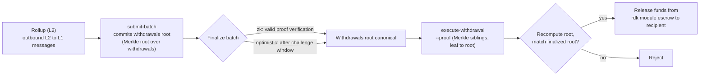

# ZK / STARK & Prelievi

Questa pagina copre due argomenti correlati: i **sistemi di proof ZK** (`snark` e `stark`) usati dai rollup con settlement ZK, e il **flusso di prelievo L2 → L1** che sposta i fondi da un rollup verso QoreChain una volta che un batch è finalizzato.

:::caution
La verifica ZK e STARK è una parte dell'RDK in attiva maturazione. Tratta i sistemi di proof e il flusso di prelievo qui descritti come intento progettuale, validali sulla testnet **`qorechain-diana`** e non dare per scontate garanzie crittografiche pronte per la produzione sulla mainnet, per ora.
:::

---

## Sistemi di proof ZK

Un rollup con settlement ZK (modalità di settlement `zk`) allega una validity proof a ogni batch di settlement, dimostrando che la transizione di stato è corretta senza ri-eseguire le transazioni del rollup. Il settlement ZK supporta due sistemi di proof:

| Sistema di proof | Caratteristiche |
| ------------ | --------------- |
| **`snark`** | Proof succinte |
| **`stark`** | Proof trasparenti — nessun trusted setup |

La modalità di settlement `zk` richiede uno tra `snark` o `stark`; l'abbinamento è imposto on-chain quando il rollup viene creato. Per contro, il settlement `optimistic` usa il sistema di proof `fraud`, mentre i settlement `based` e `sovereign` usano `none`. Vedi **[Panoramica dei Rollup](/rollups/overview)** per la matrice di compatibilità completa.

### Finalità

A differenza dei rollup ottimistici — che attendono lo scadere di una finestra di contestazione delle fraud proof — un batch ZK può finalizzarsi alla **verifica di una proof valida**, senza finestra di disputa. Questo è il compromesso fondamentale del settlement ZK: una finalità più forte e più rapida in cambio del costo e della complessità di generare le proof.

### Maturità

La verifica delle proof ZK e STARK è ancora in fase di maturazione. Considera il settlement ZK come **non ancora pronto per la produzione**: prototipa e valida su testnet, e segui le release notes dell'RDK per lo stato della verifica completa delle proof prima di farvi affidamento per rollup mainnet che gestiscono valore.

---

## Come i batch trasportano i prelievi

Quando un rollup effettua il settlement di un batch, quel batch può anche fare il commit dei messaggi cross-layer in uscita del rollup — i suoi **prelievi L2 → L1**. Concettualmente:

* Un batch finalizzato può trasportare un commitment al suo insieme di prelievi (una Merkle root sui messaggi di prelievo del batch).
* Ogni singolo prelievo è una foglia sotto quella root, identificata dal suo indice di batch e da un indice di prelievo.
* Una volta che il batch è finalizzato, qualsiasi parte può dimostrare che una specifica foglia di prelievo è inclusa sotto la root sottoposta a commit, e attivare il payout.

Ecco perché i prelievi dipendono dal settlement: un prelievo può essere eseguito solo contro un batch **finalizzato**, perché è la finalizzazione a rendere canonica la root dei prelievi sottoposta a commit.

Per come i batch vengono sottomessi e finalizzati — incluso `submit-batch` e il percorso di disputa `challenge-batch` per i rollup ottimistici — vedi **[Distribuire un Rollup](/rollups/deploying-a-rollup)**.

---

## Eseguire un prelievo: `execute-withdrawal`

Il comando `execute-withdrawal` finalizza un prelievo L2 → L1 contro la root dei prelievi di un batch finalizzato. Dimostra che una foglia di prelievo è sottoposta a commit in quella root e paga il destinatario dall'escrow del modulo rdk. L'azione è **permissionless** — chiunque può sottomettere una proof valida.

```bash
qorechaind tx rdk execute-withdrawal \
  [rollup-id] [batch-index] [withdrawal-index] [recipient] [denom] [amount] \
  --proof <sibling-hash-1>,<sibling-hash-2>,... \
  --from mykey \
  --chain-id qorechain-diana \
  --fees 500uqor
```

**Argomenti posizionali:**

| Argomento | Descrizione |
| -------- | ----------- |
| `rollup-id` | Il rollup a cui appartiene il prelievo |
| `batch-index` | Il batch finalizzato la cui root dei prelievi fa il commit di questo prelievo |
| `withdrawal-index` | L'indice della foglia di prelievo all'interno di quel batch |
| `recipient` | L'indirizzo a cui effettuare il payout |
| `denom` | La denominazione da pagare |
| `amount` | L'importo da pagare |

**Flag:**

| Flag | Descrizione |
| ---- | ----------- |
| `--proof` | Sibling hash Merkle in formato hex separati da virgola, ordinati dalla foglia alla root, che dimostrano che la foglia di prelievo è sottoposta a commit nella root dei prelievi del batch |

Il valore di `--proof` è la inclusion proof: i sibling hash lungo il percorso dalla foglia di prelievo fino alla root dei prelievi sottoposta a commit dal batch. Il modulo ricalcola la root a partire dalla foglia e dai sibling forniti e la confronta con la root sottoposta a commit dal batch finalizzato prima di rilasciare i fondi in escrow.

---

## Flusso di prelievo end-to-end

*Il percorso da L2 a L1: un batch di settlement fa il commit di una root dei prelievi, il batch si finalizza, poi una inclusion proof permissionless rilascia i fondi in escrow su QoreChain.*



1. **Effettua il settlement di un batch.** L'operatore del rollup sottomette un batch di settlement con `submit-batch`. Il batch può fare il commit di una root dei prelievi sui suoi messaggi L2 → L1 in uscita.
2. **Finalizza.** Il batch si finalizza in base alla modalità di settlement del rollup — alla verifica di una proof valida per `zk`, oppure dopo la finestra di contestazione per `optimistic` (durante la quale `challenge-batch` può contestarlo).
3. **Dimostra ed esegui.** Una volta finalizzato, chiunque sottomette `execute-withdrawal` con la Merkle inclusion proof (`--proof`) per la specifica foglia di prelievo. Il modulo verifica l'inclusione rispetto alla root dei prelievi del batch finalizzato e paga il destinatario dall'escrow.

Poiché il passaggio 3 è permissionless e basato su proof, un prelievo non dipende dalla cooperazione dell'operatore del rollup una volta che il batch che lo trasporta è finalizzato.

---

## Correlati

* **[Panoramica dei Rollup](/rollups/overview)** — paradigmi di settlement e matrice di compatibilità dei sistemi di proof.
* **[Distribuire un Rollup](/rollups/deploying-a-rollup)** — comandi operatore `submit-batch` e `challenge-batch`.
* **[Rollup Development Kit](/architecture/rollup-development-kit)** — il riferimento del modulo di livello più basso.
