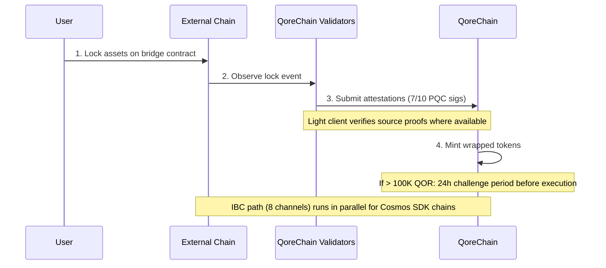

# ブリッジアーキテクチャ

`x/bridge` モジュールは、**37 個の QCB（QoreChain Bridge）チェーン構成と 8 本の IBC（Inter-Blockchain Communication）チャネル**を通じて、QoreChain をより広範なブロックチェーンエコシステムに接続するように設計されています。すべてのブリッジ操作はポスト量子暗号によって保護されます。

:::caution
クロスチェーンブリッジは**現在テストネット段階で保留中であり、まだ本番システムではありません**。以下で説明するチェーン構成、ライトクライアント、フローは、設計どおりかつテストネットで実証されたブリッジを反映しています。外部接続は段階的に展開されています。すべての対象は、稼働中のメインネットの保証ではなく、設計上の意図として扱ってください。
:::

## 接続の概要

QoreChain は、2 つのブリッジプロトコルを並行して動作させるように設計されています。

| プロトコル | 接続                 | セキュリティモデル                   | ユースケース                            |
| -------- | -------------------- | ------------------------------------ | --------------------------------------- |
| **IBC**  | 8 チャネル            | 標準 IBC + PQC パケット署名          | Cosmos SDK 互換チェーン                  |
| **QCB**  | 37 チェーン構成        | 7-of-10 Dilithium-5 マルチシグ        | 非 IBC チェーン（EVM、Solana、TON など） |

**37 個の QCB チェーン構成**には、**36 個の外部チェーン**に加えて、**QoreChain 自身**をネイティブ/ループバック構成として含みます（内部ルーティングと自己参照的な決済に使用）。8 本の IBC チャネルは Cosmos SDK 互換チェーンに接続します。

## IBC チャネル

QoreChain は、Hermes v1.x を介してリレーされる以下の 8 チェーンへの IBC 接続を維持するように設計されています。

| チェーン      | 説明                            |
| ---------- | ------------------------------ |
| Cosmos Hub | 主要なハブ接続                   |
| Osmosis    | DEX 流動性ルーティング            |
| Noble      | USDC ネイティブ発行              |
| Celestia   | データ可用性レイヤー              |
| Stride     | リキッドステーキング              |
| Akash      | 分散型コンピュート                |
| Babylon    | BTC リステーキングプロトコル       |
| Injective  | DeFi / オーダーブックの相互運用性  |

### IBC リレーヤー構成

* **リレーヤーソフトウェア**: Hermes v1.x
* **クライアント更新**: 自動ライトクライアントリフレッシュ
* **不正行為検出**: 有効 — リレーヤーは二重署名（equivocation）を監視します
* **パケットクリアリング**: 100 ブロックごとに、保留中の IBC パケットがクリアされます
* **PQC 拡張**: QoreChain から発信されるすべての IBC パケットには、前方量子セキュリティのためのオプションの Dilithium-5 署名が含まれます。PQC 対応の受信チェーンは、標準の IBC 検証と併せてこの署名を検証できます。

## QCB（QoreChain Bridge）プロトコル

QCB プロトコルは、ポスト量子暗号で保護されたハブアンドスポークアーキテクチャを採用しています。QoreChain がハブとして機能し、各外部チェーン用のスポーク構成に加えて、QoreChain 自身用のネイティブ/ループバック構成を持ちます。

### 外部チェーン構成（36）

QCB プロトコルは、以下の 36 個の外部チェーンを対象とするように設計されています。QoreChain 自身のネイティブ/ループバック構成と組み合わせると、**合計 37 個の QCB チェーン構成（QoreChain 自身を含む）**になります。

**ベースラインチェーン（10）**

Ethereum、Solana、TON、BSC、Avalanche、Polygon、Arbitrum、Optimism、Base、Sui。

**EVM ファミリーチェーン（14）**

zkSync Era、Linea、Scroll、Blast、Mantle、Hyperliquid、Berachain、Sonic、Sei、Monad、Plasma、Filecoin FVM、Cronos、Kaia。

**非 EVM チェーン（5）**

Starknet、XRP Ledger、Stellar、Hedera、Algorand。

**保留中のチェーン（7）**

NEAR、Bitcoin、Cardano、Polkadot、Tezos、Tron、Aptos。

:::note
カウント確認: 10 ベースライン + 14 EVM ファミリー + 5 非 EVM + 7 保留中 = **36 個の外部チェーン**。QoreChain 自身のネイティブ/ループバック構成を加えると、**37 個の QCB チェーン構成**になります。
:::

### アドレス形式

QCB プロトコルは、宛先アドレスを検証するためにチェーンを種類別に分類します。

| チェーンの種類 | チェーンの例                                                            | アドレス形式                                       |
| ------------ | ----------------------------------------------------------------------- | -------------------------------------------------- |
| `evm`        | Ethereum, BSC, Avalanche, Polygon, Arbitrum, Optimism, Base             | `0x` + 40 桁の 16 進数文字                         |
| `solana`     | Solana                                                                  | Base58、32-44 文字                                 |
| `ton`        | TON                                                                     | `EQ` + base64 エンコード                           |
| `sui_move`   | Sui                                                                     | `0x` + 64 桁の 16 進数文字                         |
| `aptos_move` | Aptos                                                                   | `0x` + 64 桁の 16 進数文字                         |
| `bitcoin`    | Bitcoin                                                                 | Bech32 (`bc1`)、P2SH (`3...`)、またはレガシー (`1...`)  |
| `near`       | NEAR Protocol                                                           | `.near` サフィックスまたは暗黙的                    |
| `cardano`    | Cardano                                                                 | `addr1`（支払い）または `stake1`（ステーキング）     |
| `polkadot`   | Polkadot                                                                | SS58 エンコード                                    |
| `tezos`      | Tezos                                                                   | `tz1`/`tz2`/`tz3`（暗黙的）または `KT1`（生成済み） |
| `tron`       | TRON                                                                    | `T` + base58、34 文字                              |

## ライトクライアント

外部チェーンのイベントをトラストレスに検証するため、ブリッジは各ソースチェーンのコンセンサスおよび証明システムに合わせたオンチェーンライトクライアントを実行するように設計されています。これらのライトクライアントにより、QoreChain はバリデーターの証明にのみ依存することなく、入金と出金を検証できます。

| ライトクライアント         | ソースチェーン        | 検証プリミティブ                                                       |
| ----------------------- | ------------------- | ------------------------------------------------------------------- |
| **Ethereum ライトクライアント** | Ethereum / EVM L1 | BLS12-381 署名検証、SSZ シリアライゼーション、MPT 状態証明 |
| **Bitcoin SPV**         | Bitcoin             | ブロックヘッダーに対する簡易支払い検証（Simplified Payment Verification）                                |
| **Starknet STARK**      | Starknet            | Starknet 状態遷移の STARK 証明検証              |
| **Sui BLS**             | Sui                 | Sui チェックポイントの BLS 集約署名検証             |
| **Wormhole / Solana VAA** | Solana（Wormhole 経由） | Verified Action Approval（VAA）ガーディアン署名検証     |

## 入金フロー（外部から QoreChain へ）

以下のシーケンスは QCB 入金を示しています。資産が外部チェーンでロックされ、QoreChain バリデーターが PQC 署名された証明（7-of-10 Dilithium-5）を提出し、ラップされたトークンがミントされます。Cosmos SDK 互換チェーンは代わりに並行する IBC パス（8 チャネル、オプションの Dilithium-5 パケット署名付き）を使用します。どちらのパスもテストネット/保留中です。



```
External Chain          QoreChain Validators           QoreChain
     |                         |                          |
     | 1. Lock assets on       |                          |
     |    bridge contract      |                          |
     |------------------------>|                          |
     |                         | 2. Observe & attest      |
     |                         |    (7/10 PQC sigs)       |
     |                         |------------------------->|
     |                         |                          | 3. Mint wrapped
     |                         |                          |    tokens
     |                         |                          |
     |                         |    [If > 100K QOR]       |
     |                         |    24h challenge period   |
     |                         |    before execution       |
```

1. **ロック** — ユーザーが外部チェーン上のブリッジコントラクトに資産をロックします。
2. **証明** — ブリッジバリデーターがロックトランザクションを観測し、Dilithium-5 署名された証明を提出します。最低 **10 個中 7 個**のバリデーター証明が必要です。ソースチェーンにライトクライアントが利用可能な場合、ロックイベントはそのチェーン自身の証明に対して追加で検証されます。
3. **ミント** — 証明のしきい値が満たされると、ラップされたトークンが QoreChain 上でミントされます。
4. **チャレンジ期間** — 100,000 QOR 相当を超える送金には、実行前に **24 時間のチャレンジ期間**が適用されます。この期間中、バリデーターは疑わしい活動を報告できます。

## 出金フロー（QoreChain から外部へ）

```
QoreChain               QoreChain Validators           External Chain
     |                         |                          |
     | 1. Burn wrapped tokens  |                          |
     |------------------------>|                          |
     |                         | 2. Attest burn           |
     |                         |    (7/10 PQC sigs)       |
     |                         |------------------------->|
     |                         |                          | 3. Unlock original
     |                         |                          |    assets
```

1. **バーン** — ユーザーが QoreChain 上でラップされたトークンをバーンします。
2. **証明** — バリデーターが Dilithium-5 署名（7/10 のしきい値）でバーンイベントを証明します。
3. **アンロック** — しきい値に達すると、元の資産が外部チェーン上でアンロックされます。

出金時に徴収されるすべてのブリッジ手数料は、`bridge_fee` バーンチャネルを介して `x/burn` モジュールにルーティングされます（ブリッジ手数料の 100% がバーンされます）。

### L2 → L1 出金フロー（ロールアップ決済）

ブリッジは、**ロールアップ（L2）の出金をそのホストチェーン（L1）に決済する**ようにも設計されています。[Rollup Development Kit](/architecture/rollup-development-kit) を介してデプロイされたロールアップは、定期的にその状態を QoreChain にアンカーします。ブリッジはそれらの確定したアンカーを消費して、ロールアップからホストチェーンへの出金を承認します。

1. ユーザーがロールアップ（L2）上で出金を開始し、これが決済バッチに含まれます。
2. バッチが QoreChain にアンカーされ、ロールアップの決済モードに従って証明/確定されます（例えば、オプティミスティックチャレンジウィンドウの期限切れ後、または有効な証明の検証時）。
3. アンカーが確定すると、出金が請求可能になり、対応する資産が標準のバーンアンドアテストパスを通じてホストチェーン（L1）上で解放されます。

これにより、ロールアップのファイナリティがホストチェーンの決済保証に直接結び付けられ、対応する L2 状態が不可逆的に決済される前に L2 出金が解放されることはありません。

## セキュリティアーキテクチャ

### PQC マルチシグ

すべての QCB ブリッジ操作には、登録済みブリッジバリデーターからの **7-of-10 しきい値**の Dilithium-5 ポスト量子署名が必要です。各ブリッジバリデーターは以下を登録します。

* QoreChain バリデーターアドレス
* Dilithium-5 公開鍵（2,592 バイト）
* サポートするチェーンのリスト
* 評判スコア（`x/reputation` によって管理）

### サーキットブレーカー

接続された各チェーンには、独立したサーキットブレーカー保護があります。

| 保護                      | 説明                                                                          |
| ------------------------- | ------------------------------------------------------------------------------------ |
| **単一送金制限**          | チェーンごとの個々のブリッジ操作の最大金額                         |
| **日次総量制限**          | チェーンごと、24 時間ウィンドウごとの総量上限                                        |
| **手動一時停止**          | チェーンごとのガバナンスまたはバリデーターによる緊急停止                           |
| **異常検出**              | 短いウィンドウ内で 50 件を超える操作、または日次制限の 5 倍を超える量の場合に自動一時停止 |

サーキットブレーカーの状態はチェーンごとに追跡され、最大単一送金額、日次制限、現在の日次使用量、最終リセット高さ、および理由を含む一時停止状態が含まれます。

### チャレンジ期間

大口送金（100,000 QOR 相当超、`large_transfer_threshold` で設定可能）の場合:

* 証明のしきい値が満たされた後、**24 時間のチャレンジ期間**（86,400 秒）が適用されます。
* この期間中、いずれのバリデーターも操作を報告できます。
* 報告されなかった場合、期間の満了後に操作は自動的に実行されます。
* 報告された操作は、ガバナンスによるレビューのために凍結されます。

### AI パス最適化

ブリッジモジュールは、ルート最適化のために AI サブシステムと統合されています。複数のパスを通過できる送金（例: 中継を介したチェーン A からチェーン B への送金）について、パスオプティマイザーは以下を評価します。

* ルート全体にわたる推定手数料
* 推定完了時間
* パスごとのセキュリティスコア
* 推定の信頼度

## REST API エンドポイント

チェーンバージョン **v3.1.77** 時点で、ブリッジの状態は grpc-gateway を介して `/qorechain/bridge/v1/...` プレフィックスの下で**読み取り専用で REST 経由でも**クエリ可能です（`config`、`chains`、`chains/{chain_id}`、`validators`、`validators/{address}`、`operations`、`operations/{id}`）— 以前は gRPC のみでした。これらは、エクスプローラーやライトノードのテレメトリ向けに、実際のオンチェーン JSON を HTTP 経由で提供します。完全なリストについては [REST / gRPC エンドポイント](/api-reference/rest-grpc-endpoints#bridge-module) を参照してください。

| メソッド | エンドポイント                                       | 説明                                             |
| ------ | -------------------------------------------------- | ------------------------------------------------ |
| GET    | `/bridge/v1/chains`                                | サポートされているすべてのチェーン構成を一覧表示       |
| GET    | `/bridge/v1/chains/{chain_id}`                     | 特定のチェーンの構成を取得                          |
| GET    | `/bridge/v1/validators`                            | 登録済みのすべてのブリッジバリデーターを一覧表示       |
| GET    | `/bridge/v1/operations`                            | すべてのブリッジ操作を一覧表示（最新のものから）       |
| GET    | `/bridge/v1/operations/{operation_id}`             | 特定の操作の詳細を取得                             |
| GET    | `/bridge/v1/locked/{chain}/{asset}`                | チェーン/資産ペアのロック/ミント済み金額を取得        |
| GET    | `/bridge/v1/circuit-breakers`                      | すべてのサーキットブレーカーの状態を一覧表示          |
| GET    | `/bridge/v1/estimate/{from}/{to}/{asset}/{amount}` | AI 最適化されたルート見積もりを取得                  |

## ブリッジイベント

ブリッジモジュールは以下のオンチェーンイベントを発行します。

| イベントタイプ                | 説明                                            |
| ----------------------------- | ----------------------------------------------- |
| `bridge_deposit`              | 新しい入金操作が作成された                        |
| `bridge_withdraw`             | 新しい出金操作が作成された                        |
| `bridge_attestation`          | バリデーター証明が提出された                       |
| `bridge_operation_executed`   | 操作が確定され実行された                          |
| `bridge_circuit_breaker_trip` | サーキットブレーカーが作動または解除された          |
| `bridge_validator_registered` | 新しいブリッジバリデーターが登録された              |
| `bridge_pqc_verification`     | PQC 署名検証の結果（IBC パケット）                |

## 関連項目

* [資産のブリッジング](/user-guide/bridging-assets) — チェーン間で資産を段階的に移動します。
* [ダッシュボードブリッジ](/dashboard/bridge) — 日常的なユーザー向けのブリッジインターフェース。
* [Babylon による BTC リステーキング](/architecture/btc-restaking-babylon) — Bitcoin に裏付けられたセキュリティ。
* [ポスト量子セキュリティ](/architecture/post-quantum-security) — IBC パケットの PQC 検証。
