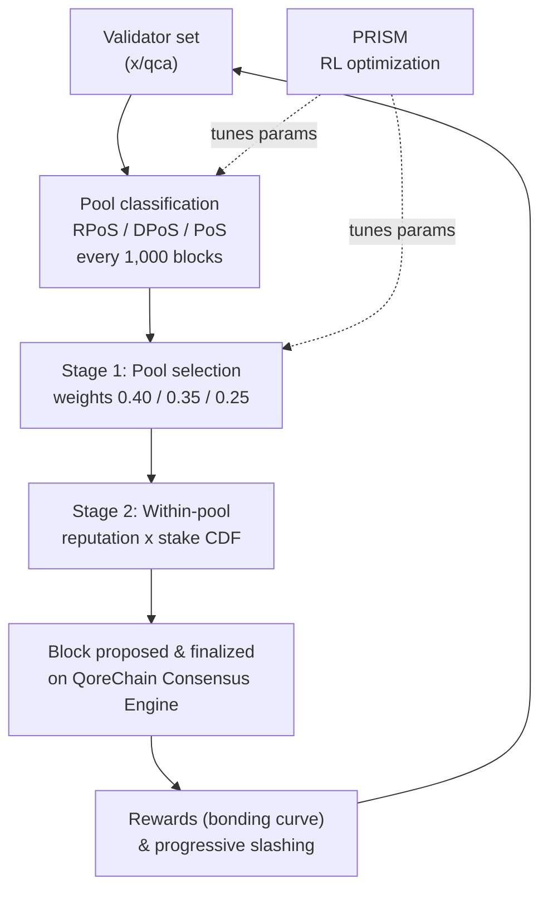

# コンセンサスメカニズム

QoreChain は **Triple-Pool Composite Proof-of-Stake (CPoS)** を実装しています。これは、バリデータを 3 つの専用プールに分類し、評判で重み付けした選択によってセキュリティ・分散性・パフォーマンスのバランスを取るコンセンサスメカニズムです。CPoS は `x/qca` モジュールに実装され、**QoreChain Consensus Engine** の上で動作します。

実行時にコンセンサスパラメータを調整する強化学習による最適化レイヤーは **PRISM** (Policy-driven Reinforcement-learning for Intelligent State Machines) というブランド名で呼ばれます。詳細は [PRISM Consensus Engine](/architecture/prism-consensus-engine) を参照してください。

以下の図は、QoreChain Consensus Engine 上での Triple-Pool CPoS の 1 つのブロック/コンセンサスサイクルを要約し、PRISM が調整可能な `x/qca` パラメータにどのようにフィードバックされるかを示しています。



---

## トリプルプールアーキテクチャ

CPoS は、評判・ステーク・委任の指標に基づいて、アクティブなバリデータセットを 3 つのプールに分割します。各プールはコンセンサスプロセスにおいて異なる役割を担います。

### プール分類

| プール                                | 基準                                                                      | 選択ウェイト         |
| ------------------------------------ | ----------------------------------------------------------------------- | ---------------- |
| **RPoS** (Reputation Proof-of-Stake) | 評判スコアが 70 パーセンタイル以上 **かつ** 自己ボンドしたステークが中央値以上     | 40%              |
| **DPoS** (Delegated Proof-of-Stake)  | 総委任量が 10,000 QOR 以上                                                  | 35%              |
| **PoS** (Standard Proof-of-Stake)    | 残りのすべてのアクティブなバリデータ                                            | 25%              |

分類は次の優先順位で評価されます: **RPoS > DPoS > PoS**。RPoS と DPoS の両方の要件を満たすバリデータは RPoS に割り当てられます。

再分類は **1,000 ブロック** ごとに行われます。各再分類エポックでは:

1. **評判スコアの収集** — すべてのアクティブなバリデータについて、`x/reputation` モジュールから評判スコアが収集されます。
2. **評判しきい値の計算** — ソートされたスコア分布から 70 パーセンタイルの評判しきい値が計算されます。
3. **自己ボンドステークの中央値の計算** — ソートされたステーク分布から自己ボンドステークの中央値が計算されます。
4. **バリデータの再割り当て** — 各アクティブなバリデータは、要件を満たす最も優先度の高いプールに再割り当てされます。
5. **デフォルト割り当て** — 未分類のバリデータ（まだ評価されていないもの）はデフォルトで PoS プールに割り当てられます。

---

## プール重み付けプロポーザー選択

ブロックプロポーザーの選択は、2 段階の決定論的プロセスに従います。

### ステージ 1: プール選択

決定論的なランダム値によって、次のブロックを提案するプールが選択されます:

```
seed = SHA256(lastBlockHash || height || "pool")
randVal = uint64(seed[:8]) / MaxUint64    // uniform in [0, 1)
```

プールは、`randVal` を累積ウェイトのしきい値と比較することで選択されます:

* `randVal < 0.40` → RPoS プール
* `0.40 <= randVal < 0.75` → DPoS プール
* `randVal >= 0.75` → PoS プール

### ステージ 2: プール内選択

選択されたプール内では、プロポーザーは **評判 × ステークで重み付けした CDF** によって選択されます。プール内の各バリデータについて:

1. 評判スコア `r` が `x/reputation` から取得されます。
2. 複合ウェイトは `w = r * tokens` です。
3. すべての複合ウェイトから累積分布関数（CDF）が構築されます。
4. ブロックハッシュと高さをシードとした決定論的なランダム抽出により、CDF に対してプロポーザーが選択されます。

### フォールバック動作

選択されたプールが空の場合、システムは PoS プールにフォールバックします。PoS プールも空の場合、選択はアクティブなバリデータセット全体にわたる評判重み付け選択にフォールバックします。

---

## カスタムボンディングカーブ

バリデータの報酬は、長期的な参加・高い評判・プロトコルの成長フェーズとの整合性を促進する多要素ボンディングカーブを用いて計算されます。

### 数式

```
R(v, t) = beta * S_v * (1 + alpha * ln(1 + L_v)) * Q(r_v) * P(t)
```

### 要素の定義

| 要素                    | 記号     | 説明                                                          | デフォルト  |
| ---------------------- | -------- | ----------------------------------------------------------- | --------- |
| ベース報酬乗数            | `beta`   | 報酬全体の大きさをスケーリングする                                 | 1.0       |
| 自己ボンドステーク         | `S_v`    | バリデータの自己ボンドトークン (uqor)                            | --        |
| ロイヤルティ感度          | `alpha`  | ロイヤルティ期間が報酬をどの程度増幅するかを制御する                 | 0.1       |
| ロイヤルティ期間          | `L_v`    | バリデータがアクティブだった連続ブロック数                          | --        |
| 評判品質                | `Q(r_v)` | 評判 `r` を \[0.75, 1.25] の範囲の報酬乗数にマッピングする         | --        |
| プロトコルフェーズ        | `P(t)`   | 報酬を立ち上げまたは抑制するフェーズ依存の乗数                      | 下記参照   |

### 評判品質関数

```
Q(r) = 1 + 0.5 * (r - 0.5)
```

結果は **\[0.75, 1.25]** の範囲にクランプされます:

| 評判スコア        | Q(r)  |
| ---------------- | ----- |
| 0.0              | 0.75  |
| 0.25             | 0.875 |
| 0.5              | 1.0   |
| 0.75             | 1.125 |
| 1.0              | 1.25  |

### プロトコルフェーズ乗数

| フェーズ  | P(t) | 説明                                          |
| ------- | ---- | --------------------------------------------- |
| Genesis | 1.5  | バリデータセットを立ち上げるための高めの報酬       |
| Growth  | 1.0  | ネットワーク拡張期における標準的な報酬            |
| Mature  | 0.8  | ネットワークが安定するにつれて発行を削減          |

### 決定論的演算

`ln(1 + L_v)` の計算は、引数縮小を伴うテイラー級数近似（`TaylorLn1PlusX`）を使用し、すべて `LegacyDec` 固定精度の小数で動作します。コンセンサスに重要な報酬計算では浮動小数点演算は一切使用されません。

---

## プログレッシブスラッシング

QoreChain は固定スラッシングレートを **プログレッシブペナルティモデル** に置き換えます。これは繰り返し違反する者への結果をエスカレートさせつつ、違反が時間とともに減衰することを許容します。

### 数式

```
penalty = base_rate * escalation_factor^effective_count * severity_factor
```

### 時間的減衰

過去の違反は、実効カウントに対して減衰するウェイトを寄与します:

```
effective_count = SUM( 0.5^(blocks_since_i / decay_halflife) )
```

各過去の違反 `i` について、その寄与は `decay_halflife` ブロック（デフォルト: 100,000）ごとに半減します。つまり、200,000 ブロック前の単一の古い違反は、実効カウントに対してわずか 0.25 しか寄与しません。

### 重大度係数

| 違反の種類           | 重大度係数        |
| ------------------- | --------------- |
| Downtime            | 1.0             |
| Double Sign         | 2.0             |
| Light Client Attack | 3.0             |

### 最大ペナルティ

ペナルティは、バリデータが蓄積した過去の違反の数にかかわらず、スラッシュイベントごとに **33%** に上限が設定されます。

### 計算例

50,000 ブロック前に 1 回、150,000 ブロック前に 1 回の合計 2 回の過去の違反があるバリデータがダブルサインを犯した場合:

1. **減衰寄与**:
   * 違反 1: `0.5^(50000 / 100000) = 0.5^0.5 = 0.707`
   * 違反 2: `0.5^(150000 / 100000) = 0.5^1.5 = 0.354`
   * `effective_count = 0.707 + 0.354 = 1.061`
2. **エスカレーション**: `1.5^1.061 = 1.516`
3. **ペナルティ**: `0.01 * 1.516 * 2.0 = 0.0303` (3.03%)

これを初回違反者と比較します: `0.01 * 1.5^0 * 2.0 = 0.02` (2.0%)。

---

## QDRW ガバナンス

QoreChain のガバナンスは、富豪支配的な掌握を防ぎつつ長期的なネットワーク参加者に報いるために **Quadratic Delegation with Reputation Weighting (QDRW)** を使用します。

### 投票力の数式

```
VP(v) = sqrt(staked + 2 * xQORE) * ReputationMultiplier(r)
```

ここで:

* `staked` = 投票者のボンドした QOR トークン
* `xQORE` = 投票者の xQORE 残高（長期ステーキングデリバティブ）
* `2` = xQORE ウェイト乗数（ガバナンスで設定可能）
* `r` = `x/reputation` からの投票者の評判スコア

### 評判乗数

評判乗数は、シグモイド曲線を介して \[0, 1] の `r` を \[0.5, 2.0] の乗数にマッピングします:

```
ReputationMultiplier(r) = 0.5 + 1.5 * sigmoid(6 * (r - 0.5))
```

| 評判スコア        | 乗数        |
| ---------------- | ---------- |
| 0.0              | 0.50       |
| 0.1              | 0.52       |
| 0.2              | 0.58       |
| 0.3              | 0.71       |
| 0.4              | 0.93       |
| 0.5              | 1.25       |
| 0.6              | 1.57       |
| 0.7              | 1.79       |
| 0.8              | 1.92       |
| 0.9              | 1.98       |
| 1.0              | 2.00       |

### 二次スケーリング

平方根関数により、投票力はステークに対して劣線形にスケールします。あるバリデータの 4 倍のステークを持つ投票者は、4 倍ではなく 2 倍の投票力しか得られません。これにより、大口トークン保有者がガバナンスの意思決定を支配することを防ぎます。

### 決定論的演算

`IntegerSqrt` は `LegacyDec` 精度でニュートン法を使用します。`SigmoidApprox` は 12 項のテイラー級数 `ExpApprox` を使用します。すべてのガバナンス演算は、すべてのバリデータノード間で完全に決定論的です。

---

## QCA パラメータ

次の表は、`x/qca` モジュールにおけるすべてのガバナンスで設定可能なパラメータを示しています:

### コアパラメータ

| パラメータ                   | 型       | デフォルト | 説明                                              |
| -------------------------- | ------- | ------- | ------------------------------------------------- |
| `use_reputation_weighting` | bool    | `true`  | 評判重み付けプロポーザー選択を有効化                   |
| `min_reputation_score`     | float64 | `0.1`   | アクティブな参加に必要な最小評判スコア                 |

### プール設定

| パラメータ                  | 型         | デフォルト         | 説明                                             |
| ------------------------- | --------- | ---------------- | ------------------------------------------------ |
| `classification_interval` | uint64    | `1000`           | プール再分類の間のブロック数                         |
| `weight_rpos`             | LegacyDec | `0.40`           | RPoS プールの選択ウェイト                           |
| `weight_dpos`             | LegacyDec | `0.35`           | DPoS プールの選択ウェイト                           |
| `min_delegation_dpos`     | uint64    | `10,000,000,000` | DPoS の最小委任量（10,000 QOR を uqor 換算）         |
| `rep_percentile_rpos`     | uint64    | `70`             | RPoS の評判パーセンタイルしきい値                    |

### ボンディングカーブ設定

| パラメータ          | 型         | デフォルト | 説明                                             |
| ------------------ | --------- | ------- | ------------------------------------------------ |
| `alpha`            | LegacyDec | `0.1`   | ロイヤルティ感度係数                                |
| `beta`             | LegacyDec | `1.0`   | ベース報酬乗数                                     |
| `phase_multiplier` | LegacyDec | `1.5`   | プロトコルフェーズ報酬乗数（Genesis フェーズ）        |

### スラッシング設定

| パラメータ            | 型         | デフォルト  | 説明                                    |
| ------------------- | --------- | --------- | -------------------------------------- |
| `base_rate`         | LegacyDec | `0.01`    | ベーススラッシュレート (1%)               |
| `escalation_factor` | LegacyDec | `1.5`     | プログレッシブエスカレーションのベース      |
| `max_penalty`       | LegacyDec | `0.33`    | イベントごとの最大ペナルティ (33%)         |
| `decay_halflife`    | uint64    | `100,000` | 違反ウェイトの半減期となるブロック数        |

### QDRW ガバナンス設定

| パラメータ             | 型         | デフォルト | 説明                                    |
| -------------------- | --------- | ------- | -------------------------------------- |
| `enabled`            | bool      | `false` | QDRW ガバナンス集計を有効化               |
| `xqore_multiplier`   | LegacyDec | `2.0`   | ステークトークンに対する xQORE ウェイト    |
| `rep_min_multiplier` | LegacyDec | `0.5`   | 最小評判乗数                             |
| `rep_max_multiplier` | LegacyDec | `2.0`   | 最大評判乗数                             |

## 関連項目

* [PRISM Consensus Engine](/architecture/prism-consensus-engine) — コンセンサスパラメータを調整する AI レイヤー。
* [Multilayer Architecture](/architecture/multilayer-architecture) — サイドチェーンがベースレイヤーにアンカーする仕組み。
* [Running a Validator](/developer-guide/running-a-validator) — チェーンを保護するバリデータを運用する。
* [Tokenomics](/architecture/tokenomics) — ステーキング報酬、インフレーション、スラッシング経済。
