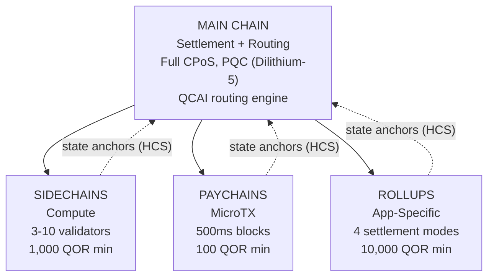

# マルチレイヤーアーキテクチャ

QoreChain は、`x/multilayer` モジュールを通じて **4 階層の階層型チェーンアーキテクチャ**を実装しています。メインチェーンは決済とトラストルートとして機能し、補助レイヤー（サイドチェーン、ペイチェーン、ロールアップ）は、異なるパフォーマンスとセキュリティのトレードオフを持つ専門的なワークロードを処理します。

---

## システム概要

以下の 4 階層の階層構造は、メインチェーンを決済とトラストルートとして示し、3 種類の補助レイヤーが Hierarchical Commitment Schemes（HCS）を介して状態ルートをメインチェーンに固定しています。



```
                    +---------------------------+
                    |       MAIN CHAIN          |
                    |  (Settlement + Routing)   |
                    |  Full CPoS consensus      |
                    |  PQC-secured (Dilithium-5)|
                    |  QCAI routing engine       |
                    +------+------+------+------+
                           |      |      |
              +------------+      |      +------------+
              |                   |                    |
    +---------v--------+ +-------v--------+ +---------v---------+
    |   SIDECHAINS     | |   PAYCHAINS    | |     ROLLUPS       |
    |  (Compute)       | |  (MicroTX)     | |  (App-Specific)   |
    |  3-10 validators | |  500ms blocks  | |  4 settlement     |
    |  1,000 QOR min   | |  100 QOR min   | |    modes          |
    |  Max: 10         | |  Max: 50       | |  10,000 QOR min   |
    +------------------+ +----------------+ |  Max: 100         |
                                            +-------------------+
```

---

## レイヤーの種類

### メインチェーン

メインチェーンは、QoreChain エコシステム全体のトラストルートです。

| プロパティ  | 値                                                                            |
| ---------- | ------------------------------------------------------------------------------ |
| コンセンサス | フル Triple-Pool CPoS（[コンセンサスメカニズム](/architecture/consensus-mechanism) を参照） |
| セキュリティ | Dilithium-5 署名で PQC 保護                                                     |
| 役割       | 決済レイヤー、状態アンカーストレージ、QCAI ルーティングエンジン、トラストルート       |
| ブロック時間 | 約 5 秒                                                                        |

すべての補助レイヤーは、Hierarchical Commitment Schemes（HCS）を介して定期的に状態ルートをメインチェーンに固定します。

### サイドチェーン

サイドチェーンは、DeFi プロトコル、ゲームエンジン、IoT データ処理などの**計算集約型の操作**を処理します。

| パラメータ                | 値                |
| ------------------------- | ----------------- |
| 最小バリデーター数         | 3                 |
| 最大バリデーター数         | 10                |
| 最小作成者ステーク         | 1,000 QOR         |
| 最大アクティブサイドチェーン数 | 10                |
| 対象ドメイン               | DeFi、ゲーム、IoT |

### ペイチェーン

ペイチェーンは、最小限のレイテンシで**高頻度のマイクロトランザクション**向けに最適化されています。

| パラメータ                | 値                                      |
| ------------------------ | --------------------------------------- |
| 目標ブロック時間          | 500 ms                                  |
| 最大アクティブペイチェーン数 | 50                                      |
| 最小作成者ステーク         | 100 QOR                                 |
| 対象ドメイン              | 決済、ストリーミング、マイクロトランザクション |

### ロールアップ

ロールアップは、Rollup Development Kit（`x/rdk`）を介してデプロイされる**アプリケーション固有のチェーン**です。これらはマルチレイヤーモジュール内でロールアップレイヤータイプとして登録されます。

| パラメータ              | 値                                          |
| ---------------------- | ------------------------------------------- |
| 決済モード              | 4（optimistic、zk、based、sovereign）        |
| 最大アクティブロールアップ数 | 100                                         |
| 最小作成者ステーク       | 10,000 QOR                                  |
| レイヤータイプ           | `rollup`                                    |
| 対象ドメイン            | DeFi、ゲーム、NFT、エンタープライズ            |

ロールアップのデプロイと構成については、[Rollup Development Kit](/architecture/rollup-development-kit) で詳しく説明します。

---

## QCAI トランザクションルーティング

QCAI ルーターは、受信する各トランザクションについてすべてのアクティブレイヤーを評価し、4 要素の加重スコアリングモデルを使用して最適な宛先を選択します。

### スコアリング式

各候補レイヤーは複合スコアを受け取ります（高いほど良い）。

```
Score = w_congestion * (1 - Congestion) + w_capability * Capability + w_cost * (1 - Cost) + w_latency * (1 - Latency)
```

| 要素        | 重み   | 説明                                                                         |
| ---------- | ------ | --------------------------------------------------------------------------- |
| 輻輳        | 0.30   | 現在の負荷レベル（反転: 輻輳が低いほどスコアが高い）                            |
| 能力        | 0.40   | レイヤーがトランザクションの要件にどれだけ一致するか                            |
| コスト      | 0.20   | メインチェーンに対する手数料倍率（反転: コストが低いほどスコアが高い）           |
| レイテンシ   | 0.10   | ファイナリティまでの予想時間（反転: レイテンシが低いほどスコアが高い）           |

### 信頼度しきい値

ルーターは、トランザクションを補助レイヤーにルーティングする前に、最低 **0.6** の信頼度スコアを要求します。このしきい値を満たすレイヤーがない場合、トランザクションはデフォルトでメインチェーンに送られます。

トランザクション送信者は優先レイヤーのヒントを提供できます。優先レイヤーが信頼度しきい値の少なくとも 80%（すなわち 0.48）のスコアを得た場合、それがルーティング先として受け入れられます。

### ペイロードヒューリスティック

詳細なトランザクションメタデータが利用できない場合、ルーターはペイロードサイズを分類シグナルとして使用します。

| ペイロードサイズ   | 優先レイヤー     | 根拠                                          |
| ----------------- | --------------- | -------------------------------------------- |
| &lt; 256 バイト    | ペイチェーン     | 単純な送金またはマイクロトランザクションの可能性が高い |
| 256 - 1,024 バイト | メインチェーン   | 標準的なトランザクションの複雑さ                 |
| > 1,024 バイト     | サイドチェーン   | 複雑なコントラクトインタラクションの可能性が高い   |

---

## Hierarchical Commitment Schemes（HCS）

補助レイヤーは、**状態アンカー**を介して定期的にその状態をメインチェーンにコミットします。各アンカーには、特定の高さにおける補助チェーンの状態の暗号学的証明が含まれます。

### アンカーの内容

| フィールド                  | 説明                                                 |
| ------------------------- | ---------------------------------------------------- |
| `layer_id`                | 補助レイヤーの識別子                                   |
| `layer_height`            | 補助チェーン上のブロック高さ                            |
| `state_root`              | 補助チェーンの状態ツリーの Merkle ルート                |
| `validator_set_hash`      | コミットメントに署名したバリデーターセットのハッシュ        |
| `pqc_aggregate_signature` | アンカーデータに対する Dilithium-5 集約署名             |
| `transaction_count`       | 前回のアンカー以降のトランザクション数                    |
| `compressed_state_proof`  | 圧縮された状態遷移証明                                  |

### アンカーの送信

アンカーは `MsgAnchorState` を介してメインチェーンに送信されます。キーパーは以下の手順に従ってアンカーを検証します。

1. **レイヤーが存在しアクティブである** — キーパーは、レイヤーが状態に存在し、現在 `active` ステータスであることを検証します。
2. **最小アンカー間隔の経過** — キーパーは、このレイヤーの前回のアンカー以降、少なくとも `min_anchor_interval` ブロック（デフォルト: 100）が経過していることを確認します。
3. **PQC 集約署名** — キーパーは、PQC 集約署名が存在し、アンカーデータに対して有効であることを保証します。

### チャレンジ期間

各アンカーは **24 時間**（86,400 秒、レイヤーごとに設定可能）の**チャレンジ期間**に入ります。この期間中、いずれの当事者も `MsgChallengeAnchor` を介して不正証明を送信することでアンカーに異議を申し立てることができます。不正証明が有効な場合、アンカーは無効化され、補助チェーンの状態は前回のアンカーにロールバックされます。

チャレンジ期間が異議の成立なく満了すると、アンカーは確定したものとみなされます。

---

## クロスレイヤー手数料バンドリング（CLFB）

CLFB により、ソースレイヤー上の単一の手数料支払いで、クロスレイヤートランザクションパス内の複数のレイヤーにわたる実行をカバーできます。

### 手数料計算

```
avgMultiplier = sum(layer_multiplier_i) / num_layers
bundledFee = (totalGas / 1000) * avgMultiplier
```

ここで:

* `layer_multiplier_i` は、トランザクションパス内の各レイヤーの基本手数料倍率です（メインチェーン = 1.0）。
* `totalGas` は、すべてのレイヤーにわたる推定総ガス消費量です。
* 結果は **uqor** で表され、最小手数料は 1 uqor です。

### 例

クロスレイヤートランザクションが 3 つのレイヤーに触れます: メインチェーン（倍率 1.0）、サイドチェーン（倍率 0.5）、ペイチェーン（倍率 0.1）。

```
avgMultiplier = (1.0 + 0.5 + 0.1) / 3 = 0.533
bundledFee = (150,000 / 1000) * 0.533 = 80 uqor
```

CLFB は `cross_layer_fee_bundling` パラメータを介してグローバルに有効化または無効化でき、個々のレイヤーは `cross_layer_fee_bundling_enabled` 構成フラグを介してオプトアウトできます。

---

## レイヤーのライフサイクル

各補助レイヤーは、明確に定義されたライフサイクルを進行します。

```
Proposed --> Active --> Suspended --> Decommissioned
                  \                /
                   +-- Active <--+
```

| ステータス          | 説明                                                                            | 許可される遷移            |
| ------------------ | ------------------------------------------------------------------------------- | ------------------------- |
| **Proposed**       | レイヤーは登録済みだがまだアクティブ化されていない                                  | Active, Decommissioned    |
| **Active**         | レイヤーは稼働中でトランザクションを受け付けている                                  | Suspended, Decommissioned |
| **Suspended**      | レイヤーは一時的に停止中（例: メンテナンスのため、またはセキュリティ上の懸念のため）   | Active, Decommissioned    |
| **Decommissioned** | レイヤーは恒久的に停止（終端状態）                                                 | なし                      |

ステータス遷移はキーパーによって強制されます。無効な遷移（例: Decommissioned から Active）は拒否されます。

---

## パラメータ

| パラメータ                      | 型     | デフォルト       | 説明                                             |
| ------------------------------ | ------ | --------------- | ------------------------------------------------------- |
| `max_sidechains`               | uint64 | `10`            | アクティブなサイドチェーンの最大数                     |
| `max_paychains`                | uint64 | `50`            | アクティブなペイチェーンの最大数                       |
| `min_anchor_interval`          | uint64 | `100`           | 状態アンカー間の最小ブロック数                          |
| `max_anchor_interval`          | uint64 | `1,000`         | 状態アンカー間の最大ブロック数（強制アンカー）           |
| `default_challenge_period`     | uint64 | `86,400`        | デフォルトのチャレンジ期間（秒、24 時間）                |
| `min_sidechain_stake`          | string | `1,000,000,000` | サイドチェーン作成の最小ステーク（uqor で 1,000 QOR）    |
| `min_paychain_stake`           | string | `100,000,000`   | ペイチェーン作成の最小ステーク（uqor で 100 QOR）        |
| `routing_enabled`              | bool   | `true`          | QCAI ベースのトランザクションルーティングを有効化         |
| `routing_confidence_threshold` | string | `0.6`           | QCAI ルーティング決定の最小信頼度                       |
| `cross_layer_fee_bundling`     | bool   | `true`          | グローバルなクロスレイヤー手数料バンドリングを有効化      |
