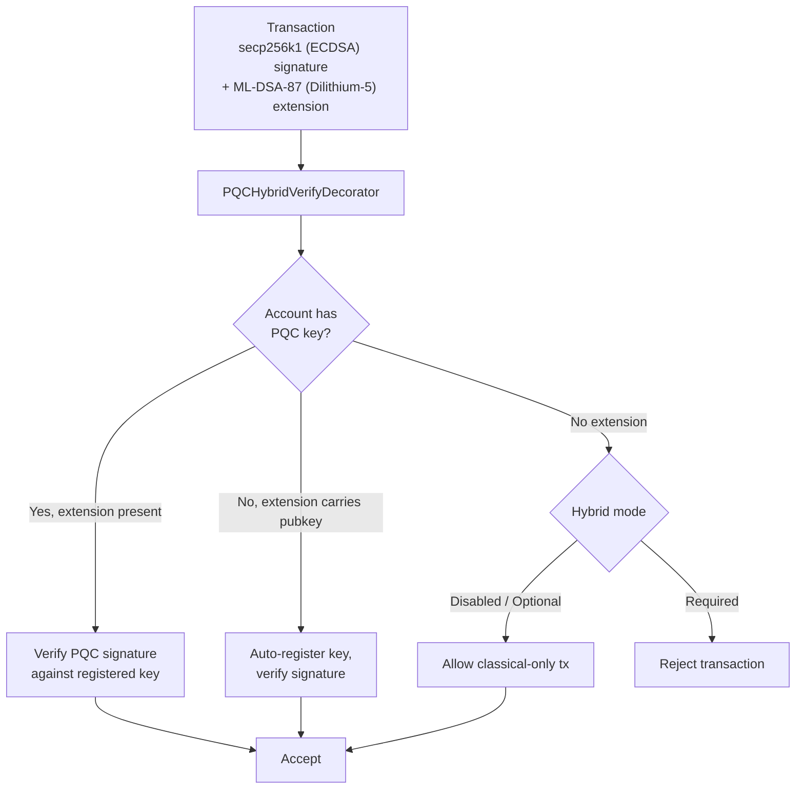

# ポスト量子セキュリティ

QoreChain は、**ジェネシス時点でポスト量子暗号（PQC）**を組み込んで構築されています — アップグレードとして後付けされたものではありません。`x/pqc` モジュールは、格子ベースのデジタル署名と鍵カプセル化を主要な暗号プリミティブとして提供し、長期的な耐性のためにガバナンス制御によるアルゴリズム俊敏性フレームワークを備えています。

完全な PQC ベースライン — **Dilithium-5（署名）+ ML-KEM-1024（KEM）+ SHAKE-256（ハッシュ）** — は現在完成し、ネットワークのデフォルトとなっています。現在のチェーンバージョン（**v3.1.82**）時点で、ハイブリッド署名は cosmos トランザクションパスで**デフォルトで必須**です: `hybrid_signature_mode = required` および `allow_classical_fallback = false`。すべての cosmos パストランザクションは、従来の secp256k1 署名と併せて Dilithium-5 署名を保持しなければなりません。PQC アカウントからの従来署名のみのトランザクションは拒否され、従来署名へのダウングレードパスは閉じられています。

## 設計原則

* **デフォルトで PQC 必須**: ポスト量子署名は cosmos パスで必須です。従来の secp256k1 署名のみではもはや不十分です — `allow_classical_fallback = false`。
* **デフォルトでハイブリッド**: Cosmos トランザクションは、従来の secp256k1 署名と Dilithium-5 PQC 署名の両方を同時に保持します。従来署名のみのフォールバックは閉じられています。
* **アルゴリズム俊敏性**: 暗号アルゴリズムレジストリはガバナンス制御されており、ハードフォークなしにネットワークが新しいアルゴリズムを採用したり、危殆化したアルゴリズムを廃止したりできます。
* **決定論的検証**: すべての署名検証は決定論的であり、バリデーターノード間で再現可能です。

## サポートされるアルゴリズム

| アルゴリズム      | 標準                  | カテゴリ           | NIST レベル | 公開鍵       | 秘密鍵       | 署名 / 暗号文           | 共有秘密       |
| --------------- | -------------------- | ----------------- | ---------- | ----------- | ----------- | ---------------------- | ------------- |
| **Dilithium-5** | ML-DSA-87 (FIPS 204) | 署名              | 5          | 2,592 バイト | 4,896 バイト | 4,627 バイト            | --            |
| **ML-KEM-1024** | FIPS 203             | 鍵カプセル化       | 5          | 1,568 バイト | 3,168 バイト | 1,568 バイト            | 32 バイト      |

両アルゴリズムは、標準化された最高のセキュリティカテゴリである **NIST セキュリティレベル 5** で動作し、従来型と量子型の両方の敵対者に対して AES-256 と同等の保護を提供します。

## 暗号バックエンド

PQC 操作は、格子ベースの署名、検証、鍵カプセル化を QoreChain ランタイムに公開する、高性能でメモリセーフな暗号バックエンドに実装されています。バックエンドは以下を提供します。

アルゴリズム固有の操作:

* Dilithium-5 の鍵生成、署名、検証
* ML-KEM-1024 の鍵生成、カプセル化、デカプセル化
* 決定論的ランダムビーコン生成（`seed`、`epoch`）

アルゴリズム認識操作:

* `Keygen(algorithmID)` — 登録済みの任意のアルゴリズムの鍵ペアを生成
* `Sign(algorithmID, privkey, message)` — 署名を作成
* `Verify(algorithmID, pubkey, message, signature)` — 署名を検証
* `AlgorithmInfo(algorithmID)` — 鍵/出力サイズをクエリ
* `ListAlgorithms()` — サポートされているすべてのアルゴリズムを列挙

すべての署名および検証操作は決定論的であり、すべてのバリデーターノードおよびサポートされるプラットフォームにわたって同一の結果を生成します。

これらと同じプリミティブ — ML-DSA（FIPS-204）、ML-KEM（FIPS-203）、SHAKE-256（FIPS-202）— は、オープンソースの [**qorechain-pqc**](https://github.com/qorechain/qorechain-pqc) ライブラリを通じてウォレットやインテグレーターに提供されています。このライブラリは、6 言語（JavaScript/TypeScript、Rust、Go、C、Python、Java）にわたって、一貫性のあるバイト互換の単一 API を提供します。[ポスト量子署名](/developer-guide/post-quantum-signing) を参照してください。

## 鍵の登録

アカウントは `MsgRegisterPQCKey`（レガシー、デフォルトで Dilithium-5）または `MsgRegisterPQCKeyV2`（アルゴリズム認識）を介して PQC 鍵を登録します。各メッセージには以下が含まれます。

* **Sender**: 鍵を登録するアカウントアドレス。
* **PublicKey**: PQC 公開鍵のバイト列。
* **AlgorithmID**: PQC アルゴリズム識別子（v2 のみ）。
* **KeyType**: 3 つの登録モードのいずれか:

| 鍵タイプ          | 説明                                                                      |
| ---------------- | ------------------------------------------------------------------------ |
| `hybrid`         | 従来型（ECDSA）と PQC の両方の鍵。トランザクションは二重署名を保持します。      |
| `pqc_only`       | PQC 鍵のみ。従来の署名は不要です。                                          |
| `classical_only` | 従来の鍵のみ。PQC 保護なし（非推奨）。                                       |

## ハイブリッド署名

ハイブリッド署名システムは、cosmos パストランザクションが従来の署名と PQC 署名の**両方**を同時に保持することを要求します。これにより多層防御が提供されます: 一方のスキームが破られても、もう一方がトランザクションを保護します。

ネットワークデフォルトの `hybrid_signature_mode = required` では、すべての cosmos パストランザクションは secp256k1 署名と併せて Dilithium-5 拡張を含める必要があります。唯一の例外（ブートストラップ用）は、**ジェネシス gentx（高さ 0）**と **PQC 鍵登録/移行トランザクション**（`MsgRegisterPQCKey`、`MsgRegisterPQCKeyV2`、`MsgMigratePQCKey`）であり、アカウントが最初の PQC 鍵を登録できるように、これらは従来署名のみであることが許可されています。

**EVM トランザクションは影響を受けません。** EVM トランザクションは別個の `eth_secp256k1` ante パス（QoreChain EVM Engine パス）で認証され、ハイブリッド PQC 拡張を必要としません。ハイブリッド要件は cosmos トランザクションパスにのみ適用されます。

### コサインフロー

準拠する cosmos トランザクションを生成するには、従来の secp256k1 署名が標準のサインバイト（PQC 拡張を除く）に対して計算され、Dilithium-5 署名が計算されて `PQCHybridSignature` 拡張として添付されます。標準の CosmJS / リレーヤーツールは、cosmos パスでトランザクションを行うためにこの拡張を生成する必要があります。現在、これは以下を介して行われます。

* `qorechaind tx pqc gen-key` — Dilithium-5 鍵を生成します。
* `qorechaind tx pqc cosign` — Dilithium-5 コサインをトランザクションに添付します。
* QoreChain SDK のハイブリッド署名 — `includePqcPublicKey` を指定した `buildHybridTx`（初回使用時の自動登録のために PQC 公開鍵を埋め込みます）。

*secp256k1（ECDSA）と ML-DSA-87（Dilithium-5）で署名され、チェーン全体の強制モードの下で ante ハンドラーによって検証されるトランザクション。*



### TX 拡張形式

PQC 署名は、タイプ URL `/qorechain.pqc.v1.PQCHybridSignature` を持つ **TX 拡張**としてトランザクションに添付されます。

```text
{
  "algorithm_id": 1,
  "pqc_signature": "<4627 bytes for Dilithium-5>",
  "pqc_public_key": "<2592 bytes, optional>"
}
```

`pqc_public_key` フィールドはオプションです。これが存在し、アカウントに登録済みの PQC 鍵がない場合、ante ハンドラーは初回使用時に鍵を**自動登録**します。

### PQCHybridVerifyDecorator

`PQCHybridVerifyDecorator` ante ハンドラーは、3 方向の検証ロジックでハイブリッド署名を処理します。

| シナリオ | アカウントに PQC 鍵あり | 拡張あり          | 拡張内に公開鍵          | 結果                                                |
| -------- | ------------------- | ----------------- | ----------------------- | --------------------------------------------------- |
| Path 1   | あり                 | あり               | --                      | 登録済みの鍵に対して PQC 署名を検証                    |
| Path 2   | なし                 | あり               | あり                     | 鍵を自動登録し、署名を検証                            |
| Path 3a  | なし                 | なし               | --                      | **Optional モード**: 従来署名のみのトランザクションを許可 |
| Path 3b  | なし                 | なし               | --                      | **Required モード**: トランザクションを拒否            |
| Path 4   | あり                 | なし               | --                      | 標準の PQCVerifyDecorator によって処理               |

### ハイブリッド署名モード

チェーン全体のハイブリッド強制レベルはガバナンスで設定可能です。**現在のネットワークデフォルトは `required` です**。

| モード        | ID | デフォルト | 動作                                                                                                          |
| ------------ | -- | ------- | ----------------------------------------------------------------------------------------------------------------- |
| **Disabled** | 0  | いいえ   | 従来の署名のみ。PQC 拡張は無視されます。                                                            |
| **Optional** | 1  | いいえ   | PQC 拡張は存在する場合に検証されます。PQC 鍵を持たないアカウントは従来の署名のみでトランザクションできます。    |
| **Required** | 2  | **はい** | すべての cosmos パストランザクションは従来署名と PQC 署名の両方を保持する必要があります。PQC 拡張のないトランザクションは拒否されます。 |

ネットワークは移行を完了しました: **Optional**（ジェネシス）→ **Required**（v3.1.71 以降の現在のデフォルト、`allow_classical_fallback = false`）。3 つのモードは引き続きガバナンス制御され、提案によって調整できます。

## アルゴリズム俊敏性フレームワーク

アルゴリズム俊敏性フレームワークは、PQC アルゴリズムのためのガバナンス制御レジストリを提供し、ハードフォークなしに、ネットワークが新しいアルゴリズムを追加したり、脆弱なものを廃止したり、アカウントを移行したりできるようにします。

### アルゴリズムのライフサイクル

各登録済みアルゴリズムには、ライフサイクルステータスがあります。

```
active --> migrating --> deprecated --> disabled
```

| ステータス        | 説明                                                                                                                                         |
| -------------- | ------------------------------------------------------------------------------------------------------------------------------------------- |
| **Active**     | 完全に稼働中。新しい鍵の登録と検証が受け入れられます。                                                                    |
| **Migrating**  | 二重署名期間がアクティブです。アカウントは置き換えアルゴリズムへの移行が推奨されます。古い署名と新しい署名の両方が受け入れられます。 |
| **Deprecated** | 既存の署名は引き続き検証できますが、新しい鍵の登録は受け入れられません。                                                       |
| **Disabled**   | 緊急キルスイッチ。アルゴリズムはいかなる署名も検証できません。脆弱性が発見された場合に使用されます。                                 |

### 二重署名による移行

アルゴリズムが廃止されると、**移行期間**が始まります（デフォルト: 1,000,000 ブロック、6 秒/ブロックで約 69 日）。この期間中:

1. 廃止されたアルゴリズムを使用する鍵を持つアカウントは、置き換えアルゴリズムに移行する必要があります。
2. 移行には二重署名（`MsgMigratePQCKey`）が必要です: 古い鍵からの 1 つと新しい鍵からの 1 つで、両方の所有権を証明します。
3. 移行期間中、両方のアルゴリズムが検証のために受け入れられます。

### ガバナンスメッセージ

| メッセージ                | 説明                                                                                                                                                              |
| ----------------------- | ----------------------------------------------------------------------------------------------------------------------------------------------------------------- |
| `MsgAddAlgorithm`       | レジストリに新しい PQC アルゴリズムを追加することを提案します。完全な `AlgorithmInfo`（名前、カテゴリ、NIST レベル、鍵サイズ）を含みます。ガバナンスを通じて提出する必要があります。 |
| `MsgDeprecateAlgorithm` | アルゴリズムの廃止プロセスを開始します。置き換えアルゴリズムとブロック単位の移行期間を指定します。                                              |
| `MsgDisableAlgorithm`   | アルゴリズムを直ちに緊急無効化します。理由の文字列が必要です。暗号上の脆弱性が発見された場合に使用されます。                                     |

### 拡張性

新しいアルゴリズムの追加には以下が必要です。

1. 統一された署名および検証インターフェースの背後で、暗号バックエンドにアルゴリズムを実装します。
2. アルゴリズムのメタデータを含む `MsgAddAlgorithm` ガバナンス提案を提出します。
3. 承認されると、そのアルゴリズムが鍵の登録と検証に利用可能になります。

## SHAKE-256 ハッシュ

v3.1.73 時点で、**SHAKE-256**（SHA-3 の拡張可能出力関数）は、`qorehash` パッケージによって提供される、QoreChain 全体の**デフォルトアプリケーションハッシュ**です — Dilithium-5 署名と ML-KEM-1024 鍵カプセル化と並んで、量子耐性のある暗号ベースラインを完成させます。`x/pqc` モジュールは純粋な Go の SHAKE-256 ユーティリティを提供します。

| 関数                                | 説明                              | 出力             |
| ---------------------------------- | --------------------------------- | ---------------- |
| `SHAKE256Hash(data, outputLen)`    | 可変長 SHAKE-256 ダイジェスト       | 任意の長さ        |
| `SHAKE256Hash32(data)`             | 標準 256 ビット SHAKE-256 ダイジェスト | 32 バイト         |
| `SHAKE256ConcatHash(left, right)`  | 連結された入力のハッシュ             | 32 バイト         |
| `SHAKE256DomainHash(domain, data)` | ドメイン分離されたハッシュ           | 32 バイト         |

これらのユーティリティはデフォルトのアプリケーションハッシュを支えており、以下に使用されます。

* Merkle ツリーノードのハッシュ化
* クロスレイヤー証明におけるハッシュコミットメント
* 異なるハッシュコンテキストのためのドメイン分離（例: `"leaf:"` 対 `"node:"`）

## ブリッジ PQC

すべてのクロスチェーンブリッジ証明と状態コミットメントは **Dilithium-5** 署名を使用します。`x/multilayer` モジュールはすべての `MsgAnchorState` 送信で PQC 集約署名を要求し、ML-KEM コミットメントがブリッジリレーヤー間の鍵交換チャネルを保護します。

これにより、ブリッジインフラストラクチャにおける従来の暗号の使用によってクロスチェーンセキュリティが低下することがなく、プロトコルスタック全体で量子耐性が維持されます。

## モジュールパラメータ

| パラメータ                  | 型                  | デフォルト         | 説明                                           |
| -------------------------- | ------------------- | ----------------- | ----------------------------------------------------- |
| `pqc_primary`              | bool                | `true`            | PQC が主要な署名スキームである                          |
| `allow_classical_fallback` | bool                | `false`           | 従来署名のみのフォールバックは閉鎖。cosmos トランザクションはハイブリッドでなければならない |
| `min_security_level`       | int32               | `5`               | 受け入れられるアルゴリズムの最小 NIST セキュリティレベル   |
| `default_migration_blocks` | int64               | `1,000,000`       | ブロック単位のデフォルト二重署名移行期間                  |
| `default_signature_algo`   | AlgorithmID         | `1` (Dilithium-5) | 新しい鍵登録のためのデフォルト署名アルゴリズム            |
| `hybrid_signature_mode`    | HybridSignatureMode | `2` (Required)    | チェーン全体のハイブリッド署名強制レベル                  |

## 関連項目

* [ポスト量子署名](/developer-guide/post-quantum-signing) — これらのプリミティブとハイブリッド署名のためのオープンソース `qorechain-pqc` ライブラリ（6 言語）。
* [ウォレットのセットアップ](/getting-started/wallet-setup) — PQC に裏付けられたアカウントの作成と管理。
* [SDK アカウントと PQC 署名](/sdk/concepts/accounts-pqc) — コードからの鍵とポスト量子署名。
* [チェーンパラメータ](/appendix/chain-parameters) — デフォルトのアルゴリズムと移行設定。
* [ブリッジアーキテクチャ](/architecture/bridge-architecture) — クロスチェーンパケットの PQC 検証。
