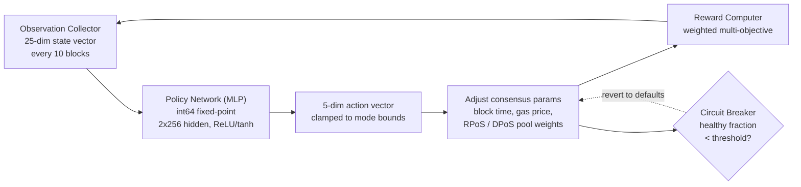

# PRISM コンセンサスエンジン

QoreChain は、強化学習による最適化レイヤーである **PRISM**（Policy-driven Reinforcement-learning for Intelligent State Machines）を、`x/rlconsensus` モジュールを介してコンセンサスレイヤーに直接組み込んでいます。PRISM は N ブロックごとにチェーンのメトリクスを観測し、固定小数点ニューラルネットワークを通じて推論を実行し、コンセンサスパラメータの調整を提案します。これらはすべて決定論的に行われ、コンセンサスに不可欠な経路で浮動小数点演算を使用しません。

*PRISM 最適化ループ: チェーンの状態を観測し、ポリシー推論を実行し、パラメータ変更をクランプして適用し、その結果をフィードバックします。*



---

## アーキテクチャ概要

PRISM は 4 つのコンポーネントで構成されています:

1. **Observation Collector**（観測コレクター）— 設定可能な間隔で 25 次元のチェーン状態ベクトルを収集します。
2. **Policy Network (MLP)**（ポリシーネットワーク）— 観測をアクションにマッピングする Go ネイティブの多層パーセプトロンです。
3. **Reward Computer**（報酬計算機）— 重み付き多目的関数を用いてパラメータ変更の品質を評価します。
4. **Circuit Breaker**（サーキットブレーカー）— チェーンの健全性を監視し、不安定性が検出された場合にすべての PRISM 調整済みパラメータを元に戻します。

すべてのコンポーネントは ABCI ライフサイクル内で動作し、すべてのバリデーターノードにわたって決定論的で検証可能な出力を生成します。

---

## ポリシーネットワーク

ポリシーネットワークは、**int64 固定小数点演算**（10^8 でスケーリング）を用いて Go で完全に実装されたフィードフォワード多層パーセプトロン（MLP）です。

### ネットワークアーキテクチャ

| プロパティ          | 値                                 |
| ------------------- | ---------------------------------- |
| 入力次元数          | 25                                 |
| 隠れ層              | 2                                  |
| 隠れ層のサイズ      | 256, 256                           |
| 出力次元数          | 5                                  |
| 活性化関数（隠れ層）| ReLU                               |
| 活性化関数（出力層）| tanh                               |
| 総パラメータ数      | 73,733                             |
| 精度                | int64 固定小数点（10^8 でスケーリング） |

### パラメータ数の内訳

```
Layer 1: 25 * 256 + 256   =  6,656  (input -> hidden_1)
Layer 2: 256 * 256 + 256   = 65,792  (hidden_1 -> hidden_2)
Layer 3: 256 * 5 + 5       =  1,285  (hidden_2 -> output)
Total:                       73,733
```

### 固定小数点演算

すべての MLP 計算は、`FixedPointScale = 10^8` でスケーリングされた `int64` 値を使用します。これにより、ハードウェアプラットフォーム間での IEEE 754 浮動小数点丸めの差異による非決定性が排除されます。

* **乗算**: `fixMul(a, b) = (a / SCALE) * b + (a % SCALE) * b / SCALE`（オーバーフローを防ぐために分割）
* **ReLU**: `relu(x) = max(0, x)`
* **tanh**: `|x| <= 2.5*SCALE` に対してパデ近似 `tanh(x) ~ x * (3*S - x^2) / (3*S + x^2)`、それ以外の場合は +/- SCALE にクランプ

ポリシーの重みは、フラット化された `[]int64` ベクトルとしてオンチェーンに保存され、ガバナンス提案を通じて更新できます。

---

## 観測ベクトル

PRISM は、各観測間隔（デフォルト: 10 ブロックごと）で 25 次元の観測ベクトルを収集します。

| インデックス | 次元                   | 説明                                             |
| ----- | ---------------------- | ------------------------------------------------ |
| 0     | `block_utilization`    | ブロックで使用されたガス / ブロックのガス上限     |
| 1     | `tx_count`             | ブロック内のトランザクション数                   |
| 2     | `avg_tx_size`          | トランザクションの平均サイズ（バイト）           |
| 3     | `block_time`           | 前のブロックからの経過時間（ms）                 |
| 4     | `block_time_delta`     | ブロックタイムから目標ブロックタイムを引いた値（ms） |
| 5     | `gas_price_50th`       | ガス価格の中央値                                 |
| 6     | `gas_price_95th`       | 95 パーセンタイルのガス価格                      |
| 7     | `mempool_size`         | 保留中のトランザクション数                       |
| 8     | `mempool_bytes`        | 保留中のトランザクションの総バイト数             |
| 9     | `validator_count`      | アクティブなバリデーター数                       |
| 10    | `validator_gini`       | バリデーターパワー分布のジニ係数                 |
| 11    | `missed_block_ratio`   | 署名を逃したバリデーターの割合                   |
| 12    | `avg_commit_latency`   | 平均コミットラウンドレイテンシ（ms）            |
| 13    | `max_commit_latency`   | 最大コミットラウンドレイテンシ（ms）            |
| 14    | `precommit_ratio`      | 受信したプリコミットの割合                       |
| 15    | `failed_tx_ratio`      | 失敗したトランザクションの割合                   |
| 16    | `avg_gas_per_tx`       | トランザクションあたりの平均ガス消費量           |
| 17    | `reward_per_validator` | バリデーターあたりの平均報酬（uqor）            |
| 18    | `slash_count`          | 観測ウィンドウ内のスラッシングイベント数         |
| 19    | `jail_count`           | 観測ウィンドウ内の収監（jail）イベント数         |
| 20    | `inflation_rate`       | 現在の発行率                                     |
| 21    | `bonded_ratio`         | ボンドされたトークン / 総供給量                  |
| 22    | `reputation_mean`      | アクティブなバリデーター全体の平均評判スコア     |
| 23    | `reputation_stddev`    | 評判スコアの標準偏差                             |
| 24    | `mev_estimate`         | 抽出された MEV の推定値（ヒューリスティック）    |

すべての値は `LegacyDec` 文字列表現として保存され、推論前に int64 固定小数点に変換されます。

---

## アクション空間

MLP の出力は 5 次元のアクションベクトルであり、各次元はコンセンサスパラメータへの変更提案を表します。tanh 活性化関数は生の出力を \[-1, 1] に制約し、その後モード固有の境界によってスケーリングされます。

| インデックス | アクション次元              | 説明                                                                   |
| ----- | -------------------------- | ----------------------------------------------------------------------- |
| 0     | `block_time_delta`         | 目標ブロックタイムへの変更提案（ms）                                    |
| 1     | `gas_price_delta`          | ベースガス価格への変更提案                                              |
| 2     | `validator_set_size_delta` | 目標バリデーターセットサイズへの変更提案（ログのみ、適用されない）      |
| 3     | `pool_weight_rpos_delta`   | RPoS プール優先度の重みへの変更提案                                     |
| 4     | `pool_weight_dpos_delta`   | DPoS プール優先度の重みへの変更提案                                     |

アクションは、適用前に現在の PRISM モードで定義された最大変更境界に**クランプ**されます。

---

## 報酬関数

報酬シグナルは、最近のパラメータ変更がチェーンのパフォーマンスをどの程度改善したかを評価します。これは 5 つの目的の重み付き合計として計算されます:

```
R = 0.30 * delta_throughput
  + 0.25 * delta_finality
  + 0.20 * delta_decentralization
  - 0.15 * mev_estimate
  - 0.10 * failed_tx_ratio
```

| コンポーネント       | 重み   | 方向     | ソースメトリクス                              |
| ------------------- | ------ | --------- | --------------------------------------------- |
| スループット         | +0.30  | 最大化   | ブロック利用率の変化                          |
| ファイナリティ       | +0.25  | 最大化   | プリコミット率の変化                          |
| 分散性               | +0.20  | 最大化   | バリデータージニ係数の負の変化                |
| MEV                 | -0.15  | 最小化   | 現在の MEV 推定値                            |
| 失敗トランザクション | -0.10  | 最小化   | 現在の失敗トランザクション率                  |

報酬の重みはガバナンスで設定可能であり、合計が正確に 1.0 にならなければなりません。

---

## PRISM モード

PRISM は、ガバナンスで制御可能な 4 つのモードのいずれかで動作します:

| モード           | ID | 最大変更   | 動作                                                                                       |
| ---------------- | -- | ---------- | ------------------------------------------------------------------------------------------ |
| **Shadow**       | 0  | 0%         | 観測と推奨事項のログ記録のみ。パラメータは変更されません。これがデフォルトモードです。      |
| **Conservative** | 1  | +/- 10%    | 厳密な境界内でパラメータ変更を適用します。初期の本番デプロイに適しています。                |
| **Autonomous**   | 2  | +/- 25%    | より広い境界内でパラメータ変更を適用します。検証済みのポリシーを持つ成熟したネットワーク向け。 |
| **Paused**       | 3  | 0%         | PRISM は完全にアイドル状態です。観測は収集されず、推論も実行されません。                   |

モードの移行にはガバナンス提案が必要です。推奨されるデプロイ経路は: Shadow → Conservative → Autonomous です。

---

## サーキットブレーカー

サーキットブレーカーは、チェーンの健全性を監視し、不安定性が検出された場合にすべての PRISM 調整済みパラメータを自動的に元に戻す安全メカニズムです。

### 検出ロジック

サーキットブレーカーは直近の **50 ブロック**（`circuit_breaker_window` で設定可能）を評価します:

1. **ブロックタイムのデルタを計算** — 連続する各ブロックタイムスタンプのペアについて、ブロックタイムのデルタを計算します。
2. **健全なブロックを分類** — ブロックは、そのデルタが正であり、目標ブロックタイムの 2 倍以内であれば**健全**とみなされます。
3. **健全な割合を計算** — **健全な割合** = 健全なブロック数 / 総デルタ数を計算します。

### トリガー条件

健全な割合がしきい値（デフォルト: **50%**）を下回ると、サーキットブレーカーがトリガーされます。

### 応答

トリガーされると、サーキットブレーカーは:

1. すべての PRISM 適用済みパラメータ（ブロックタイム、ガス価格、プールの重み）をデフォルト値に**戻します**。
2. PRISM を**一時停止**します（`CircuitBreakerActive = true` に設定）。
3. 新しいリロードを強制するため、メモリ内のポリシーを**クリア**します。
4. `circuit_breaker_triggered` イベントを**発行**します。

サーキットブレーカーは、その後の評価で健全な割合がしきい値を上回って回復すると、自動的に解除されます。

---

## ロールアップアドバイザリー関数

PRISM は、ロールアップパラメータ最適化のためのアドバイザリー関数を提供します:

* **`SuggestRollupProfile`** — 現在のチェーン状態を分析し、最適なロールアップ設定パラメータ（ブロックタイム、ガス上限、決済頻度）を提案します。
* **`OptimizeRollupGas`** — メインチェーンの混雑パターンに基づいて、ロールアップ決済トランザクションのガス価格調整を推奨します。

これらの関数は情報提供のみを目的としており、チェーンの状態を変更しません。

---

## 決定論的数学ライブラリ

すべての PRISM 計算は、標準の浮動小数点数学に代わる決定論的な代替手段を提供する `mathutil` パッケージを使用します:

| 関数                      | 説明                        | メソッド                                                  |
| ------------------------- | --------------------------- | --------------------------------------------------------- |
| `IntegerSqrt(x)`          | 平方根                      | `LegacyDec` 上でのニュートン法、100 回反復で収束          |
| `TaylorLn1PlusX(x)`       | 自然対数 `ln(1+x)`          | 引数縮小 + 15 項テイラー級数                              |
| `ExpApprox(x)`            | 指数 `e^x`                  | 12 項テイラー級数                                        |
| `SigmoidApprox(x)`        | シグモイド `1/(1+e^-x)`     | 負の入力に対する対称性を持つ `ExpApprox`                 |
| `ReputationMultiplier(r)` | \[0,1] を \[0.5,2.0] にマップ | スケールとオフセットを持つシグモイド                     |

すべての関数は `cosmossdk.io/math.LegacyDec` 値で動作し、すべてのハードウェアプラットフォームおよび Go コンパイラバージョンにわたって同一の結果を保証します。

---

## パラメータ

| パラメータ                       | 型        | デフォルト   | 説明                                                 |
| -------------------------------- | --------- | ------------ | ---------------------------------------------------- |
| `enabled`                        | bool      | `true`       | PRISM を有効化                                        |
| `observation_interval`           | uint64    | `10`         | 観測収集間のブロック数                               |
| `agent_mode`                     | PrismMode | `0` (Shadow) | 現在の動作モード                                     |
| `max_change_conservative`        | LegacyDec | `0.10`       | Conservative モードでの最大パラメータ変更            |
| `max_change_autonomous`          | LegacyDec | `0.25`       | Autonomous モードでの最大パラメータ変更             |
| `circuit_breaker_window`         | uint64    | `50`         | サーキットブレーカーが監視する直近のブロック数       |
| `circuit_breaker_threshold`      | LegacyDec | `0.50`       | トリガー前の最小健全ブロック割合                     |
| `default_block_time_ms`          | int64     | `5000`       | デフォルトの目標ブロックタイム（ms）                |
| `default_base_gas_price`         | LegacyDec | `100`        | デフォルトのベースガス価格                           |
| `default_validator_set_size`     | uint64    | `100`        | デフォルトの目標バリデーターセットサイズ             |
| `reward_weight_throughput`       | LegacyDec | `0.30`       | スループット改善の報酬重み                           |
| `reward_weight_finality`         | LegacyDec | `0.25`       | ファイナリティ改善の報酬重み                         |
| `reward_weight_decentralization` | LegacyDec | `0.20`       | 分散性改善の報酬重み                                 |
| `reward_weight_mev`              | LegacyDec | `0.15`       | MEV 抽出のペナルティ重み                            |
| `reward_weight_failed_txs`       | LegacyDec | `0.10`       | 失敗トランザクションのペナルティ重み                 |

## 関連項目

* [Consensus Mechanism](/architecture/consensus-mechanism) — PRISM が最適化するコンセンサスレイヤー。
* [AI Engine](/architecture/ai-engine) — より広範なオンチェーン AI サービスとエンドポイント。
* [Tokenomics](/architecture/tokenomics) — RL シグナルが報酬とパラメータ調整にどのように供給されるか。
